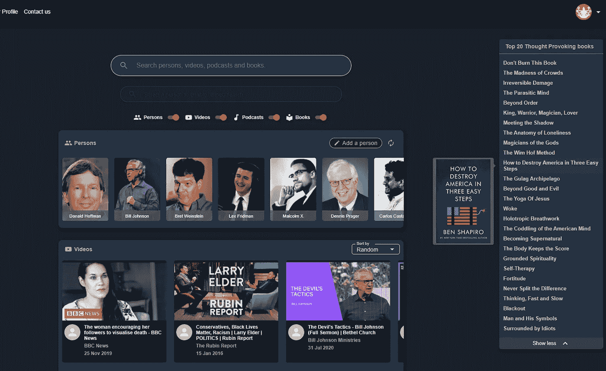

# React 图像加载优化技术

> 原文：<https://javascript.plainenglish.io/image-loading-in-react-js-preloading-lazy-loading-intersectionobserver-fade-in-transitions-722c24f4d5fb?source=collection_archive---------2----------------------->

## 第 1 部分:预加载，延迟加载，***【intersection observer，*** 【淡入过渡，窗口，错误处理，占位符等等

# 介绍

就职业而言，我首先是一名(本地)Android 开发人员，已经为一系列公司和项目工作了 6 年多。
开发世界中的一个挑战性问题是，如果你想创建一个应用程序，并在市场上成为一个重要的参与者，你需要为 iOS **和安卓**开发应用程序。其他问题可能会出现，如:我也应该创建一个网站吗？或者当你想创建一个网站时，你至少应该确保它在移动设备上看起来不错。我是不是应该先把重点放在*手机上……*因为可以说大多数听说过你的网站的用户首先会想通过他们的移动设备来尝试和访问它？

在我工作过的所有公司中，每个平台(iOS/Android/Web)都有自己的开发团队。每个团队通常解决许多相同的挑战，很少交换想法或代码。由于所用语言的本质差异，似乎无法找到一种方法来结合或减少工作努力的桥梁。

因此，我一直在思考的一个问题是:“有没有一种方法可以让我创建一个网站/应用程序来设置我的项目，以便它 1。在台式机/笔记本电脑 2 上看起来不错。可以在 Android 以及 iOS 设备上使用 3。请记住，大多数用户希望通过移动设备访问它。

显而易见的答案是，创建一个基于网络的应用程序，用户可以通过他们的网络浏览器访问，这也是一个额外的好处，不必处理发布到 Google Play 或苹果应用程序商店带来的额外工作。
脸书做到了……而且用户体验水平足够好，足以满足我对自己平台的期望……那么我为什么不能做到呢？)
所以我去年决定开始学习 React JS 和一些后端开发，并着手看看我是否能创建[metacules.com](https://metacules.com)平台。这里的文字描述了 React JS 世界中的一些冒险。

# 图像，图像，图像…

视觉故事讲述:图像…可能是任何应用程序或网站最重要的方面之一。在 Android 开发中，多年来我们已经有了像 Glide 和 Picasso 这样的库，使得 Android 开发人员的图像加载变得相当“容易”。
当我转到 React JS 学习 web 开发时，我非常惊讶地发现，开发人员的水平还没有达到我习惯的在 Kotlin 或像 Android Studio 这样的 IDE 中开发的水平。

像图像加载这样琐碎的事情并不像使用整个开发社区都在使用的库那么简单。所以我开始一步一步地解决这个问题…一块一块拼图…从我从 Stackoverflow 和 Medium 帖子中收集的综合信息中…



Part of the Home screen of the desktop version of metacules.com

我需要解决的一些图像加载问题有:

1.  如何在图像显示在屏幕上之前预加载它们？我不想只在开始加载图像时才在视窗中显示。
2.  **如何限制预加载图像的数量**？例如，metacules.com 的主屏幕提供了滚动浏览 250 多人列表的选项，并通过选择一个人来启动查询，以找到与该人相关的播客、视频和书籍。在我们列表的第一个实现中，一个网络请求获取所有的图像，当然，这对于性能来说不是很好。
3.  **如何在加载图片 url 出错时显示占位符？**
4.  **当图像进入视窗时，如何在图像尚未显示/完全加载时添加淡入过渡？**
5.  **如何添加加载动画，给用户一个图像正在加载的视觉提示？**

# 使用**react-lazy-load**&**react-lazy load**遇到的问题

最初我开始使用像 [react-lazy-load](https://www.npmjs.com/package/react-lazy-load) 和 [react-lazyload](https://www.npmjs.com/package/react-lazyload) 这样的包(其中第二个似乎更受欢迎)。
我试用了两个非常受欢迎的包，下载量都超过了 20 万次，解决了只在图像进入视窗之前才开始加载图像的问题。
lazy load 实现看起来相对简单，类似下面的代码将延迟加载图像(在本例中是在垂直列表中),直到图像进入 300px 的视口范围。

```
<LazyLoad **height**={imageHeight} **offsetVertical**={300}>
   
</LazyLoad>
```

一切看起来都很好，直到我们在图像列表中添加了一个随机按钮功能，这样用户不仅可以通过滚动，还可以通过按下按钮来发现其他项目。现在，在主屏幕的情况下，其中显示了一个人的卡片列表，其中列表被打乱加载，图像不会被触发，用户首先需要滚动一点点来触发图像加载。这很奇怪，当然也是不想要的行为，我们无法直接找到一个可靠的解决方案，需要编写一些额外的代码来触发图像加载。

# 图像未载入时显示占位符

Javascript 的图像组件包含一个属性/事件回调，用于加载图像出错时。这让我想到，如果我想在图像无法加载时显示一个占位符，实现起来会相对容易一些，如下所示:

```
*<*img src={imageUrl}
     onError={(e) => e.target.src = {placeholder}}alt=""*/>*
```

不幸的是，这还不够，例如，当图像 url 为空时，占位符有时根本不会显示。或者，在应该触发错误和占位符显示的情况下，有时会显示图像的 Base64 字符串。

当 src url 为空时，onError 回调未被触发的问题可以通过在 src 值上添加 or 运算符来巧妙解决。像这样:

```
*<*img src={imageUrl **|| placeholder**}
     onError={(e) => e.target.src = {placeholder}}alt=""*/>*
```

在我浏览了一段时间后，发现 GitHub repo 上的一些代码没有使用 *react lazy load* 包之一，而是使用了交叉点观察器 API 来延迟图像的加载，并且也有一些预加载图像的实现，因此 Base64 字符串显示而不是实际图像的问题得到了解决。正是在这个预加载的错误处理实现中，我找到了一种在< img >组件上实际设置占位符的方法，而不是错误地显示没有正确加载的图像的 Base64 字符串。

不幸的是，我已经不知道是在哪个回购协议中找到的代码，我用它作为自己实现 ImageLoading 包装组件的基础，但我的代码看起来应该是这样的:

```
class PreloadImage extends React.Component *{* constructor*(*props*) {* super*(*props*)*;
        this.state = *{* loaded: false,
            src: null,
            placeholder: this.props.placeholder || null,
        };
    } componentDidMount() {
        if (this.props.lazy && 'IntersectionObserver' in **window**) {
            this.setObserver();
        } else {
            this.setPreloader();
        }
    }componentWillUnmount() {
        if (this.observer) this.observer.disconnect();
        if (this.preloader) this.preloader.onload = null;
    }setObserver() {
        this.observer = new **IntersectionObserver**((entries) => {
            entries.forEach((entry) => {
                if (entry.isIntersecting) {
                    this.setPreloader();
                    this.observer.disconnect();
                }
            });
        });
        this.observer.observe(this.el);
    } setPreloader() {
        this.preloader = new **Image**();
        this.preloader.onload = () => {
            this.setState({
                loaded: true,
                src: this.props.src
            });
        };
        this.preloader.onerror = () => {
            this.setState({
                loaded: true,
                src: this.state.placeholder
            });
        }; this.preloader.src = this.props.src;
    } render() {
        return (
            <div ref={(el) => this.el = el}>
                 this.el = el}
                     onError={(e) => {
                         e.target.src = this.state.placeholder;
                     }}
                     alt=""/>
            </div>
        );
    }
}export default PreloadImage;
```

然后，其他组件可以使用此组件，并设置带有占位符回退的图像 src，如下所示:

```
<PreloadImage  
    lazy
    src={imageUrl} 
    placeholder={placeholder}
 />
```

在<preloadimage>上添加 lazy 属性将阻止图像被预加载，直到交叉点观察器触发加载。</preloadimage>

此外，注意在<preloadimage>的内部实现中， **imageUrl** 并没有直接设置为< img >标签上的值。</preloadimage>

相反，每当调用 setPreloader()时，图像的加载将由 imageUrl 触发，imageUrl 通过<preloadimage>上的 src 属性提供。根据加载是失败还是成功，占位符或实际的 src url 将被设置为标签的 src 属性。现在，在图像加载失败的情况下，偶尔会放在 UI 上的 Base6 字符串将不再显示，因为图像的预加载实际上正确地触发了错误。</preloadimage>

# 更多内容将在第 2 部分介绍

在下一部分中，我们将更深入地研究图像加载的实现、淡入动画、何时预加载或推迟预加载直到图像进入视口附近的模式等等。

关注我，了解未来帖子的最新动态。

第 2 部分的链接:[https://JavaScript . plain English . io/image-loading-in-react-js-preloading-lazy-loading-intersection observer-fade-in-transitions-722 c24 F4 D5 FB](https://rik-van-velzen.medium.com/react-image-loading-optimization-techniques-b885427bde44)

如果您有任何额外的东西要添加、改进，或者如果您想给我们的项目送去一些爱或支持，您可以给我们买一杯咖啡或帮助筹集我们创建元规则(一种审查的解毒剂)平台的资金，请通过

*   [https://www.buymeacoffee.com/l5LnQfk](https://www.buymeacoffee.com/l5LnQfk)
*   https://fundrazr.com/f1ldl3

*里克·范·韦尔森是 metacules 的创始人，高级(Android)移动开发者，目前是使用 React/NodeJs 的 metacules 平台的开发者。
您可以在社交媒体上关注我们:*

*-推特:*[https://twitter.com/VelzenRik](https://twitter.com/VelzenRik)
-*推特*:[https://twitter.com/metacules](https://twitter.com/metacules)
-*脸书*:[https://www.facebook.com/Metaculescom-100856938688500](https://www.facebook.com/Metaculescom-100856938688500)


Screenshot part of the Landing Page of metacules.com

# 链接:

*   【https://www.npmjs.com/package/react-lazyload】
*   [https://www.npmjs.com/package/react-lazy-load](https://www.npmjs.com/package/react-lazy-load)
*   [https://level up . git connected . com/what-so-special-about-intersection-observer-API-in-JavaScript-f 2430 a 159 fa 7](https://levelup.gitconnected.com/what-is-so-special-about-intersection-observer-api-in-javascript-f2430a159fa7)
*   https://metacules.com 创造审查的解药
*   [https://fundrazr.com/f1ldl3](https://fundrazr.com/f1ldl3)