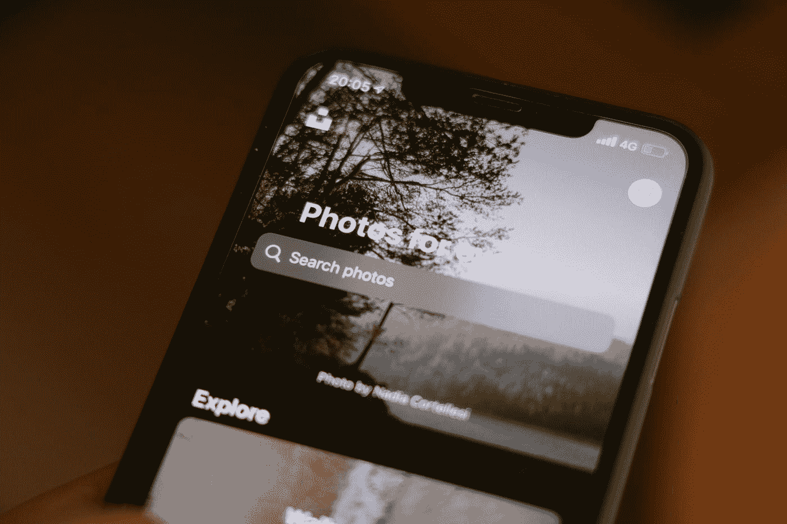
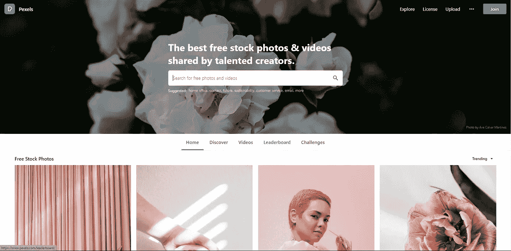
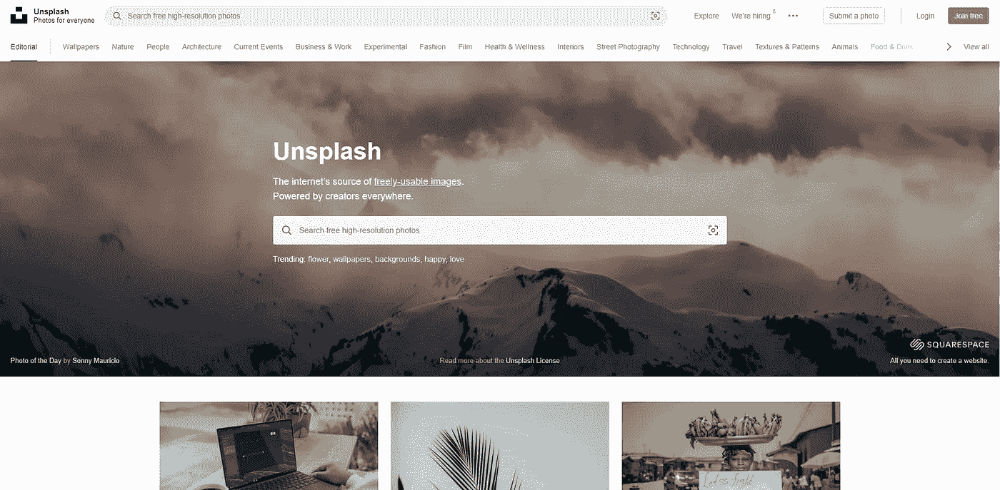
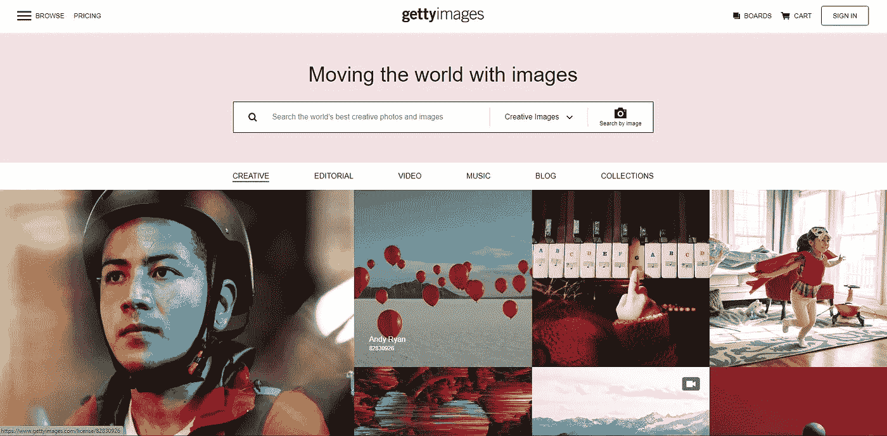
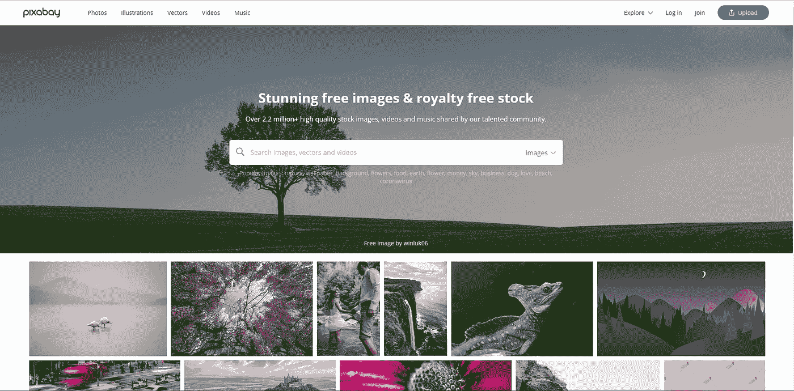
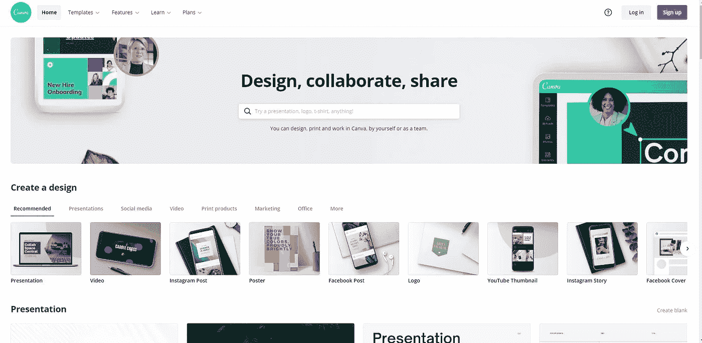

# 您下一个项目的图像资源

> 原文：<https://javascript.plainenglish.io/image-resources-for-your-next-project-176efd6ee46c?source=collection_archive---------9----------------------->

## 利用这些平台获得免费的高质量图像。

Photo by [Rubén García](https://unsplash.com/@espunnyesp?utm_source=medium&utm_medium=referral) on [Unsplash](https://unsplash.com?utm_source=medium&utm_medium=referral)

图像在大多数项目中起着至关重要的作用。人们常说，一幅画胜过千言万语。因此，毫无疑问，在你的项目中使用图片有助于更好地展示和推销你的项目创意。

图片提供了第一印象，更好的第一印象会让你的读者着迷并吸引他们的注意力，而错误的第一印象会很快赶走他们。

在本文中，我们将查看各个地方，为您的下一个项目获取免费图像资源。

这可以是你的下一个网页设计，文章，甚至电子邮件营销通讯。这些图片是由上传它们的创作者免费提供的。

提醒你，对创作者的工作给予肯定是很重要的，这可以帮助他们创作更多的内容。

如果你有多余的钱，你可以赞助他们，为他们免费提供的作品在他们的脸上洒下一些爱。

## **1。像素**

Pexels 拥有来自非常有才华的创作者的全面和大量的照片和视频。

只需一次搜索，他们的数百万张照片就在你的掌握之中。

Pexels landing page

## **2。Unsplash**

就像 Pexels 一样，Unsplash 也有大量的照片收藏来满足您的项目需求。因此，令人惊叹的创作者在这个平台上提供他们的顶级作品。

Unsplash landing page

## **3。Getty Images**

Getty Images 收集了不同主题和类型的图片。这个平台上的照片有的是免费的，有的是可以买的。如果你想支持创作者，这也是一个好办法。

Getty Images Landing page website

## **4。Pixabay**

Pixabay 是一个充满活力的创意社区，分享无版权的图片、视频和音乐。

Pixabay 拥有大约 250 万张令人惊叹的免费图片，几乎可以在任何地方使用。

Pixabay landing page

## **5。Canva**

Canva 是一个在线设计和发布工具，其使命是让世界上的每个人都能设计任何东西并在任何地方发布。

通过 Canva，您可以使用免费层专业编辑您的照片和视频。

Canva design page

## 结论

谢谢你读到这里。如果你觉得这篇文章有趣，请不要犹豫，让我知道在评论和分享。

**更多阅读:**

 [## 使用这些技巧提高网页图像性能

### 用这种技术提高网页图像的性能。

javascript.plainenglish.io](/improve-web-image-performance-with-these-tips-93890574e6a2) 

*更多内容请看*[***plain English . io***](http://plainenglish.io/)