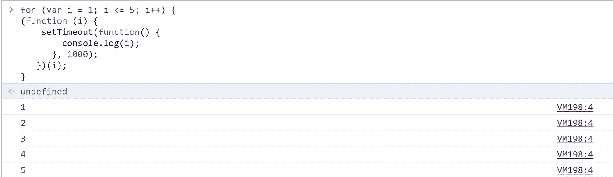

# 初学者可以立即调用函数表达式

> 原文：<https://javascript.plainenglish.io/immediately-invoking-function-expressions-for-beginners-8db1a8d90d63?source=collection_archive---------14----------------------->


Photo by [Clément Hélardot](https://unsplash.com/@clemhlrdt?utm_source=medium&utm_medium=referral) on [Unsplash](https://unsplash.com?utm_source=medium&utm_medium=referral)

在任何编程语言中，函数作为一个概念是非常重要的。当涉及到可重用性和构建代码以使其更具可读性时，它们非常有用。

在我以前的文章中，我们已经看到了使用函数的不同方式，即常规函数和函数表达式。

但是还有另一种类型的函数，立即调用函数表达式或 IIFE(发音为 *iffy* )。IIFE 是一个函数表达式，在它的定义之后立即运行。我们不必显式调用该函数。

## 句法

变体 1:

```
( function () {
     //Logic to Execute
}**()**)
```

变体 2:

```
( function () {
       //Logic to Execute
})**()** //Here the parenthesis are defined outside
```

从以上两个变体中，我们可以看出:

1.该函数包含在一组括号“()”中。这是至关重要的，因为这是将函数转换成函数表达式的过程。如果没有外括号，它就是一个普通的旧正则函数定义。

2.在函数末尾的另一组括号的帮助下调用函数。以上两个代码的不同之处在于括号的位置。一个在外括号内，另一个在外括号外。调用 IIFE 的另一组括号的位置不影响代码的工作。这完全是个人喜好的问题。

这些函数也可以有一个名字，但是是否保持匿名，又是一个偏好的问题！

命名函数如下所示:

```
(function example(){
     //logic to execute
})()
```

**注意:**即使函数有名字，也不能通过调用名字的函数来显式调用。

让我们看看如何利用这些生命。

示例:

```
(function(name){
     console.log(`Welcome ${name}!`)
})(‘Jane’) //IIFE’S can accept parameters too
```

如果你运行这段代码，你会发现这个函数只执行一次，之后我们就不能调用它了。

我们也可以用箭头函数来写生命。让我们将上面的函数转换成一个箭头函数:

```
((name) => {
      console.log(`Welcome ${name}!`)
}(‘’Jane))
```

既然我们已经知道了生活是什么，如何去写它们，让我们进入文章的核心。

# **为什么生活的？**

## 全球范围污染

在外部定义的变量和函数属于全局范围。在较大的脚本中，由于使用相同的名称重新定义变量和函数，这可能会导致冲突和错误。这些变量和函数也驻留在内存中，直到从作用域中释放出来。

为了避免这种情况，我们使用生命的。如果有一个功能我们不会再使用，我们可以使用生命。这样，变量和函数一执行就可以从内存中删除，从而提高内存效率。

示例:

```
(function () {
    let initVariable1;
    let initVariable2;
    //Some initiation logic
})();
```

上述两个变量不能在函数之外使用。像常规函数一样，这些函数也有自己的作用域。因此，这两个变量在执行后都会从内存中丢弃。

## 私有变量

生命对于声明私有变量非常有用。如果我们想防止其他代码编辑私有变量，私有变量是必不可少的。

例如:

```
let count = 0;
function counter(){
    count = count++;
    console.log(`count is ${count}`)
}
```

但是这个计数变量是公共的，其他脚本可以很容易地访问它。如果有人更改并重新初始化 count 变量，可能会导致计数出现错误。使用 IIFE，我们可以将上面的代码重写如下:

```
(function counter() {
   var count = 0;
   count = count +1
   console.log(count) // 1
}());
```

现在，count 变量不能被其他脚本访问。

## for 循环中的异步代码

用循环编写的异步代码有点混乱。看看下面的代码，猜猜输出结果:

```
for (var i = 1; i <= 5; i++) {
   setTimeout(function () {
   console.log('i: ', i);
}, 1000);
}
```

它应该输出 1，2，3，4，5，对吗？

但是如果你执行代码，你会看到它打印 6 五次。

发生这种情况是因为，每当遇到回调时，它的执行都被推迟，直到其他任务完成。在上面的例子中，当遇到 setTimeout 时，它被延迟到 for 循环执行。因此，I 的值被设置为最后的结果，即 6。当回调函数必须被执行时，它得到 I 的最后一个值，这个值已经被设置为 6。因此，我们只能看到控制台上打印的 6。

有了生活，这个问题是可以避免的。

```
for (var i = 1; i <= 5; i++) {
(function (i) {
    setTimeout(function() {
        console.log(i);
      }, 1000);
   })(i);
}
```

输出:



因此，在使用 IIFE 时，我们一直给回调函数 I 的当前值。因此，当回调函数执行时，它将具有 I 的最近值。

## 结论

虽然您可能倾向于在遗留代码中看到 IIFE，但是现在已经不常使用了。为了减少全局对象污染，使变量私有，我们也可以使用“let”和“const”。在 ES6 引入 let 和 const 之前，IIFE 的主要用途是。然而，了解它仍然很重要，因为这是你在旧脚本中经常会遇到的事情。

## 参考

[](https://developer.mozilla.org/en-US/docs/Glossary/IIFE) [## life-MDN 网络文档词汇表:网络相关术语的定义

### IIFE(立即调用的函数表达式)是一个 JavaScript 函数，它一被定义就运行。这个名字…

developer.mozilla.org](https://developer.mozilla.org/en-US/docs/Glossary/IIFE) 

*更多内容看*[***plain English . io***](http://plainenglish.io)