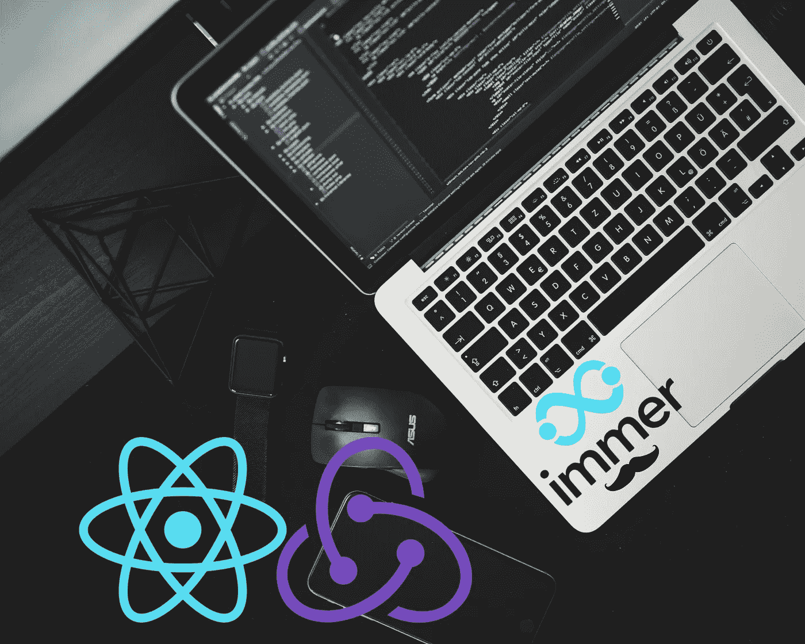
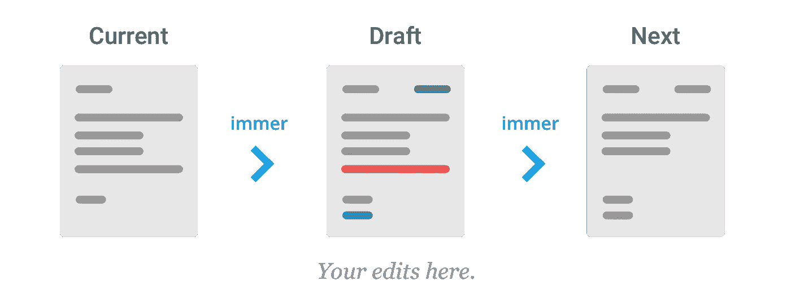

# Immer.js 101 —使 React 中的 Redux 状态更新可预测

> 原文：<https://javascript.plainenglish.io/immer-js-101-making-redux-state-updates-in-react-predictable-62efe93e03dc?source=collection_archive---------8----------------------->



Photo by [Altum](https://unsplash.com/@altumcode) on [Unsplash](https://unsplash.com/)

# 为什么是 Redux？为什么是 Immer？

你要么恨，要么爱 Redux。我绝对是一个热爱 Redux 的人，但老实说，在每个项目中都使用它是没有必要的。如果你只是在做一个原型或者一个小的 app——最好用钩子和状态。

虽然，从我的经验来看，每一个商业化的产品都会成长。新功能意味着需要管理更大的州。在设计应用程序架构时，最好记住你最终将拥有一个大的状态。例如，我们的主要 React 应用程序有超过 90k 行代码，使用 API 调用，WebSockets 和 state 拥有包含数百个对象的数组。我甚至无法想象没有 Redux 该如何处理这件事。

也就是说——如果由没有经验的开发人员使用，Redux 可能是危险的。最大的问题之一是在 Redux 中管理状态不变性。但是一个更复杂的问题是，由于 reducers 中的错误，导致组件不必要的重新渲染。一个简单的解决方案是 Immer。让我们深入探讨一下不变性/重渲染的问题，然后我将向你展示我个人如何利用 Immer 的方法。

# Redux 中常见的不变性问题

让我们把重点放在 reducers 上，因为这应该是状态改变的唯一地方。Reducers 非常简单——不改变状态，返回一个新状态。

## 直接突变状态

这个很明显。不对状态进行任何操作，例如:

Don’t do this!

因为我们是对原始状态进行变异，然后再返回它— Redux 不会识别任何变化。因此，连接到商店**这一部分的组件不会**更新。Redux 将新状态与旧状态进行比较(reducer 函数中的第一个参数)。所以，减速器的功能必须永远是一个**的纯功能。为了避免任何类似的错误，你也应该在 reducer** 函数中使用**纯函数。下面是一个纯函数的例子。**

Just to be sure we are on the same page with pure functions

## 不必要的重新渲染

这个不那么明显，这个错误我看了很多次。我在无数的 React 教程里见过。有坏的，也有好的！让我们看看下面的例子:

This is really a common mistake!

现在，明确一点，使用过滤函数完全没问题。它创建并返回状态的副本。但是状态的**副本导致了一个问题。Redux 每次都做**浅**比较。简单来说，这些是**不同的对象，因为过滤器正在复制**。同样的道理也适用于贴图，还原等等。**

那为什么要肤浅的比较呢？嗯，Redux 团队认为，每次进行深度比较都会对资源提出很高的要求。这是合乎逻辑的，我对此没有异议。

此外，如果您的应用程序很小，这可能不是一个大问题(也许这就是为什么教程有这个错误？你怎么想呢?)但是在有数百个组件连接到 Redux 和更新状态的 API 调用的应用程序中，这变得很严重。对于大规模应用程序，你不能承担无用的重新渲染。这在 **React 原生应用中尤其令人沮丧，可能会大幅降低性能。**

现在，为了解决这个问题，我们可以使用一些简单的重构:

Some defensive programming in action

没什么极端的，对吧？通过一些规则和防御性编程，我们确保状态只在必要时更新。现在是介绍 Immer 的好时机。

# 伊梅尔来了！

Immer 已经是一个完善的库了。每周近 600 万次下载(根据 NPM—2021 年 1 月)，100%的代码覆盖率，+100 名贡献者，19k GitHub 明星。这些数字令人印象深刻。更令人印象深刻的是，Immer 被评为 2019 年 JavaScript 开源“最具影响力贡献”和“年度突破”React 开源奖。

## Immer 真的是 React 的突破吗？

不要误解我——我爱 Immer。然而，它不是一个可以毫不费力地解决所有问题的魔法库。它需要遵循一些模式——如果不小心使用的话，不会让你免于不必要的状态更新。不需要额外的库，你自己也可以达到同样的效果。然而，Immer 提倡最佳实践、干净的代码并减少代码重复。在我看来，它是任何 React+Redux app 中的必备。

## Immer 如何工作

出奇的简单。Immer 中的主要功能是**产生**。**T5 有两个参数，**状态**和回调函数，回调函数有**草稿**(状态的)。在回调函数中，我们直接对草稿**进行修改**。然后，Produce 比较差异并生成 **nextState** 。**



[https://immerjs.github.io/immer/img/immer.png](https://immerjs.github.io/immer/img/immer.png)

让我们看看 Immer 是如何用于减速器的:

现在关注 **myReducer** 函数。我们在这里使用的概念叫做[逢迎](https://javascript.info/currying-partials)。这不是必须的，有其他的使用 Immer 的方法——但是我更喜欢这个。它清楚地显示了正在发生的事情。我们用**扩展一个减速器产生**功能。在 produce 中，我们使用回调函数直接对草稿进行操作。我喜欢把我的减速器限制在简单的开关箱使用。在每种情况下，我都会返回在草稿上做必要工作的函数。重要的是——我们不必退回汇票！因此，我不使用默认大小写，尽管添加了:

```
default: return draft; / return;
```

这很好——但没有必要。我将在文章的最后讨论大多数场景。

## 奖励:为 Immer 调整商店

在深入实际场景之前，让我和音麦分享我的经验。我认为 Immer 最适合使用 [**正常化状态**](https://redux.js.org/recipes/structuring-reducers/normalizing-state-shape) **或者简单的地图。**在一系列复杂的 API 对象上使用 Immer 是可能的，但有时会令人沮丧。尤其是对于嵌套的对象数组。标准化状态解决了我们在生产质量反应应用中面临的许多问题(复制、容易访问和更新对象等)。).然而，这不是必须的，我将涵盖数组和对象(地图)。

# 使用 Immer 的减速器中最常见的场景

## 沉浸在标准化状态/对象中

Immer with normalized state

该守则相当不言自明。方法清晰易懂。我喜欢保持减速器尽可能小。

**updateObject**——在他的方法中我们有点懒惰，我们不检查对象是否真的改变了——我们覆盖它。归一化状态有一个显著的优势，访问/写入/删除有[大 O(1)](https://dev.to/adafia/brief-performance-analysis-of-arrays-and-objects-through-the-lens-of-big-o-notation-4id3) 。这取决于您是否需要一些工具来检查对象是否不同。

**updateObjectStatus**——也许 hasObject 是不必要的，但是我添加了这个以便于理解。首先，我们检查这个对象是否已经处于状态。如果是，我们会更新状态属性。酷的是，Immer 会将草稿与状态进行比较——如果状态是相同的(比如说“完成”)，它就不会更新状态。

**deleteObject** —这个很明显:)delete 非常有用，我们不需要检查 state 是否有这个 id。

**AT 病例。RESET _ OBJECT**——我已经说过了，我们不需要返回草稿，生产函数也不需要它。但是，如果我们想重置或使状态为空呢？然后，我们退回新的汇票。在这种情况下，初始状态。

**replacewwithinnewobjects**——现在假设我们从 API 接收到了全新的状态。也许很少有项目是相同的，但是我们已经决定，通过这个特别的行动，我们将取代国家。在这种情况下，使用我的 utils 函数，我们创建一个新的状态(与规范化状态一致)并返回它。因为我们没有对草稿进行任何操作，所以我只将有效载荷传递给 replaceWithNewObjects 函数。

## 带阵列的 Immer

Immer with array of objects

乍一看，我们可以看到标准化状态相对于对象数组的优势。我们几乎每次都需要对大 O(n)进行操作，以检查对象是否处于状态。我认为代码很清楚，不需要额外的解释。:)如果您不这么认为，有一些问题——请留言评论！我会更新这篇文章。

# 包扎

使用 Immer 一开始可能是违反直觉的——因为我们改变了 draft。从我的经验来看，使用带有规范化状态的 Immer，在代码简洁、可读性和控制状态方面效果最好。

没有 Immer 我们能有同样的效果吗？当然可以！这取决于你。然而，它是添加到项目中的另一个库和依赖项。