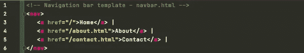
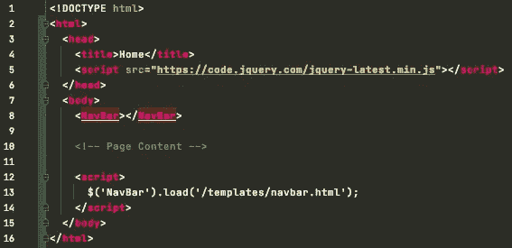
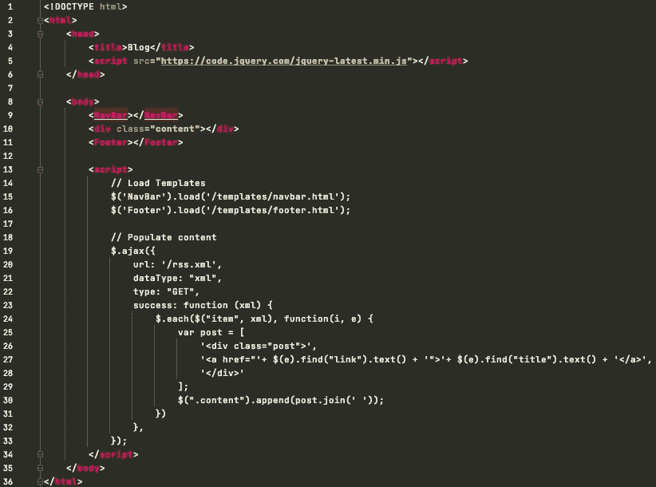

# 用 jQuery 实现客户端模板

> 原文：<https://javascript.plainenglish.io/implement-client-side-templates-with-jquery-30b399d68330?source=collection_archive---------9----------------------->

Photo by [KOBU Agency](https://unsplash.com/@kobuagency?utm_source=unsplash&utm_medium=referral&utm_content=creditCopyText) on [Unsplash](https://unsplash.com/s/photos/javascript?utm_source=unsplash&utm_medium=referral&utm_content=creditCopyText)

在你自己的博客或网站上维护代码库是一次很好的学习经历。它告诉你在运行一个成功的网站时所涉及的设计和架构决策，并允许在预设行为之外增加灵活性。

此外，这种方法减少了对单一框架或平台的依赖。如果你需要移动主机提供商，只需将你的文件复制到另一个 cpanel 或 web 目录。

然而，尽管有这些好处，维护你自己的网站还有一个陡峭的学习曲线——超出了需要的显著的编码知识。例如，对导航栏或页脚的微小更改包括单独修改每个页面的代码。虽然现代的 CSS 样式从设计的角度使这变得更容易实现，但是功能性的修改甚至会阻碍最专业的用户走这条路。

这就是客户端模板的用武之地！

## Web 模板

首先，什么是网页模板？网站模板是预先设计的资源或代码块，用于提供网站的基本结构。

例如，可以为您的站点创建一个包含页眉、页脚和整体布局的主模板。然后，每个后续页面只需要包含要嵌入到主模板中的核心内容。

有两种类型的模板，它们细分为数据的构造位置:

*   **服务器端模板**在被推送到客户端之前，在服务器级编译 HTML 源代码。这为管理动态内容(如配置文件或其他用户特定数据)提供了一种更简单的方法。存在各种语言和相关框架来使这一过程变得更容易，但是依赖于服务器端的执行来获得成功。
*   **客户站点模板**正好相反。页面的所有构造都是由客户端浏览器执行的。这可以通过 HTML5 `<template>`标签来保存特定内容，或者通过 JavaScript 框架如 [jQuery](https://jquery.com/) 来获取额外的页面资源。

## 客户端模板化入门

我们的方法将引入后者，用 jQuery 进行客户端模板化。

对于那些不熟悉的人来说，jQuery 是一个开源的 JavaScript 库，专门用于简化复杂的任务。它的 AJAX 请求、HTML/DOM 操作和 CSS 处理方法使它成为客户端模板的完美工具。

事实上，`load()`方法是这个实现的核心，因为它允许用户加载嵌入页面的远程 HTML 代码。以下是包含在单个文件中的导航栏示例，以便于维护:

从那里，我们可以在加载过程中利用`JQuery.load()`请求`navbar.html`。这将在我们的主页上呈现模板的最新版本，对用户几乎没有影响。同样，这是在浏览器中执行的，不需要服务器端代码执行。

## 动态 HTML 内容

jQuery 的另一个强大功能是插入动态内容。使用`JQuery.ajax()`方法，用户可以向外部数据源发出受控请求，以获取额外的数据。一旦检索到，`JSON`、`XML`或`HTML`数据可以在插入页面之前进行适当的格式化。

对于博客网站，这可以节省创建主页的时间。用户可以将内容保存在一个单独的`data.json`文件中，并在需要时引用这些信息，而不是使用`copy/paste`来背诵诸如文章标题、日期和各个位置的描述等内容。

另一种方法是直接从您的`RSS` feed 中读取这些数据。鉴于大部分信息已经提供，他们没有浪费磁盘空间！然后可以像解析`JSON`一样解析`XML`数据，并将其插入页面。下面的示例代码进一步说明了这一点:

## 需要考虑的事项

在进入客户端模板的世界之前，有几个因素需要记住:

*   当使用`load()`方法时，测试您的页面并验证它们是否如预期的那样呈现。这适用于您的开发和生产实例，以防止差异。调整资源的顺序，并利用 JQuery / DOM 事件函数来提高性能。
*   其次，使用`ajax()`添加图像时，确保您的图片或缩略图针对您的网站进行了优化。如果保留其默认大小，这可能会导致缓慢或不稳定的加载。

## 包装它

这篇文章来自我在 GitHub 页面上管理博客的个人经历。我喜欢维护自己的代码库的自由和灵活性。然而，GitHub 只提供了一个简单的 web 目录，并限制对后端服务器的访问——出于明显的安全原因。

经过大约一年的手动交互每个页面的微小变化后，我需要一个更好的方法。这让我走上了用 JavaScript 并最终用 jQuery 来呈现预定义模板的道路。

自从实现客户端模板以来，我已经能够减少管理网站所需的时间，从而更快地推出更好的内容！

感谢阅读！在 [m8sec.dev](https://m8sec.dev) 找到更多关于我的信息，并关注更多 JavaScript 资源。