# 为您的 JavaScript 应用程序实现无缝的帐户管理基础设施

> 原文：<https://javascript.plainenglish.io/implement-seamless-account-management-infrastructure-for-your-javascript-application-7039051408ff?source=collection_archive---------16----------------------->

Photo by [Marvin Meyer](https://unsplash.com/@marvelous?utm_source=medium&utm_medium=referral) on [Unsplash](https://unsplash.com?utm_source=medium&utm_medium=referral)

# 介绍

用户管理已经成为现代 SaaS 运营的重要组成部分，因此，一个好的用户管理工具是必不可少的。正如这个短语所暗示的，用户管理工具基本上可以帮助你管理用户！然而，还有更多。

一个[用户管理](https://jumpcloud.com/blog/what-is-user-management)工具允许您管理权限、角色、IT 资源(应用程序、存储、网络)等。这是一个连续的识别和授权过程，根据用户的需求授予用户访问权限。

虽然市场上有相当多的选项可以满足您的用户管理需求，但多租户支持和定价等因素使得购买决策变得更加困难。一些流行的选项包括 Okta 和 Auth0。出于本文的目的，我将使用 Frontegg 的免费版。

# 什么是 Frontegg？

[Frontegg](https://frontegg.com/) 是一个新时代的用户管理工具，它解决了上述所有因素，同时还提供了一个面向客户的、集中的、通用的解决方案。我在这篇文章中使用的是他们产品的免费版本。虽然它显然不像他们的付费软件那样广泛，但对于小规模的应用程序来说，它仍然是足够胜任的。

随着一般概述和定价的方式，让我们谈论一些更有趣的事情。你如何开始 Frontegg 和你的用户管理之旅？

要开始，您需要注册/登录 Frontegg。

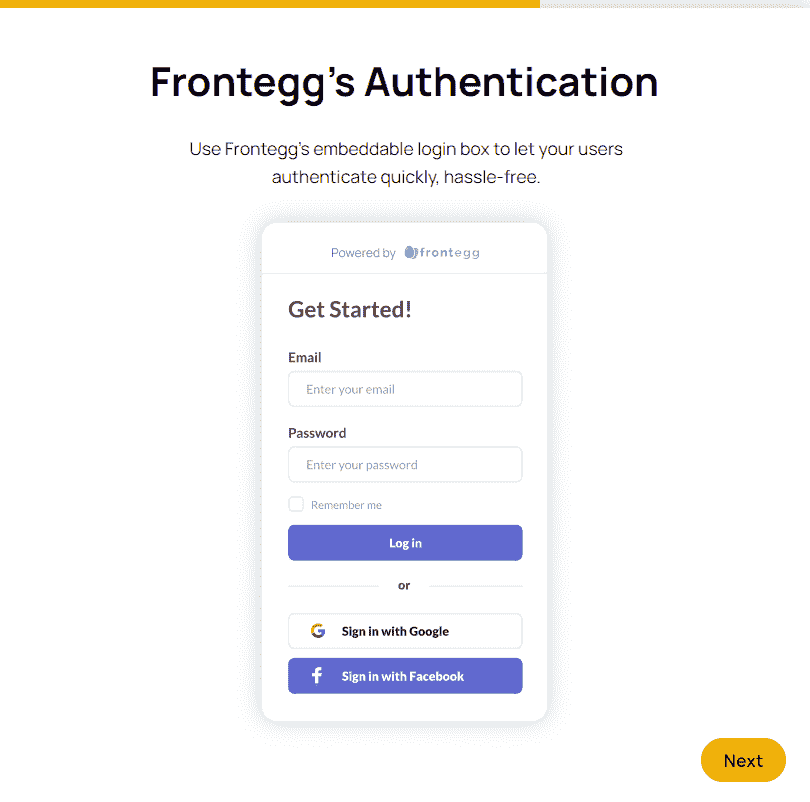

Frontegg 会询问您的产品所需的能力，并相应地进行安排。毕竟，一种尺寸并不适合所有人。

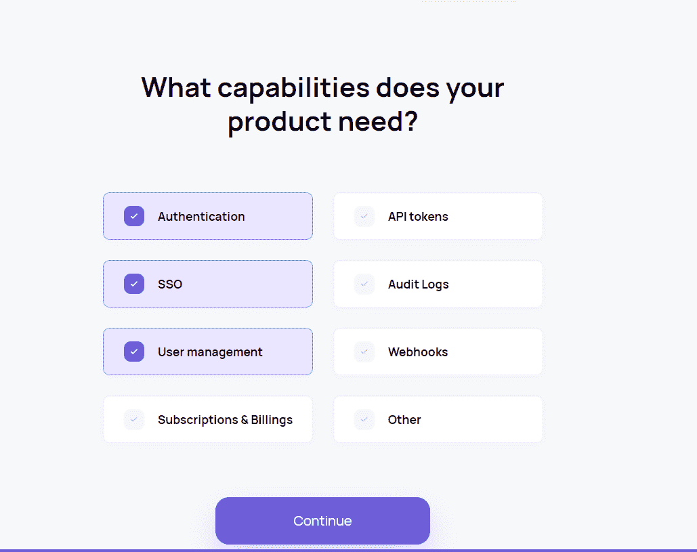

一旦决定了要实现的特性。归结起来就是选择你希望与 Frontegg 一起使用的[前端 javascript 框架](https://hackr.io/blog/best-javascript-frameworks)。

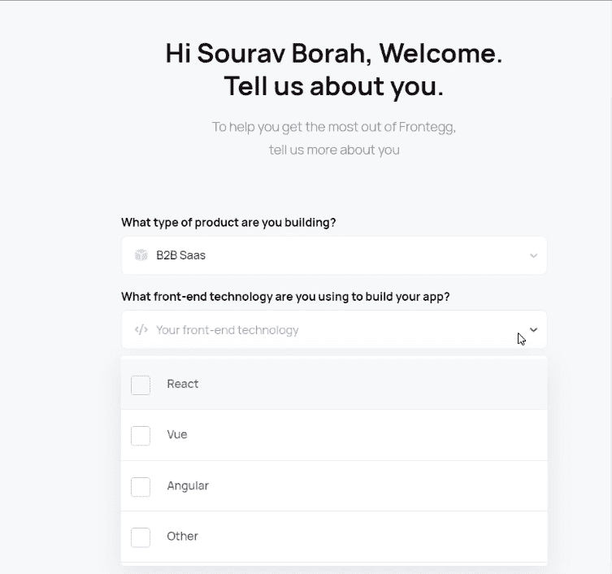

在这种情况下，我决定用 Angular。 [Angular](https://angular.io/) 是一个用于开发前端用户界面的开源平台。凭借其双向绑定特性和对单页面和多页面 web 应用程序的支持，Angular 是最通用的前端技术之一。

现在，是我们动手的时候了。

# 将 Frontegg 集成到您的应用程序中

我们从**集成登录框**开始。步骤如下:

# 1.创建一个新的 Angular 应用程序(如果您已经有一个应用程序，请跳过)。

首先安装 Angular CLI(假设您还没有安装它)。

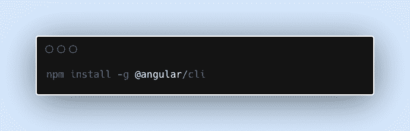

现在，使用以下脚本创建一个应用程序。

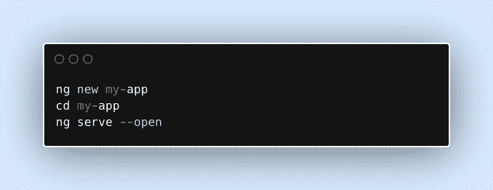

现在已经完成了，让我们进入第二步。

# 2.安装 Frontegg 库。

运行以下命令来安装 npm 和 yarn 库。

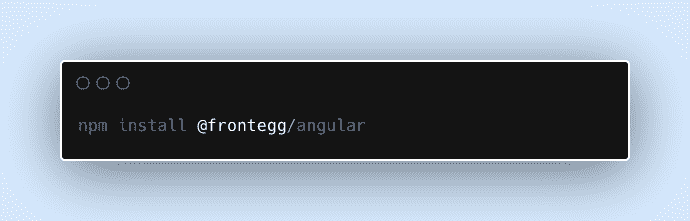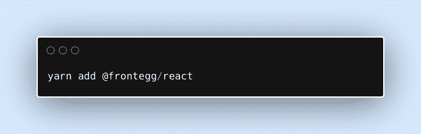

# 3.配置。

将 FronteggAppModule 添加到 AppModule。

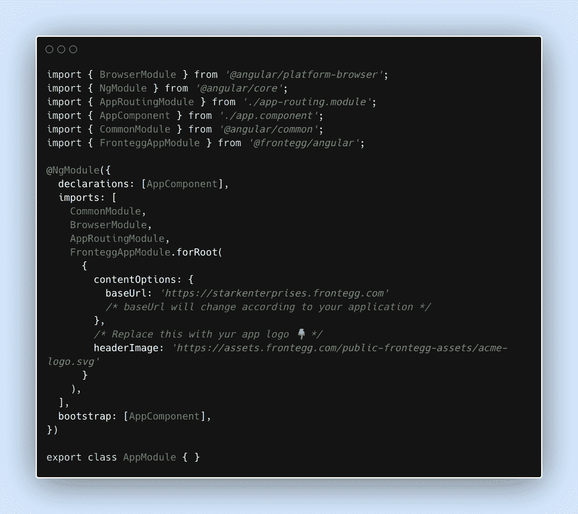

# 4.将 Frontegg 添加到路由器模块中

将 FronteggRouterComponent 添加到您的通配符路由中(如下所示)。在路由模块中使用 FronteggAuthGuard 可以让您将经过身份验证的用户重定向到登录页面。

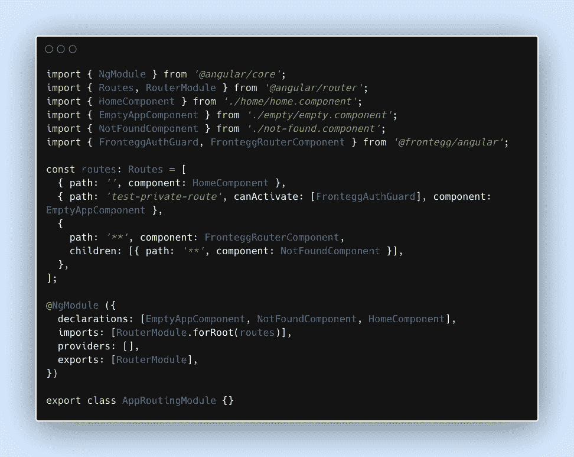

# 5.获取用户上下文。

用 frontegg-app 选择器包装你的应用。

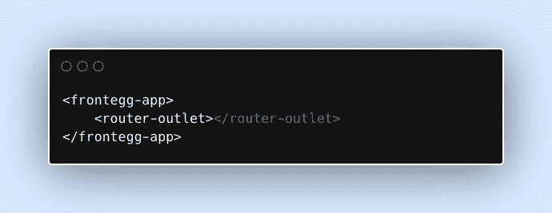

Frontegg 通过 FronteggAppAuthService 通知您用户上下文和认证状态。FronteggAppService 允许您访问完整的状态。访问存储的认证子状态，如用户状态、SSO 状态、MFA 状态等。，请使用 FronteggAppAuthService，如下例所示。

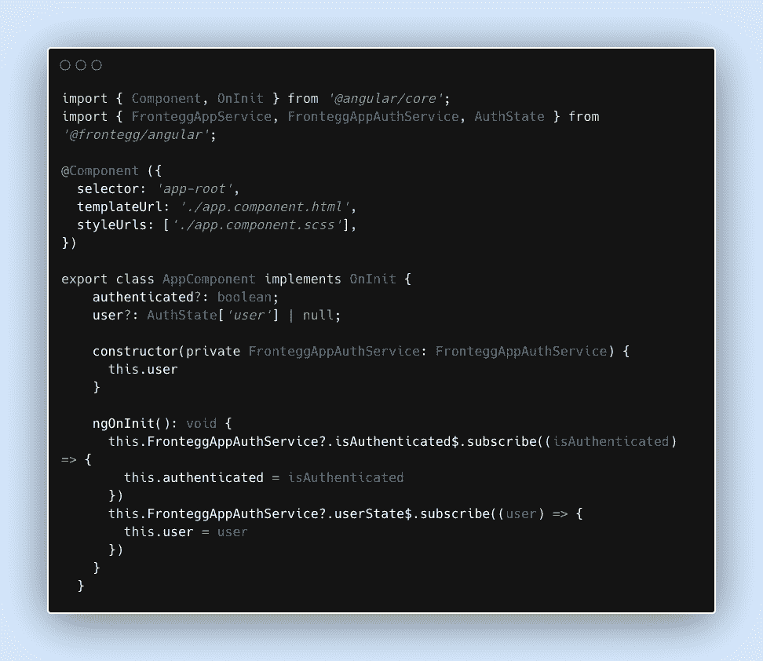

下面给出了用户上下文的演示:

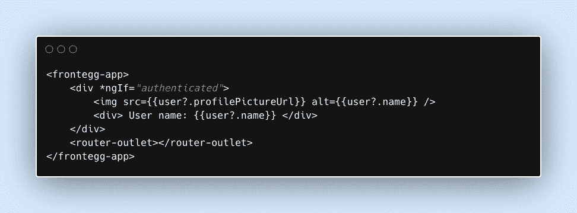

# 6.运行应用程序，注册并登录。

投入所有这些工作后第一次运行应用程序是一种令人兴奋的体验。运行应用程序也是集成 Frontegg 的最后一步。使用以下命令运行您的应用程序。

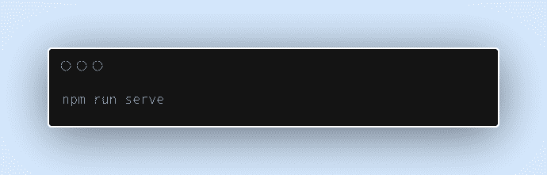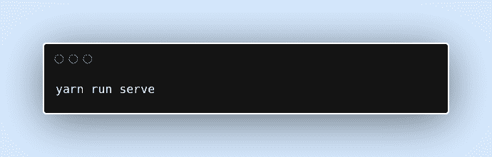

# 完了！

恭喜你！Frontegg 现在与您的应用程序集成在一起。

登录和注销路线已添加到您的应用中:

*   [http://localhost:4200/account/sign-up](http://localhost:4200/account/sign-up)将带您进入注册屏幕。
*   [http://localhost:4200/account/log in](http://localhost:4200/account/login)将带您进入登录界面。

如果你已经登录，去[http://localhost:4200/account/logout](http://localhost:4200/account/logout)注销。要打开该应用程序，请使用[http://localhost:4200/account/sign-up](http://localhost:4200/account/sign-up)并注册您的第一个用户。

# 通过集成管理门户来跟进登录框集成

Frontegg 的管理门户集成要求我们从@frontegg/angular 包中导入 FronteggAppService，并在点击相关按钮时使用 showAdminPortal 方法。

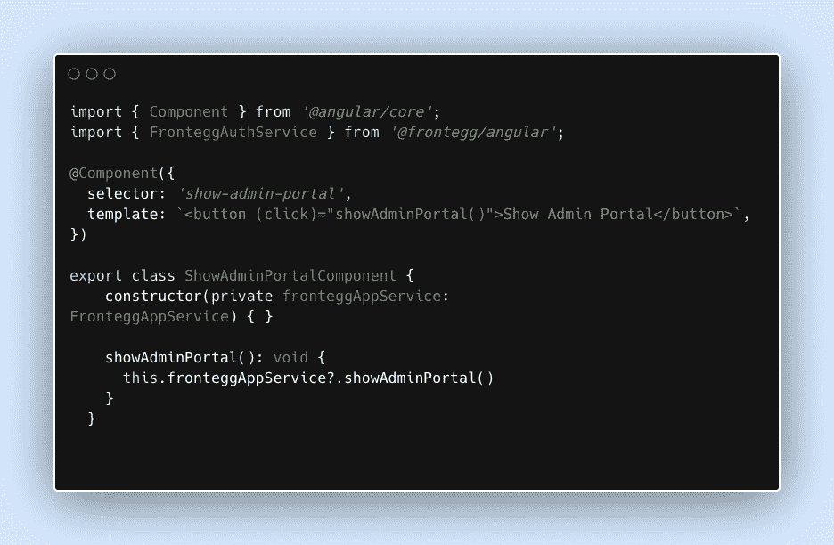

一切就绪！

# 结论

有了这个，你就可以走了。管理门户现在应该是可见的。欢迎使用 Frontegg 提供的完全自我管理的体验！我希望您能够学习如何为您的 JavaScript 应用程序设置帐户管理基础设施。

*更多内容请看*[***plain English . io***](http://plainenglish.io/)