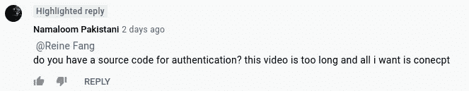
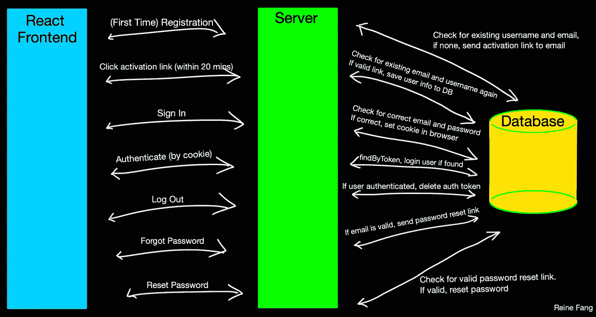

# 在 Node.js 中实现您自己的用户认证系统

> 原文：<https://javascript.plainenglish.io/implement-your-own-user-authentication-system-in-nodejs-866078a08584?source=collection_archive---------8----------------------->

## 简单易懂的教程

## 包括—用户注册、登录、激活、身份验证、注销、忘记密码和重置密码服务

Photo by [Franck](https://unsplash.com/@franckinjapan?utm_source=medium&utm_medium=referral) on [Unsplash](https://unsplash.com?utm_source=medium&utm_medium=referral)

所以…有人在 Awais 的 YouTube 视频中给我加了标签，这促使我写了这篇用户认证教程(见下文)。

Screenshot by Author

当我试图为我自己的全栈 MERN 应用程序设置认证系统时，我引用了 Awais 的这个 YouTube 视频，我强烈推荐观看他的视频[这里](https://www.youtube.com/watch?v=CEim3tZsp1Y):)但是如果你真的没有时间，请随意浏览这个教程并使用[这个](https://github.com/Reine0017/NodeAuthentication)公共 GitHub repo。ʕ•́ᴥ•̀ʔっ♡

我自己实现整个用户认证流程的原因主要是因为我想更好地了解幕后发生的事情。如果你不确定是应该自己实现还是使用第三方服务(比如 [Auth0](https://auth0.com/) 或 [Firebase](https://firebase.google.com/) ，你可能想看看 Ben Awad 的 [YouTube 视频](https://www.youtube.com/watch?v=Hh_kiZTTBr0)。

***注:*** *我从 Awais 那里了解并参考了以下内容——请查看他的* [*视频*](https://www.youtube.com/c/AwaisMirza1/videos) *:)此外，我对他的版本做了一些修改，所以这里的代码和他的视频看起来可能有点不同。*

我使用 MongoDB Atlas 作为我的云数据库，使用 Sendgrid 作为我的电子邮件发送服务。在 Awais 的 YouTube 教程中，他使用了其他东西，所以你可以选择你更喜欢的东西。

事不宜迟，我们开始吧~

# 总体想法是:

Diagram made by Author

我们将建设的路线有:

*   `/register`
*   `/activate`
*   `/login`
*   `/authenticate`
*   `/logout`
*   `/forgotpassword`
*   `/resetpassword`

# 该设置

前往 [SendGrid](https://sendgrid.com/) 和 [MongoDB Atlas](https://www.mongodb.com/cloud/atlas) 创建你的账户，并按照他们的指导进行设置。但是基本上你想要的只是 API 密匙。一旦你有了这些，把它们放在一个(秘密的)文件中——我把我的命名为 [config.js](https://github.com/Reine0017/NodeAuthentication/commit/b02599195f0787eaecf30ff0f6a0d184d99e2f23) 。

现在我们要安装相关的 npm 包。您可以阅读这篇文章，了解更多关于设置 NodeJS 环境的信息。运行`npm init`和`npm install express`之后，我们将需要[安装其他相关的包](https://github.com/Reine0017/mini-tutorials/commit/be640ecdc89bf749f60fed7707d38fad95b96704)。

# 写文件

接下来，我们将编写我们的 [server.js](https://github.com/Reine0017/NodeAuthentication/commit/71e21ebce01235868957d6dbd1dc2b4b7dcb8aca) 文件。这个文件有点像“主文件”，在这里你可以编写不同的服务(例如，在这种情况下是 userService)，然后指定你必须调用什么 API 端点路由来“到达”服务(userService)。在这种情况下，如第 22 行所示，我们必须调用“< URL > /api/users”来“到达”我们的用户服务。

除了我们的 server.js 和/routes/userService 文件，我们仍然必须声明用户模式([mongose。模式](https://mongoosejs.com/docs/schematypes.html))。这概括了用户模型在我们的数据库中的样子——例如，它有什么属性等等(基本上是 Mongoose 模型的配置对象)。接下来让我们创建该文件:

请注意，这只是整个文件的一部分(如果我包含所有代码，本教程会太长)。除了这个模式之外，还有一些帮助函数——查看 user.js 中的所有代码

很好，现在还记得我们如何指定 userService.js 文件在 routes 中(server.js 的第 8 行)吗？我们现在将创建 routes 文件夹，并在其中创建我们的 [userService.js 文件](https://github.com/Reine0017/NodeAuthentication/commit/5ba29ba55b89f97e218c46350cc421c40dd04bc3)。这个文件太长了，无法添加到本教程中，所以我想我应该简单解释一下`/register`和`/auth`路线的作用，如果你有任何问题，欢迎在下面评论或者联系我。

在上面的要点中，在我们的用户输入他们的电子邮件、用户名和密码之后，我们检查用户名和电子邮件之前是否已经注册过。如果是，我们通过返回状态 400 和一条消息来拒绝注册。否则，我们向用户发送一封带有签名令牌(这是 activationToken)的电子邮件，当用户点击激活链接时，我们将从前端触发`/activateUser` API 端点，并将用户详细信息保存在我们的数据库中。我们不在首次注册时直接写入我们的数据库的原因是，我们不想将假电子邮件写入我们的数据库。

现在对于`/auth`端点:

这个`/auth`无需用户点击或输入就能被触发。在您的 React 应用程序中，创建一个当某些页面被访问时触发调用此端点的操作的特设。如果您在浏览器中设置了身份验证 cookie，authenticateToken 中间件(第 1 行)将发回用户数据。如果不是，authenticateToken 中间件拒绝认证尝试。

最后，我们将添加 authenticateToken 中间件:

这里有最终的代码库:[https://github.com/Reine0017/NodeAuthentication](https://github.com/Reine0017/NodeAuthentication)

好的，谢谢你读到这里:)我希望你喜欢它，如果有任何问题，请在这里留言或给我发信息！

Node.js-ing 快乐！ʕ•́ᴥ•̀ʔっ♡

*更多内容请看*[*plain English . io*](http://plainenglish.io/)