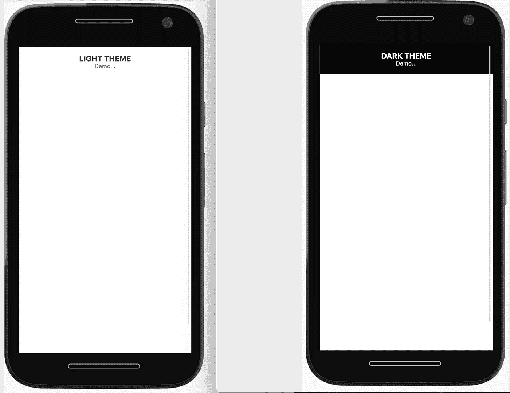

# 用 React 实现黑暗模式

> 原文：<https://javascript.plainenglish.io/implementing-dark-mode-reactjs-2fba91cda7f2?source=collection_archive---------4----------------------->

## 使用 React 在应用程序中实现暗/亮模式主题

顾名思义，这个博客是关于在使用 React 的应用程序中实现暗/亮模式主题的。我相信你已经意识到了应用程序中的明暗主题。

*亮模式:指* ***暗****-字体文本上* ***亮*** *背景(正对比极性)*

*暗模式:表示组合* ***亮*** *(如白色)文字上* ***暗*** *(如黑色)背景(负对比极性)。*


In Mac, we can set Dark or Light theme from <System Preferences -> General>

这两个主题有一些优点，可以在移动设备上配置，也可以在桌面上配置。在大多数设备中，我们可以从`Setting-> Display-> THEME`开始更改暗/亮模式。或者，我们也可以在网站中添加切换功能，明确地在亮暗主题之间切换。

为什么它很重要？当一个网站有黑暗模式主题时，有几点可以让它变得更好:

*   它为视力低下和对强光敏感的用户提高了可见度。
*   让任何人都能更轻松地在弱光环境中使用设备。

如果我谈论实现部分，我已经使用了`[window.matchMedia](https://developer.mozilla.org/en-US/docs/Web/API/Window/matchMedia)`来检查主题`[prefers-color-scheme](https://developer.mozilla.org/en-US/docs/Web/CSS/@media/prefers-color-scheme)`。

```
// EventListener when mode/theme is changedwindow.matchMedia('(prefers-color-scheme: dark)').addEventListener('change', event => {
  if (event.matches) {
    // set **mode** state to Dark here
  } else {
    // set **mode** state to Light here
  }
});
```

上面的代码是一个监听器，它检查事件`(prefers-color-scheme: dark)`中是否有变化。因此，如果系统主题是黑暗的，那么`if`条件为真，我们可以将**模式**状态切换到`Dark`，否则在 else 语句中，我们可以将状态切换到`Light`模式。

我使用相同的事件`*window.matchMedia('(prefers-color-scheme: dark)')*` 来设置我的应用程序中的默认主题状态，如下所示:

```
// To set default value when page is refreshedlet defaultMode = 'light';
if (window.matchMedia('(prefers-color-scheme: dark)').matches) {
  defaultMode = 'dark';
}
```

因此，如果系统设置已经设置为暗，则`*if (window.matchMedia('(prefers-color-scheme: dark)').matches)*`条件被评估为真，应用默认模式被设置为**暗。**

让我们实现下面的例子，如果设置从亮到暗，背景颜色应该从白色变成黑色，文本颜色从黑色变成白色，以防主题从亮到暗。

灯光主题(左图):背景色:白色，文字色:黑色。

深色主题(右图):背景色:黑色，文字色:白色。



Example for Dark and Light theme.

首先在应用程序中添加一个上下文。

这里 context 有两个键*模式*(主题值:暗/亮)和*切换(*功能切换模式*)。*

然后我们可以创建一个保持**模式**状态的`useDarkmode`钩子，并在 body 上设置样式。然后，我们将在我们的提供者中使用这个函数，如下所述。

在这个文件中，我们添加了一个使用`useDarkmode`和`darkModeContext`的提供者

现在我们有了维护暗/亮模式的代码，我们只需要在我们的应用程序中使用上面的代码，这样它就可以在我们的应用程序中工作。

要完成该功能，请像这样将您的应用程序包装在提供程序中(**应用程序文件**):

```
import React from 'react';
import { object } from 'prop-types';
import DarkProvider from './darkModeProvider';
import MainComponent from './mainComponent';function App({ history, client }) {
  return (
    <DarkProvider>
      <MainComponent />
    </DarkProvider>
  );
}App.propTypes = {
  client: object.isRequired,
  history: object.isRequired,
};export default App;
```

如果你的`MainComponent`是这样的( **mainComponent.js 文件**

```
import React from 'react';
import { useDarkmodeContext } from './darkModeProvider';
import { setThemeMode } from './styles';const MainComponent = () => {
  const { mode } = useDarkmodeContext();
  const themeMode = mode || 'light';
  const css = setThemeMode(themeMode);return (
      <div className={css.container}>
        <div>
          <div className={css.emptySearchHeading}>
            {themeMode?.toUpperCase()} THEME
          </div>
          <div className={css.emptySearchText}>
            Demo...
          </div>
        </div>
      </div>
  );
};
export default MainComponent;
```

在上面的文件中`useDarkmodeContext`得到**模式**状态是亮还是暗。在这种状态下，我们可以在 styles.js 文件中设置我们的主题。像下面提到的( **styles.js 文件**):

```
import { css } from 'react-emotion';
import { Theme } from './colors';// set colors dynamically based on the **mode** from **Theme**
// color: ${Theme[mode].blackNewRgba};export const setThemeMode = mode => {
  return {
    container: css`
      display: flex;
      padding: 16px;
      justify-content: center;
      background: ${Theme[mode].containerColor};
    `,
    emptySearchHeading: css`
      font-size: 16px;
      color: ${Theme[mode].headingColor};
      text-align: center;
      font-weight: bold;
    `,
    emptySearchText: css`
      font-size: 12px;
      color: ${Theme[mode].textColor};
      text-align: center;
    `,
  };
};
```

主题对象包含亮暗模式的所有颜色变体。我们可以在下面查看这个目标代码(**)。/colors.js** )。

```
// Base color
export const headingColor = 'rgba(49, 53, 59, 0.96)';
export const textColor = `rgba(49, 53, 59, 0.68)`;
export const containerColor = '#ffffff';const lightTheme = {
  headingColor,
  textColor,
  containerColor,
};const darkTheme = {
  headingColor: '#ffffff',
  textColor : '#ffffff',
  containerColor: '#000',
};export const Theme = {
  light: lightTheme,
  dark: darkTheme,
};
```

因此，我们从这个文件中导出**主题**对象，如:

```
export const Theme = {
  light: lightTheme,
  dark: darkTheme,
};
```


## 结论

我希望这能有所帮助。也许我们可以使用不同的方法来设置主题，比如使用状态管理库或者只使用 css。请随时与我分享您的实现:)。