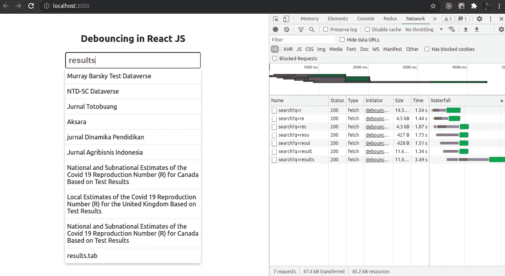
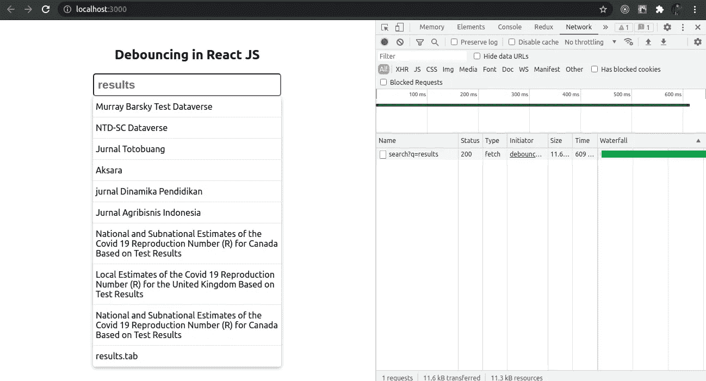

# 以 3 种不同的方式在 React 中实现去抖

> 原文：<https://javascript.plainenglish.io/implementing-debouncing-in-react-f3316ef344f5?source=collection_archive---------0----------------------->

去抖动用于优化 web 应用的性能。这是通过限制特定功能的执行速率(也称为速率限制)来实现的。

我们将通过在带有 onChange 事件的输入框中实现去抖动来学习它。当我们在这个输入框中输入内容时，每次击键都会调用一个 API。如果我们进入 Chrome 的 network 选项卡，在输入框中输入 results，我们会看到在我们输入的每个字母上，都有一个网络/API 调用。



从性能的角度来看，这并不好，因为如果用户在输入框中输入 50 或 100 个字符，那么将会进行 50-100 次 API 调用。


我们将在去抖的帮助下修复它。

# **方法 1:从头开始实施**

让我们做一个函数去抖。它将返回另一个函数(优化的函数)。该函数背后的逻辑是，只有当两次按键事件之间的时间大于 500 毫秒时，才会从 API 获取数据。如果延迟超过 500 毫秒，只有这时才会调用 *handleChange* 函数。

我们将使用 apply 函数来修复我们的上下文。如果这两个击键事件之间的延迟小于 500 ms，那么我们应该清除这个 setTimeout(定时器变量)。我们将使用这个优化的函数(从去抖函数返回)，而不是直接调用 handleChange 方法。

```
const debounce = (func) => {
    let timer;
    return function (...args) {
      const context = this;
      if (timer) clearTimeout(timer);
      timer = setTimeout(() => {
        timer = null;
        func.apply(context, args);
      }, 500);
    };
  };const handleChange = (value) => {
    fetch(`[https://demo.dataverse.org/api/search?q=${value}`](https://demo.dataverse.org/api/search?q=${value}`))
      .then((res) => res.json())
      .then((json) => setSuggestions(json.data.items));
  };
```

现在我们可以在 Chrome 的网络标签中查看，并输入结果。当我们在输入框中输入完整的结果时，只有一两次调用。



我们的去抖将在每次渲染时返回一个新的函数。这是我们不想要的，所以我们将使用 *useCallBack* 钩子。它将为我们提供记忆回调。

```
const optimizedFn = useCallback(debounce(handleChange), []);
```

下面是从头开始实现去抖的完整代码。

# 方法 2:使用 lodash

另一种实现去抖的方法是使用 [lodash](https://www.npmjs.com/package/lodash) 。Lodash 提供了一个去抖方法，我们可以用它来限制 handleChange 函数的执行速率。只需用去抖方法包装回调函数，并提供我们想要的两个事件之间的延迟量。现在，如果你回到 Chrome 上检查，它的工作原理是一样的。

```
import { debounce } from "lodash";const handleChangeWithLib = debounce((value) => {
    fetch(`[https://demo.dataverse.org/api/search?q=${value}`](https://demo.dataverse.org/api/search?q=${value}`))
      .then((res) => res.json())
      .then((json) => setSuggestions(json.data.items));
  }, 500);
```

# 方法 3:使用反作用-去抖-输入

我们还可以使用一个名为 [react-debounce-input](https://www.npmjs.com/package/react-debounce-input) 的 npm 包。与前两种方法相比，这是最简单的方法。只需使用 react-debounce-Input 库提供的 DebounceInput，而不是使用普通的 input 标记。并提供延迟作为属性。现在，如果我们回到 Chrome，再次检查，只有当我们完全输入结果时，才会调用。

```
<DebounceInput
     minLength={2}
     className="search"
     placeholder="Enter something here..."
     debounceTimeout={500}
     onChange={e => handleChange(e.target.value)} />
```


这是 React 中实现去抖的 3 种不同方法。我希望你们中的一些人会发现这些对我很有用。

查看这个 GitHub 资源库，获取源代码:s [源代码链接](https://github.com/ankitsaxena21/react-debounce-tutorial)

视频解释:

*更多内容尽在*[***plain English . io***](http://plainenglish.io/)