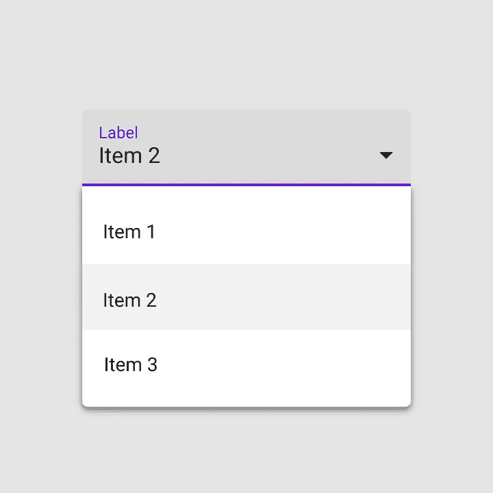

# 在 React Native with Formik 中实现下拉选择框

> 原文：<https://javascript.plainenglish.io/implementing-dropdown-select-boxes-in-react-native-with-formik-a897d1b3db48?source=collection_archive---------0----------------------->

## 如何使用 Formik 在 React Native 中制作下拉选择框



image by [material.io](https://material.io/components/menus#usage)

下拉选择框是移动和 web 应用程序中许多表单的常见功能。它们允许用户从相似项目的列表中选择单个项目。这些项目可以是日、月、城市、国家或任何其他类别。本文将向您展示如何在 React Native 和 Formik 中放置下拉选择框。

**步骤 1:** 使用 expo 创建一个新的 react-native 项目。称之为 SelectBoxApp

```
expo init SelectBoxApp
```

**第二步:**然后把 Formik 库安装到 app 上。在这里阅读 Formik 文档。

```
npm install formik --save
```

**第三步:**安装 Axios

```
npm install axios --save
```

**第四步:**安装 react-native-paper

```
npm install react-native-paper
```

**步骤 5:** 安装 react-native-community/picker

```
npm install @react-native-community/picker --save
```

查看文档 od**@ react-native-community/picker**[此处](https://www.npmjs.com/package/@react-native-community/picker)。

**步骤 6:** 将 react 导入到您的 app.js 文件中

```
import React from 'react';
```

**第七步:**将 axios 导入到你的 app.js 文件中。

```
import axios from 'axios';
```

**第八步:**将 *react-native* 中的**视图**、**文本**和**预警**组件导入到你的 app.js 中

```
import { View, Text, Alert} from 'react-native';
```

**第九步:**将**按钮**、**标题**、**文本**组件从 *react-native-paper* 导入到你的 app.js 文件中

```
import { Button, Title, TextInput } from 'react-native-paper';
```

**步骤 10:** 将 Formik 中的 useFormik 钩子导入到您的 app.js 文件中

```
import { useFormik } from 'formik';
```

**第十一步:**将 Picker 从@react-native-community/picker 导入到你的 app.js 文件中。

```
import { Picker } from '@react-native-community/picker'
```

这是所需进口的完整清单。

```
import React, { useState, useEffect } from 'react';
import axios from 'axios';
import { View, Text, Alert} from 'react-native';
import { Button } from 'react-native-paper';
import { useFormik } from 'formik';
import { Picker } from '@react-native-community/picker' 
```

**第十二步:**创建一个名为 App 的常量变量来存放一个胖箭头函数。

```
const App = () => {

};

export default App;
```

**第 13 步:**在应用程序内部创建一个数组，用于保存下拉选择框的选项。称之为城市。

```
*const* cities = [
     {name:"Los Angeles", id: 1},
     {name:"Philadelphia", id: 2},
     {name:"Chicago", id: 3},
     {name:"Washington DC", id: 4},
     {name:"New York", id: 5},
     {name:"San Diego", id: 6},
     {name:"Fort Worth", id: 7},
     {name:"Houston", id: 8},
     {name:"Cleveland", id: 9},
     {name:"Pittsburg", id: 10},
     {name:"Detroit", id: 11},
     {name:"Jacksonville", id: 12},
     {name:"Denver", id: 13},
     {name:"Columbus", id: 14},
     {name:"El Paso", id: 15},
     {name:"New Orleans", id: 16},
     {name:"Cincinnati", id: 17},
     {name:"Nashville", id: 18},
     {name:"Miami", id: 19},
     {name:"Tampa", id: 20},
     {name:"Bakersfield", id: 22},
     {name:"Tuscon", id: 23},
     {name:"Baltimore", id: 25},
     {name:"St Louis", id: 26},
     {name:"Las Vegas", id: 27},
     {name:"Memphis", id: 28},
     {name:"Seatle", id: 29},
     {name:"San Fransisco", id: 30},]
```

**第十四步:**App 内。创建一个常量变量来保存 *useFormik* 钩子的返回值。

```
const formik = useFormik();
```

**第十五步:**将 *city_name* 属性添加到 initialValues 属性中。

```
const formik = useFormik({
  initialValues: { city_name: '' },
});
```

**步骤 16:** 使用 axios 向 onSubmit 属性发出 HTTP 请求，将数据发送到 API 端点。

```
*const* formik = useFormik({
   initialValues: { city_name: '' },
   onSubmit: *values* => {
     axios({
        method: 'post',
        url: <domain-name> + 'url',
        data: {
           'city_name': values.city_name},
        headers: {'Content-Type': 'application/json'}
         }).then(*response* => {
         }).catch(*err* => {
             Alert.alert('An error occurred!', err.message,
           [{ text: 'Okay' }]);})}});
```

在 return 语句中，添加一个选取器元素和选取器项。

```
return(<View>
      <Picker 
            *enabled*={true} 
            *mode*="dropdown"
            *placeholder*="Select City"
            *onValueChange*={formik.handleChange('city_name')}
            *selectedValue*={formik.values.city_name}
      >
       {cities.map((*item*) => {
        return
          (<Picker.Item 
              *label*={item.name.toString()} 
              *value*={item.name.toString()} 
              *key*={item.id.toString()} />)
        })}</Picker></View>)
```

**第十七步:**接下来，在提货人下方添加提交按钮。

```
return(<View>
      <Picker 
            *enabled*={true} 
            *mode*="dropdown"
            *placeholder*="Select City"
            *onValueChange*={formik.handleChange('city_name')}
            *selectedValue*={formik.values.city_name}
      >
       {cities.map((*item*) => {
        return
          (<Picker.Item 
              *label*={item.name.toString()} 
              *value*={item.name.toString()} 
              *key*={item.id.toString()} />)
        })} </Picker> <Button 
            *mode*="contained" 
            *title*='submit' 
            *onPress*={formik.handleSubmit}
      >
        Enter
      </Button></View>)
```

最终的 *app.js* 文件应该是这样的。

```
import React, { useState, useEffect } from 'react';
import axios from 'axios';
import { View, Text, Alert} from 'react-native';
import { Button } from 'react-native-paper';
import { useFormik } from 'formik';
import { Picker } from '@react-native-community/picker' *const* App = () => {*const* cities = [
     {name:"Los Angeles", id: 1},
     {name:"Philadelphia", id: 2},
     {name:"Chicago", id: 3},
     {name:"Washington DC", id: 4},
     {name:"New York", id: 5},
     {name:"San Diego", id: 6},
     {name:"Fort Worth", id: 7},
     {name:"Houston", id: 8},
     {name:"Cleveland", id: 9},
     {name:"Pittsburg", id: 10},
     {name:"Detroit", id: 11},
     {name:"Jacksonville", id: 12},
     {name:"Denver", id: 13},
     {name:"Columbus", id: 14},
     {name:"El Paso", id: 15},
     {name:"New Orleans", id: 16},
     {name:"Cincinnati", id: 17},
     {name:"Nashville", id: 18},
     {name:"Miami", id: 19},
     {name:"Tampa", id: 20},
     {name:"Bakersfield", id: 22},
     {name:"Tuscon", id: 23},
     {name:"Baltimore", id: 25},
     {name:"St Louis", id: 26},
     {name:"Las Vegas", id: 27},
     {name:"Memphis", id: 28},
     {name:"Seatle", id: 29},
     {name:"San Fransisco", id: 30},
]*const* formik = useFormik({
   initialValues: { city_name: '' },
   onSubmit: *values* => {
     axios({
        method: 'post',
        url: <domain-name> + 'url',
        data: {
           'city_name': values.city_name},
        headers: {'Content-Type': 'application/json'}
         }).then(*response* => {
         }).catch(*err* => {
             Alert.alert('An error occurred!', err.message,
           [{ text: 'Okay' }]);})}});return(<View> <Picker 
            *enabled*={true} 
            *mode*="dropdown"
            *placeholder*="Select City"
            *onValueChange*={formik.handleChange('city_name')}
            *selectedValue*={formik.values.city_name}
      >
       {cities.map((*item*) => {
        return
          (<Picker.Item 
              *label*={item.name.toString()} 
              *value*={item.name.toString()} 
              *key*={item.id.toString()} />)
        })} </Picker> <Button 
            *mode*="contained" 
            *title*='submit' 
            *onPress*={formik.handleSubmit}
      >
        Enter
      </Button></View>)}export default App;
```

**最后**，测试 app。

现在我们有了。我希望你已经发现这是有用的。我会带着更多有趣的文章回来。感谢您的阅读。

*更多内容看*[***plain English . io***](http://plainenglish.io/)