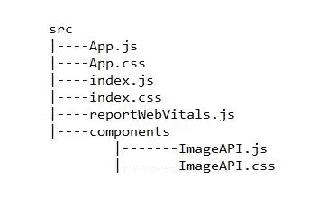

# 在 React 中实现无限滚动

> 原文：<https://javascript.plainenglish.io/implementing-infinite-scroll-in-react-34b112813de7?source=collection_archive---------4----------------------->


在本文中，我们将开发一个 React 应用程序，该应用程序将从下面的 API—[https://jsonplaceholder.typicode.com/photos](https://jsonplaceholder.typicode.com/photos)中获取数据(一页一页)，并将它们以表格的形式显示在浏览器上。当应用程序在浏览器中打开时，它将显示第一页的内容，滚动时，应用程序将加载并显示后续页面。应用程序的最终外观如下所示—

# 初始设置

首先，我们已经确保 Node.js 安装在我们的系统中。如果是这样，我们将创建一个名为 **React_Projects** 的目录，然后，我们将打开终端并导航到该目录。在那里，我们将运行以下命令—

```
npx create-react-app myapp
```

然后我们将运行 run 下面的命令来安装`axios`。

```
npm install axios
```

`axios`是一个基于 promise 的 HTTP 客户端，用于浏览器和 node.js。

# 程序

这个项目的`src`目录如下所示



## **第一步**

首先，我们将修改文件`App.js`如下—

## **第二步**

现在，我们将在`src`中创建一个`components`目录。然后，在`components`中，我们将创建一个文件`ImageAPI.js`。

当应用程序加载到浏览器中时，`useEffect`钩子将运行函数`getData()`，该函数将调用 API 并获取第一页。所有提取的数据将存储在状态变量`data`中。并且在`data.map()`方法的帮助下，保存在`data`变量中的所有数据都会在浏览器中显示出来。

`useEffect`钩子让我们在函数组件中执行副作用。

我们还使用了`onScroll`事件，为此我们需要创建一个 CSS 文件`ImageAPI.css`。

上面提到的`height`属性将是应用程序的`clientHeight`。

现在，当用户滚动页面时，`onScroll`事件将被触发，这将由函数`firstEvent`处理。一旦用户到达页面底部，`bottom`变量将存储一个`true`值，并且`if`语句将被执行。因此，页码将增加，并且调用`getData()`函数，该函数将再次调用 API 的第二页。现在，在`data`状态变量中，第一页和第二页的数据都将被存储，并在`data.map()`方法的帮助下显示在网页上。

# 结论

按照上面的简单步骤，可以在 react 应用程序中实现无限滚动。

上述代码也可以在我的 GitHub 知识库中找到，可以通过以下链接访问—

[](https://github.com/souvik-pl/React_infiniteScroll) [## souvik-pl/React_infiniteScroll

### 此时您不能执行该操作。您已使用另一个标签页或窗口登录。您已在另一个选项卡中注销，或者…

github.com](https://github.com/souvik-pl/React_infiniteScroll)