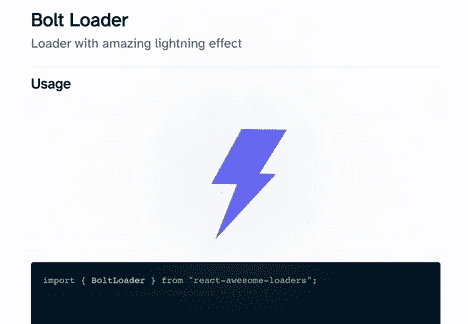

# 如何在 React 中实现加载器并改善站点的用户体验

> 原文：<https://javascript.plainenglish.io/implementing-loaders-in-react-a5e41cd04f0b?source=collection_archive---------3----------------------->

*利用装载机创造更好的用户体验*

Sunspot Loader from react-awesome-loaders

你有没有注意到当你的 React 应用程序完成一个获取请求时出现一个暂时的黑屏，或者当字体和图像加载时出现一个暂时的小故障？您的代码没有问题，但浏览器本身需要一些时间来处理信息，然后才能呈现在屏幕上。虽然大多数情况下可能只需要一秒钟或更短的时间，但有些情况下加载可能需要很长时间，让您的用户不知道发生了什么。

一个很好的解决方案是实现一个负载指示器。这样做可以在后台进程完成时为用户提供确认。在本文中，我们将探索如何使用`react-loaders-kit`包和 React 钩子实现一个基本的加载器，以及对其他流行的加载器包的建议。

# 用 React 钩子实现一个加载器

在创建了 React 应用程序、选择了想要使用的加载器并决定了它应该放在哪里之后，第一步是为加载器创建一个组件。我将使用[反应装载机套件](https://seimodei.github.io/react-loaders-kit-examples/)中的`GooeyCircleLoader`。请务必查看加载器包的文档，因为可能会有您可以更改的属性。在这种情况下，我将改变大小，加载器循环的次数(持续时间)，以及使用的颜色。下面是一段代码。

> 注意:我还使用了 [react-typed](https://www.npmjs.com/package/react-typed) 包来合并一个类型化的“loading…”文本，并且我已经在样式表中设置了组件的样式，这样加载器就出现在屏幕的中央。

一旦我们对加载器的外观感到满意，我们将把加载器导入到我们希望它在流程加载时显示的组件中。我将使用`useState`和`useEffect`挂钩来管理是否应该显示加载器以及显示多长时间，但是您可以使用`async` / `await`函数来做同样的事情。

我们首先声明一个布尔状态，决定是否显示加载程序，并将初始状态设置为`false`。如果状态为假，则应用程序知道显示加载程序。同时，会有进程在后台运行，以预加载数据或发出网络请求。

当数据正在加载时，我们将使用带有`setTimeout()`函数的`useEffect`钩子来指定在将状态更改为`true`之前要等待的时间。分配的时间应该是加载数据或发出网络请求所需的时间。一旦`setTimeout()`功能的时间到了，状态设置为`true`，满载的组件将出现在屏幕上，加载器将消失。

最终的产品应该是这样的。

> 注意:我还使用了 [react-spring](https://react-spring.io/) 来淡出加载器，但是你可以加入任何最适合你的应用的过渡

# 流行的加载程序包

## 反应装载机套件

这是我在上面的演示中使用的包，但是还有更多独特的和动画加载器的选项。查看[演示](https://seimodei.github.io/react-loaders-kit-examples/)和[文档](https://github.com/Seimodei/react-loaders-kit)。

## 反作用载荷

这个包提供了一些简单的动画加载器。参见[演示](https://agneym.github.io/react-loading/)和[文档](https://github.com/agneym/react-loading)。

## 反应装载机

这个包只有一个简单的 spinner loader，但是它是高度可定制的。更多信息请访问[演示](https://codesandbox.io/s/optimistic-hooks-4ihxj?fontsize=14)和[文档](https://www.npmjs.com/package/react-loader)。

## 反应-纯-装载机

这个套装提供了相当多的选择。我个人最喜欢的是 Pacman 装载机。访问[演示](https://reactpureloaders.io/story/?path=/story/ball-loaders--beat)和[文档](https://reactpureloaders.io/)。

## 反应加载 g

这个包提供了一些独特而有趣的加载器。查看[演示](http://139.196.82.33:8080/iframe.html?id=demo--demo)和[文档](https://github.com/Summer-andy/react-loading)。

## react-awesome-装载机

这个包中的加载器绝对是最生动和最精细的。查看其余的加载器选项，并查看文档[此处](https://awesome-loaders.netlify.app/docs/getting-started/)。

# 最后

加载器是向您的应用程序用户提供确认并改善整体用户体验的好方法。有许多令人惊奇的软件包，它们提供了易于实现的代码片段，无论您的技能水平如何。

下次当你创建一个具有加载周期的 React 应用程序时，遵循这里分享的步骤，找到一个最适合你的用户的加载器。

*更多内容尽在*[***plain English . io***](http://plainenglish.io/)