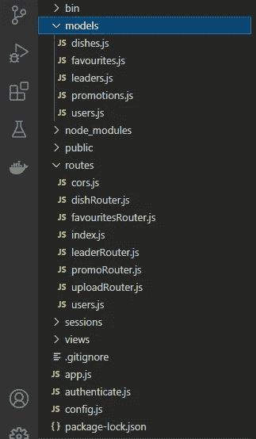

# 如何使用 Angular、Node.js 和 MongoDB 实现 OAuth2 脸书认证

> 原文：<https://javascript.plainenglish.io/implementing-oauth2-facebook-using-angular-node-and-mongo-db-88e852bb9e80?source=collection_archive---------1----------------------->


Photo by [Tudor Baciu](https://unsplash.com/@baciutudor?utm_source=medium&utm_medium=referral) on [Unsplash](https://unsplash.com?utm_source=medium&utm_medium=referral)

本文展示了如何在 Angular 应用程序中添加基于脸书的 OAuth2 身份验证。本文假设您了解 OAuth2 和 Passport npm 模块的工作原理。

我来总结一下 OAuth2 中的角色，以及每个角色的作用。

1.  与应用程序交互的最终用户(Express/Angular)是**资源所有者**。
2.  脸书是**资源服务器**，它存储受保护的资源，即终端用户的详细信息。
3.  Angular /Express 应用程序是代表资源所有者请求访问受保护资源的**客户端**。
4.  脸书也是授权服务器。它对资源所有者进行身份验证，并在获得授权后，向客户端颁发访问令牌。

客户端将使用访问令牌来生成 JWT 令牌，以便使用 JWT 令牌而不是访问令牌来认证角度应用和快速服务器之间的所有进一步交互。

**流程步骤:**

1.  资源所有者/最终用户选择通过脸书登录应用程序。
2.  脸书将使用用户名和密码验证资源所有者。
3.  身份验证成功后，脸书会向客户端颁发一个访问令牌。
4.  客户端使用接入令牌来生成具有特定有效期的 JWT 令牌。
5.  JWT 令牌存储在浏览器的 cookie 中，这样资源所有者发出的进一步请求将根据令牌有效性进行身份验证。
6.  客户端能够调用脸书 API **/me** 来获取资源所有者的脸书配置文件细节。

**第一步:向脸书开发者应用注册并创建一个新应用。**

我们需要先登录[https://developers.facebook.com/app](https://developers.facebook.com/app)。这需要一个脸书帐户。

创建一个类型为 **None** 的新应用程序。


Create App


Give App Name and Contact Email

一旦创建了您的应用程序，您将看到一个新的屏幕，顶部显示有**应用程序 Id** 。这些信息对 OAuth2 至关重要。


App Id

进入设置= >基本，您可以查看**应用程序秘密**，这是另一条重要信息。


App Secret

在屏幕的底部，有一个**添加平台**的选项。我选择了网站，因为我们正在创建的是一个基本的网络应用程序。


Add Platform

选择平台后，输入站点 URL 作为 Angular 应用程序 URL:[https://localhost:4200](https://localhost:4200)


Site URL

要使用脸书实现 OAuth2，重要的是一个**安全站点**访问它以使它工作，因为脸书只接受来自安全(HTTPS)站点的请求。

如果你想知道如何添加一个 HTTPS 连接到你的本地角度和节点应用程序，你可以看看下面的故事。

[](/setting-up-a-free-trusted-https-connection-for-your-local-express-server-d6716ad2cf69) [## 为本地 Express 服务器和 Angular Dev 服务器设置 HTTPS 连接

### 我最近试图使用脸书作为授权和资源服务器来实现 OAuth2。有很多…

javascript.plainenglish.io](/setting-up-a-free-trusted-https-connection-for-your-local-express-server-d6716ad2cf69) 

在基本设置中更新应用程序域。


App domains

现在在高级设置中，启用本机或桌面应用程序。


Advanced Settings

**第二步:建立你的 Node Express 项目。**

我总是喜欢使用 **express-generator** npm 模块来生成项目的框架。



这里我们只需要检查 4 个文件:routes/users.js、authenticate.js、models/users.js 和 config.js

**config.js**

```
//centralising all config info
module.exports={
secretKey:’12345–67890–12345–67890', //secret key for signing jwt
mongoUrl:’mongodb://localhost:27017/conFusion’,
**facebook:{
clientId:”362253228721012", //facebook App Id
clientSecret:”put your FB client secret here”
}**
}
```

这是不言自明的。我们已经导出了 3 条重要信息，供其他模块使用。

1.  `secretKey`为 JWT 代币签名。该令牌是在验证由脸书生成的访问令牌之后生成的。
2.  `mongoUrl`是连接到数据库时使用的 Mongo DB URL。
3.  当我们在脸书开发者网站上创建应用程序时，脸书向我们提供了应用程序 Id 和应用程序密码。

**userModel.js**

这里，我们为通过脸书或传统用户名/密码认证登录应用程序的用户编写了模式。最后，我们导出这个模式的**用户模型**，用于其他模块与**用户集合**进行交互。

```
const mongoose = require(‘mongoose’);
const schema = mongoose.Schema;
const passportLocalMongoose = require(‘passport-local-mongoose’);const userSchema = new schema({
firstName: {
type: String,default: ‘’
},
lastName: {
type: String,default: ‘’
},
facebookId: String,
admin: {
type: Boolean,
default: false
}
})userSchema.plugin(passportLocalMongoose);
module.exports = mongoose.model(‘User’, userSchema);
```

**routes/users.js**

这里我们写了一个路由，它接受由脸书后身份验证提供的访问令牌作为查询参数。

这个路由执行由中间件中的**passport-Facebook-token**模块提供的策略，以验证访问令牌并执行更多的动作，我们将在讨论身份验证模块时很快看到这些动作。

策略成功执行后，我们使用 authenticate 模块的 **getToken()** 生成一个 **JWT 令牌**。现在就把它当作一个黑盒，当被调用时，它会生成一个 JWT 令牌。令牌是使用用户集合中记录的 **_id 字段**作为有效负载生成的。这个字段对于集合中的每条记录都是惟一的，当一条记录被插入到集合中时，由 MongoDB 自动生成。

```
**userRouter.get(‘/facebook/token’, passport.authenticate(‘facebook-token’), function (req, res, next) {**
if (req.user) {
**let token = authenticate.getToken({ _id: req.user._id });** **res.cookie('jwt',token,{secure:true,httpOnly:true});
res.cookie('adm',req.user.admin,{secure:true});
res.cookie('user',`${req.user.firstName} ${req.user.lastName}`,{secure:true});**res.status(200).send();
}
})
```

你可能想知道用户。_id 属性存在于 req 对象中。脸书护照策略，成功验证后将用户信息序列化到会话中，即将以下对象添加到 req.user 中

```
{ 
firstName: ‘Ramya’,
lastName: ‘Balasubramanian’,
admin: false,
_id: 6156c32ac6e16619402588ff,
username: ‘Ramya Balasubramanian’,
facebookId: ‘115670914164322’,
__v: 0 
}
```

贴出来，我们在浏览器上设置了 3 个 cookies:jwt，adm 和 user。

存储 JWT 令牌的 cookie 仅在安全连接上传输(安全标志确保这一点，并防止中间人攻击)，并且不能被浏览器上的 JavaScript 访问(httpOnly 标志确保这一点)。

剩下的 2 个 cookies 包含管理员和用户的名字和姓氏，它们只有安全标志，因为它们需要被 JavaScript 访问以在屏幕上显示用户名，并且需要管理员信息来确定显示/隐藏哪些功能。


Cookies

因此，这个 JWT 令牌将用于将来客户端和服务器之间的所有交互，以进行身份验证。将不再使用访问令牌。

上面截图中的会话 id cookie 对应于基于服务器的**快速会话 npm 模块**，我们已经使用该模块在服务器端安全地存储 CSRF 秘密信息，并且仅在浏览器上存储会话 id 细节。CSRF 令牌与这里的讨论无关，因此被省略了。

**authenticate.js**

```
const passport = require(‘passport’);
const userModel = require(‘./models/users’);
**const jwt = require(‘jsonwebtoken’);
const facebookTokenStrategy = require(‘passport-facebook-token’);**const config = require(‘./config’);**passport.serializeUser(userModel.serializeUser());
passport.deserializeUser(userModel.deserializeUser());****//Facebook strategy
passport.use(new facebookTokenStrategy({
clientID: config.facebook.clientId,
clientSecret: config.facebook.clientSecret
}, function (accessToken, refreshToken, profile, done) {**
userModel.findOne({ facebookId: profile.id }, function (err, user) {
if (err) {
console.log(err);
return done(err, false);
}
else {
if (user) {
return done(null, user);
}
else{
let newUser = new userModel({
username: profile.displayName
})
newUser.facebookId = profile.id;
newUser.firstName = profile.name.givenName;
newUser.lastName = profile.name.familyName;
newUser.save(function (err, user) {
if (err) {
return done(err, false);
}
else {
return done(null, user);
}})}}})
}))**exports.getToken = function (user) {**
//user is the _id of the document in the users collection
//user is the user info i.e payload which will be signed by secret //key. Token will expires in 360 sec
return jwt.sign(user, config.secretKey, {
expiresIn: ‘360s’
})
}
```

1.  **护照-脸书-令牌**模块:

```
**passport.use(new facebookTokenStrategy({
clientID: config.facebook.clientId,
clientSecret: config.facebook.clientSecret
}, function (accessToken, refreshToken, profile, done) {**
console.log(accessToken);
userModel.findOne({ facebookId: profile.id }, function (err, user) {
if (err) {
console.log(err);
return done(err, false);
}
else {
if (user) {
return done(null, user);
}
else{
let newUser = new userModel({
username: profile.displayName
})
newUser.facebookId = profile.id;
newUser.firstName = profile.name.givenName;
newUser.lastName = profile.name.familyName;
newUser.save(function (err, user) {
if (err) {
return done(err, false);
}
else {
return done(null, user);
}})}}})
}))
```

上述策略在调用**passport . authenticate(‘Facebook-token’)**时执行。正如我们已经看到的，这在 **/facebook/token** 路线中被称为中间件。该策略从请求中的查询参数提取访问令牌，并使用提供给该策略的客户机 id 和机密作为参数来验证它。

访问令牌也可以在头或主体中传递，而不是作为查询参数传递。请检查下面的链接，看看它是如何在标题或正文中传递的。

[](https://www.npmjs.com/package/passport-facebook-token) [## 护照-Facebook-令牌

### 使用 OAuth 2.0 API 通过脸书访问令牌进行身份验证的 Passport 策略。本模块让您…

www.npmjs.com](https://www.npmjs.com/package/passport-facebook-token) 

在回调函数中，我们能够提取用户配置文件的详细信息。我们在用户集合的 **facebookId** 字段中寻找一个匹配的配置文件 Id。如果返回一个匹配，并且没有遇到错误，则返回 done (null，user)。如果没有匹配，那么我们将在 Users 集合中为这个概要文件创建一个新的用户记录。

下面这段代码将解释如何将用户信息序列化到会话(req.user)中，以及如何从会话(req.user)中反序列化。Passport 模块提供的方法提供了这种功能。

```
passport.serializeUser(userModel.serializeUser());
passport.deserializeUser(userModel.deserializeUser());
```

2. **jsonwebtoken** 模块:使用用户集合的 _id 字段作为有效负载来生成 JWT 令牌时，此模块是必需的。我们在下面的方法中使用了该模块来生成一个有效期为 360 秒的令牌。

```
**exports.getToken = function (user) {**
//user is the _id of the document in the users collection
//user is the user info i.e payload which will be signed by secret //key. Token will expires in 360 sec
return **jwt.sign(user, config.secretKey, {
expiresIn: ‘360s’
})**
}
```

**第三步:使用脸书登录 SDK 设置 Angular 应用程序。**

在控制面板中，我们有一个设置脸书登录的选项。点击 setup = > Select Web as platform = >输入 [https://localhost:4200](https://localhost:4200) 作为您站点的 URL。


Facebook Login

将向您展示在 angular 应用程序中配置脸书登录的几个步骤。假设你已经准备好了你的角度计划，让我们从这些步骤开始。

加载脸书 SDK 并检查登录状态。

在 **app.module.ts** 中，在导入之后和 NgModule 定义开始之前，添加下面这段代码。

```
declare const FB:any;function **appInitializer**(loginService: LoginService) {
return ()=> new Promise((resolve, reject) => {
// wait for facebook sdk to initialize before starting the angular //app
**window[‘fbAsyncInit’] = function () {
FB.init({
appId: environment.facebookAppId,
cookie: true,
xfbml: true,
version: ‘v11.0’
});
FB.AppEvents.logPageView();
}**// auto authenticate with the api if already logged in with facebook
loginService.getFacebookLoginStatus().then((authResponse:any)=>{
if (authResponse) {
console.log(authResponse);
loginService.setFacebookAuthStatus(authResponse);
resolve(true);
} else {
resolve(true);
}
});// load facebook sdk script
**(function (d, s, id) {
var js, fjs = d.getElementsByTagName(s)[0];
if (d.getElementById(id)) { return; }
js = d.createElement(s); js.id = id;
js.src = “https://connect.facebook.net/en_US/sdk.js";
fjs.parentNode.insertBefore(js, fjs);
}(document, ‘script’, ‘facebook-jssdk’));
});**
}
```

在 **appInitializer** 函数中，注入了对 LoginService(我们很快就会看到)的引用，以访问服务中的方法。

为此，在@NgModule definitions，providers 部分添加 appInitializer 函数，如下所示。appInitializer 函数将在 app 初始化时执行。除非函数中的承诺没有解决，否则应用程序初始化不会完成。

```
**providers: [
{
provide: APP_INITIALIZER,
useFactory: appInitializer,
deps: [LoginService],
multi: true
}
],**
```

**environment . facebook appid**是我们之前在 Facebook 开发者应用中创建应用时看到的应用 Id。我已经用下面提到的应用 ID 在脸书开发者上创建了一个应用。

```
**//environment.ts**
export const environment = { 
production: false, 
baseUrl:”https://localhost:3443/oauth/", clientUrl:”http://localhost:4200", 
**facebookAppId**:”**362253228721012**"};
```

它是从**环境. ts** 文件中导出的。

```
**//app.module.ts**
**loginService.getFacebookLoginStatus()**.then((authResponse:any)=>{
if (authResponse) {
console.log(authResponse);
**loginService.setFacebookAuthStatus(authResponse);**
resolve(true);
} else {
resolve(true);
}
});
```

当在浏览器中点击 [https://localhost:4200](https://localhost:4200) 时，随着应用程序初始化，我们在服务中调用方法**getFacebookLoginStatus()**来检查脸书用户的身份验证状态。一旦成功接收到状态，承诺在 app.module.ts 中解析，我们调用 LoginService 中的**setfacebooktauthstatus()**方法来基于状态执行一些操作。一旦我们理解了脸书发送的用户的认证状态，我们将在后面看到这一点。

```
**//LoginService**
**getFacebookLoginStatus**(): Promise<any> {
return new Promise((resolve, reject) => {
**FB.getLoginStatus((authResponse) => {
resolve(authResponse);
})**
})
}
```

我们已经在 LoginService 中在导入之后和 class 关键字之前声明了 FB，如下所示。

```
**declare const FB: any;**
@Injectable({
providedIn: ‘root’
})
export class LoginService {
//constructor,methods and instance variables
}
```

`FB.getLoginStatus()`将触发对脸书的调用，以获得如下所示的登录状态。

```
{
 status: ‘connected’,
 authResponse: {
 accessToken: ‘…’,
 expiresIn:’…’,
 signedRequest:’…’,
 userID:’…’
 }
}
```

status 属性指定应用程序使用者的登录状态。状态可以是下列之一:

`connected` -此人已登录脸书，并已登录您的应用程序。

`not_authorized` -此人已登录脸书，但尚未登录您的应用程序。

`unknown` -此人没有登录脸书，所以你不知道他们是否登录过你的应用程序，或者之前是否呼叫过`FB.logout()`，因此无法连接到脸书。

**authResponse** 如果状态为已连接，则包含属性，该属性由以下内容组成:

`accessToken` -包含应用程序使用者的访问令牌。

`expiresIn` -表示令牌过期并需要续订的 UNIX 时间。

`signedRequest` -一个有符号的参数，包含应用程序使用者的信息。

`userID` -应用程序使用者的 ID。

现在，为了基于 authResponse 中的登录状态执行进一步的操作，我们调用**setfacebooktauthstatus()。**

```
**setFacebookAuthStatus**(response: any) {
if (response.status === “connected”) {
 this.fb_authenticated=true;
 console.log(“The person is logged into Facebook, and has logged into your webpage.”);
 **this.generateJWTTokenForFB(response.authResponse.accessToken)**.subscribe((data: any) => {
 this.**getFacebookUserInfo()**.then(() => {
 this.**setUserAuthenticationStatus(true);**
 })
 .catch(err => console.log(err))
 })
 }
 else if (response.status === “not_authorized”) {
 console.log(“The person is logged into Facebook, but has not logged into your webpage.”);
 }
 else {
 //unknown status
 console.log(“The person is not logged into Facebook, so you don’t know if they have logged into your webpage.”)
 }
 }
```

如果能在浏览器上看到这个方法中发生的事情就太好了。为此，让我们看看我们的登录用户界面。


Unauthenticated Screen

点击登录按钮打开一个对话框。这是登录对话框的样子。如果用户喜欢传统的用户名/密码验证，它会有一个用户名和密码字段。否则，有一个继续与脸书按钮，以验证使用脸书。我们将重点关注 OAuth2 脸书认证，而不是传统的用户名/密码认证。


Login Dialogue

**登录决策模态模板:**我已经单独包含了登录动作的模板。包括注册动作也会造成混乱。

```
<form class=”form-group form-horizontal” [formGroup]=”**loginForm**”>
<div class=”form-group”>
<label class=”col-form-label req”>Username:</label>
<input type=”text” class=”form-control” **formControlName=”username”**></div><div class=”form-group”>
<label class=”col-form-label req”>Password:</label>
<input type=”password” class=”form-control” **formControlName=”password”**>
</div><div class=”form-group”>
<button [disabled]=”!loginForm.valid”
class=”btn btn-primary btn-block” (click)=”submit(action)”>**Submit**</button><button class=”btn btn-primary btn-block” (click)=”**loginWithFB()**”><i class=”fab fa-facebook-square”></i>**Continue with Facebook**</button></div>
</form>
```

**登录决策模态组件**

```
**declare const FB: any;**@Component({
selector: 'app-login-decision-modal',
templateUrl: './login-decision-modal.component.html',
styleUrls: ['./login-decision-modal.component.scss']
})
export class **LoginDecisionModalComponent** implements OnInit {public **loginForm** = new FormGroup({
username: new FormControl(“”, [Validators.required]),
password: new FormControl(“”, [Validators.required]),
firstName: new FormControl(“”), //for signup
lastName: new FormControl(“”) //for signup
})ngOnInit() {
**FB.Event.subscribe(‘auth.login’, this.fbLogin_event.bind(this));**
}**loginWithFB()** {
console.log(“logging in with FB”);
**FB.login();**
}**fbLogin_event(response)** {
console.log(response);
**this.loginService.setFacebookAuthStatus(response);**
this.loginDecision.emit({ action: “fbLogin”, response: response, type: “success” });
this.close(); //closes the dialogue
}}
```

当引导模式打开时，我们首先订阅一个脸书事件: **auth.login.** 每当事件触发时，就会调用 **fbLogin_event()** 。

```
ngOnInit() {
**FB.Event.subscribe(‘auth.login’, this.fbLogin_event.bind(this));**
}
```

当用户点击**继续脸书**按钮时，调用 **loginWithFB()** ，进而调用 **FB.login()** 。这将触发一个对话框来继续登录过程。

```
**loginWithFB()** {
console.log(“logging in with FB”);
**FB.login();**
}
```


Facebook login dialogue

输入用户名和密码并点击 **Please login** 按钮后，将触发 **auth.login** 事件，调用 **fbLogin_event()** ，并记录用户的登录状态，如下图浏览器控制台所示。

```
**fbLogin_event(response)** {
console.log(response);
**this.loginService.setFacebookAuthStatus(response);**
this.loginDecision.emit({ action: “fbLogin”, response: response, type: “success” });
this.close(); //closes the dialogue
}
```


Facebook Authentication Response

如您所见，响应的结构与我们之前讨论的完全相同。脸书已经提供了访问令牌，我们将使用该令牌在 express 节点服务器(应用服务器)中生成 JWT 令牌。用户将使用此 JWT 令牌与 express 服务器进行进一步的交互。我们现在将看到这是如何发生的。

一旦记录了响应，我们就调用**setfacebooktauthstatus()**将认证响应作为参数传递。我们现在可以详细了解在这种方法中发生了什么。这个方法的定义前面已经提到过了。

因为响应的 status 属性是“connected”，所以执行第一个 if 块。

```
**if (response.status === “connected”) {**
 this.fb_authenticated=true;
 console.log(“The person is logged into Facebook, and has logged into your webpage.”);
 **this.generateJWTTokenForFB(response.authResponse.accessToken)**.subscribe((data: any) => {
 this.**getFacebookUserInfo()**.then(() => {
 this.**setUserAuthenticationStatus(true);**
 })
 .catch(err => console.log(err))
 })
 }
```

我们调用另一个方法 **generateJWTTokenForFB()** 传递由 facebook 生成的访问令牌，以生成 JWT 令牌。

```
**generateJWTTokenForFB(fbAccess_Token: string) {** const url = **`${environment.baseUrl}users/facebook/token?access_token=${fbAccess_Token}`**;return this.http.get(url).pipe(response => response, catchError(this.handleError));}
```

正如我们已经看到的， **facebook/token** 路由用于验证访问令牌并为将来的交互生成 JWT 令牌。这个 JWT 令牌将存储在浏览器上一个安全的 httpOnly cookie 中。

通过脸书的成功认证后，我们在 **getFacebookUserInfo()** 中调用一个脸书 API **/me** 来获取用户资料细节并记录下来。

```
**getFacebookUserInfo**() {
 let that = this;
 return new Promise((resolve, reject) => {
 FB.api(‘/me’, function (response, err) {
 if (err) {
 reject(err);
 }
 else {
 console.log(‘Successful login for: ‘ + response.name);
 **that.setUser();**
 resolve(true);
 }
 });
 })}
```

我们还调用 **setUser()** 从 cookie 中提取用户详细信息，即名字、姓氏和管理信息，并通过 **user** subject 将其传递给组件。该组件将使用这些信息来隐藏/显示基于管理员状态的功能，并在屏幕上显示用户的名字和姓氏。

```
**setUser() {**
 let list = document.cookie.split(“;”);
 let cookieObj: any = {}
 list.forEach(cookie => {
 let trimmedCookie=cookie.trim();
 let cookieName = trimmedCookie.trim().substring(0, trimmedCookie.indexOf(“=”));
 cookieObj[cookieName] = decodeURIComponent(trimmedCookie.substring(trimmedCookie.indexOf(“=”)+1));
 //The purpose of decodeURI is to remove any kind of encoding
 })
 this.user.next(cookieObj);
 }
```

**setUserAuthenticationStatus(true)**将通过 subject authenticationCheck 将身份验证状态传递给组件。身份验证成功后，该组件进行 API 调用来检索菜肴的详细信息。

```
**setUserAuthenticationStatus**(status) {
this.authenticationCheck.next(status);}
```


successful oauth2 authentication

就是这样！都安排好了。

你可以在下面的链接查看角度和表达代码。

[https://github.com/ramya22111992/coursera_Oauth2.git](https://github.com/ramya22111992/coursera_Oauth2.git)

[https://github.com/ramya22111992/coursera-angular.git](https://github.com/ramya22111992/coursera-angular.git)

*更多内容请看*[***plain English . io***](http://plainenglish.io/)