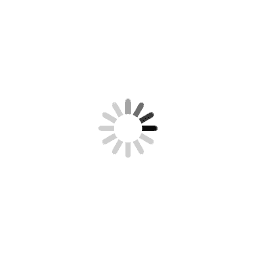
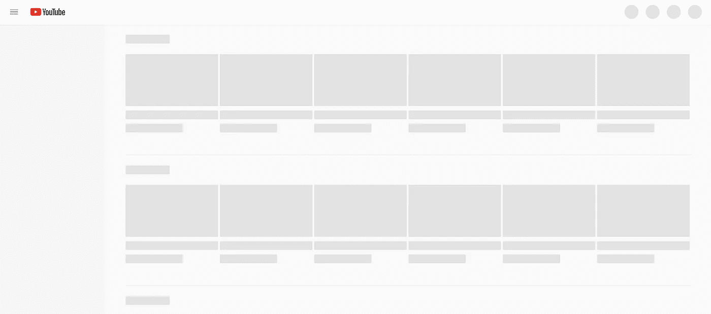
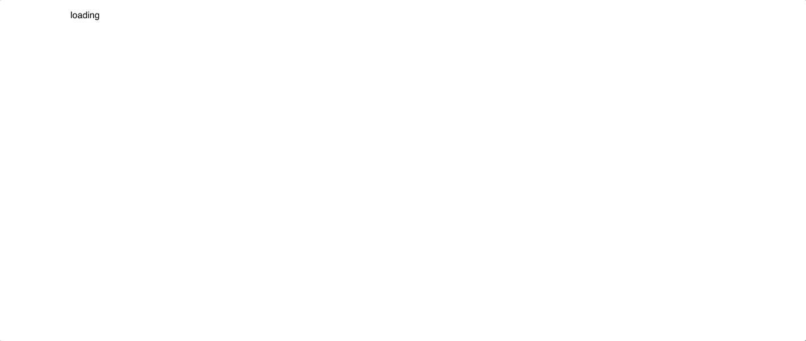
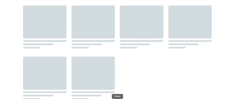

# 如何在 React 中创建骨架加载屏幕

> 原文：<https://javascript.plainenglish.io/implementing-skeleton-ui-in-react-js-7eeb409584de?source=collection_archive---------1----------------------->

骨架加载屏幕这个术语可能看起来很新，但你几乎在每个流行的平台上都见过(例如脸书、YouTube、LinkedIn 等)。这些是仍在加载的信息的动画占位符。它模仿整个视图的结构和外观。

当网站内容由于较慢的网络而需要时间加载时，我们习惯于看到一个表示内容正在加载的加载图标/gif。

表示内容仍在加载的旧方法:



上面的加载图标会让用户知道内容正在被加载。但是，在我看来，这不是一个很好的用户体验。

我们怎样才能让它变得更好？

**介绍骨骼加载屏幕:**



上图是 YouTube 上的骨骼加载屏幕。


它模仿将要加载的 UI 的结构。

我们将学习在任何 React 项目中实现这一点的两种方法。

源代码: [Github 源代码](https://github.com/ankitsaxena21/React-Skeleton-Loading-UI)

下面我们有一个简单的 App.js 文件，有两条路线。一个用于我们定制实现的代码，另一个使用 react-loading-skeleton。

```
import './App.css';
import { Route, Switch } from 'react-router-dom';
import ProductsCustom from './components/ProductsCustom';
import ProductsLib from './components/ProductsLib';
import Navbar from './components/Navbar';
function App() {
  return (
    <main>
      <Navbar />
      <Switch>
        <Route path="/" component={ProductsCustom} exact />
        <Route path="/lib" component={ProductsLib} />
      </Switch>
    </main>
  );
}export default App;
```

# 1.通过编写我们自己的定制代码来实现

让我们先构建自定义的。创建一个名为 components 的文件夹，在该文件夹中创建一个名为 ProductsCustom.js 的文件。

```
import { useState, useEffect } from "react";import SkeletonProduct from "../skeleton/SkeletonProduct";const ProductsCustom = () => { const [products, setProducts] = useState([]); const [loader, setLoader] = useState(false); useEffect(() => { setLoader(true); setTimeout(async () => { const response = await fetch('https://fakestoreapi.com/products/category/electronics'); const data = await response.json(); setLoader(false); setProducts(data); }, 4000); }, []); return (<div className="container"> <div className="row"> {!loader ? products.map(product => ( <div className="col-3" key={product.id}> <div className="product"> <div className="product-image">  </div> <div className="product-body"> <div className="product-title">{product.title.slice(0, 30)}.      </div> <div className="product-price">$ {product.price}</div> <div className="product-button"><a href="www.youtube.com">buy n now</a></div> </div> </div> </div> )) : [1, 2, 3, 4, 5, 6].map(loading => ( <div className="col-3" key={loading}> <SkeletonProduct /> </div> ))} </div> </div> )}export default ProductsCustom;
```

在这里，我们从 [fake store api](https://fakestoreapi.com/) 获取数据，并在屏幕上填充数据之前使用 setTimeout 创建 4 秒的延迟。在页面完全加载之前，我们只显示一条简单的消息——“正在加载”。(如下图所示)



现在，我们必须用一些框架 UI 来替换这个“加载”文本。为此，我们创建一个名为 skeleton 的文件夹，并在该文件夹中创建一个 SkeletonProduct.js 文件。

```
import Skeleton from "./Skeleton"import './skeleton.css';const SkeletonProduct = () => { return ( <div className="skeleton-wrapper"> <Skeleton type="thumbnail" /> <Skeleton type="text-lg" /> <Skeleton type="text-md" /> <Skeleton type="text-sm" /> <div className="shimmer-wrapper"> <div className="shimmer"></div> </div> </div> )}export default SkeletonProduct;
```

这里的<skeleton>是我们将创建的另一个组件。这将需要一个类型道具，我们可以使用 CSS 为不同类型的元素创建框架 UI。这些类- **thumbnail** 、 **text-lg** 、 **text-md、**和 **text-sm** 代表不同大小和种类的 UI 元素。</skeleton>

```
.skeleton { margin: 10px 0;}.skeleton-wrapper { width: 100%; position: relative;}.skeleton .thumbnail { width: 100%; min-height: 200px; background: #D2DBE2; border-radius: 7px;}.skeleton .text-lg { width: 100%; margin-top: 10px; background: #D2DBE2; border-radius: 7px; min-height: 10px;}.skeleton .text-md { width: 70%; margin-top: 10px; background: #D2DBE2; border-radius: 7px; min-height: 10px;}.skeleton .text-sm { width: 40%; margin-top: 10px; background: #D2DBE2; border-radius: 7px; min-height: 10px;}
```

微光包装器类将负责在<skeletonproduct>组件上创建微光效果。我们使用 CSS 动画来改变闪烁的 div 的位置。</skeletonproduct>

```
.shimmer-wrapper { position: absolute; left: 0; top: 0; width: 100%; height: 100%; overflow: hidden;}.shimmer { width: 50%; height: 100%; opacity: 0.2; background: rgba(238, 238, 238, 0.966); transform: skewX(-20deg); animation: loader 1s linear infinite;}@keyframes loader { 0% { transform: translateX(-150%); } 50% { transform: translateX(-60%); } 100% { transform: translateX(150%); }}
```

让我们看看我们的 Skeleton.js 文件。下面你可以看到我们正在使用“类型”道具来将相应的类应用到骨架组件上。

```
import './skeleton.css';const Skeleton = ({type}) => { return ( <div className="skeleton"> <div className={type}> </div> </div> )}export default Skeleton;
```

现在，我们将展示我们的<skeletonproduct>组件，而不是仅仅显示“加载”文本。</skeletonproduct>



现在，我们的 React 应用程序将加载，如上面的 gif 所示。

# 2.使用[反作用-骨架加载](https://www.npmjs.com/package/react-loading-skeleton)实现

另一种方法是使用[反应-骨架加载](https://www.npmjs.com/package/react-loading-skeleton) npm 包来实现我们应用程序的骨架加载 UI。

使用以下命令安装软件包:

```
npm i react-loading-skeleton
```

在骨架文件夹中创建另一个文件——Skeleton productlib . js。我们将从反应-加载-骨架(<skeleton>中导入骨架和骨架名称，用于添加骨架用户界面。<skeletontheme>改变所有骨架组件的颜色)。</skeletontheme></skeleton>

```
import React from "react";import Skeleton, { SkeletonTheme } from "react-loading-skeleton";const SkeletonProductLib = () => { return (

   <SkeletonTheme> <section> <div style={{ padding: "8px" }}> <div> <Skeleton height={200} /> </div> <div style={{ marginTop: "7px" }}> <Skeleton height={12} width={`100%`} /> </div> <div style={{ marginTop: "7px" }}> <Skeleton height={12} width={`70%`} /> </div> <div style={{ marginTop: "7px" }}> <Skeleton height={12} width={`40%`} /> </div> </div> </section> </SkeletonTheme>);};export default SkeletonProductLib;
```

<skeleton>组件以高度和宽度为支柱，指定占位符用户界面将采用的高度和宽度。</skeleton>

现在，我们将使用我们刚刚创建的这个<skeletonproductlib>组件，而不是使用我们的<skeletonproduct>组件。</skeletonproduct></skeletonproductlib>


我们的反应应用程序将加载如上图所示的 gif。

这就是你如何在反应中实现骨架加载屏幕。我希望你们中的一些人会发现这和对我一样有用。

项目源代码: [Github Repo](https://github.com/ankitsaxena21/React-Skeleton-Loading-UI)

*多内容于* [***中***](http://plainenglish.io/)