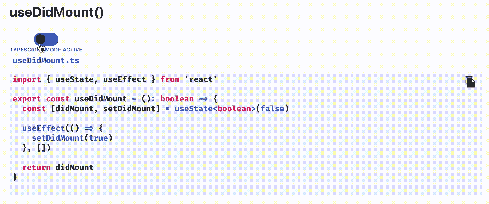
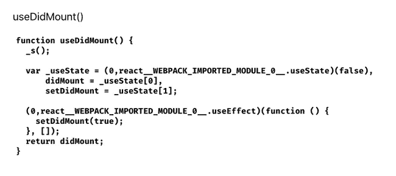
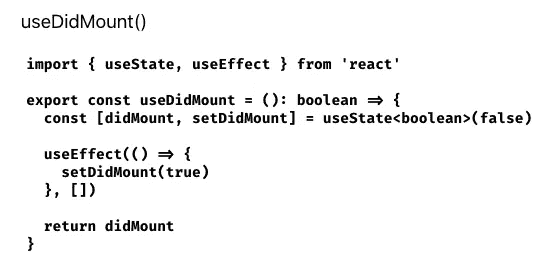

# 在 Gatsby 或 React 中将文件作为原始字符串导入

> 原文：<https://javascript.plainenglish.io/import-a-file-as-a-raw-string-in-gatsby-or-react-c788d7273bcb?source=collection_archive---------12----------------------->

## **以及如何用 Gatsby 或 React 创建高级代码片段！**



The advanced code snippet toggler I use on my blog.

*这篇文章是* [*在我的博客 chrisfrew.in*](https://chrisfrew.in/blog/import-a-file-as-a-raw-string-in-gatsby-or-react/) *上的镜像，在这里你会发现 waaay 更好的语法高亮和代码片段格式！*

# 右边的例子

[完全工作的代码沙箱在这里](https://codesandbox.io/s/boring-surf-tqtkc)。在这篇文章的后面，你将一步一步地看到如何为你自己的博客文章或网站构建这样一个组件！

# 为什么我需要以原始字符串的形式导入文件？

一些读者可能已经浏览了我博客的[片段页面](https://chrisfrew.in/snippets)，在那里我以最简洁的形式收集了我所有博客文章的关键片段。这在很大程度上受到了乔希·科莫的博客上的片段页面的启发。

我在我自己的 snippets 页面中加入了我自己的风格:我有来自整个堆栈的代码片段，包括来自 C#、Python 和 Node.js 等语言的代码片段。

我觉得我搭建的 TypeScript / JavaScript toggler 特别酷！在这篇文章的后面，我将介绍一个关于如何实现自己的语言 toggler 的教程。

如果你查看这个博客的回购协议[，你会看到我有一个文件夹，里面的每个代码片段实际上都是它自己语言的普通代码文件(`**.py**`用于 python，`**.cs**`用于 C#，`**.ts**`用于 TypeScript，等等)。正如我们将在这篇文章的结尾看到的，我实际上将这些文件作为原始字符串导入，然后使用](https://github.com/princefishthrower/chrisfrew.in)`[**prism-react-renderer**](https://github.com/FormidableLabs/prism-react-renderer)`库语法高亮显示它们。

# 我第一次尝试(失败)的演练

作为一个演练，让我们假设我们只想呈现一个片段，它将是一个 React 钩子，只是一个普通的 ol' TypeScript 文件(`**.ts**`扩展名)，`**useDidMount.ts**`。挂钩本身的实际代码如下:

```
***import* { useState, useEffect } *from* 'react'*****export* *const* useDidMount = (): boolean => {*****const* [didMount, setDidMount] = useState<boolean>(false)****useEffect(() => {****setDidMount(true)****}, [])*****return* didMount****}**
```

为了在我的博客上呈现这个文件，我首先天真地尝试直接导入文件，并在上面调用`**toString()**`。😂观察这个示例组件，它执行以下操作:

```
*import* * *as* React *from* "react"*import* { useDidMount } *from* '../snippets/useDidMount';*const* ExampleComponent = () => {*return* (<><p>useDidMount()</p><pre>{useDidMount.toString()}</pre></>)}*export* *default* ExampleComponent
```

如果您真的在浏览器中看到这个组件，它的结果会是这样的:



是的……片段的原始源代码已经被转换，变成了所有的 Webpack-ish。对于访问网站、想要干净代码片段的开发人员来说一点用都没有！

所以很明显，我们不能使用标准的`**import**`方法来导入我们的代码片段进行渲染。

**我们需要将它们作为原始字符串导入。**

# 解决方案

找到解决方案比我想象的更难。这里的*是*一个包，[gatsby-remark-embed-snippet](https://www.gatsbyjs.com/plugins/gatsby-remark-embed-snippet/)，它帮助你在 Gatsby 中嵌入来自一个文件的代码片段，但是那是一个 remark 插件，只打算在 markdown(或 MDX)文件中使用，而且无论如何，在撰写本文时，那个包的依赖项还没有升级到与我的博客正在使用的 Gatsby V3 兼容。我的片段页面是*而不是*一个`**.md**`或`**.mdx**`文件；它是一个 typescript react 组件，在一个`**.tsx**`文件中，我不想将整个页面重构为`**.md**`或`**.mdx**`。

因此，通过一些搜索，我首先找到了[这个 Stackoverflow 关于以原始方式导入 CSS 文件的帖子](https://stackoverflow.com/questions/55205774/how-to-import-a-css-file-in-a-react-component-as-raw-text)，因为最初的发帖人正在创建一个所见即所得编辑器，并希望完全按照编辑器中写的那样渲染 CSS。在那篇文章中，我找到了答案:

**需要使用** `**require**` **配合 Webpack 的** `**raw-loader**` **将文件作为原始字符串导入！**

按照我们一直使用的`**useDidMount**`示例，这将是:

```
***const* useDidMount = *require*("!!raw-loader!./useDidMount");**
```

然后我们可以使用`**useDidMount.default.toString()**`来呈现这个变量，例如在`**<pre>**`标签中:

```
**<p>useDidMount()</p>****<pre>{useDidMount.*default*.toString()}</pre>**
```

这将在浏览器中呈现代码片段的源代码，就像它出现在源文件中一样，如下所示:



太好了。这正是我们想要的！现在只需要突出显示实际代码字符串的语法，我们就可以了！

我为此创建了[堆栈溢出问题，我自己回答了](https://stackoverflow.com/a/66832315/2805387)，但由于某种原因被否决了。😞我不知道为什么——我认为我的解决方案是唯一一个如果你想把文件作为原始字符串导入到一个 Gatsby 项目中的非降价或 MDX 文件中的解决方案！

# 有趣的部分:我如何在代码片段页面上制作那些花哨的 TypeScript/JavaScript 脚本

因此，根据我们在本文中所学的知识，我现在将在[代码片段页面](https://chrisfrew.in/blog/import-a-file-as-a-raw-string-in-gatsby-or-react/snippets)上提供一个教程，介绍我如何实际构建这些代码片段集合。

我为我的代码片段选择的名字是… `**SnippetToggler**`！本质上，我们需要一个标签来标注我们想要称之为代码片段的东西，两个文件标签(一个用于 javascript，一个用于 TypeScript)，然后是实际的两个代码源——这将来自于整个`**raw-loader**`问题的头痛。

所以，让我们从组件的骨架开始，为我们需要的道具设置接口契约:

```
*export* *interface* ISnippetTogglerProps {snippetLabel: stringfileLabels: Array<string>typeScriptCode: stringjavaScriptCode: string}*export* *function* SnippetToggler(props: ISnippetTogglerProps) {*return* <></>}
```

到目前为止还不错。我们需要做的第一件事是拔下所有的道具:

```
*export* *interface* ISnippetTogglerProps {snippetLabel: stringfileLabels: Array<string>typeScriptCode: stringjavaScriptCode: string}*export* *function* SnippetToggler(props: ISnippetTogglerProps) {*const* {snippetLabel,fileLabels,typeScriptCode,javaScriptCode} = props*return* <></>}
```

然后让我们想想我们将需要的状态。我们将需要一个`**boolean**`状态变量来让我们知道实际渲染两个片段中的哪一个。我称之为`**showJavaScript**`。然后我们将使用`**activeModeText**`和`**className**`来帮助我们在切换片段时改变样式和标签:

```
*export* *interface* ISnippetTogglerProps {snippetLabel: stringfileLabels: Array<string>typeScriptCode: stringjavaScriptCode: string}*export* *function* SnippetToggler(props: ISnippetTogglerProps) {*const* {snippetLabel,fileLabels,typeScriptCode,javaScriptCode} = props*const* [showJavaScript, setShowJavaScript] = useState<boolean>(false)*const* activeModeText = showJavaScript ? "JavaScript" : "TypeScript"*const* className = activeModeText.toLowerCase()*return* <></>}
```

让我们开始考虑渲染标记。我将代码块的 TypeScript 和 JavaScript 版本分别保存为两个独立的`**const**`变量:

```
*export* *interface* ISnippetTogglerProps {snippetLabel: stringfileLabels: Array<string>typeScriptCode: stringjavaScriptCode: string}*export* *function* SnippetToggler(props: ISnippetTogglerProps) {*const* {snippetLabel,fileLabels,typeScriptCode,javaScriptCode} = props*const* [showJavaScript, setShowJavaScript] = useState<boolean>(false)*const* activeModeText = showJavaScript ? "JavaScript" : "TypeScript"*const* className = activeModeText.toLowerCase()*const* typeScriptBlock = (<><code className={className}>{fileLabels[0]}</code><PrecodeString={typeScriptCode}language="typescript"/></>)*const* javaScriptBlock = (<><code className={className}>{fileLabels[1]}</code><PrecodeString={javaScriptCode}language="javascript"/></>)*return* <></>}
```

其中的`**<Pre/>**`组件是另一个 react 组件(它相当复杂，因为我们需要基于 javascript 的语法高亮，而不是基于 markdown 的语法高亮——这里我省略了自己的`**<Pre/>**`组件的各个部分，比如复制按钮和点击时显示五彩纸屑。我还将语法突出显示主题固定为`**github**`，但还有许多其他主题可供选择。见[我的](https://github.com/princefishthrower/chrisfrew.in/blob/master/src/components/CodeCopyButton/Pre.tsx) `[**<Pre/>**](https://github.com/princefishthrower/chrisfrew.in/blob/master/src/components/CodeCopyButton/Pre.tsx)` [构件库上探索完整一个](https://github.com/princefishthrower/chrisfrew.in/blob/master/src/components/CodeCopyButton/Pre.tsx)。

```
*import* React *from* "react";*import* Highlight, { defaultProps, Language } *from* "prism-react-renderer";*import* github *from* "prism-react-renderer/themes/github";*export* *interface* IPreProps {codeString: string;language: Language;}*export* *const* Pre = (props: IPreProps) => {*const* { codeString, language } = props;*return* (<Highlight{...defaultProps}code={codeString}language={language}theme={github}>{({ className, style, tokens, getLineProps, getTokenProps }) => (<preclassName={className}style={{...style,padding: "2rem",position: "relative",overflowX: "scroll"}}>{tokens.map((line, i) => (<div {...getLineProps({ line, key: i })} style={style}>{line.map((token, key) => (<span {...getTokenProps({ token, key })} />))}</div>))}</pre>)}</Highlight>);};
```

回到我们的`**<SnippetToggler/>**`组件，我们可以使用`**return**`语句，添加实际的开关组件，并使用状态变量`**showJavaScript**`来决定呈现那些`**const**`变量中的哪一个。

**我们已经到达了 SnippetToggler 组件的最终版本:**

```
*import* * *as* React *from* "react";*import* { useState } *from* "react";*import* { Pre } *from* "./Pre";*export* *interface* ISnippetTogglerProps {snippetLabel: string;fileLabels: Array<string>;typeScriptCode: string;javaScriptCode: string;}*export* *function* SnippetToggler(props: ISnippetTogglerProps) {*const* { snippetLabel, fileLabels, typeScriptCode, javaScriptCode } = props;*const* [showJavaScript, setShowJavaScript] = useState<boolean>(false);*const* activeModeText = showJavaScript ? "JavaScript" : "TypeScript";*const* className = activeModeText.toLowerCase();*const* typeScriptBlock = (<><code className={className}>{fileLabels[0]}</code><Pre codeString={typeScriptCode} language="typescript" /></>);*const* javaScriptBlock = (<><code className={className}>{fileLabels[1]}</code><Pre codeString={javaScriptCode} language="javascript" /></>);*return* (<><h3 className={className}>{snippetLabel}</h3><div><label className={`switch ${className}`}><input*type*="checkbox"onChange={() => setShowJavaScript(!showJavaScript)}checked={showJavaScript}/><span className="slider round" /><span className="switch-text snippet">{activeModeText} Mode Active</span></label></div>{showJavaScript ? javaScriptBlock : typeScriptBlock}</>);}
```

很好，我们完成了！🎉

如果你感兴趣，这是我为我们的`**<SnippetToggler/>**`中使用的颜色和开关准备的 SCSS:

```
*$typeScriptBlue*: #2f74c0;*$javaScriptYellow*: #efd81c;*$width*: 50px;*$height*: 27px;*$lightColor*: #ffffff;*$darkColor*: #191919;.switch {position: relative;text-align: center;display: inline-block;height: *$height*;& .switch-text {margin-top: 1rem;display: block;}& input {opacity: 0;width: 0;height: 0;}& .slider {width: *$width*;position: absolute;cursor: pointer;top: 0;left: 0;right: 0;bottom: 0;background-color: *$lightColor*;-webkit-transition: 0.4s;transition: 0.4s;margin: 0 auto;}& .slider:before {position: absolute;content: "";height: 19px;width: 20px;left: 4px;bottom: 4px;background-color: *$darkColor*;-webkit-transition: 0.4s;transition: 0.4s;}& input:checked + .slider {background-color: *$darkColor*;}& input:checked + .slider:before {background-color: *$lightColor*;}& input:focus + .slider {box-shadow: 0 0 1px *$darkColor*;}& input:checked + .slider:before {-webkit-transform: translateX(22px);-ms-transform: translateX(22px);transform: translateX(22px);}/* Rounded sliders */& .slider.round {border-radius: *$height*;}& .slider.round:before {border-radius: 50%;}}.switch.typescript {& .switch-text {color: *$typeScriptBlue*;}& .slider {background-color: *$typeScriptBlue*;}}.switch.javascript {& .switch-text {color: *$javaScriptYellow*;}& input:checked + .slider {background-color: *$javaScriptYellow*;}}
```

# 工作示例

如果你想看一看并自己摆弄一下，我在这篇博文中放了[一个代码沙箱，里面有完整的代码引用](https://codesandbox.io/s/boring-surf-tqtkc)。SCSS 是最小的工作例子，所以当然它不会看起来*完全*像你在这个博客上看到的 togglers，但它非常接近！

我仍然有这个组件的未来工作计划。一些想法:

*   prop，在这里我可以引用我使用过的博客帖子或展示过的片段
*   `**description**`提供代码片段功能的简要概述的道具
*   显示在一些真实环境中被调用的函数的道具
*   `**id**` prop，这样我就可以链接到特定的片段，因为我预计[片段页面](https://chrisfrew.in/blog/import-a-file-as-a-raw-string-in-gatsby-or-react/snippets)会变得相当长

# 谢谢！

一如既往，感谢阅读，我希望这篇文章对你有用！您现在知道如何将文件作为原始字符串导入，并在 Gatsby 和/或 React 中对它们做任何您想做的事情！

干杯！🍻

*更多内容尽在*[***plain English . io***](https://plainenglish.io/)