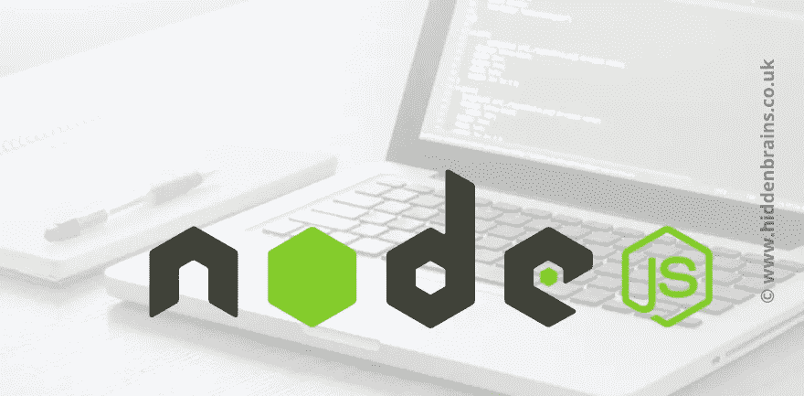

# 关于 Node.js 开发您应该知道的重要事实

> 原文：<https://javascript.plainenglish.io/important-facts-you-should-know-about-node-js-development-12cacb27632b?source=collection_archive---------10----------------------->

在全世界开发者团队高度需求的框架列表中，Node.js 是后端技术的最佳选择之一。超过 50%的开发者利用这个平台开发出顶尖的、高度可扩展的 web 应用。

在 Node.js 开发的最佳应用列表中，有优步和特雷罗。简单的代码共享、大规模的开发社区、温和的学习曲线和快速的性能是该技术的最大优势。在这里，我们将讨论 Node.js 的未来:

# 关于 Node.js

随着 JavaScript 的名气越来越大，一些修改使得 web 开发变得相当特别。Node.js 是专业开发人员选择的 JavaScript 运行时环境。几乎所有用它开发的应用程序都能够在不同的服务器上运行，例如 Unix、MS Windows 和 Mac OS。因此，它通过调用 web 套接字中的推送功能，在 web 应用程序的实时空间中工作。它最终将拥有一个双向连接的实时网络应用程序。这意味着服务器和客户端都要进行交互并公开交换数据。

## 与 Node.js 相关的 5 个主要特性

Node.js 的平台具有很强的管理不同请求和快速响应的能力。此外，该技术具有一些特殊的特性，使其适合于 web 应用程序的开发:

*   ASYNC hook 是 Node.js 中的主要模块，它有一个 API 来管理节点应用程序中的异步资源——带有回调的思想。
*   节点包管理器(NPM):它被称为一种发布用 Node.js 编写的开源计划的方法。此外，它还用于包的安装、依赖和版本管理。
*   NODE_Report 拥有一个与测试和开发相关的分析摘要，以保存与问题确定相关的数据。它拥有本机堆栈和 JavaScript 跟踪、堆统计信息、资源使用情况以及更多因素。
*   单个线程模型指的是一个系统，它处理不同的任务，为不同的任务分配优先级，并以良好的方式执行。
*   NODE_OPTION 确保命令行是在环境变量中完成的——环境变量是处理代码的焦点。

# Node.js 的主要优势

## 面向微服务的灵活性

当我们考虑开发可伸缩的应用程序时，Node.js 被认为是正确的解决方案。跨平台运行时设置有一个特殊的集群模块，并提供负载平衡。此外，Node.js 有一个非阻塞的机会循环设备，允许服务器完美地工作。

如果您希望一个现代应用程序能够根据您的需要上下运行，Node.js 是合适的平台。此外，它有助于提高 web 应用程序的整体性能，同时使用更少的资源。

随着 web 应用的垂直扩展，该平台将额外的资源分配给各个节点。

## 提高速度和性能

我们都知道 Node，js 是开源的，它拥有一个很大的开发者社区。请记住，社区是积极的，并使用最好的技能来改善和发展。此外，Node.js 的好处之一是开发人员总能找到 JavaScript 程序员的帮助。他们在 GitHub 中确保快速的解决方案和快速的回答。

作为一名开发人员，我们得到了团队的广泛帮助。对他们来说，回答困难的问题也很简单。除此之外，开发人员还得到了社区的特别帮助，即使是最困难的问题对他们来说也很容易解决。除此之外，JavaScript 还有 NPM，它是领先的包管理器，为 web 开发提供不同的工具。此外，Node.js 开发人员的活跃群体得到了包括网飞、亚马逊和谷歌等巨头的帮助。随着科技巨头们的良好接受，技术已经成长，光明的未来就在眼前。

## 全栈 JavaScript 的成本效益

有了 Node.js 的存在，开发者可以很方便的在后台和前台写下代码。主要原因是它为 JavaScript 开发人员提供了编写服务器端代码的可能性。因此，不需要为业务指定两个资源团队，这节省了全部开发成本。

除此之外，它在不影响质量的情况下，加快了整个 web 开发的过程。Node.js 与全栈 JavaScript 相关的另一个优势是，您不必为后端和前端指定不同的开发人员。所以即使是初露头角的初学者也能熟练使用 Node.js。

## 非凡的技术堆栈

规划一个强大的知识堆栈是 Node.js 必须转变为独立的全局名称的最重要原因之一。当一个 [Node.js 开发公司](https://www.hiddenbrains.co.uk/node-js-development.html)利用 Node.js 做后端时，你机械地获得了全栈 JavaScript 开发的所有好处。

*更多内容尽在*[***plain English . io***](http://plainenglish.io/)