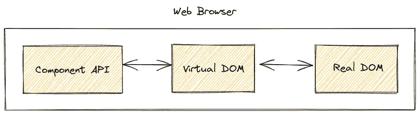

# 令人印象深刻的基于 React 的开源框架和工具

> 原文：<https://javascript.plainenglish.io/impressive-react-based-open-source-frameworks-and-tools-38f65227a59?source=collection_archive---------6----------------------->

## React 通常基于 JSX 组件呈现 DOM 元素，这些项目用 React 呈现不同的东西。

Photo by [Filiberto Santillán](https://unsplash.com/@filisantillan?utm_source=unsplash&utm_medium=referral&utm_content=creditCopyText) on [Unsplash](https://unsplash.com/s/photos/react?utm_source=unsplash&utm_medium=referral&utm_content=creditCopyText)

React 是一个开源的 JavaScript 库，帮助开发人员创建高度动态的 web 应用程序。它使用基于组件的开发风格和 JSX 语法，提供了一个开发人员友好的界面来定义 React 组件。然而，React 开发工具将您的 JSX 语法转换成原始的 React 组件定义。React 的架构有三层:组件定义 API、内存中组件状态管理模块(也称为虚拟 DOM 模块)和真实 DOM 元素渲染模块。

React 架构的第三层被称为 React 渲染器，它被实现为 React 库的一个单独的[包](https://www.npmjs.com/package/react-dom)。我们可以将 React 的架构命名为组件渲染器，因为它用 JSX 组件渲染不同的元素。

React’s component-renderer architecture. Illustration by the author.

这种架构设计使得 React 对于各种渲染器更具可扩展性。例如，有人可以通过将一些 JSX 组件映射到原生 UI 工具包的组件来构建 React 渲染器。同时，有人可以构建一个 React 渲染器，用自己的 JSX 组件集生成可打印的文档。

我发现了以下有趣的工具和框架，它们是在浏览 GitHub 资源库时作为 React 渲染器创建的。

# 反应 PDF/DOCX

我们通常需要有文档设计软件来创建 PDF 或 DOCX 文档。但是，作为程序员，我们喜欢通过编码而不是设计来完成工作。 [react-pdf](https://github.com/diegomura/react-pdf) 项目让程序员用 react 组件创建 pdf 文件。它提供了几个 React 组件，如页面、视图、图像、文本、链接和带有各种调整属性的注释。每个 JSX 组件映射到一个内部的 PDF 构建块，就像文本组件在特定的 PDF 文档中呈现文本元素一样。

类似地， [redocx](https://github.com/nitin42/redocx) 渲染器从 React 组件生成 docx 文档。它还为 Word 文档创建提供了几个 React 构建框，如页眉、页脚、文本、换行符和带有各种有用属性的图像。它通过与众所周知的 [officegen](https://github.com/Ziv-Barber/officegen) 节点模块协作来生成 DOCX 文件。

# 为 CLI 应用程序做出反应

有三种不同的桌面应用程序类型:GUI 应用程序、CLI 应用程序和 web 应用程序。CLI 应用程序广泛用于创建开发人员工具和实用程序。传统的 CLI 应用程序(如 Unix 或类似 Unix 的命令)通常按顺序显示输出消息。换句话说，这些 CLI 不会改变打印到终端的特定文本。但是，现代的基于 CLI 的开发工具可以动态更新已经打印的文本，并以各种风格显示用户友好的控制台输出。

[ink](https://github.com/vadimdemedes/ink) 项目为终端实现了一个 React 渲染器。它提供了几个组件，如文本、框、换行符和分隔符，并带有各种属性来创建现代的 CLI 输出。此外， [react-blessed](https://github.com/Yomguithereal/react-blessed) 项目也是如此，但是它有许多基于终端的 UI 元素来创建交互式 CLI 工具。现在，您可以使用 ink 和 react-祝福开发高度动态的 CLI 应用程序，而不是遵循传统的方法。

# React 本地移动电话

像任何桌面操作系统一样，移动操作系统也有默认的内置插件工具包。小部件工具包由 GUI 应用程序的构建块组成，称为 GUI 组件。几个项目实现了用于移动应用程序开发的 React 渲染器。换句话说，这些项目为移动应用程序开发人员创建了使用 React 组件构建跨平台移动应用程序的框架。

最受欢迎的基于 React 的移动应用程序渲染器是 React Native，由脸书开源团队维护。React Native 附带了一组跨平台(也是特定于平台的)React 组件。React 本机运行时使用 React 组件的状态变化来呈现本机平台特定的组件。GUI 对于移动应用程序来说是不够的，我们经常需要从基于 JavaScript 的 GUI 中调用本地操作。因此，React Native 实现了一个本机桥，让 JavaScript 通过 JavaScript 引擎(Hermes)访问本机 API。

# 反应本机桌面

尽管官方的 React Native 项目使用的口号是*一次学习，随处编写*，但它并不正式支持桌面平台。然而，开发人员社区和一些公司放弃了原来的存储库，增加了对桌面平台的支持。现在，React 本机应用程序可以在 Linux、macOS 和 Windows 上运行。微软开发了 [react-native-windows](https://github.com/microsoft/react-native-windows) 和 [react-native-macos](https://github.com/microsoft/react-native-macos) ，两个项目都用平台特定的 GUI 组件渲染 GUI。例如，react-native-windows 项目将使用 UWP(通用 windows 平台)GUI 元素，允许开发人员发布几乎所有 Windows 平台的本机应用程序。

如前所述，由于 React 和 React Native 的灵活架构，可以将任何小部件工具包用作 React Native 后端。开发者社区扩展了针对 Qt、wxWidgets 和 GTK 后端的 React Native。微软的 React 原生桌面扩展比其他项目更受欢迎，因为它有几个优点:React 原生插件支持、活动开发人员支持以及使用特定于平台的原生 GUI 组件。

# 反应一致

Unity 是由 Unity Technologies 开发的跨平台游戏引擎。用 Unity 构建的 3D 环境可以在几乎所有平台类型上运行，包括 web 和移动平台。Unity editor 提供了一个设计区域来制作 GUI 元素，包括几个小部件，如 InputField、Button、Toggle 和 Slider。React Unity 框架是一个 React 渲染器，它根据 JSX 组件定义渲染 Unity 的本地 GUI 组件。游戏开发者可以用 React 的 JSX 语法构建高度互动的 Unity UI 屏幕。此外，游戏开发者可以使用 CSS 来操作 Unity 组件的样式和动画。

与 React Native 类似，React Unity 将一些 JSX 组件映射到本机 Unity 组件中。此外，可以在 Unity 项目中使用任何 JavaScript 库。React Unity 使用 [Jint](https://github.com/sebastienros/jint) JavaScript 解释器，React Native 使用 Hermes 来运行 React 和其他 JavaScript 库。

# 结论

React 的组件渲染器架构非常灵活，可以扩展来构建任何定制的渲染器。上述工具和框架激励程序员使用单一开发环境 React 构建各种东西。React 开发人员社区每天都在增长，许多开发人员为他们的用例实现了定制的 React 呈现器。一名开发人员创建了一个 React [渲染器](https://github.com/reactend/reactend-express)来使用 Express 框架构建节点 RESTful APIs。与此同时，另一名开发人员创建了一个 React [渲染器](https://github.com/revivek/oy)来生成 HTML 电子邮件。

同样，我们可以实现自定义的 React 渲染来提供基于 React 的开发接口，这样的场景不胜枚举。React 呈现器有两种类型:嵌入 React 到运行时的框架和生成其他文件的工具。基于 React 的框架需要 JavaScript 运行时来执行 React 库和其他 JavaScript 库。另一方面，基于 React 的工具不需要任何最终产品的 JavaScript 运行时。因此，如果你想构建你自己的[自定义的](https://github.com/nitin42/Making-a-custom-React-renderer)反应渲染器，考虑一下吧。

*更多内容请看*[***plain English . io***](http://plainenglish.io/)