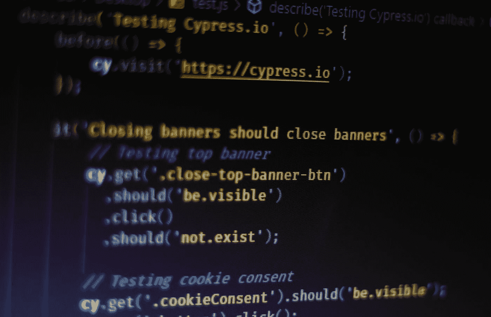

# 利用参数化提高 Cypress 测试效率

> 原文：<https://javascript.plainenglish.io/improve-cypress-testing-efficiency-with-parameterization-1d4a599b4130?source=collection_archive---------1----------------------->

## 了解如何在一次测试中测试多个用户旅程。



Photo by [Ferenc Almasi](https://unsplash.com/@flowforfrank?utm_source=medium&utm_medium=referral) on [Unsplash](https://unsplash.com?utm_source=medium&utm_medium=referral)

你是否曾经写过一系列非常相似的测试，以至于你想把它们结合在一起而不是分开运行？

我有，相当频繁。当我注意到我陷入这种模式时，我转向参数化，这是我在使用 Pytest 编写 Python 测试时熟悉的东西。

参数化测试的行为是用不同的值执行相同(或相似)的一系列动作。一个例子是编写一个在屏幕上选择三个相似按钮的脚本。我们可以生成一个脚本并遍历每个按钮，而不是编写三个单独的脚本来选择按钮 A、B 和 C。

本教程将展示如何使用 JavaScript 和 Cypress.io 参数化测试。重要的是演示如何正确地参数化测试。

我们将使用[演示按钮](https://www.demoqa.com/buttons)页面作为我们测试的基础。

# 干燥问题

DemoQA 按钮页面有三个独立的按钮:

1.  双击
2.  右键单击
3.  点击


The DemoQA Buttons page. (Sceenshot by Jonathan Thompson)

选择具有相应点击动作的每个按钮(双击双击按钮)会在按钮列表下方呈现一条消息。

我们可以为每个按钮编写一个测试，让用户访问按钮页面，验证按钮是否存在，选择按钮，并验证是否返回了消息。

Our non-parameterized tests.

如你所见，这里有些重复。我们访问按钮页面，验证元素是否存在，然后验证消息是否存在。区别在于元素选择器和所使用的点击类型。我们可以通过创建一个参数化的测试来整合代码动作并消除这种枯燥的违规行为。

# 通过参数化提高效率

我们可以从在测试中使用哪些变量开始。如上所述，点击类型和元素选择器在每个测试中都是唯一的。我们可以从把这些项目变成变量开始。我更喜欢用 JavaScript 生成“元组”，因为我有 Python 背景。它们只是 JavaScript 中的嵌套数组。

我们的目的是写出一个`forEach`方法，它捕获点击类型和消息选择器，然后将它们传递给测试。我们使用点击类型而不是按钮选择器，因为最终按钮的选择方法涉及到一个正则表达式模式。此外，我们需要对一个按钮执行特定的单击操作，以便显示一条消息。

The beginning of our parameterized test.

上面的代码演示了如何用 JavaScript 构建一个元组，然后如何遍历元组数组。变量`$type`将包含点击类型和消息选择器。我们可以析构这些数据，然后将它传递给一个指定的块。

Test with destructured tuple data.

我们现在已经将`$type`变量分解成两个独立的变量:`clickType`和`messageSelector`。我们计划在测试中使用这些来确定如何通过设置条件逻辑流来采取适当的行动。

*注意:测试参数化是我唯一容忍在测试代码中使用条件逻辑的情况。* ***不要*** *在参数化测试之外的测试代码中编写条件逻辑流，因为它会创建非确定性测试，从而导致剥落。*

我们可以评估`clickType`是什么，以便对特定的选择器采取行动。为此，我们将实现一个简单的 if/else if/else 流。

Conditional logic using the clickType variable.

为了完成测试，我们现在准备把所有的部分放在一起。剩下的工作就是为消息选择器标准写出一个插入的字符串。

Our finished test with conditional flow.

运行我们的测试文件将在输出中显示三个测试。


A successful test run. (Screenshot by Jonathan Thompson)

# 项目目录

完成本教程后，您的目录应该如下所示:

```
cypress
    |__ integration
        |__ buttons.spec.js.gitignore
cypress.json
package-lock.json
package.json
README.md
```

# 摘要

测试参数化是一种快速有效的方法，可以将相似的用户故事合并到一个测试中。这使得工程师可以通过消除细微差异的类似测试来减少干违规。与其构建单独的测试，不如简单地参数化以合并代码。

**Jonathan Thompson** 是 Pendo.io 的高级质量工程师，专攻测试自动化。他目前和妻子以及一只名叫温斯顿的金毛猩猩住在北卡罗来纳州的罗利。你可以在 [LinkedIn](https://www.linkedin.com/in/jonathanmnthompson/) 上联系他，或者在 [Twitter](https://twitter.com/jacks_elsewhere) 或 [Github](http://github.com/ThompsonJonM) 上关注他。