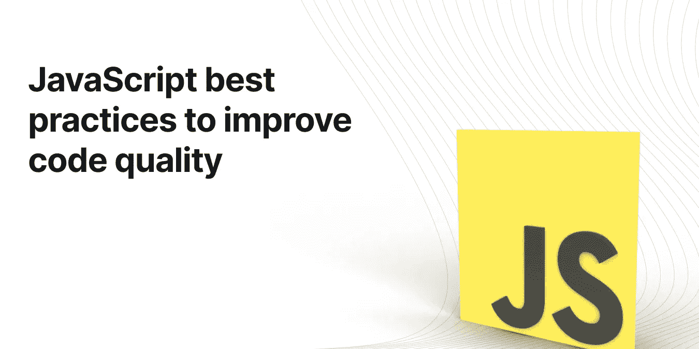

# 通过这些最佳实践提高 JavaScript 代码质量

> 原文：<https://javascript.plainenglish.io/improve-javascript-code-quality-with-these-best-practices-ee883a124d8e?source=collection_archive---------6----------------------->



如果您现在编写 JavaScript，那么了解该语言在过去几年中的所有更新是值得的。自 2015 年以来，随着 ES6 的发布，每年都会发布 ECMAScript 规范的新版本。每一次迭代都为语言增加了新的特性、新的语法以及生活质量的提高。大多数浏览器和 Node.js 中的 JavaScript 引擎都很快赶上了，你的代码也应该跟上。这是因为 JavaScript 的每一次新的迭代都会带来新的习惯用法和新的方式来表达您的代码，而且很多时候，这些变化可能会使您和您的合作者的代码更易于维护。

这里有一些最新的 ECMAScript 特性，通过归纳，您可以利用 JavaScript 和 Node.js 来编写更简洁、更易读的代码。

# 1.阻止带分数的声明

自语言诞生以来，JavaScript 开发人员就一直使用`var`来声明变量。关键字`var`有其独特之处，其中最大的问题是使用它所创建的变量的范围。

```
**var** x **=** 10
**if** (**true**) {
  **var** x **=** 15     *// inner declaration overrides declaration in parent scope
*  console.log(x) *// prints 15* }
console.log(x)   *// prints 15*
```

因为用`var`定义的变量不是块范围的，所以在更窄的范围内重新定义它们会影响外部范围的值。

现在我们有两个新的关键字取代了`var`，即`let`和`const`，它们没有这个缺点。

```
**let** y **=** 10
**if** (**true**) {
  **let** y **=** 15       *// inner declaration is scoped within the if block
*  console.log(y)   *// prints 15* }
console.log(y)     *// prints 10*
```

`const`和`let`在语义上有所不同，用`const`声明的变量不能在其作用域内被重新分配。这并不意味着它们是不可变的，只是它们的引用不能被改变。

```
**const** x **=** []x.push("Hello", "World!")
x *// ["Hello", "World!"]*x **=** [] *// TypeError: Attempted to assign to readonly property.*
```

# 2.箭头功能

箭头函数是 JavaScript 最近引入的另一个非常重要的特性。它们带来了许多好处。首先也是最重要的，它们使 JavaScript 的功能方面看起来更漂亮，写起来更简单。

```
**let** x **=** [1, 2, 3, 4]x.map(val => val ***** 2)                *// [2, 4, 6, 8]* x.filter(val => val **%** 2 **==** 0)        *// [2, 4]* x.reduce((acc, val) => acc **+** val, 0) *// 10*
```

在上面所有的例子中，以独特的箭头`=>`命名的箭头函数用简洁的语法取代了传统的函数。

1.  如果函数体是单个表达式，则范围括号`{}`和`return`关键字是隐含的，不需要编写。
2.  如果函数只有一个参数，参数括号`()`是隐含的，不需要编写。
3.  如果函数体表达式是一个字典，必须用括号`()`括起来。

arrow 函数的另一个显著优点是它们不定义作用域，而是存在于父作用域中。这避免了使用`this`关键字时可能出现的许多陷阱。箭头功能对`this`没有绑定。在 arrow 函数内部，`this`的值与父作用域中的值相同。因此，arrow 函数不能用作方法或构造函数。Arrow 功能不适用于`apply`、`bind`或`call`，并且对`super`没有绑定。

它们也有某些其他的局限性，比如缺少传统功能可以访问的`arguments`对象，无法从功能体中`yield`。

因此，arrow 函数不是标准函数的 1:1 替代品，而是 JavaScript 特性集的受欢迎的补充。

# 3.可选链接

想象一个像这个`person`对象一样的深度嵌套的数据结构。假设您想知道这个人的名字和姓氏。您可以这样用 JavaScript 编写:

```
person **=** {
  name**:** {
    first**:** 'John',
    last**:** 'Doe',
  },
  age**:** 42
}
person.name.first *// 'John'* person.name.last  *// 'Doe'*
```

现在想象一下如果`person`对象不包含嵌套的`name`对象会发生什么。

```
person **=** {
  age**:** 42
}
person.name.first *// TypeError: Cannot read property 'first' of undefined* person.name.last  *// TypeError: Cannot read property 'last' of undefined*
```

为了避免这样的错误，开发人员不得不求助于下面这样的代码，这种代码不必要地冗长，难以阅读，并且令人不快——这是一个非常糟糕的三个形容词。

```
person **&&** person.name **&&** person.name.first *// undefined*
```

满足可选链接，这是 JavaScript 的一个新特性，消除了这种畸形。可选链接一旦遇到`null`或`undefined`值就使挖掘过程短路，并返回`undefined`而不产生错误。

```
person**?**.name**?**.first *// undefined*
```

生成的代码更加简洁明了。

# 4.类似零的合并

在引入类似 null 的合并运算符之前，如果没有输入，JavaScript 开发人员使用 or 运算符`||`返回默认值。这带来了一个重要的警告，即即使是合法但虚假的值也会导致回到默认值。

```
**function** print(val) {
	**return** val **||** 'Missing'
}print(**undefined**) *// 'Missing'* print(**null**)      *// 'Missing'*print(0)         *// 'Missing'* print('')        *// 'Missing'* print(**false**)     *// 'Missing'* print(**NaN**)       *// 'Missing'*
```

JavaScript 现在提出了空合并运算符`??`，它提供了一个更好的选择，因为如果前面的表达式是空的，它只会导致回退。这里的 null-ish 指的是`null`或`undefined`的值。

```
**function** print(val) {
	**return** val **??** 'Missing'
}print(**undefined**) *// 'Missing'* print(**null**)      *// 'Missing'*print(0)         *// 0* print('')        *// ''* print(**false**)     *// false* print(**NaN**)       *// NaN*
```

这样，你可以确保如果你的程序接受虚假的值作为合法的输入，你不会用错误来代替它们。

# 5.逻辑分配

假设你想给一个变量赋值，当且仅当这个值当前为空时。这样写的逻辑方式应该是这样的:

```
**if** (x **===** **null** **||** x **==** **undefined**) {
	x **=** y
}
```

如果您知道短路是如何工作的，那么您可能希望使用 null-ish 合并操作符用一个更简洁的版本来替换这 3 行代码。

```
x **??** (x **=** y) *// x = y if x is nullish, else no effect*
```

这里我们使用 null-ish 合并操作符的短路特性来执行第二部分`x = y`,如果`x`是 null-ish。代码非常简洁，但仍然不容易阅读或理解。逻辑 null-ish 赋值消除了对这种变通方法的需要。

```
x **??=** y *// x = y if x is nullish, else no effect*
```

同样，JavaScript 也引入了逻辑 AND 赋值`&&=`和逻辑 OR 赋值`||=`操作符。这些运算符仅在满足特定条件时执行赋值，否则无效。

```
x **||=** y *// x = y if x is falsy, else no effect* x **&&=** y *// x = y if x is truthy, else no effect*
```

提示:如果你以前写过 Ruby，你会看到`||=`和`&&=`操作符，因为 Ruby 没有 falsy 值的概念。

# 6.命名捕获组

让我们先快速回顾一下正则表达式中的捕获组。捕获组是字符串的一部分，它匹配括号中正则表达式的一部分。

```
**let** re **=** /(\d{4})-(\d{2})-(\d{2})/
**let** result **=** re.exec('Pi day this year falls on 2021-03-14!')result[0] *// '2020-03-14', the complete match* result[1] *// '2020', the first capture group* result[2] *// '03', the second capture group* result[3] *// '14', the third capture group*
```

正则表达式支持命名捕获组已经有一段时间了，这是一种通过名称而不是索引来引用捕获组的方式。现在，在 ES9 中，这个特性已经发展到了 JavaScript。现在，结果对象包含一个嵌套的 groups 对象，其中每个捕获组的值都映射到它的名称。

```
**let** re **=** /(?<year>\d{4})-(?<month>\d{2})-(?<day>\d{2})/
**let** result **=** re.exec('Pi day this year falls on 2021-03-14!')result.groups.year  *// '2020', the group named 'year'* result.groups.month *// '03', the group named 'month'* result.groups.day   *// '14', the group named 'day'*
```

新的 API 与另一个新的 JavaScript 特性——非结构化赋值——配合得非常好。

```
**let** re **=** /(?<year>\d{4})-(?<month>\d{2})-(?<day>\d{2})/
**let** result **=** re.exec('Pi day this year falls on 2021-03-14!')
**let** { year, month, day } **=** result.groupsyear  *// '2020'* month *// '03'* day   *// '14'*
```

# 7.`async` & `await`

JavaScript 的强大之处之一是它的异步性。这意味着许多可能需要长时间运行或耗费时间的函数可以返回一个承诺，而不会阻塞执行。

```
**const** url **=** 'https://the-one-api.dev/v2/book'
**let** prom **=** fetch(url)
prom *// Promise {<pending>}**// wait a bit* prom *// Promise {<fullfilled>: Response}, if no errors
// or* prom *// Promise {<rejected>: Error message}, if any error*
```

对 fetch 的调用返回一个创建时状态为“待定”的承诺。很快，当 API 返回响应时，它转换到“已完成”状态，并且可以访问它包装的响应。在 Promises 的世界中，您可以做类似这样的事情来进行 API 调用，并将响应解析为 JSON。

```
**const** url **=** 'https://the-one-api.dev/v2/book'
**let** prom **=** fetch(url)
prom                               *// Promise {<fullfilled>: Response}
*  .then(res => res.json())
  .then(json => console.log(json)) *// prints response, if no errors
*  .**catch**(err => console.log(err))  *// prints error message, if any error*
```

2017 年，JavaScript 宣布了两个新的关键词`async`和`await`，这使得处理和处理承诺更加容易和流畅。它们不能代替承诺；它们仅仅是强大的承诺概念之上的语法糖。

`await`使所有代码看起来都像同步的 JavaScript，而不是发生在一系列“然后”函数中。作为额外的好处，您可以将`try...catch`与`await`一起使用，而不是像直接使用 Promises 那样处理“catch”函数中的错误。与`await`相同的代码如下所示。

```
**const** url **=** 'https://the-one-api.dev/v2/book'
**let** res **=** await fetch(url) *// Promise {<fullfilled>: Response} -await-> Response* **try** {
	**let** json **=** await res.json()
	console.log(json) *// prints response, if no errors* } **catch**(err) {
  console.log(err)  *// prints error message, if any error* }
```

`async`关键字是同一枚硬币的另一面，因为它包装了任何要在承诺内发送的数据。考虑下面的异步函数来添加几个数字。在现实世界中，您的代码会做一些更复杂的事情。

```
async **function** sum(...nums) {
    **return** nums.reduce((agg, val) => agg **+** val, 0)
}sum(1, 2, 3)                    *// Promise {<fulfilled>: 6}
*  .then(res => console.log(res) *// prints 6***let** res **=** await sum(1, 2, 3)    *// Promise {<fulfilled>: 6} -await-> 6* console.log(res)                *// prints 6*
```

这些新功能只是冰山一角。我们甚至还没有触及表面。JavaScript 在不断发展，并且每年都有新的特性被添加到该语言中。很难跟上手动引入该语言的不断涌现的新特性和习惯用法。

*原创于* [*深源博客*](https://deepsource.io/blog/javascript-code-quality-best-practices/?utm_source=medium&utm_medium=jsinplainenglish&utm_campaign=contentdistribution&utm_term=jscodequality) *。*