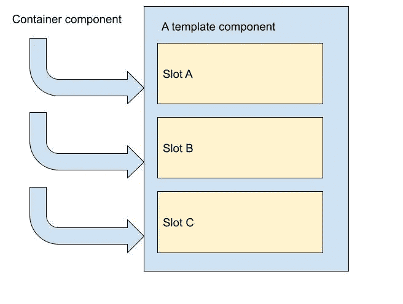

# 提高 React 性能，无需备忘录()

> 原文：<https://javascript.plainenglish.io/improve-react-performance-without-memo-4d388f45d028?source=collection_archive---------7----------------------->

在我的前一篇文章中，我描述了一些防止 react 应用程序过度渲染的方法。我重点使用了`useMemo`和`useCallback`挂钩和`memo()`挂钩。仅仅一天后，丹·阿布拉莫夫的一篇名为《在你备忘录之前的 T21》的优秀文章发表了。今天，我将介绍如何将他博客中的技术应用于我文章中的问题。

# 问题陈述

让我们从我在[上一篇文章](/preventing-redundant-re-renders-in-react-c0de7c92d0b6)中使用的完全相同的代码开始。我使用`Fibonacci`组件来模拟一个渲染时计算量很大的组件(所以我们不想在不需要的时候重新渲染它)。

这是它最初的用法。注意，默认情况下，每次`text`值改变时`Fibonacci`组件都会被重新渲染。这是一种糟糕的、缓慢的打字体验。

上次这个问题是用`React.memo()` HOCs 解决的。这次让我们探索其他的选择！

# 下移状态

我们可以观察到`Demo`组件是`text`状态的所有者，但是只有一部分对这个状态感兴趣。让我们把这部分提取成一个单独的组件！

重构非常简单。`ControlledText`组件被提取，现在它是`text`状态的所有者。`Fibonacci`组件不像我们键入的那样重新呈现。太好了！

# 缝隙模式

在 Dan 的文章中，这种方法被称为*上移内容*并使用了`children` prop。其实我们并不局限于`children`道具。我们可以使用任意数量的插槽！

下面是我如何将这种技术应用到我的初始代码中

只要`bottomSlot`道具不变，React 就不会重新渲染。大获成功！由于副作用组件`DemoTemplate`没有耦合到应该在`bottomSlot`中呈现的特定组件，任何东西都可以在那里注入。

注意，插槽是从容器组件注入的，因此得名*上移内容。*

我认为 react 中的插槽模式很好地类比了 OOP 中的[模板方法](https://refactoring.guru/design-patterns/template-method)模式。看看吧！

# 摘要

没有优化 react 性能的灵丹妙药，因此了解几种方法是有益的。是不错的首选，但请不要止步于此。使用替代方法可能会改进代码的架构。感谢阅读，希望你今天学到了新的东西！