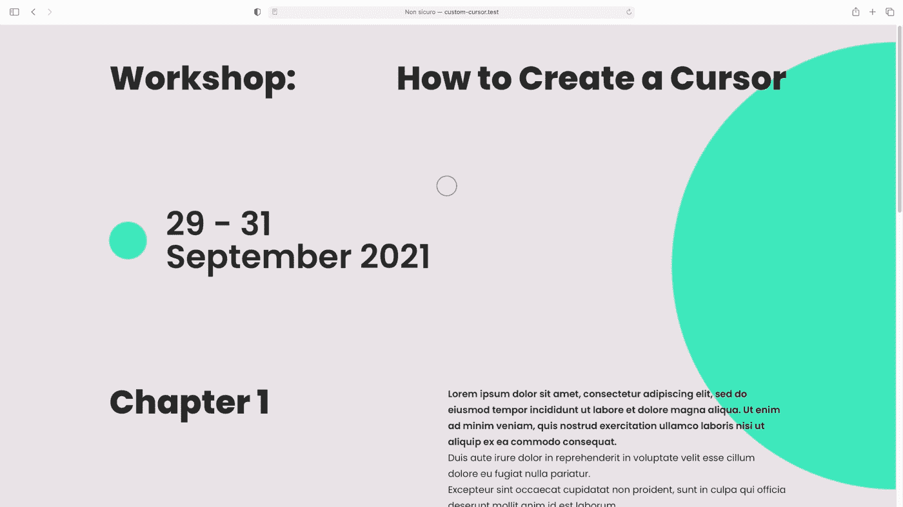
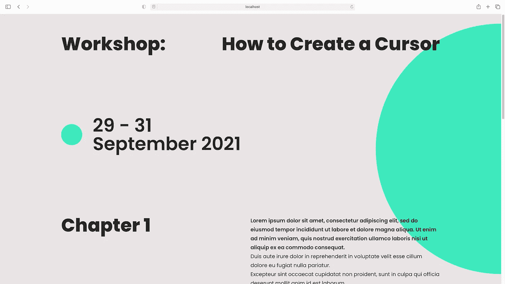

# 使用自定义光标来提高网站的 UX

> 原文：<https://javascript.plainenglish.io/improve-the-ux-of-your-website-with-a-custom-cursor-9f1e684417ef?source=collection_archive---------6----------------------->

## 以一种更吸引人的方式给你的用户指明方向。


Photo by [vitamina poleznova](https://unsplash.com/@poleznova?utm_source=unsplash&utm_medium=referral&utm_content=creditCopyText) on [Unsplash](https://unsplash.com/s/photos/cursor?utm_source=unsplash&utm_medium=referral&utm_content=creditCopyText)

**鼠标光标在每个网站的用户体验中扮演着** **至关重要的角色**。这就是为什么你知道你*可以点击一个链接*，*拖拽*一个元素，*放大*或者*缩小*某个东西，*等等*。

激发我写这篇文章的是一些**奇妙的网站**，它们把**光标变成了它们设计**不可分割的一部分，把它带到了一个新的高度。

这些是*的一些最棒的***引起了我的注意*:*

*   *[饭饭饭](https://fanfan.fan/)*
*   *鲁伯特&罗斯柴尔德*
*   *[奥雅纳 2020 年年度报告](https://annualreport2020.arup.com/)*

# *🆗基本光标*

**用户代理样式表*定义了**光标的基本样式，以向用户提供他们在屏幕**上所做事情的视觉反馈，例如:*

*   *👆🏼`cursor: pointer`表示*一个环节，**
*   *🚫`cursor: not-allowed`暗示*你不能做某个具体动作，**
*   *🔎`cursor: zoom-in`让你知道*你可以放大*某样东西，*
*   *如果您想查看*所有可用值*，请查看 MDN 上的[光标文档](https://developer.mozilla.org/en-US/docs/Web/CSS/cursor#values)。*

*我们都同意*的基本光标样式是可以的*，但既不是*现代*也不是*原始*。*

*不要担心。*

*你可以把它定制成**让用户体验更吸引人**。*

# *🆒自定义光标*

*我们将创建*一个随机文章页面*来学习如何为**处理不同的样式，为一些鼠标相关事件**定制光标。*

*此图显示了最终设计的预览图:*

**

***我们开始吧！**💪🏼*

## *1 —设置项目*

*你可以下载[启动文件](https://www.dropbox.com/s/ct5v0p0hcupcixh/custom-cursor-starter.zip?dl=0)和我一起编码。*

*一旦你下载了项目文件夹，**readme . MD 文件将引导你完成所有的设置**准备开发。*

*一旦您安装了软件包并启动了开发服务器，您将在浏览器中看到的是**布局，我们将在其中为自定义光标**添加必要的代码行。*

**

*我们将要使用的所有文件都在`src`文件夹中。*

## *2-HTML*

*在`index.html`中，紧接着`<body>`标签之后，为光标添加一个新标签。*

```
*<span class="cursor"></span>*
```

*我更喜欢使用`<span>`标签而不是`<div>`，因为**没有语义**，而**对于 SEO 来说更好**，但是你可以随意使用任何你喜欢的。*

*这对于 HTML 来说已经足够了。下一步: **CSS** 。*

## *3 — CSS*

*在`scss/components`文件夹中，在`_cursor.scss`内部，我们将为光标添加样式。*

*首先，我们需要隐藏原来的光标，为此，我们需要将`scss/base/_reset.scss`中的`cursor: none !important;`添加到`*`选择器中。*

*现在我们需要默认光标和指针光标的样式。另外，我们将为用户点击鼠标按钮创建一个类。*

***3.1 —默认光标***

***我们的默认光标将是一个** **圆** 40px 宽，透明背景，2px 纯色边框`$secondary`。*

```
*.cursor {
    position: fixed;
    top: -20px;
    left: -20px;
    width: 40px;
    height: 40px;
    border-radius: 100%;
    border: 2px solid $secondary;
    z-index: 1;
    transition: top .2s linear, left .2s linear, width .2s linear, height .2s linear, background-color .2s linear, border-color .2s linear;
}*
```

*从片段中可以看出，你需要设置**位置来固定**和**顶部**和**左侧**属性为** -20px(圆宽度的一半，40px / 2)。***

*为什么我不只是使用转换属性来转换对象？*

*原因是*我们将在 JavaScript* 中需要 transform 属性。*

*如果您刷新浏览器页面，现在您会在屏幕的左上角看到我们光标的一部分。*

*在继续之前，让我们**添加一个控制器来防止我们新创建的光标出现在用户没有任何指点设备的设备上**。*

*由于有了 CSS 媒体功能，实现这一点**非常容易**。*

*在`scss/abstract/_mixins.scss`中，我已经为`any-pointer`创建了一个 mixin，几秒钟后我们将在`.cursor`类中使用它。*

```
*@mixin anyPointer {
    @media (any-pointer: fine) {
        @content;
    }
}*
```

*现在，回到`_cursor.scss`，**我们需要做一些调整**:*

```
*.cursor {
    display: none; // to hide the cursor by default
    // ... @include anyPointer {
        display: block; // to show the cursor if a pointing device is available
        pointer-events: none;
    }
}*
```

*`pointer-events: none;`控制*一个图形元素在什么情况下可以成为指针事件*的目标。要了解更多信息，请阅读文档。*

***到目前为止做得很好！**😊*

***3.2 —指针光标***

*使用修改器`.cursor--mousedown`，让我们优化指针事件上光标**的外观:***

```
*.cursor {
    // ...
    &--mousehover {
        top: -40px;
        left: -40px;
        width: 80px;
        height: 80px;
        border: 2px solid transparent;
        background-color: rgba($secondary,0.3);
    }
}*
```

*正如你所看到的，我们正在改变**圆的大小，使其为**的两倍大，**设置**顶部**和**左侧**的值为** -40px(新圆大小的一半，80px / 2)，**添加背景色**和**设置为透明边框的颜色**。*

***3.3 —鼠标按下光标***

*是时候使用最后一个修改器了:`.cursor--mousedown`。*

```
*.cursor {
    // ...
    &--mousedown {
        top: -10px;
        left: -10px;
        width: 20px;
        height: 20px;
        background-color: $secondary;
    }
}*
```

*这几行代码将使光标**的大小为默认光标**的一半，并为**添加背景颜色**。*

*有了这个地方，**造型结束**。*

*轮到 **JavaScript** 了。*

## *4 — JavaScript*

*在`js`文件夹中，有**三个文件**:*

*   *`utils.js`:带有**一些小的可重用代码片段**的支持文件*
*   *`cursor.js`:该文件将包含**类光标**，以及使其按预期工作所需的所有逻辑*
*   *`index.js`:包含在`index.html`中的**主 javascript 文件***

***4.1 —实用工具***

*这个项目将只有一个 util: `getMousePosition`。*

*`getMousePosition`的作用是，给定一个 mousemove 事件，它**返回一个带有光标在屏幕上位置坐标的对象**。记得导出。*

```
*const getMousePosition = e => {
    return {
        x: e.clientX,
        y: e.clientY
    };
};export { 
    getMousePosition
}*
```

***4.2 —光标***

*让我们进入**好玩的部分**。🎉*

*首先，**我们要跟踪鼠标的位置**，借助 mousemove 事件和 getMousePosition 可以做到这一点。*

*请记住，应该导入 getMousePosition。*

```
*import { getMousePosition } from ‘./utils’;let mouse = { x: 0, y: 0 };
window.addEventListener(
    ‘mousemove’,
    event => {
        return mouse = getMousePosition(event);
    }
);*
```

*我们现在将使用带有关键字`class`的 *ES6 语法*来定义**光标类**:*

```
*export default class Cursor {
    // ...
}*
```

*使用关键字`constructor`，我们将为类定义**构造函数**来存储:*

*   *一个**元素**，其不透明度应设置为 0，以防止闪烁，并给浏览器时间根据指针位置查看在哪里显示它；*
*   ***元素的边界**，借助[getBoundingClientRect()](https://developer.mozilla.org/en-US/docs/Web/API/Element/getBoundingClientRect)；*
*   *保存用户指针在 x 轴和 y 轴**上的前一个和当前位置**的对象；*
*   *一些事件被称为对一些`addEventListener()`的回调。*

*构造函数的基本代码已经就绪。现在我们需要为单个事件编写**代码。🙌🏼***

*对于`this.onFirstMouseMove`，我们需要 [GSAP](https://greensock.com/gsap/) 的帮助，所以一定要在文件的顶部导入。我们希望这个事件**只在用户第一次移动指针**时运行。为此，我们在函数末尾调用 [removeEventListener()](https://developer.mozilla.org/en-US/docs/Web/API/EventTarget/removeEventListener) 。*

*当鼠标的*按钮被按下*时，`this.onMouseDown`和`this.onMouseUp`T37 处理和`.cursor--mousedown`的添加或移除，以获得*视觉反馈*。*

*在`this.onMouseDown`中，我们还需要**检查哪个鼠标按钮被点击了**。我们能做到这一点要感谢存储在 which 属性中的数字代码。*

*因为我们不希望当用户点击右键时出现鼠标按下的效果，**我们只对代码`1`可以识别的左键点击**感兴趣。*

*而在`this.onMouseUp`中，并没有什么奇特的事情发生:我们只是**移除了** `.cursor--mousedown`类。*

*构造函数准备好了。现在，我们只需要一些方法:`render()`、`onMouseOver()`和`onMouseLeave()`。*

***我们在`this.onFirstMouseMove`事件中已经遇到的** `render()` **方法**是**负责渲染我们的光标并正确表现**。*

*我建议你检查一下 [requestAnimationFrame](https://developer.mozilla.org/en-US/docs/Web/API/window/requestAnimationFrame) ，这个方法*告诉浏览器你希望在下一次重画*之前执行一个动画。*

*`onMouseOver()`和`onMouseLeave()`方法将**在链接**上悬停时给出视觉反馈。*

*你可能会问*为什么我把后两个当作对象*内部的方法而不是事件:原因是这两个不是与光标直接相关的事件，**它们将被用作链接**上鼠标悬停**和**鼠标离开**的回调函数**。*

```
*onMouseOver = () => this.DOM.el.classList.add("cursor--mousehover");
onMouseLeave = () => this.DOM.el.classList.remove("cursor--mousehover");*
```

***4.3 —索引***

*最后，我们必须**初始化** `index.js`中的光标类，并且**在每个链接**上监听鼠标悬停和鼠标离开**事件。***

***结束。** 🥳*

# *🎓结论*

*我的例子只是一个**简单的例子**来告诉你创建一个自定义光标并不是一场*血战*和**会对你的网站**的整体 UX 产生意想不到的结果。*

*另外，**我真的很喜欢自定义光标让网站看起来和感觉起来**。在那里，你可以找到很多很棒的例子，让*得到启发*，*从*中学习，*用*进行实验。*

***前途无量！** ⭐️*

# *🔗有用的链接*

*   ***GitHub 资源库:**[https://github.com/GiuliaMalaroda/Custom-Cursor](https://github.com/GiuliaMalaroda/Custom-Cursor)*
*   ***现场版:**https://custom-cursor-omega.vercel.app/*

**更多内容请看*[***plain English . io***](http://plainenglish.io/)*