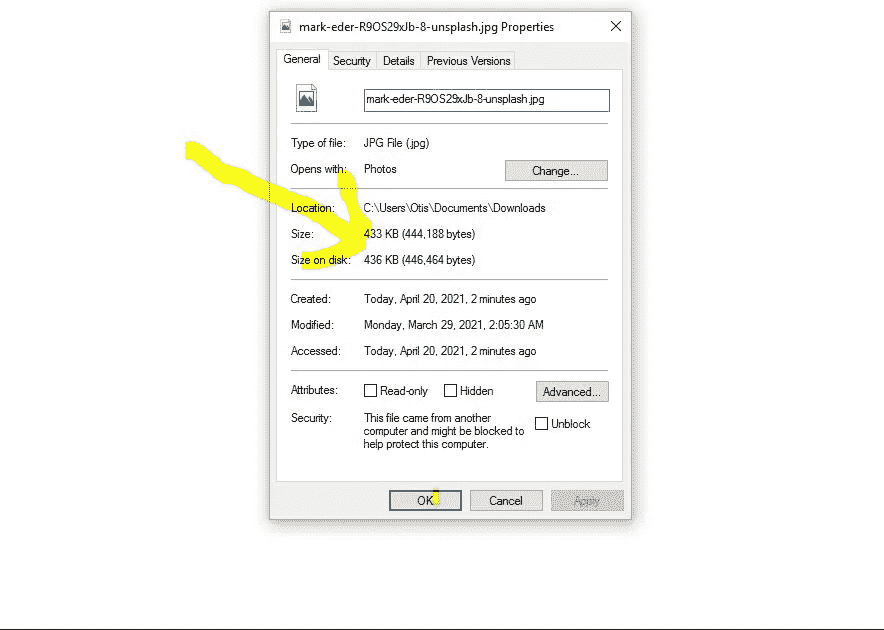
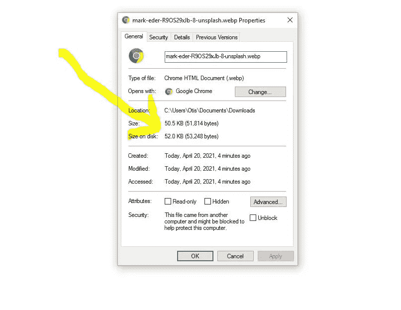

# 使用这些技巧提高网页图像性能

> 原文：<https://javascript.plainenglish.io/improve-web-image-performance-with-these-tips-93890574e6a2?source=collection_archive---------11----------------------->

## 用这种技术提高网页图像的性能。


Photo by [George Bakos](https://unsplash.com/@georgebakos?utm_source=medium&utm_medium=referral) on [Unsplash](https://unsplash.com?utm_source=medium&utm_medium=referral)

图片是网站最重要的组成部分之一。

在这篇文章中，我们将看看各种各样的方法来优化图像，以提高 web 性能。

优化的图像将确保您的网站满足以下需求

## **让你的网站更轻便**

小尺寸的图像更轻，因此，可能会导致您的网站加载速度更快，而且它们占用很少的服务器空间。

## **改进的 SEO**

具有更快加载速度的网站可能会导致更高的搜索引擎优化(SEO)和排名，这反过来可能会导致更好的网站性能。

## **性能更佳**

较轻的网站加载速度提高。当与具有较小尺寸图像的网站相比时，由于大尺寸图像而导致的较慢执行的网站可能具有较低的性能。

## **更好的用户体验**

用户体验总是与网站的性能有关。具有较高加载时间的网站可能会使客户端等待太长时间，这可能会对用户体验产生负面影响。

据 Websitebuilderexpert.com 称，他们发现网页加载时间越长，跳出率就越高。高跳出率告诉搜索引擎，用户没有发现页面内容有用，所以它的排名会下滑。如果电子商务网站的结账页面比竞争对手慢一点点，它们将不可避免地失去顾客。

同样，1/4 的网站访问者会放弃一个加载时间超过 4 秒的网站，46%的用户不会经常重新访问该网站。

当我们想到这一点时，我们只能想象当我们有一个低性能的网站时，我们失去的网站访问者的数量。

这可以清楚地表明，在确保更高性能的网站或应用程序中，优化 web 图像的必要性。

# **1。网络视频图片**

WebP 图像是一种新的网络图像格式。

据 developers.gogle.com 称，WebP 是一种现代图像格式，为网络上的图像提供了卓越的无损和有损压缩。使用 WebP，网站管理员和 web 开发人员可以创建更小、更丰富的图像，使 web 速度更快。与 png 相比，WebP 无损图像的大小要小 26%。

在同等的 SSIM 质量指数下，WebP 有损图像比可比较的 JPEG 图像小 25–34%。无损 WebP 支持透明性(也称为 alpha 通道),成本仅为 22%的额外字节。

对于可接受有损 RGB 压缩的情况，有损 WebP 也支持透明，通常提供比 PNG 小 3 倍的文件大小。
从版本 14 开始，包括 Chrome、Firefox、Edge 和 Safari 在内的主流 web 浏览器现在都支持 WebP。

**转换前的图像**



image before conversion

**WebP 转换后**



WebP after conversion

如果我们比较这两个图像，我们可以看到图像的大小急剧下降。从 **433kb** 到 **50.5kb** 。

尽管尺寸变小，但图像仍将保持图片质量。

# **2。延迟加载图像**

惰性加载确保图像在出现在网站的视窗之前就被加载。

如果你的网站或应用程序有很多图片，比如图片画廊，你可以利用这项技术来提高网站的性能。有许多方法可以将惰性加载和许多插件一起使用来实现惰性加载。

我们可以使用原生 HTML 来应用延迟加载

```

```

# **3。内容交付网络(CDN)托管图像**

在 CDN 中托管图像可确保您在不同的网络中托管图像，而不是允许您的服务器提供图像。

CDN 还将确保网站访问者获得位于其位置附近的 CDN 服务。这确保了它能够方便快捷地提供图像。

## **结论**

感谢您阅读到目前为止，如果您觉得这篇文章有趣，请不要犹豫，让我知道在评论和分享。

**更多阅读**

[](/different-http-status-codes-87518fe387d4) [## 不同的 HTTP 状态代码

### 了解所有 HTTP 状态代码

javascript.plainenglish.io](/different-http-status-codes-87518fe387d4) 

*更多内容请看*[***plain English . io***](https://plainenglish.io/)