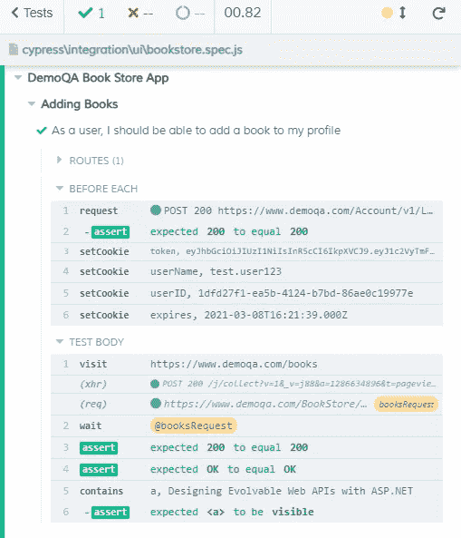

# 使用 Cypress Intercept 改进您的端到端测试

> 原文：<https://javascript.plainenglish.io/improve-your-end-to-end-tests-with-cypress-intercept-2c68156d9495?source=collection_archive---------2----------------------->

## 了解如何捕获用于存根、断言等的网络调用。


Photo by [Kevin Martin Jose](https://unsplash.com/@kevinmartinjose?utm_source=medium&utm_medium=referral) on [Unsplash](https://unsplash.com?utm_source=medium&utm_medium=referral)

如果你过去使用过 Cypress，你应该熟悉`cy.server()`和`cy.route()`方法。它们使工程师能够在浏览器中处理 XHR 请求，例如模仿响应、中止请求和智能等待。

在 Cypress 6.0.0 中被弃用，`cy.route()`和`cy.server()`都被一个新的方法`cy.intercept()`所取代。

2020 年 11 月发布的`cy.intercept()`方法允许工程师监控**所有**网络流量，而不仅仅是 XHR 请求。简单地说，这是一个游戏规则的改变者。就其在浏览器中操纵请求的能力而言，它将 Cypress 置于与木偶师和剧作家相同的水平。

本教程将通过提供请求拦截、模仿和断言的例子来展示`intercept()`方法背后的力量。我们将使用 [DemoQA 书店](https://www.demoqa.com/books)应用程序作为基础。

# 入门指南

对于任何新的 JavaScript 项目，我们必须使用 NPM 进行初始化。

```
npm init
```

一旦我们有了一个`package.json`文件，我们就可以开始加载 Cypress 了。

```
npm install --save-dev cypress
```

一旦安装了 Cypress，用 NPM 运行它，这样它就可以完成安装。

```
npx cypress open
```

当一个`cypress`目录被创建后，Cypress 就完成了安装。您还可以通过运行`npx cypress --version`来验证安装是否正确。

# 拦截

在用户旅行期间，软件应用程序从前端向后端发出数百个网络请求。这些请求中的很大一部分对于执行操作可能是有用的，比如设置测试状态或者在检查元素之前等待响应完成。请求拦截允许工程师完成这些任务。

使用 Cypress 拦截网络请求设置了所谓的间谍。它允许工程师根据提供的 URL(或 URL 匹配)监控网络流量。不仅仅是监视，间谍还可以扩展到存根响应，甚至针对请求或响应主体对象做出断言。

DemoQA 书店应用程序对 books 端点进行 API 调用，以获取店面中的所有书籍。我们可以拦截这个 API 调用来设置一个间谍。


Books fetch request highlighted in red. (Screenshot by Jonathan Thompson)

选择此请求将为我们提供信息，我们可以使用这些信息开始制作一个间谍，如请求 URL。在这种情况下，请求 URL 是`[https://www.demoqa.com/Bookstore/v1/Books](https://www.demoqa.com/Bookstore/v1/Books.)`。

为了在测试运行程序中获得更好的可视性，我们应该为我们的请求设置一个别名。有别名的请求用包含别名名称的淡黄色标签表示。

The beginning of an intercept to the /Books endpoint.

有了我们的代码，我们现在可以运行我们的测试来验证 spy 正确地监控了到 books 端点的网络流量。


An aliased request spy. (Screenshot by Jonathan Thompson)

现在我们有了一个间谍，我们可以开始操作测试设置和断言的请求。

# 生硬的回答

存根是对请求的固定回答。存根在通过模拟可能会或可能不会直接影响测试的数据来构建端到端测试中的测试状态时非常有用。在这个实例中，books 端点返回一个 JSON 数据对象。JSON 对象中的每本书都列在 books 表中。

如果这个请求需要很长时间才能加载呢？或者，如果表显示一个错误语句，直到请求完成，该怎么办？

当编写端到端测试时，为了减少错误，精心设计测试环境是至关重要的。我在 Pendo.io 经历过上述情况，特别是一个返回错误语句的表，直到请求完成。我们确定我们有两个选择来解决这个问题:

1.  等待请求完成
2.  存根数据

我们选择存根数据，因为表数据不会直接影响我们的测试。我们可以对 books 端点做同样的事情，因为表数据对整个用户旅程并不重要。重要的是用户能够将一本书添加到他们的个人资料中。只要至少有一个表条目，我们的用户之旅就能够继续。

如果存根是对请求的固定响应，那么我们的测试需要在运行测试之前构建一个响应对象。我们可以通过复制一个好的响应对象并将其调整到更易管理的状态来实现。在本例中，我们将响应发送到 books 端点，并删除除一个条目之外的所有条目。

A book fixture.

我们可以通过为拦截的请求提供一个 fixture 来存根表数据。这将用 fixture 文件中找到的任何数据替换响应体。

Our test featuring a stubbed response for the books endpoint.

我们的表格现在将被一个名为*用 ASP.NET*设计可进化的 Web APIs 的条目填充。在采取下一步行动之前，我们可以对此提出异议。


A properly stubbed books table. (Screenshot by Jonathan Thompson)

# 断言这一点

既然我们已经正确地存根化了数据，我们可以通过断言 fetch 请求来强化我们的测试。这样做将允许我们确保后端以我们期望的方式与前端通信。

上面的代码现在捕获请求(`$req`)，然后捕获响应(`$res`)，并向它发送一个包含 fixture 数据的存根。前一个模式是用逗号将截取的 URL 与 fixture 分开，这是该模式的简化版本。我们已经手写了出来，以反驳这种反应。

除了发送 fixture 之外，我们还有两个断言:

1.  断言状态为 200
2.  断言消息“正常”

这允许我们强化我们的测试，并确保尽管有存根响应数据，后端仍然与前端通信。我们可以使用这些断言来捕获 API 故障，如果它们发生的话，因为状态和消息没有被模仿。



Our response assertion. (Screenshot by Jonathan Thompson)

# 完成我们的测试

我们的数据已被删除，我们的回应已被确认。是我们完成测试的时候了。

一旦一本书在列表中可见，用户必须选择重定向到单个图书页面的书。图书页面包含标题、副标题和 ISBN 等数据。它还包含一个按钮，用于将图书添加到用户的图书收藏中。

一旦用户将一本书添加到他们的收藏中，书名就会出现在用户的个人资料页面中。

为了准确地测试这个用户旅程，我们的测试应该选择存根书，然后通过检查提供的 ISBN 和标题来断言我们正在访问正确的页面。然后，我们可以点击“添加到您的收藏”按钮，并访问用户的个人资料。最后，我们将断言我们选择的书名在用户的图书收藏中是可见的。

Our completed test script (authenticate and deleteBook commands not shown).

# 摘要

赛普拉斯的`intercept()`方法正在彻底改变我们在 web 应用程序中探测、存根和测试请求的方式。工程师可以窥探请求，以便监控 web 应用程序中的网络流量。存根通过为测试提供无菌环境来模拟测试数据。针对响应的断言可以通过为前端到后端的通信提供安心来强化测试。

最后，由于 Cypress API 的简单性，工程师可以轻松地执行每个单独的操作。

# 资源

1.  "变更日志。"*柏树文件【2021 年 3 月 5 日[docs.cypress.io/guides/references/changelog.html#6–0–0](http://docs.cypress.io/guides/references/changelog.html#6–0–0)。*
2.  同上。
3.  “路线。”*柏树文件*，2021 年 3 月 5 日，[docs.cypress.io/api/commands/route.html#Syntax](http://docs.cypress.io/api/commands/route.html#Syntax)。
4.  “拦截。” *Cypress 文档*，2021 年 3 月 5 日[docs . Cypress . io/API/commands/intercept . html # Comparison-to-cy-route](http://docs.cypress.io/api/commands/intercept.html#Comparison-to-cy-route)。

Jonathan Thompson 是 Pendo.io 的高级质量工程师，专门从事测试自动化。他目前和妻子以及一只名叫温斯顿的金毛猩猩住在北卡罗来纳州的罗利。你可以在 [LinkedIn](https://www.linkedin.com/in/jonathanmnthompson/) 上联系他，或者在 [Twitter](https://twitter.com/jacks_elsewhere) 或 [Github](http://github.com/ThompsonJonM) 上关注他。