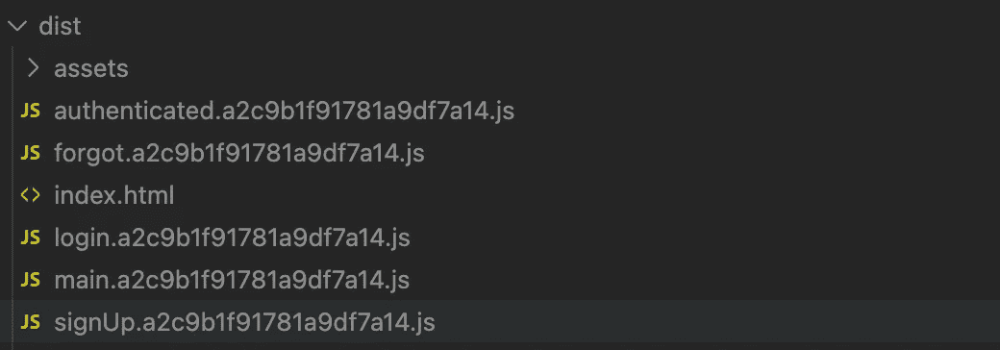

# 通过代码分割改进 React 应用程序

> 原文：<https://javascript.plainenglish.io/improve-your-react-application-with-code-splitting-4fc1597940fc?source=collection_archive---------5----------------------->

## 只在你需要的时候加载你需要的 JavaScript 文件。


## **什么是代码拆分？**

*代码拆分是将代码拆分成不同的包或组件，然后按需或并行加载。~ MDN*

## **代码拆分的主要好处**

由于需要处理的 JavaScript 更少，您的应用程序将运行得更快。你的应用程序运行得越快，用户就越不可能认为你的应用程序质量差。漫长的加载时间[会影响](https://www.dotcom-tools.com/blog/how-fast-should-my-website-load/#:~:text=Ideal%20Website%20Load%20Time%20%E2%80%93%202,in%202%20seconds%20or%20less.)应用程序的跳出率。此外，在比较单页面应用程序和多页面应用程序时，按需加载文件一直是主要的优势之一。

## **你需要什么**

我的例子将使用 React + Webpack 配置。我不会深入讨论如何设置 React 或 Webpack。本文假设您已经完成了这些工作，并且正在寻找进一步的优化。

## **入门**

代码拆分相对容易实现。我们只需要更新我们的路由器。首先，我将展示一个没有启用代码分割的应用程序。焦点将集中在最高级路由器上。您使用的路由库应该无关紧要。

在我构建我的应用程序之后，我的 dist 文件夹有一个包含我的整个应用程序的 JavaScript 文件。


到本文结束时，我们的每条路线都将有一个单独的文件。

## **启用 web pack asynchunknames**

*该步骤是可选的，但有助于调试*

一旦创建了新文件，有一种方法来识别它们是很好的。`webpack-async-chunk-names-plugin`允许您配置文件的名称。

要安装:

`yarn add webpack-async-chunk-names-plugin -D`

在 webpack.config.js 中:

```
// require the packageconst AsyncChunkNames = require("webpack-async-chunk-names-plugin") // add to your plugin arrayplugins: [ new AsyncChunkNames(),]// include a chunchunkFilename option inside output. This will get convered later.output: { filename: "[name].[hash].js", chunkFilename: "[name].[hash].js", <-- publicPath: "/",}
```

## **更新路由器**

接下来，我们需要使用两个 React 函数来更新路由器，`Lazy`和`Suspense`。

Lazy 允许您将动态导入作为常规组件呈现。Lazy 函数为您的组件获取一个导入语句并返回一个承诺。以这种方式导入的组件必须命名为 exports。

`export default MyComponent`

```
const Component = React.lazy(() => import(./path-to-component))
```

因为我们的惰性组件现在是异步加载的，所以我们需要使用悬念来等待它们的呈现。您可以提供您想要的任何组件作为后备选项。

```
<Suspense fallback={<LinearProgress />}>
  <Component />
</Suspense>
```

这两个特性结合起来就是我们实现代码拆分的方式。

回到我们添加到 Webpack 配置中的可选的`chunkFilename`选项。您可以在 lazy import 语句中添加`/* webpackChunkName: “name” */`,给文件一个您可以识别的名称。这是一个很好的特性，有助于解决您以后可能遇到的任何问题。

当 Webpack 看到这个配置时，它会为您处理一切。

重新构建您的应用程序，您应该看到在您的 dist 文件夹中为每个延迟加载的组件生成了单独的文件。



当您运行您的应用程序并访问每条路由时，您应该看到您的命名文件被加载到您的 network 选项卡中。

*更多内容看* [***说白了. io***](http://plainenglish.io/) ***。*** *报名参加我们的* [***免费每周简讯这里***](http://newsletter.plainenglish.io/) ***。***