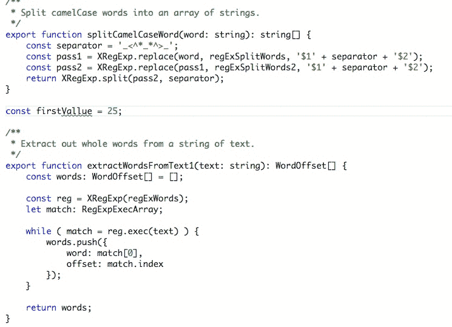
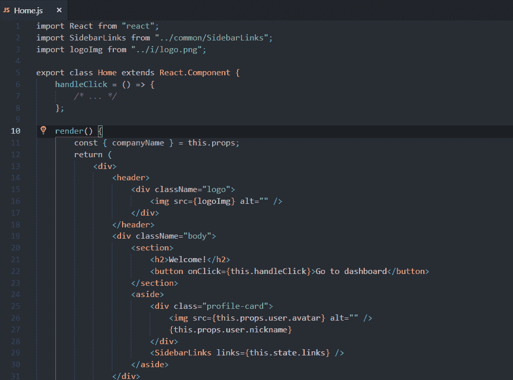

# 使用这些 VS 代码扩展改进您的 React 工作流

> 原文：<https://javascript.plainenglish.io/improve-your-react-workflow-with-these-6-vs-code-extensions-3d186a529b23?source=collection_archive---------12----------------------->

## 仅在 5 分钟内提高您的反应效率

Photo by [Ferenc Almasi](https://unsplash.com/@flowforfrank?utm_source=unsplash&utm_medium=referral&utm_content=creditCopyText) on [Unsplash](https://unsplash.com/s/photos/javascript?utm_source=unsplash&utm_medium=referral&utm_content=creditCopyText)

编写 React 代码是一项艰苦的工作。想象一下用一个对你毫无帮助的代码编辑器来做这件事。

没有语法帮助，没有快捷方式，没有格式。

这是一个你不希望自己陷入的境地。因此，如果你像我一样使用 VS 代码来编写 React 应用程序，看看这令人难以置信的 6 个扩展，让你的代码编写更加流畅。

## [1。括号对着色机](https://marketplace.visualstudio.com/items?itemName=CoenraadS.bracket-pair-colorizer)

我想知道是否还有人不使用这个分机。它所做的真的很简单，它只是在你的应用程序中相应的括号着色。因此，对于每一个用红色标记的开始`(`,你都会有一个用同样颜色标记的结束，这让你更容易抓住表达式/块的结束位置。

Note the function parentheses colors.

## [2。代码拼写检查器](https://marketplace.visualstudio.com/items?itemName=streetsidesoftware.code-spell-checker)

在你的程序中，你会用到名字。你命名你的函数，你的变量，你的类。既然这些名字 90%的时候都包含现实世界中的单词，为什么不检查它们的拼写以避免这个扩展的愚蠢错误呢？

## 3.ESLint +更漂亮

高质量的代码使用标准。对于语言风格和格式来说尤其如此。如果你正在构建任何一个中型到大型的应用程序，使用 ESLint 和 appearlier 是必须的。我建议你使用林挺的 Airbnb 风格指南,这样你只需要设置扩展就可以开始了。

 [## 使用 Airbnb JavaScript 样式指南在 VS 代码上设置 ESLint

### Airbnb 维护着一个非常受欢迎的 JavaScript 风格指南，全球许多 JavaScript 开发人员都在使用它。跟随…

travishorn.com](https://travishorn.com/setting-up-eslint-on-vs-code-with-airbnb-javascript-style-guide-6eb78a535ba6) 

## [4。高亮匹配标签](https://marketplace.visualstudio.com/items?itemName=vincaslt.highlight-matching-tag)

JSX 可能很难读懂。尤其是如果你有一个包含许多 div 的长代码块。每当您将鼠标悬停在 HTML 元素上时，该扩展都会突出显示匹配的标签。例如:

## 5.ES7 React/Redux/graph QL/React-本机代码片段

如果您喜欢快捷方式，并且您喜欢比其他开发人员更快地编写代码，那么就来看看这个神奇的 snippets 扩展吧。只要记住其中的几个，那些你认为最有用的，你的工作效率就会立刻飙升。

Some of snippets you can use

## 6.VSCode React 重构

只需点击几下就可以重构 React 代码。

## 结论

VS 代码是一个令人惊奇的工具，但是如果你不使它适应你的工作流程，那么它就不会为你服务。希望有了我刚才展示的这些扩展，您应该能够提高您的 React 生产率，并从现在起拥有一个非常愉快的编码体验。

— *皮耶罗*

[***想在短短 6 个月内学会编程并获得一份令人惊叹的工作吗？点击这里获得我的免费书籍，告诉你如何做到这一点！***](https://astounding-motivator-3764.ck.page/b922e9420e)