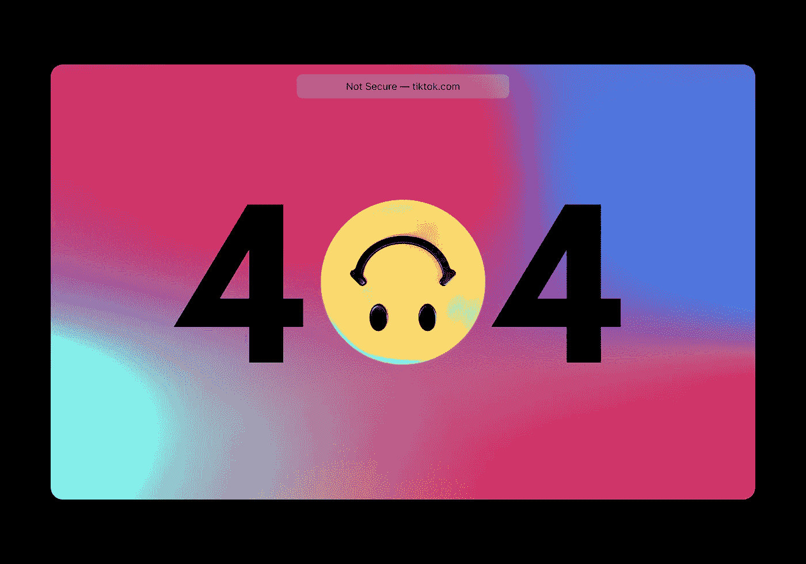

# 在 10 分钟内提高你的 UX

> 原文：<https://javascript.plainenglish.io/improve-your-ux-in-under-10-minutes-f5c38359a294?source=collection_archive---------19----------------------->

## 使用 Levenshtein 距离计算实现更智能的路由

Photo by [visuals](https://unsplash.com/@visuals?utm_source=medium&utm_medium=referral) on [Unsplash](https://unsplash.com?utm_source=medium&utm_medium=referral)

有无数种方法可以改善客户的用户体验。尤其是死胡同对每个人来说都是一个巨大的打击。不仅仅是沮丧，还有你转化率的降低。让我们通过尝试将用户重定向到正确的页面而不是 404 页面来防止这种情况，并使您的应用程序或网站事件变得更好。

在本文的最后，您已经了解了 Levenshtein 距离计算是如何工作的，它如何有助于纠正拼写错误，以及如何使用它来防止用户在没有进一步指导的情况下停留在 404 页面上。首先，我们将用普通的 JavaScript 实现这个解决方案，然后作为一个有角度的路由保护。

附注:如果你现在认为错别字不是什么大不了的事情，每一位 Macbook Pro 用户都会永远感谢你。感谢伟大的蝴蝶键盘。🦋

# 什么是 Levenshtein 距离计算？

让我们首先对 Levenshtein 距离的计算有一个高层次的理解。为了使整篇文章更具可读性，我将用“LDC”代替“Levenshtein 距离计算”。

LDC 是一种确定两个字符串相似性的方法。它计算一个数字，表示将一个字符串转换为另一个字符串所需的修改次数。数字越大，需要的编辑就越多，因此两个输入字符串之间的相似性就越小。

例如，如果您采用两个输入字符串 kitten 和 sitting，则所需更改的最小数量是三个:

**k** itten → **s** itten(用“s”代替“k”)

sitt **e** n → sitt **i** n(用“I”代替“e”)

sittin → sittin **g** (在末尾插入“g”)。

LDC 是在 git 之类的命令行工具中纠正用户输入的一个很好的方法。

最有可能的是，用户只是搞混了几个字母，而 Levenshtein 会在那里提供帮助。git CLI 根据字符串相似性建议您可能想要的命令。

因此，在没有计算密集型机器学习的情况下，预测用户想要的输入是可能的。它快速、经济且易于实施。由于这是一个简单的字符串比较，不涉及任何人工智能，这只是在打字错误的情况下有所帮助。如果您已经将一个 URL 重命名为另一个，例如，将*首选项*重命名为*设置*，LDC 不是正确的解决方案。

如果你想了解更多关于计算本身或其背后的理论， [Ethan Nam](https://medium.com/@ethannam) 已经为你提供了他的伟大文章[为初学者理解 Levenshtein 距离方程](https://medium.com/@ethannam/understanding-the-levenshtein-distance-equation-for-beginners-c4285a5604f0)。除了 Levenshtein，还有一些其他的字符串相似性算法，例如[余弦](https://en.wikipedia.org/wiki/Cosine_similarity)、[三元模型](https://en.wikipedia.org/wiki/Trigram)、[Jaro–Winkler](https://en.wikipedia.org/wiki/Jaro%E2%80%93Winkler_distance)和 [Hamming](https://en.wikipedia.org/wiki/Hamming_distance) 。对于每个用例，评估哪种算法是合适的是有意义的，因为计算相似性的方法是不同的。有时会考虑顺序(例如 Levenshtein)，有时则不会(例如余弦)

现在，让我们更进一步，在应用程序中使用它来建议下一个最佳路线，以防客户由于深层链接中的拼写错误(例如拼写错误 privacy)而进入 404 页面。

# 使用 Levenshtein 距离计算来提出路线建议

现在我们知道了 LDC 是做什么的，让我们实现一个基本的路线建议机制来帮助用户决定下一步去哪里，以防客户由于打字错误而遇到 404。这个想法是显示客户可能想要导航或立即重定向的最有可能的路线。

JavaScript 是我选择的武器，npm 提供了很好的 LDC 实现。在这种情况下，我选择使用速度最快的 levenshtein 库。

[fast-levenshtein](https://www.npmjs.com/package/fastest-levenshtein)公开了两个函数，`distance(a: string, b: string): number`接受两个参数，两个参数都是被比较的字符串，结果是以数字形式计算的距离。第二个是`closest(str: string, arr: string[]): string`,它接受一个字符串和一个数组来比较字符串。该函数的结果是需要修改次数最少的字符串。为了简单起见，我们将使用最接近的*函数。由于目前可能没有人使用普通的 JavaScript，我将只坚持逻辑(这显然很简单，因为最快的 levenshtein 库为我们做了所有繁重的工作)。*

第一种方法有其缺点。开始时，我们只是检查当前路由的路径名是否存在于我们注册的 routes 对象中。如果没有，我们调用 LDC 来获得最近的可能路线。到目前为止一切顺利。但是你可能已经注意到了，这可能会引起一些麻烦。让我详细说明一下。想象以下场景:用户键入*privacy*，但是您已经将 privacy route 重命名为 *privacy-settings* 。LDC 输出值 9。但是还有另一条路线，叫做*剖面*。LDC 输出值 6。现在我们完蛋了。如你所见，在这种情况下，算法一点帮助都没有。这甚至可能会让客户搞不清楚他/她是如何被重定向到一个具有完全不同上下文的页面的。

让我们通过一些调整来优化第一种方法。这一次，我们将使用库的*距离*功能来获取更多关于当前路径与我们所有已注册的路径相比有多接近的细节。我们还介绍了常数`MAX_DISTANCE`。正如在第一种方法中已经看到的，我们检查当前路径名是否存在于我们注册的 routes 对象中。如果不是这样，我们使用 LDC *distance* 方法来获得当前路径名和每个注册路由所需的修改次数。然后我们根据修改次数对结果进行排序，并通过新引入的常量`MAX_DISTANCE`对结果进行过滤。这样，我们至少可以确保我们只接受一个合理的路线建议，并且只进行一些必要的修改。当然，这也不是万无一失的，但对大多数情况来说已经足够好了。

# 使用 Levenshtein 距离计算自动将用户重定向到正确的页面

为了让整个概念更进一步，我们在 Angular 中实现了一个路由保护，它自动将用户重定向到 LDC 建议的路由，从而防止客户看到总共 404 页的内容。让我们开门见山吧。完整的回购可以在[这里](https://github.com/danielreiser/medium-levenshtein-404-redirect)找到。

您已经看到，只需几行代码(好吧，公平地说，[速度最快的 levenshtein](https://www.npmjs.com/package/fastest-levenshtein) 库为我们完成了所有繁重的工作)和最少的时间，您就可以将用户的挫折感降至最低，并提高应用程序的 UX。

## 资源

*   [初学者理解 Levenshtein 距离方程](https://medium.com/@ethannam/understanding-the-levenshtein-distance-equation-for-beginners-c4285a5604f0)作者 [Ethan Nam](https://medium.com/@ethannam)
*   [维基百科关于 Levenshtein 距离的文章](https://en.wikipedia.org/wiki/Levenshtein_distance)
*   [最快的 levenshtein npm 包](https://www.npmjs.com/package/fastest-levenshtein)
*   [角状刳刨机护罩示例](https://github.com/danielreiser/medium-levenshtein-404-redirect)
*   [余弦相似度](https://en.wikipedia.org/wiki/Cosine_similarity)
*   [三元模型](https://en.wikipedia.org/wiki/Trigram)
*   [贾罗-温克勒距离](https://en.wikipedia.org/wiki/Jaro%E2%80%93Winkler_distance)
*   [海明距离](https://en.wikipedia.org/wiki/Hamming_distance)

*更多内容请看*[***plain English . io***](http://plainenglish.io/)