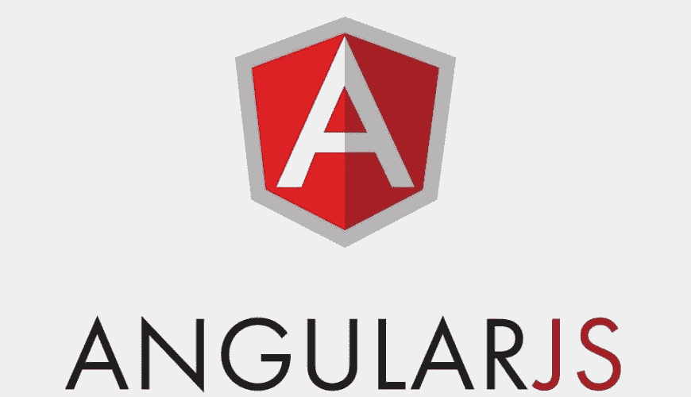

# 2021 年开发者必用的五大 AngularJS 开发工具

> 原文：<https://javascript.plainenglish.io/in-2021-developers-must-use-the-top-5-angularjs-development-tools-155cfd76389c?source=collection_archive---------20----------------------->

在这个瞬息万变的技术时代，拥有一个网站已经成为任何公司寻求建立和营销其在线存在的一个重要组成部分。在大多数情况下，网站是客户与您的组织的第一个接触点。

对于后端、前端、开发和测试在线应用和网站，许多网站使用 JavaScript 技术。

AngularJS 的开发工具比其他框架和工具更受欢迎，因为它们简单的架构和丰富的 HTML 5 特性，以及简单的语法。

# 五大 AngularJS 开发工具

以下是一些最有用的 **AngularJS Web 开发工具**用于构建 Web 应用程序:

# 量角器

量角器是一个基于 Node.js 的开源框架，使创建 Angular.js web 应用程序变得简单。WebDriverJS 似乎扮演着激活一个框架的角色，该框架为卓越的在线应用程序开发提供了一个协作环境。它是自包含的，允许响应用户命令自动执行所需的步骤。

# 茉莉

Jasmine 是一个开源的 JavaScript 开发工具。对于想要测试代码的开发人员来说，它是最好的行为驱动 AngularJS 工具之一。它促进了一种开发框架，这种框架包括独立于任何浏览器、DOM 或 JavaScript 框架的交互方式。

# 詹古拉

这些 AngularJS 开发工具可能会帮助您在创建内容时节省大量时间和工作。Djangular 结合了 angular 和 Django，允许你简单地根据你的需求为你的方案创建内容。

# 平均

在 Angular 中用于开发 Express、Node.js、AngularJS 和 MongoDB 的优秀且简单的样板文件。Mean 是给 JS 起的名字。它帮助创建或修改可重用的代码。AngularJS 的两个开发工具 Mongoose 和 Passport 是定制模块和预捆绑模块的组合。

# 摩卡网

Mocha 是另一个优秀的 JavaScript 测试框架，以其准确性和适应性而闻名。对于 AngularJS 开发者来说，这个工具是一个有趣的测试服务，因为它有很多内置功能。它可以在 Node.js 上和浏览器中运行，并且允许异步测试、映射和广播。

你现在必须尝试这些 **Angularjs 开发工具**。

*更多内容请看*[***plain English . io***](http://plainenglish.io/)