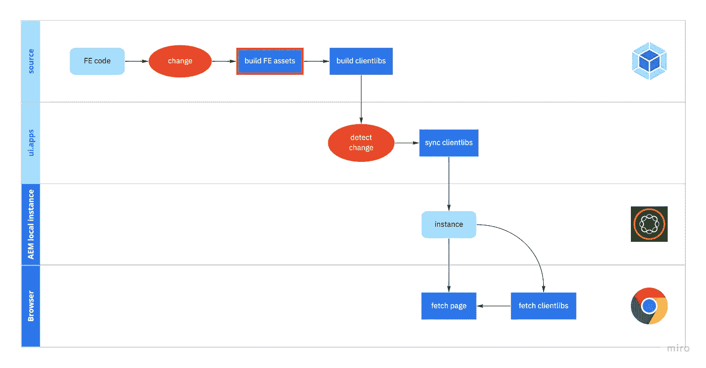
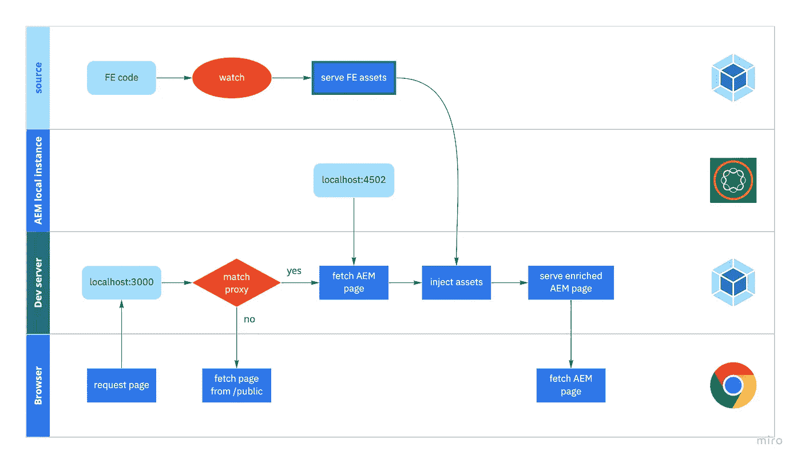

# 通过在 AEM 页面上运行 Webpack 开发服务器来提高 FE 开发速度和体验

> 原文：<https://javascript.plainenglish.io/increase-fe-development-speed-and-experience-by-running-a-webpack-dev-server-on-your-aem-pages-403101776041?source=collection_archive---------9----------------------->

## 使用本指南，使 FE 成为将代码无缝迁移到 AEM 实例的过程的一部分。

## 没有开发服务器

serving FE assets to local AEM page without a dev server

如果没有开发服务器，让您的资产出现在 AEM 页面上的唯一选择是创建一个**生产版本**。从这些资产中，创建客户端库，然后将它们同步到您的 AEM 实例。这个过程可能需要很长时间，因为生产构建正在尝试优化资产。要在 AEM 页面上看到您的增量更改，这并不理想。

## 使用开发服务器

Serving FE assets to local AEM page with a dev server

当使用 Webpack 开发服务器时，我们可以[代理](https://webpack.js.org/configuration/dev-server/#devserverproxy)某些路径。我们要做的是将所有页面请求代理到 AEM 实例。在通过 dev 服务器提供这些页面之前，我们将注入由 Webpack 创建的资产。

由于 Webpack 不必创建生产版本，而只需编译内存中的资产，因此这个过程要快得多！

# 如何在 CRA 系统中实现这一点

## 设置代理

Create React App 允许你[设置代理](https://create-react-app.dev/docs/proxying-api-requests-in-development/#configuring-the-proxy-manually)而不用接触 Webpack 配置。为此，在 src 根目录下创建一个文件`setupProxy.js`。在这里，我们将代理`/content`下的所有路径到 AEM 实例。如果您知道 Webpack 没有提供其他资产，您也可以允许代理这些资产。

这个代理设置将通过您的开发服务器暴露所有 AEM 内容，但将阻止所有客户端库(除了白名单中的那些)被下载。您希望将资产直接注入页面，而不是下载客户端库。

## 注入资产

为了注入这些资产，我们需要稍微改变一下 Webpack 的配置。为此，我们将使用 [craco](https://www.npmjs.com/package/@craco/craco) 。在项目的根目录下创建一个`craco.config.js`，并创建一个使用 craco 的运行脚本。

[before](https://webpack.js.org/configuration/dev-server/#devserverbefore) 选项提供了在服务器内部所有其他中间件之前执行定制中间件的能力。这里我们将添加中间件来将脚本注入页面。为此，我使用了[web pack-dev-server-inject-scripts](https://github.com/rustybox/webpack-dev-server-inject-scripts)。

记住从 CRA 配置中执行最初的`before`方法，不要破坏任何东西。

## 快乐开发意味着快乐项目

有了这个设置，我们让开发人员可以处理 AEM 创作的内容和快速重新加载的开发服务器，而不必每次都进行构建，从而减轻了他们的负担。这让您感觉好像是在使用一个没有 AEM 的普通应用程序。

# 其他技术？

在此强调了 AEM — CRA 用例，这也可以应用于您拥有的任何其他设置。关键是将本地 CMS 内容页面与 Webpack 开发流程相集成。

*更多内容请看*[***plain English . io***](http://plainenglish.io/)*。报名参加我们的* [***免费周报***](http://newsletter.plainenglish.io/) *。在我们的* [***社区***](https://discord.gg/GtDtUAvyhW) *获得独家获得写作机会和建议。*