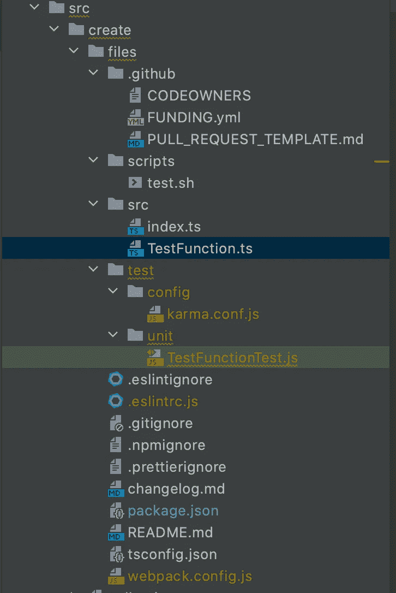

# 通过角度示意图增加速度

> 原文：<https://javascript.plainenglish.io/increase-velocity-with-angular-schematics-cc276a7849ac?source=collection_archive---------5----------------------->

## 自动创建可重用的类型脚本包


Photo by [Daniel McCullough](https://unsplash.com/@d_mccullough?utm_source=unsplash&utm_medium=referral&utm_content=creditCopyText) on [Unsplash](https://unsplash.com/s/photos/blueprints?utm_source=unsplash&utm_medium=referral&utm_content=creditCopyText)

我最近非常专注于构建自动化工具，为我们的开发团队提供生产力提升。在评估了众多自动化平台之后，包括 [nx](https://nx.dev/) 和 [yeoman](https://yeoman.io/learning/) ，我们选择了 [Angular Schematics](https://angular.io/guide/schematics) 作为我们的平台。本文将探索一个简单的示意图，用于生成支持同构 JavaScript(可以在客户机和服务器上运行)的最佳实践 TypeScript 包。我们还将强调自动化工具在良好系统设计中的重要性。

> 为什么是角度示意图？

Angular Schematics 提供了其他生成器所没有的可组合性。它内置的实用程序支持函数概念，包括函数处理和组合。Schematics 还融合了 JSON 和 TypeScript，以提供更快的代码重用。我可以用现有的图表或现有的生成器功能来组成新的图表。它还通过使用 TypeScript 来鼓励类型安全。Angular Schematics 与角度应用程序没有任何依赖关系。例如，我们有 React 组件的原理图生成器。

> 最佳实践包的定义是什么？

可重用组件包是高效产品团队的支柱。因此，我们的基础设施团队必须获得正确的包架构。对我们来说，最佳实践必须包括以下内容:

1.  支持所有主要模块系统
2.  静态代码分析
3.  测试自动化
4.  证明文件
5.  Github 协作工具

我们的角度示意图使用 [WebPack](https://webpack.js.org/) 来生成一个可由所有目标模块加载器(CommonJS、AMD、es 和 script 标签)使用的 UMD 模块。 [TypeScript](https://www.typescriptlang.org/) 、 [ESLint](https://eslint.org/) 和[漂亮器](https://prettier.io/)提供良好的静态代码分析。Karma 和 Jasmine 提供了测试自动化。Typedoc 用于生成每个构建的文档。并且 [Huskey](https://www.npmjs.com/package/husky) 运行预提交检查，而`.github`文件夹包括[代码所有者文件](https://docs.github.com/en/free-pro-team@latest/github/creating-cloning-and-archiving-repositories/about-code-owners)和 [PR 模板](https://docs.github.com/en/free-pro-team@latest/github/building-a-strong-community/creating-a-pull-request-template-for-your-repository)以确保稳固的 Github 协作。看看下面的演示。

Demo of Angular Schematic for TypeScript packages

如果你不熟悉角度原理图，请阅读本文。你不必理解所有的角度示意图概念。您必须了解自动化在减少人为错误和促进最佳实践方面的力量。我们示意图的要点如下。

我们示意图的入口点是`collection.json`。它定义了我们的原理图工厂函数和模式文件。`schema.json`文件定义了可以作为参数传递或通过命令提示符输入的参数。我们在`index.ts`中定义的`create`函数通过加载带有插值选项的模板文件来执行所有繁重的工作，插值选项是通过参数或提示收集的。

我们的原理图使用了包含在上述存储库的`files`目录中的模板文件。这些模板接受我们的原理图的插值参数。更重要的是，它们包括所有必需的开发依赖项、脚本和样板文件:



Screenshot of our template files

要在本地执行我们的示意图，请运行以下命令:

```
schematics ./src/collection.json:create --dry-run false
```

在运行我们的原理图并按照提示操作之后，我们得到了一个股票类型脚本包，其中包含了我们所有的最佳实践优点(请务必查看[演示](https://www.youtube.com/watch?v=HgZhRI7mkik))。**这个原理图**的源代码是在 GitHub 上可以获得的[，所以你可以测试和修改。](https://github.com/doriansmiley/typescript-starter)

让我们回顾一下这个生成的包包括的功能:

1.  用于客户端和服务器应用程序的 UMD 模块
2.  类型安全
3.  使用 ESlint 和 pretty 进行预提交检查
4.  带有测试样板的测试转轮
5.  构建、测试和发布脚本
6.  使用 [Typedoc](https://www.npmjs.com/package/typedoc) 生成的文档。
7.  Github 协作工具，包括代码所有者和拉请求模板。
8.  构建和测试包的说明
9.  变更日志
10.  适当忽略文件

**更重要的是，这里有我们没有得到的:**

1.  与复制样板文件相关的人为错误
2.  不一致的包装设计
3.  与不兼容模块相关的延迟
4.  用可预防的失败堵塞我们的构建系统的提交
5.  未记录的代码
6.  缺少 PR 信息
7.  缺少必需的审核
8.  缺少测试自动化
9.  未记录的变更
10.  不应跟踪的跟踪文件

像这样简单的生成器可以在一天或更短的时间内编写完成。更复杂的生成器可能需要一个开发人员花费两周或者更少的时间。一旦这些低代码解决方案在生产团队手中，节省的时间是这个数字的许多倍(在近期内可能是几个数量级)。**对构建自动化工具的承诺就是对与代码生成器一致的设计模式的承诺**。受益于此的系统往往属于架构良好的类别。如果你没有预算时间来构建低代码解决方案，你可能会浪费时间和金钱。了解[角度示意图](https://angular.io/guide/schematics)并发现您可以实现哪些自动化。