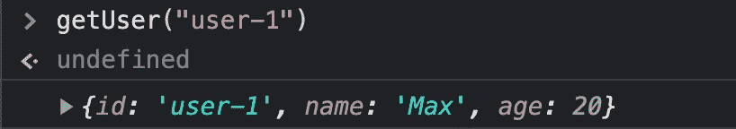

# 浏览器中 IndexedDB 的简单介绍

> 原文：<https://javascript.plainenglish.io/indexeddb-cfb55e3e26d8?source=collection_archive---------10----------------------->

## 添加、获取和删除数据


你肯定知道本地存储和饼干。两者都允许我们在浏览器中永久保存数据。然而，这两个特性都基于键值对方法。假设我们想要保存一个用户的年龄，我们将使用用户名或 ID 作为键——值就是年龄本身。

这对于存储更结构化的数据很有用，但不是最佳选择。结构化数据？浏览器支持我们。然而，所谓的索引数据库并不像 cookies 和本地存储那样流行。是时候更详细地了解这个经常被误解但功能强大的特性了——是时候开始使用 IndexedDB 了。

# IndexedDB 是如何工作的？

正如我之前所说，IndexedDB 不是键值对存储。顾名思义，它可能与指数有关——事实也的确如此。数据库系统允许我们保存通过索引识别的对象。

让我们直接看一个例子。IndexedDB 数据库的结果结构如下所示:


在这个例子中，我们用相同的键存储了三个 JavaScript 对象——虽然键的值不需要唯一，但 id 必须唯一。

让我们在浏览器中运行这个例子。

# IndexedDB 入门

IndexedDB 在浏览器中的`window`对象上可用。然而，使用它比使用本地存储或 cookies 更难。一个重要的区别是，我们通过连接访问数据库，并且有特定的事件。我们将在实践中看到这一点:

```
let db
const dbConnection = indexedDB.open('Database', 1)
```

首先，我们定义一个全局变量“db”。通过这个变量，我们将在不同事件的范围内访问数据库本身。如果数据库已经存在，`open` 函数将打开名为“database”的数据库。如果它不存在，函数将创建它。第二个参数，即“1”，是版本。现在，我们保留这个值，因为版本控制是一个更复杂的主题。

您可能注意到了，到目前为止，我们没有给全局“db”变量赋值。这就是事件发生的地方。数据库连接`dbConnection`知道多个事件。当数据库首次创建或版本号更改时，将触发“需要升级时”事件。因为我们没有触及版本号，所以现在，在创建数据库时运行以下代码:

```
dbConnection.onupgradeneeded = (event) => {}
```

在 arrow 函数内部，我们分配给事件，我们提供建立数据库所需的代码。到目前为止，只设置了数据库的名称。

一个 IndexedDB 数据库可以保存多个所谓的对象存储。您可以将对象存储想象成 SQL 中的一个表。本文旨在为用户创建一个表—包含 ID、姓名和用户年龄的字段。

下面是设置它的代码。我会引导你通过它:

正如我所说的，我们在函数中提供的代码在创建数据库时运行。我们做的第一件事是将 DB 赋给全局变量。然后，用`createObjectStore`我们创建一个你可以想象的类似表格的东西——“用户”是它的名字，我们命名需要提供“id”的索引字段。

一旦创建了表，就会触发相关的“oncomplete”事件——在我们提供的函数中，我们创建了第一个数据库条目。为了使事情尽可能复杂，我们调用表上的事务函数，将其保存在一个变量中，最后通过这个变量添加一个条目。我们提供的 id 由我们自己决定—我们只是强迫自己使用“id”作为数据库的必要索引。

到目前为止，整个代码如下所示:

如果在浏览器中运行代码，可以看到创建并填充的数据库。打开 Chrome 开发工具中的“应用程序”标签，转到“存储”部分，打开 IndexedDB:


到目前为止，一切顺利——但是剧透一下，有一个问题。

还记得全局“db”变量吗？我们需要它来访问所有代码的数据库。在事件函数中，我们将实际的数据库分配给它。问题:“onupgradeneeded”只运行来创建数据库。由于它是永久存储，重新加载页面不会创建新的数据库。因此，“onupgradeneeded”不会被执行，全局“db”变量仍未定义。

好吧，听起来很复杂，抱歉。总结一下这个问题:我们需要一个在数据库已经存在时触发的数据库连接事件:

```
dbConnection.onsuccess = (event) => {
  db = event.target.result
}
```

因为在这种情况下已经建立了数据库，所以我们只需要将 DB 赋给变量。现在，重新加载页面工作得很好——在第一次加载时，建立了只有一个条目的数据库，在每次重新加载时，不会改变数据库。

以下是目前为止的代码:

# 添加、删除和获取数据库条目

为了将用户添加到“users”表中，我们创建了一个名为“addUser”的函数。让事情变得更复杂的是，我们在分配给变量的表上实例化一个事务。通过这个变量，我们将数据添加到表中:

当您运行这个函数时，请记住传递一个惟一的 id —例如，“user-2”。最后，您需要在 Application 选项卡中刷新数据库以查看更改。

现在，让我们看看如何从 IndexedDB 中检索对象:

和以前一样，我们使用事务函数来访问数据库。我们的函数通过 ID 检索相关对象:

运行该函数，我们得到相关的 JavaScript 对象。



## 从索引中删除某些内容 b

最后但同样重要的是，让我们去掉一些条目。要删除一个用户，类似于获取一个用户，我们使用它的 id。

您可能会注意到，我们只是增加了从数据库获取用户的代码——事实上，我们使用了一个“请求”变量，并监听它以获得成功。这在获取数据时是必要的，但是对于删除和添加数据，我们也可以使用这样的请求。它使我们能够在交易完成后执行代码。作为最后一个简单的例子，我们可以很容易地重写删除函数来使用请求。然后，当删除事务完成时，它将 console.log:

感谢您的阅读！