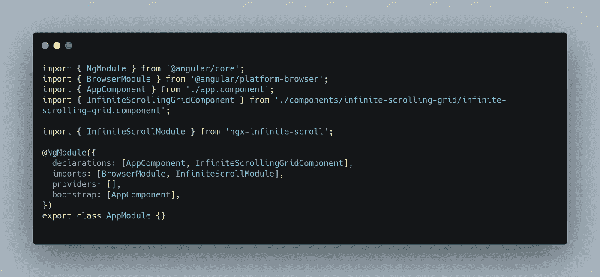
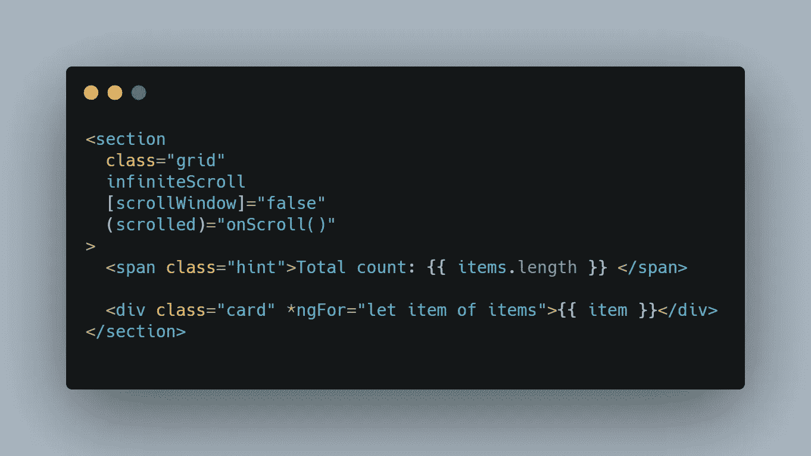
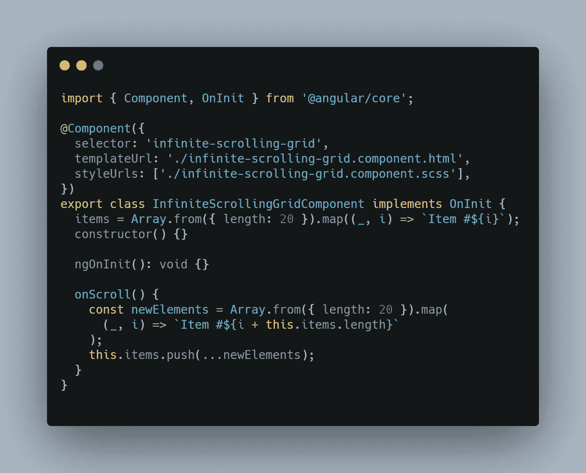
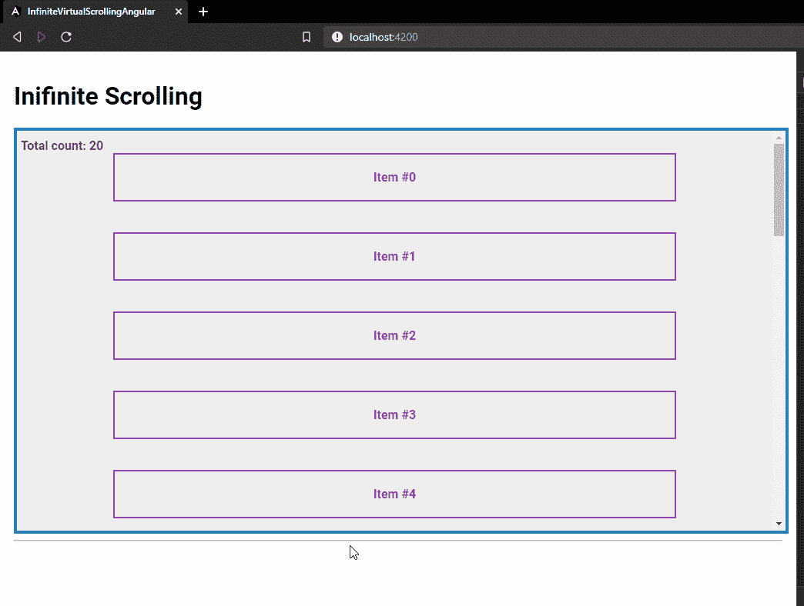
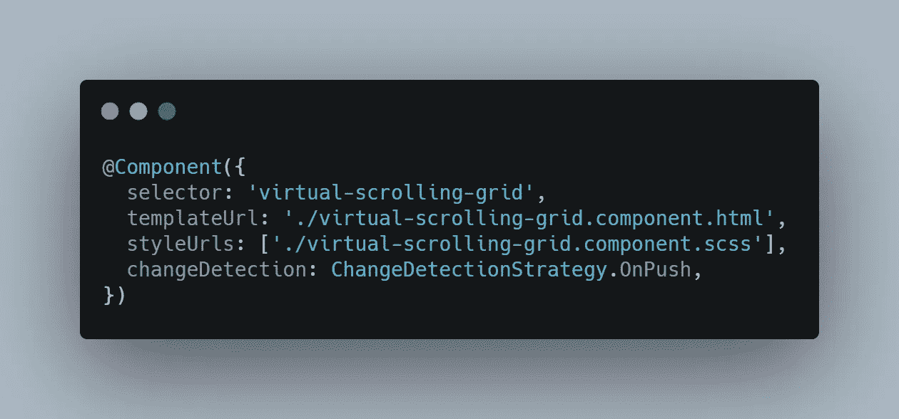
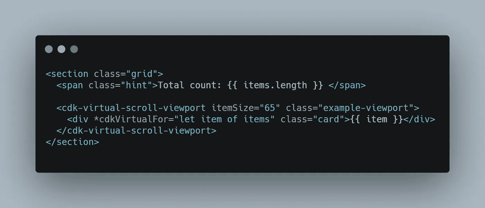
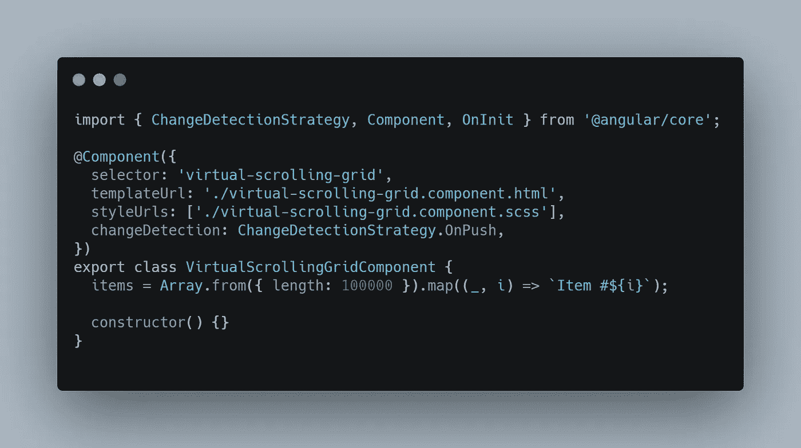
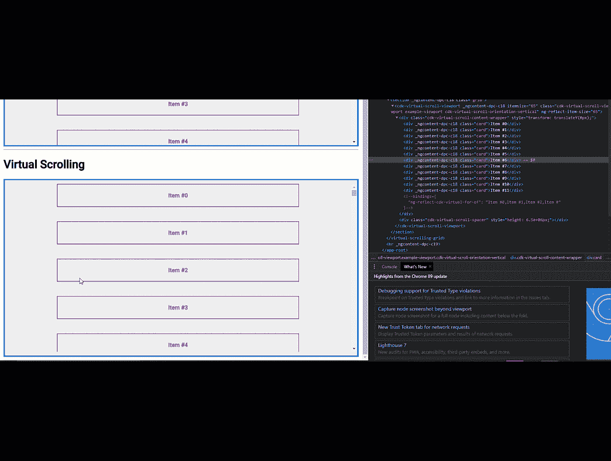

# 无限滚动与角度虚拟滚动

> 原文：<https://javascript.plainenglish.io/infinite-scrolling-vs-virtual-scrolling-in-angular-57f6e60f1285?source=collection_archive---------2----------------------->

## 以及如何实现这两者


Photo by [Taylor Wilcox](https://unsplash.com/@taypaigey?utm_source=unsplash&utm_medium=referral&utm_content=creditCopyText) on [Unsplash](https://unsplash.com/s/photos/scroll?utm_source=unsplash&utm_medium=referral&utm_content=creditCopyText)

在我们的应用程序中，我们经常需要加载大型数据集，它们可以由帖子、文章、图像等组成，也可以由包含数千或数百万行的巨大表格来表示。

为了处理这些情况，可以实现无限滚动或虚拟滚动策略。

在本文中，我们将了解何时使用其中的一个或另一个，以及如何实现它们。

# 无限滚动

我们知道，为了使应用程序加载时间尽可能短，并保持应用程序的稳定性和性能，我们不能同时加载所有数据。

这两种策略包括加载一个初始数据集，然后在用户请求时引入更多的数据集。

使用无限滚动策略，我们显示一个初始数据集，当用户滚动到该数据集的末尾时，我们会将更多的数据附加到初始数据上。

这种策略在 feeds 中被大量使用，你可以在你使用的大多数社交平台中看到。

下面是你如何实现它！

## 第一步。安装 ngx-无限卷轴

为了实现无限滚动策略，我们可以使用 npm 包 [ngx-infinite-scroll](https://www.npmjs.com/package/ngx-infinite-scroll) ，这将使这个过程变得更加容易，而不必从头开始编写代码。

```
npm i ngx-infinite-scroll
```

一旦安装完毕，不要忘记导入它并将其添加到模块声明中。



[RAW](https://carbon.now.sh/?bg=rgba%28171%2C+184%2C+195%2C+1%29&t=seti&wt=none&l=javascript&ds=true&dsyoff=20px&dsblur=68px&wc=true&wa=true&pv=56px&ph=56px&ln=false&fl=1&fm=Hack&fs=14px&lh=133%25&si=false&es=2x&wm=false&code=import%2520%257B%2520NgModule%2520%257D%2520from%2520%27%2540angular%252Fcore%27%253B%250Aimport%2520%257B%2520BrowserModule%2520%257D%2520from%2520%27%2540angular%252Fplatform-browser%27%253B%250Aimport%2520%257B%2520AppComponent%2520%257D%2520from%2520%27.%252Fapp.component%27%253B%250Aimport%2520%257B%2520InfiniteScrollingGridComponent%2520%257D%2520from%2520%27.%252Fcomponents%252Finfinite-scrolling-grid%252Finfinite-scrolling-grid.component%27%253B%250A%250Aimport%2520%257B%2520InfiniteScrollModule%2520%257D%2520from%2520%27ngx-infinite-scroll%27%253B%250A%250A%2540NgModule%28%257B%250A%2520%2520declarations%253A%2520%255BAppComponent%252C%2520InfiniteScrollingGridComponent%255D%252C%250A%2520%2520imports%253A%2520%255BBrowserModule%252C%2520InfiniteScrollModule%255D%252C%250A%2520%2520providers%253A%2520%255B%255D%252C%250A%2520%2520bootstrap%253A%2520%255BAppComponent%255D%252C%250A%257D%29%250Aexport%2520class%2520AppModule%2520%257B%257D%250A)

## 第二步。添加属性

我们将对下面的网格使用这种策略，最初它只有 20 个条目，随着用户滚动，我们将追加更多条目。


这个网格是一个简单的容器，它的最大高度`overflow`属性设置为`auto`

要对我们的数据网格应用无限滚动，我们需要使用以下属性。



[RAW](https://carbon.now.sh/?bg=rgba%28171%2C+184%2C+195%2C+1%29&t=seti&wt=none&l=javascript&ds=true&dsyoff=20px&dsblur=68px&wc=true&wa=true&pv=56px&ph=56px&ln=false&fl=1&fm=Hack&fs=14px&lh=133%25&si=false&es=2x&wm=false&code=%253Csection%250A%2520%2520class%253D%2522grid%2522%250A%2520%2520infiniteScroll%250A%2520%2520%255BscrollWindow%255D%253D%2522false%2522%250A%2520%2520%28scrolled%29%253D%2522onScroll%28%29%2522%250A%253E%250A%2520%2520%253Cspan%2520class%253D%2522hint%2522%253ETotal%2520count%253A%2520%257B%257B%2520items.length%2520%257D%257D%2520%253C%252Fspan%253E%250A%250A%2520%2520%253Cdiv%2520class%253D%2522card%2522%2520*ngFor%253D%2522let%2520item%2520of%2520items%2522%253E%257B%257B%2520item%2520%257D%257D%253C%252Fdiv%253E%250A%253C%252Fsection%253E%250A)

*   `infiniteScroll`
*   `scrollWindow`设置为`false`,因为我们想听实际的元素滚动而不是窗口滚动
*   `scrolled`当向下滚动达到距离阈值时，我们传递想要执行的功能(默认为 80%，但可以使用`ifiniteScrollDistance`进行配置)

## 第三步。添加更多数据

为了完成这个例子，我们现在需要做的就是声明一个回调函数，一旦`scrolled`事件被触发，这个回调函数就会被执行，并向我们的数组添加更多的数据。

这个网格组件的完整代码如下:



[RAW](https://carbon.now.sh/?bg=rgba%28171%2C+184%2C+195%2C+1%29&t=seti&wt=none&l=javascript&ds=true&dsyoff=20px&dsblur=68px&wc=true&wa=true&pv=56px&ph=56px&ln=false&fl=1&fm=Hack&fs=14px&lh=133%25&si=false&es=2x&wm=false&code=import%2520%257B%2520Component%252C%2520OnInit%2520%257D%2520from%2520%27%2540angular%252Fcore%27%253B%250A%250A%2540Component%28%257B%250A%2520%2520selector%253A%2520%27infinite-scrolling-grid%27%252C%250A%2520%2520templateUrl%253A%2520%27.%252Finfinite-scrolling-grid.component.html%27%252C%250A%2520%2520styleUrls%253A%2520%255B%27.%252Finfinite-scrolling-grid.component.scss%27%255D%252C%250A%257D%29%250Aexport%2520class%2520InfiniteScrollingGridComponent%2520implements%2520OnInit%2520%257B%250A%2520%2520items%2520%253D%2520Array.from%28%257B%2520length%253A%252020%2520%257D%29.map%28%28_%252C%2520i%29%2520%253D%253E%2520%2560Item%2520%2523%2524%257Bi%257D%2560%29%253B%250A%2520%2520constructor%28%29%2520%257B%257D%250A%250A%2520%2520ngOnInit%28%29%253A%2520void%2520%257B%257D%250A%250A%2520%2520onScroll%28%29%2520%257B%250A%2520%2520%2520%2520const%2520newElements%2520%253D%2520Array.from%28%257B%2520length%253A%252020%2520%257D%29.map%28%250A%2520%2520%2520%2520%2520%2520%28_%252C%2520i%29%2520%253D%253E%2520%2560Item%2520%2523%2524%257Bi%2520%252B%2520this.items.length%257D%2560%250A%2520%2520%2520%2520%29%253B%250A%2520%2520%2520%2520this.items.push%28...newElements%29%253B%250A%2520%2520%257D%250A%257D%250A)

当我们现在浏览这个网格时，我们看到越来越多的数据是如何被带来的。



注意**总数**:如何随着用户滚动而增加，以及当添加更多数据时滚动条如何跳跃。

# 虚拟滚动

无限滚动的问题是越来越多的东西被附加到应用程序中，从而增加了 DOM 的负载。

虽然这种影响可以减少到一个简单的空白 HTML 元素，该元素的高度就像其中有数据一样，但是如果要实现某种性能，可以使用另一种技术。

虚拟滚动广泛应用于具有数十万或数百万行以及数十或数百列的大型数据网格中。

在虚拟滚动策略中，当用户滚动时，元素的总数保持不变，只是当前的元素被下一个替换了。

为了在应用程序中轻松实现这一策略，而不必从头开始编写代码，我们可以使用[角度材料](https://material.angular.io/cdk/scrolling/overview)

## 第一步。安装角形材料

要将角度材质添加到项目中，只需在应用程序中运行以下命令。

```
ng add @angular/material
```

安装完成后，您需要导入`ScrollingModule`并将其添加到模块声明中(与之前相同😊 ).

```
import { ScrollingModule } from '@angular/cdk/scrolling';
```

## 第二步。更新网格

对于虚拟滚动，我们将使用与上面类似的网格，但是这次网格将有`overflow:hidden`并且组件将有不同的`changeDetection`策略。



[RAW](https://carbon.now.sh/?bg=rgba%28171%2C+184%2C+195%2C+1%29&t=seti&wt=none&l=javascript&ds=true&dsyoff=20px&dsblur=68px&wc=true&wa=true&pv=56px&ph=56px&ln=false&fl=1&fm=Hack&fs=14px&lh=133%25&si=false&es=2x&wm=false&code=%2540Component%28%257B%250A%2520%2520selector%253A%2520%27virtual-scrolling-grid%27%252C%250A%2520%2520templateUrl%253A%2520%27.%252Fvirtual-scrolling-grid.component.html%27%252C%250A%2520%2520styleUrls%253A%2520%255B%27.%252Fvirtual-scrolling-grid.component.scss%27%255D%252C%250A%2520%2520changeDetection%253A%2520ChangeDetectionStrategy.OnPush%252C%250A%257D%29)

如果你想了解更多关于这个`changeDetection`房产的信息，你可以查看这篇[文章](https://netbasal.com/a-comprehensive-guide-to-angular-onpush-change-detection-strategy-5bac493074a4)。简而言之，检测变化不会在我们的应用程序中每次发生变化时运行，而只会在某些事情发生变化时运行。

此外，我们需要用以下代码更新模板:



[RAW](https://carbon.now.sh/?bg=rgba%28171%2C+184%2C+195%2C+1%29&t=seti&wt=none&l=htmlmixed&ds=true&dsyoff=20px&dsblur=68px&wc=true&wa=true&pv=56px&ph=56px&ln=false&fl=1&fm=Hack&fs=14px&lh=133%25&si=false&es=2x&wm=false&code=%253Csection%2520class%253D%2522grid%2522%253E%250A%2520%2520%253Cspan%2520class%253D%2522hint%2522%253ETotal%2520count%253A%2520%257B%257B%2520items.length%2520%257D%257D%2520%253C%252Fspan%253E%250A%250A%2520%2520%253Ccdk-virtual-scroll-viewport%2520itemSize%253D%252265%2522%2520class%253D%2522example-viewport%2522%253E%250A%2520%2520%2520%2520%253Cdiv%2520*cdkVirtualFor%253D%2522let%2520item%2520of%2520items%2522%2520class%253D%2522card%2522%253E%257B%257B%2520item%2520%257D%257D%253C%252Fdiv%253E%250A%2520%2520%253C%252Fcdk-virtual-scroll-viewport%253E%250A%253C%252Fsection%253E%250A)

为了让虚拟滚动工作，我们需要知道网格中每个元素的准确高度。因此，每个`.card`的高度被设置为`65px`，与`itemSize`属性的值相同。

`cdk-virual-scroll-viewport`也必须有固定的高度和宽度。

## 第三步。数据

最后，我们需要定义`item`数组。



[RAW](https://carbon.now.sh/?bg=rgba%28171%2C+184%2C+195%2C+1%29&t=seti&wt=none&l=javascript&ds=true&dsyoff=20px&dsblur=68px&wc=true&wa=true&pv=56px&ph=56px&ln=false&fl=1&fm=Hack&fs=14px&lh=133%25&si=false&es=2x&wm=false&code=import%2520%257B%2520ChangeDetectionStrategy%252C%2520Component%252C%2520OnInit%2520%257D%2520from%2520%27%2540angular%252Fcore%27%253B%250A%250A%2540Component%28%257B%250A%2520%2520selector%253A%2520%27virtual-scrolling-grid%27%252C%250A%2520%2520templateUrl%253A%2520%27.%252Fvirtual-scrolling-grid.component.html%27%252C%250A%2520%2520styleUrls%253A%2520%255B%27.%252Fvirtual-scrolling-grid.component.scss%27%255D%252C%250A%2520%2520changeDetection%253A%2520ChangeDetectionStrategy.OnPush%252C%250A%257D%29%250Aexport%2520class%2520VirtualScrollingGridComponent%2520%257B%250A%2520%2520items%2520%253D%2520Array.from%28%257B%2520length%253A%2520100000%2520%257D%29.map%28%28_%252C%2520i%29%2520%253D%253E%2520%2560Item%2520%2523%2524%257Bi%257D%2560%29%253B%250A%250A%2520%2520constructor%28%29%2520%257B%257D%250A%257D%250A)

请注意，现在`items`数组包含了开始的所有数据。



注意，现在 DOM 中的项目数量保持不变，只有微小的变化。

## **当用户滚动时我想添加数据怎么办？**

我们前面说过，这种技术在处理数十万条记录时被广泛使用，但是在这些场景中，向后端发出请求并同时返回所有数据是不可行的。

为了使虚拟滚动有效地工作，只需要知道项目的总数。因此，如果您有 10，000 条记录，您可以定义一个长度为 10，000 的空数组，并在用户滚动时完成它。

# 结论

无限滚动和虚拟滚动是处理大型数据集的很好的技术，如果你想看这两个例子的完整代码，可以查看这个 Github [库](https://github.com/GeorgianStan/infinite-virtual-scrolling-angular)。