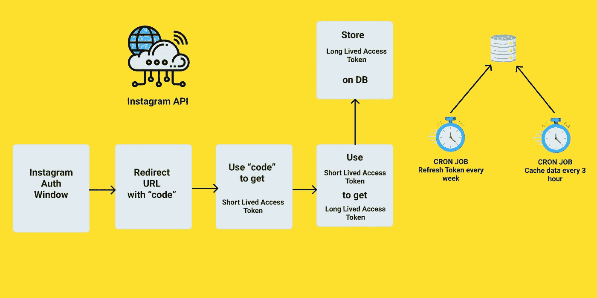
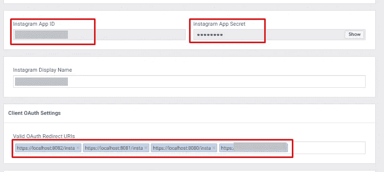

# 如何将 Instagram 基本显示 API 与 Node.js 集成

> 原文：<https://javascript.plainenglish.io/instagram-basic-display-api-integration-with-nodejs-45e4338dff17?source=collection_archive---------0----------------------->

本文将展示 Instagram 如何与您的系统集成。具体来说，它探索了一种机制来显示**用户在你的应用/网站**上的 Instagram 帖子。

> *在撰写本文时，*[*insta feed . js*](https://instafeedjs.com/#/)*提供了类似的功能。不过要靠 Heroku 的免费服务来刷新代币。Heroku 更新了定价政策后，它变得有点贵了。这种方法可以作为自托管的替代方法。*

在继续之前，请前往[脸书开发者](https://developers.facebook.com/docs/instagram-basic-display-api/overview)页面并浏览**概述。**进一步掌握概念会更容易。

整个过程可归结为 4 个步骤:

1.  创建脸书应用程序
2.  获取访问令牌
3.  设置令牌刷新服务
4.  取数据

# 1.创建脸书应用程序

遵循此链接中的步骤 1 至 3。

[https://developers . Facebook . com/docs/insta gram-basic-display-API/getting-started](https://developers.facebook.com/docs/instagram-basic-display-api/getting-started)

# 2.获取访问令牌

继续下一步需要应用程序特定的密钥和秘密，可以在这里找到。

*应用仪表板我的产品 Instagram 基本显示设置*

仅在前端需要应用 ID；后端需要 ID 和 secret。由于 App secret 不能向用户显示，所以它作为环境变量保存在服务器上。

App ID, secret & Redirect URIs

此外，将您的前端应用程序的 URL 添加到**有效 OAuth 重定向 URIs。带 https 的 l [ocalhost](http://Localhost) 就可以了。在 [GitHub 页面](https://pages.github.com/)上托管静态应用也可以，而且是更好的选择。**

# 前端

在静态前端站点上使用这段代码获得一个短期访问令牌。短期访问令牌的有效期为 1 小时，但可以交换为长期令牌(稍后将在服务器端进行)。

由于我们的目标是获取用户相关信息和他们的 Instagram 照片，因此范围被设置为`user_profile` & `user_media`。

它将在一个新的选项卡上打开授权窗口。在被授权后，它将重定向到带有包含`code`的查询参数的`/insta`页面(如上面的代码所配置的)。该代码将用于在后端获取短期访问令牌。

接下来，`code` & `redirect URI`被发送到服务器进行进一步处理。

# 后端

假设后端有一个通过任何 HTTP 方法接收`code` & `redirect URI`的端点。

现在，下一步是获得短期访问令牌。代码是不言自明的。

> *基于 JSON 的 POST 无法工作。所以基于表单的请求是通过* ***请求*** *发送的。*

获得**短期访问令牌**后，需要与**长期访问令牌进行交换。**

对于进一步的 API 调用，仅使用**长期访问令牌**。如前所述，短期令牌有 1 小时的有效期。类似地，长期令牌有 60 天的有效期。即刚刚存储在 DB 上的令牌需要在其到期之前被刷新。

# 3.设置令牌刷新服务

要每 60 天刷新一次令牌，cron 作业似乎是合适的。node-cron 最适合这个目的。

在`instaRefresh.cron`文件中，它从数据库中获取旧令牌并用新令牌替换它。

因此，这个 cron 作业将自动刷新访问令牌。

# 4.取数据

最后，是时候从 Instagram 获取数据了。我们将使用存储在 DB 上的`accessToken`。要了解更多可以获取的数据类型，请访问此[页面](https://developers.facebook.com/docs/instagram-basic-display-api/guides)。

> *访问令牌是应用范围的(对于应用和用户对是唯一的)*

在这里，我们将获取用户上传的媒体。然后对其进行过滤，仅获得图像。

# 平台费率限制

Instagram API 对 API 调用次数有限制。更多细节可以在这里找到[。](https://developers.facebook.com/docs/graph-api/overview/rate-limiting#platform-rate-limits)

解决这个问题的一种方法是缓存 API 响应。对于这个特定的场景，图像 URL 可以每隔，比如说，每 3 个小时保存到数据库；使用克隆作业。

不用直接调用 Instagram API，图片可以从 DB 端上来；作为一个缓存。然而，这种特殊的情况并不适合所有的用例。

希望本指南有助于在基于 Node.js 的应用上集成 Instagram Basic API。如果你有更好的选择，请在下面的评论中提出。

感谢阅读。🙂

# 参考

 [## 脸书应用和测试用户设置 stevenschobert/insta feed . js Wiki

### 此时您不能执行该操作。您已使用另一个标签页或窗口登录。您已在另一个选项卡中注销，或者…

github.com](https://github.com/stevenschobert/instafeed.js/wiki/Facebook-app-and-test-user-setup)  [## Instagram 基本显示 API - Instagram 平台-文档-开发者脸书

### Instagram 基本显示 API 允许您的应用程序用户在他们的……中获取基本的个人资料信息、照片和视频

developers.facebook.com](https://developers.facebook.com/docs/instagram-basic-display-api) 

*更多内容看*[***plain English . io***](http://plainenglish.io/)