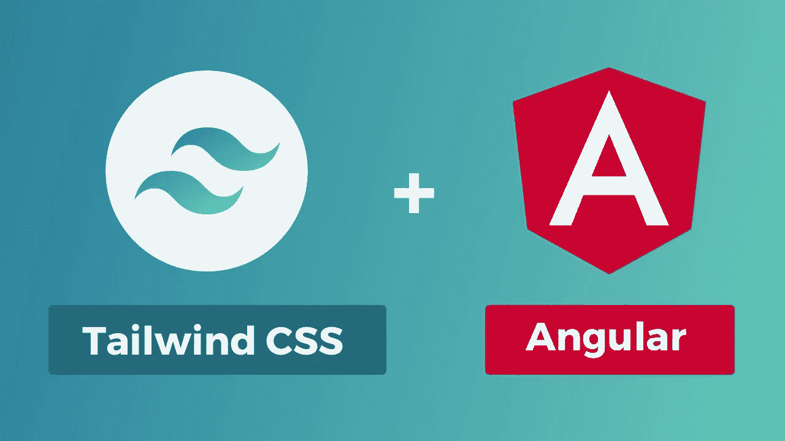
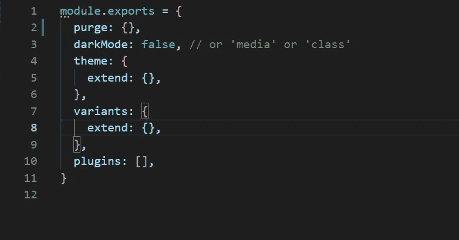
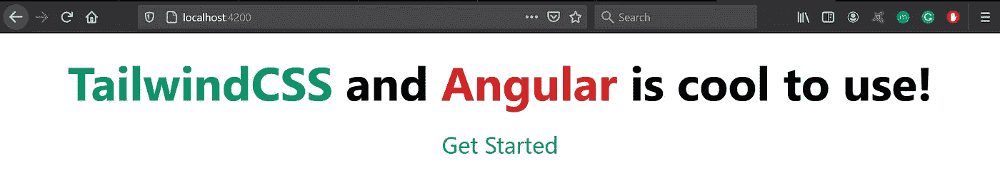
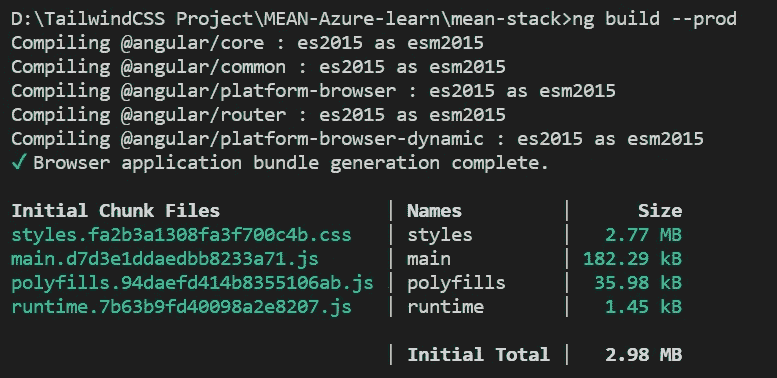
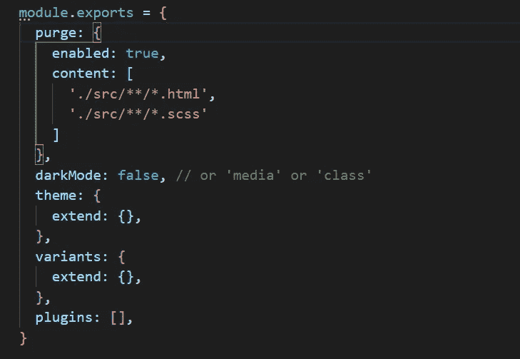
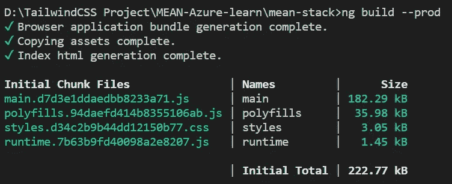

# 在角度项目中安装顺风 CSS

> 原文：<https://javascript.plainenglish.io/install-tailwind-css-in-an-angular-project-54a189b53db2?source=collection_archive---------5----------------------->



Source: Google Images

首先，非常感谢 Angular 开发团队，感谢他们倾听开发者社区的声音，并为 Tailwind CSS 带来了构建支持。

**什么是顺风 CSS？**

> **“一个实用至上的 CSS 框架，里面有类似** `**flex**` **、** `**pt-4**` **、** `**text-center**` **和** `**rotate-90**` **这样的类，可以直接在你的标记中构建任何设计。”-顺风队**

作为一名 web 开发人员，我讨厌编写 CSS 设计代码，直到我接触了 Tailwind CSS 框架。在我的 angular 项目中使用 Tailwind CSS 很有趣。如果你已经熟悉 Bootstrap 或 CSS 或者有这方面的经验，学习曲线是非常短的；否则，可能需要一些时间来适应类名。

他们还有一份[清晰易懂的文档](https://tailwindcss.com/docs/configuration)，可以方便地帮助你学习。在应用程序开发过程中，您也可以依靠这些文档(在我的开发过程中，我曾多次这样做😄).

在 Angular 版本 11.2.0 之前，开发人员必须采取手动方式将 Tailwind CSS 包含到他们的项目中。这是一个繁琐的过程，因为我们必须安装所有的依赖关系，配置文件，维护依赖关系等。幸运的是，从 11.2.0 或更高版本开始，这个过程变得简单了。

## **安装顺风 CSS**

*   首先确保你有 Angular 版本 11.2.0 或更高版本和 Node.js 版本 12.13.0 或更高版本(Tailwind CSS 肯定需要 Node 版本 12.13.0 或更高版本)
*   使用 npm 或您选择的任何其他软件包管理器工具和操作系统安装 Tailwind CSS 框架

```
npm install -D tailwindcss
```

*   安装 postcss 和 autoprefixer 依赖项

```
npm install postcss@latest autoprefixer@latest
```

*   在项目文件夹的根路径下创建 **tailwind.config.js** 文件(确保你有相同的文件名)。您的初始 tailwind.config.js 文件应该如下所示



Initial config file structure

接下来，我们需要将顺风 CSS 样式文件添加到您的根样式文件中。如果您使用 scss，您的 style.scss 将如下所示:

```
@import "tailwindcss/base";
@import "tailwindcss/components";
@import "tailwindcss/utilities";
```

如果您使用 css 而不是 scss，请按如下方式更新 css 文件:

```
@tailwind base;
@tailwind components;
@tailwind utilities;
```

## **确保安装工作正常**

让我们添加一个快速的 HTML 代码来检查是否一切正常。

将以下代码片段添加到您的**app.component.html**文件中。

```
<h1 class="my-8 text-center text-6xl font-bold">
<span class="text-green-600">TailwindCSS</span> and <span         class="text-red-600">Angular
</span> is cool to use!</h1><p class="text-center text-3xl">Thanks for reading!</p>
```

使用`npm start`运行应用程序，查看顺风 CSS 的运行情况



## **拥有干净的 HTML 文件和定制选项**

您可能已经从前面的代码片段中注意到，当我们有如此多的类要添加时，HTML 文件可能看起来很难看并且不可读。我们可以在 scss 文件中使用`@apply`标签将样式应用到 HTML 组件

首先，我们需要向 HTML 组件添加一个类名

```
<h1 class="main-heading">
    Tailwind CSS and Angular is cool to use
</h1>
```

接下来，我们可以通过使用 HTML 文件中定义的类名，在 scss 文件中使用`@apply`标签来应用样式

```
.main-heading {
   @apply my-8 text-center text-6xl font-bold;
}
```

## **定制课程值**

在少数情况下，我们需要的值可能不在可用列表中。假设你想增加 4.5 雷姆的余量。默认情况下，我们没有任何职业允许我们增加 4.5 雷姆的余量。

Tailwind CSS 提供了覆盖默认值或根据需要添加新值的选项。

我们可以编辑 tailwind.config.js 文件中的主题选项来进行定制。要添加 4.5 雷姆到我们的空白或填充，我们修改主题选项如下

```
...
theme: {
   spacing: {
     '4.5': '4.5rem'
   },
   extend: {},
}
...
```

现在我们可以像使用其他值一样使用这个值

```
<h1 class='my-4.5'>This will add margin bottom and top of 4.5rem</h1>
```

与此类似，我们可以自定义或覆盖任何类名。

## **清除生产中的代码**

当我们使用一个框架时，我们的项目中必然会有很多未使用的类，这会增加我们项目的整体规模。

下面是整个 Tailwind CSS 框架类的项目规模。



Tailwind CSS 提供了一种简便的方法来清除所有 HTML 和 JavaScript 文件中未使用的样式。

我们可以利用 **tailwind.config.js** 文件中的 purge 选项。



Modifying the purge config values

从项目中清除未使用的样式类后的文件大小



这是项目规模的巨大变化。通过清除，我们可以将项目大小从 MB 降低到几 kB。

## **优点:**

*   学习曲线最小
*   使用舒适
*   简单易懂的类名
*   有据可查
*   支持 Angular、Vue、React 等多种前端框架和库
*   能够在浏览器检查工具中检查实际的 CSS 值
*   高度定制控制

## **缺点:**

*   当使用大量类名时，HTML 文件会变得很难看；但是我们可以使用`@apply`标签方法。通过这种方式，你可以保持一个干净的 HTML 文件

## 结论

Tailwind CSS 减少了我花在编写风格代码上的时间。根据我的工作经验，我看到了使用 Tailwind CSS 的许多优点，而不是缺点。但是不要忘记清除生产环境中的代码

我希望这篇文章对你有用。感谢您的阅读。

*更多内容请看*[***plain English . io***](http://plainenglish.io)