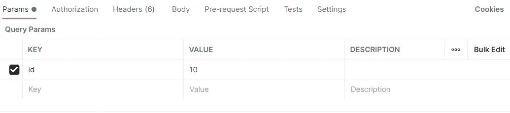

# 如何安装和使用 Postman:初学者指南

> 原文：<https://javascript.plainenglish.io/installation-and-use-of-postman-a32857c00dea?source=collection_archive---------15----------------------->


# 安装教程


首先，你需要访问[这个](https://www.postman.com/downloads/)网站，为你的系统选择一个合适的版本，然后等待下载完成。

确保您拥有 Postman 注册的帐户以访问该应用程序。如果没有，你可以很容易地访问[这个](https://identity.getpostman.com/signup)页面并注册。它使用用户名、电子邮件和密码等基本信息。


现在，继续下载安装并完成整个过程。


登录应用程序，它会将您重定向到您的浏览器进行验证。之后，您的桌面应用将会登录。


所有过程完成后，您将看到这种类型的屏幕。现在转到工作区，用您喜欢的名称创建一个新的工作区。
我将在这里创建一个名为`Postman`的工作空间。

随着本文的深入，现在我们将在这个工作区中执行所有进一步的任务🙌

# 邮递员的使用


现在在这里创建一个集合，我们将在这里学习如何发出不同的 API 请求。我在这里做了一个名为`Postman_Tutorial`的收藏。

> 我已经列出了你在使用这个应用程序时会遇到的术语。就在这里过一遍:

1.  **New** —您将在这里创建一个新的请求、集合或环境。
2.  **导入** —用于导入集合或环境。有从文件、文件夹、链接或粘贴原始文本等选项。
3.  **运行器** —自动化测试可以通过收集运行器来执行。这将在下一课中进一步讨论。
4.  **打开新的** —点击此按钮打开新的标签、邮递员窗口或跑步者窗口。
5.  **我的工作区** —您可以单独或作为团队创建新的工作区。
6.  **邀请** —通过邀请团队成员在工作区中协作。
7.  **历史记录** —您过去发送的请求将显示在历史记录中。这使得跟踪你所做的动作变得容易。
8.  集合 —通过创建集合来组织你的测试套件。每个集合可能有子文件夹和多个请求。也可以复制请求或文件夹。
9.  **请求选项卡** —显示您正在处理的请求的标题。默认情况下，对于没有标题的请求，将显示“无标题请求”。
10.  **HTTP Request** —点击它会显示一个不同请求的下拉列表，如 GET、POST、COPY、DELETE 等。在 Postman API 测试中，最常用的请求是 GET 和 POST。
11.  **请求 URL** —也称为端点，在这里您将识别 API 将与之通信的链接。
12.  **保存** —如果请求有变更，必须点击保存，这样新的变更才不会丢失或被覆盖。
13.  **Params** —您可以在这里编写请求所需的参数，比如键值。
14.  **授权** —为了访问 API，需要适当的授权。它可以是用户名和密码、不记名令牌等形式。
15.  **头** —您可以根据组织的需要设置内容类型 JSON 等头。
16.  **正文** —这是用户可以定制 POST 请求中常用的请求细节的地方。
17.  **请求前脚本** —这些是将在请求前执行的脚本。通常，设置环境的预请求脚本用于确保测试将在正确的环境中运行。
18.  **测试** —这些是在请求过程中执行的脚本。进行测试很重要，因为它会设置检查点来验证响应状态是否正常、检索的数据是否符合预期以及其他测试。

我们将使用[*JSONPlaceholder*](https://jsonplaceholder.typicode.com/)*网站来测试我们所有使用 postman 的 HTTP 请求。它有一些预定义的 API 路径，这将使我们很容易理解它是如何工作的。让我们开始吧…💃*

## *使用 GET 请求*

*使用以下链接通过 Postman 执行 GET 请求。在成功的 API 请求之后，它将列出一些用户作为响应。*

```
*https://jsonplaceholder.typicode.com/users*
```

**

*如上图所示，我们发出了一个`GET`请求，并收到了一个成功的`**200**`响应。它还以 JSON 格式返回了一些用户数据。*

## *处理发布请求*

*特别是对于`POST`请求，有时我们需要将一些数据作为请求的主体发送给服务器。该数据随后被服务器用来添加一些新记录。使用下面给出的链接进行`POST`请求。*

```
*https://jsonplaceholder.typicode.com/posts*
```

*向我们的`POST`请求添加主体:*

```
*{"title": "Hello","body": "World","userId": 99}*
```

**

*转到请求体，将 JSON 格式的数据添加到我们的请求中。*

**

*结果，我们得到一个 status `**201**` 响应，表明新记录已经在服务器上创建。耶！！*

## *处理上传请求*

*通常`PUT`请求用于更新服务器上一些预先存在的记录。让我们使用下面给出的链接来完成这个过程。*

```
*[https://jsonplaceholder.typicode.com/posts/10](https://jsonplaceholder.typicode.com/posts/101)*
```

*`PUT`链接中的“10”是文章的 id。所以这个 id 会根据您想从服务器上选择的记录而变化。*

```
*{"title": "Hello World","body": "Updated Post"}*
```

**

*我们将使用 PUT 方法更新编号为“10”的文章的标题和正文。这些更改将立即反映在服务器上。*

**

*现在，正如我们在上面的图片中看到的，帖子已经更新，id 为“10”。太棒了。！💯*

## *过滤请求*

*我们使用查询参数来过滤请求。现在让我们使用过滤找出一个 id 为“10”的用户。请使用下面给出的链接。*

```
*https://jsonplaceholder.typicode.com/users*
```

*现在添加用于过滤的参数:*

**

*正如我们在下面给出的图片中看到的，我们得到了一个响应`**200**` ，id 为“10”的用户的所有详细信息都已显示。Tada！！👯*

**

## *使用删除请求*

```
*https://jsonplaceholder.typicode.com/posts/10*
```

*使用上面给出的链接，我们只需调用一个`DELETE`端点，它将删除 id 为“10”的帖子。正如我们在链接的末尾看到的，我们必须提供要删除的文章的 id。*

**

*正如我们在上面给出的图片中看到的，我们已经从服务器收到了一个状态`200`，声明我们的帖子已经被成功删除。💃*

*最后，我们已经到了请求部分的末尾，所以基本上这也将是任何其他请求的流程。通过首先练习这些请求，你一定会对处理其他类似类型的请求有所了解😉*

## ***收集滑道***

**

*您可以选择收藏。
添加你想要的迭代次数。
在每个请求后添加延迟。
如果需要，选择数据文件。*

*繁荣💥差不多就是这样。如果你有很多要求，邮递员会帮你处理的。*

**

*正如我们在这里看到的结果，我们在右侧获得了所有请求的状态代码。*

*最后，我已经尽可能多地收集了在制作《邮差》时所需要的最基本和最相关的东西。当你熟悉了这些概念之后，你就可以自由地深入研究了💛*

*这是我的结束…🚶*

*希望你们喜欢这篇文章，你知道该怎么做…👏
请随时联系我[这里](mailto:sahilmore19999@gmail.com)📪另外，如果你想请我喝杯咖啡，随时欢迎。☕️*

**更多内容请看*[***plain English . io***](http://plainenglish.io/)*