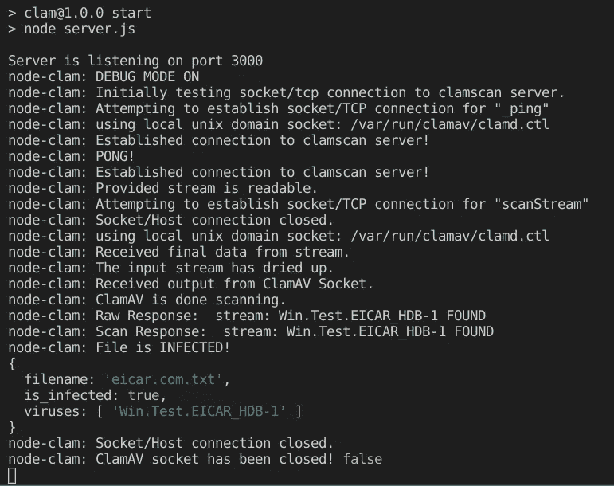

# 在 Node.js 应用程序中轻松集成 ClamAV 防病毒软件

> 原文：<https://javascript.plainenglish.io/integrate-clamav-antivirus-software-in-your-node-js-application-39d92ff76792?source=collection_archive---------2----------------------->

## 向您展示如何在 Node.js 应用程序中扫描恶意文件的简单步骤


Photo by [Michael Geiger](https://unsplash.com/@jackson_893?utm_source=medium&utm_medium=referral) on [Unsplash](https://unsplash.com?utm_source=medium&utm_medium=referral)

谈到互联网和 web 应用程序，安全性是一个重要的关键词。我们总是努力保护我们的系统免受网络攻击。危及安全会导致我们暴露有价值的信息，从而毁掉我们的业务。

大多数安全攻击都是通过向网站上传恶意文件来完成的。许多网站允许用户上传个人照片、简历等文件。黑客可能会利用这个机会将易受攻击的文件上传到网站，并获得未经授权的访问权限。

因此，如果我们的 web 应用程序允许用户上传文件，那么我们需要提供某种级别的安全性来扫描文件中的漏洞。我们应该在服务器上安装杀毒软件并扫描上传的文件。

ClamAV 是扫描网络应用程序文件的绝佳选择。由于其多功能性，它支持多种文件格式和签名语言。还有一个很棒的 Node.js 包叫做`clamscan`，它提供了一个从后端应用程序扫描文件的 API。

在本文中，我们将探讨如何使用 clamscan 来扫描文件，以检测服务器中的病毒和恶意内容。因此，没有进一步的行动，让我们直接进入它。

# 在 Ubuntu 中安装和配置 ClamAV

首先，我们需要在我们的服务器或本地计算机上安装 ClamAV。在 Linux 机器上安装 ClamAV 相当容易:

*   为了在基于 Fedora 的发行版上安装，

```
sudo yum install clamav
```

*   为了在基于 Debian 的发行版上安装，

```
sudo apt-get install clamav clamav-daemon
```

*   对 OS X 来说，

```
sudo brew install clamav
```

在我们的 Linux 机器上安装 ClamAV 之后，我们需要配置一些设置。对于运行 Ubuntu 作为其操作系统的计算机，在终端中执行以下命令来启动`clamav-freshclam`。

```
sudo service clamav-freshclam restart
sudo service clamav-freshclam status
```

之后，我们应该开始`clamav-daemon`服务。这个过程非常重要，因为它将在`/var/run/clamav/clamd.ctl`中创建一个套接字文件，用于扫描上传到服务器的文件流。

让我们在终端中运行以下命令来启动`clamav-daemon`:

```
sudo service clamav-daemon start
sudo service clamav-daemon status
```

在我们的 Linux 机器上安装和配置 ClamAV 之后，我们准备进一步在 Node.js 应用程序中实现扫描文件。

# 设置项目

首先，让我们创建一个新项目并设置一些基本配置。

要从头开始创建一个新的 Node.js 应用程序，我们需要在终端中键入以下命令:

```
npm init -y
```

它将创建一个包含一些信息的`package.json`文件。然后，我们应该通过在终端中运行以下命令来安装所需的包以及 express js:

```
npm install express
```

该命令将安装 express js 和运行 Node.js 应用程序所需的所有其他依赖项。接下来，让我们在项目的根目录下创建一个名为`server.js`的文件。在这里，我们将粘贴以下代码块。

要运行服务器，让我们在`package.json`中添加以下代码。

```
{
  // ...
  "scripts": {
    "start": "node server.js",
    // ...
  },
  // ...
}
```

现在，如果我们在终端中运行`npm start`，我们应该会看到一条消息“服务器正在监听端口 3000”。这意味着我们的应用程序已经成功配置。

# 安装和配置 Clamscan

现在，我们已经初始化了我们的项目，并实现了一些基本配置，是时候为项目安装和配置 clamscan 了。

要安装 clamscan，我们应该在终端中编写以下命令:

```
npm install clamscan
```

它将安装使用 ClamAV 扫描和发现恶意文件所需的所有必要的依赖项和 API。

现在，我们需要修改下面的`server.js`中的代码来配置 clamscan。

# 扫描文件

现在，我们可以使用以下代码块扫描服务器中的文件:

我们还可以修改代码来扫描通过 API 上传的文件。因此，我们甚至可以在将文件保存到存储之前轻松检测到恶意内容。

但是在此之前，我们需要安装几个包:`cors` 和`express-fileupload`。我们需要这些包来实现向服务器上传文件。我们可以通过在终端中运行以下命令来安装这两个软件包:

```
npm install cors express-fileupload
```

现在，让我们创建一个名为`config.js`的新文件，并将`clamscanConfig`移动到`config.js`。让我们也在`config.js`中添加`fileUploadConfig`，这将是`express-fileupload`的配置选项。

现在，让我们将以下代码块添加到`server.js`文件中:

这里，我们将在每个路由器中使用`req.clamscan`，这里我们需要上传一个或多个文件。

至此更改完`server.js`后，完整的`server.js`将类似于下面的代码:

## 实现上传 API

到目前为止，我们配置了这么多东西！现在，是时候创建一个上传路径了，文件将被上传到这里。

让我们首先创建一个简单的上传文件的 POST API:

这里，我们实现了一个简单的 POST API 来上传头像图片。我们可以通过使用 [Postman](https://www.postman.com/) 或任何其他平台上传文件来测试这个 API。在此之前，我们需要在项目的根目录下创建一个名为`upload`的文件夹，防止找不到目录的错误。

如果文件成功上传，我们将进入下一阶段，在存储文件之前对其进行扫描。

让我们更改上面的代码，在将文件保存到服务器之前扫描它们:

# 结果

现在是测试 API 的时候了。让我们上传一个恶意文件，看看服务器的输出是什么。



Image captured by the author

我们可以看到，防病毒软件已成功检测到恶意文件，并阻止了 web 应用程序在服务器上存储该文件。我们还可以通过通知用户有关病毒的信息来警告他们。

# 摘要

到目前为止，我们已经在我们的 Linux 机器上安装了 ClamAV，并创建了一个 Node.js 应用程序，我们可以在其中扫描上传的文件，并检测该文件是否被感染。我们还通过上传一个恶意文件来测试我们的 API。

我们现在可以利用这些知识，在所有后端应用程序中扫描恶意文件。这将使我们的用户在使用我们的应用程序时更可靠、更有信心。

此外，我们可以防止我们的网站受到有害的攻击和安全漏洞。虽然我们不能 100%安全地抵御攻击者，但这将使我们在一定程度上领先于他们，并确保我们的资源安全无虞。

# 资源

*   [https://github.com/kylefarris/clamscan#readme](https://github.com/kylefarris/clamscan#readme)
*   [https://kainikhil . medium . com/installing-clamav-and-clam-f 4d 26d 8150 C4](https://kainikhil.medium.com/installing-clamav-and-clam-f4d26d8150c4)
*   [https://kaini hil . medium . com/nodejs-file-upload-and-virus-scan-9f 23691394 F3](https://kainikhil.medium.com/nodejs-file-upload-and-virus-scan-9f23691394f3)