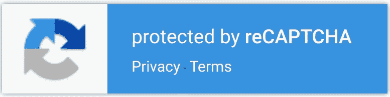
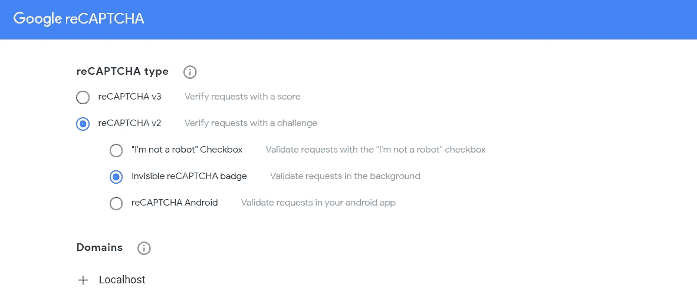

# 将 Google ReCaptcha v2 与 React 和 Node.js 集成

> 原文：<https://javascript.plainenglish.io/integrate-google-recaptcha-v2-invisible-with-react-and-nodejs-9d119c94433b?source=collection_archive---------1----------------------->



在本教程中，我们将使用 npm 包 [react-google-recaptcha](https://www.npmjs.com/package/react-google-recaptcha) 完成 reCAPTCHA v2(不可见)与 React 和 Node.js 的集成过程。

## 第一步。为 google recaptcha 生成密钥

要使用 Google reCAPTCHA 服务，首先我们需要注册我们的应用程序并获得一个站点密钥和私有密钥对。

为此，我们做了以下工作:

1.  访问 Google reCAPTCHA [管理控制台](https://www.google.com/recaptcha/admin/)。
2.  单击“+”图标注册新的站点/应用程序。
3.  选择验证码版本为 reCAPTCHA v2，并输入为不可见。
4.  复制您的站点和私钥以备将来使用。
5.  在允许的域列表中添加应用程序的域。出于开发目的，将 *Localhost(区分大小写)添加到*列表中。



## 第二步。设置客户端

使用 npm 或 yarn 安装 [react-google-recaptcha](https://www.npmjs.com/package/react-google-recaptcha) 包。

```
npm install react-google-captcha
OR
yarn add react-google-captcha
```

1.  导入`<ReCaptcha/>`组件
2.  将它包含在返回方法中。
3.  你还需要一个`*ref*`给这个组件。
4.  使用`*ref*`和`executeAsync()`函数获得 recaptcha 令牌(在向后端提交数据之前)
5.  最后，重置验证码。这是 imp，用于在需要时使 recaptcha 为后续检查做好准备(例如:-如果用户名或密码在登录 captcha 时无效，应在重试前重置)

下面是一些示例 React 代码:

对于*我不是机器人复选框*验证码，只需移除尺寸道具(第 33 行)并用`recaptchaRef.current.getValue()`替换第 9 行

***注意:*** *如果谷歌检测到一些可疑的用户活动，recaptcha 挑战将被隐式调用。你不能明确地调用挑战或改变它的概率。为了增加挑战被调用的概率(可能是为了测试目的),请尝试在匿名模式下通过 VPN 连接启动应用程序。*

该软件包还提供了可选的道具，如主题、徽章的位置等。查看[和](https://www.npmjs.com/package/react-google-recaptcha)的包装文件。

## 第三步。在后端验证令牌

从请求体中提取令牌，并将这个令牌和在步骤 1 中获得的私钥一起发送到 Google 的 API，以获得用户分数。

```
https://www.google.com/recaptcha/api/siteverify?secret=${YOUR_PRIVATE_KEY}&response=${token}
```

您将收到一个带有成功密钥的 JSON 对象。此密钥可用于确定请求是来自真实用户还是可疑机器人。成功真意味着一个真正的用户。

```
data: {
 success: true,
 challenge_ts: ‘2021–10–18T04:33:00Z’,
 hostname: ‘localhost’
}
```

下面是后端的示例代码片段:

***注意:*** *在将你的代码推送到公共存储库之前，记得从代码中移除你的私钥。您可以将它存储在环境变量中，并使用 process.env 对象或配置变量(如果使用 heroku 部署)来访问它。并添加您的。env 文件到. gitignore.*

就是这样！我希望你已经发现这是有用的。如果有，一定要在评论里让我知道。

*更多内容请看*[***plain English . io***](http://plainenglish.io)