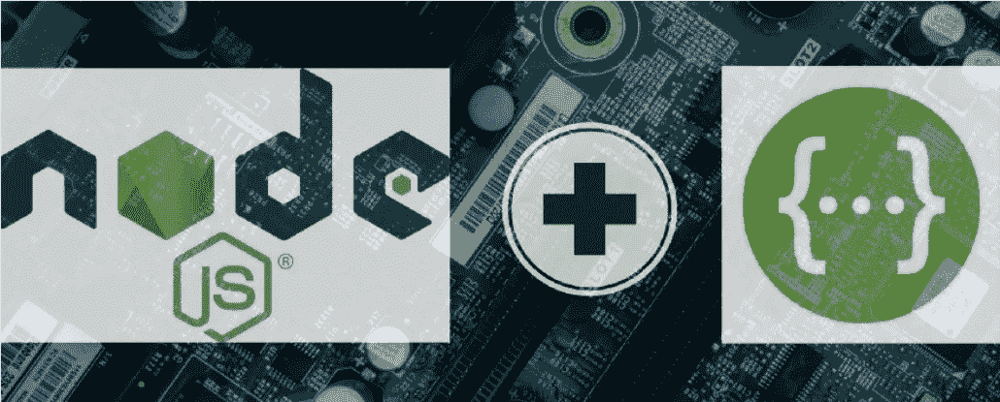
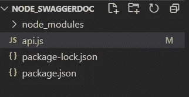
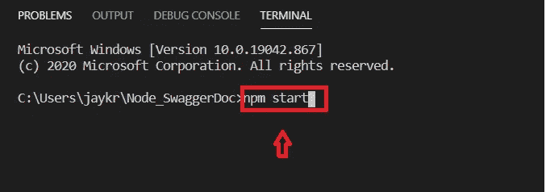
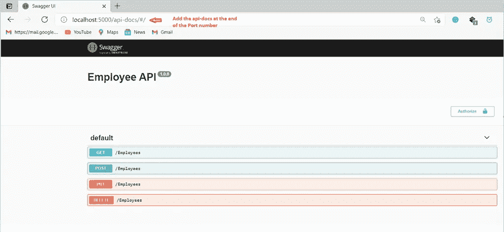
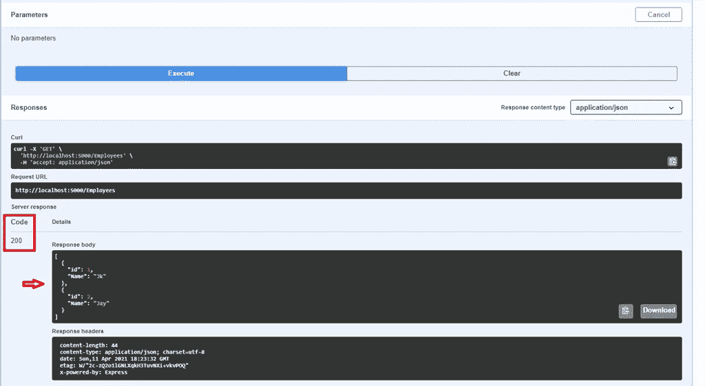

# 将开放 API (Swagger)与 Node.js 和 Express 集成

> 原文：<https://javascript.plainenglish.io/integrate-open-api-swagger-with-node-and-express-b5b77bdc081b?source=collection_archive---------3----------------------->

Node js + Swagger

本文将解释如何将 swagger(开放 API)与 Node.js 和 Express 集成。Swagger 使得后端开发人员能够非常容易地记录、测试和解释他/她一直在为前端开发人员或任何希望使用这些端点的人工作的 API 端点。

# 设置

在我们开始之前，我们应该在我们的机器上安装一些东西。

*   Visual Studio 代码-> [Visual Studio 代码](https://code.visualstudio.com/)
*   Node.js -> [Node.js](https://nodejs.org/en/)

**源代码**

 [## GitHub-JayKrishnareddy/Node _ SwaggerDoc:集成 swagger 和 Node - express

### 集成 swagger 和 Node - express。通过创建帐户为 JayKrishnareddy/Node _ SwaggerDoc 开发做贡献…

github.com](https://github.com/JayKrishnareddy/Node_SwaggerDoc) 

**所需包**

*npm 初始化*

*npm 安装 swagger-jsdoc swagger-ui-express express node mon*

快速—适用于服务器

Swagger —用于 UI 中的 API 文档

nodemon——每当我们对文件进行更改时，将使用它来自动重启我们的服务器。

安装完所需的包后，让我们添加新文件来设置 Swagger 配置，并在节点中添加 API 端点

**项目的结构。**

Fig-1

# 摆好架势

Swagger UI 可以为前端和后端设置。因为这篇文章是关于 Node.js 的 swagger。我将只在 Node.js express 应用程序中设置 Swagger。您可以在此探索其他选项

**在你的 api.js 里**

在集成了 swagger 设置之后，让我们用特定格式的描述和响应代码来定义 swagger 端点，以便我们能够在浏览器中运行之后访问 swagger 中的那些 API

**在每个终点前添加 Swagger**

出于演示的目的，我添加了四个 API(Get、Post、Put、Delete ),并为剩余的端点添加了 swagger 设置

**最终 api.js**

**在浏览器中运行网址**

现在，您可以在终端中对您的应用程序执行 **npm start** ，它将导航到浏览器。我们必须在 URL 的末尾添加 **/api-docs** ，这样我将导航到我们已配置的 swagger，您将看到基于您生成的 swagger.json 的 Swagger UI。

**端子**

Fig-2

**招摇**

Fig-3

**使用 Swagger 测试 API**

Fig-4

希望这篇文章对你有帮助。

继续学习！

*更多内容看*[***plain English . io***](http://plainenglish.io/)