# 以简单的方式将 PayPal 集成到 React 中

> 原文：<https://javascript.plainenglish.io/integrate-paypal-into-react-the-easy-way-f49b4774a11e?source=collection_archive---------5----------------------->

## **使用 PayPal 沙盒在基于 React 的电子商务平台上创建快速安全的结账选项**

*将购物车集成到你的项目中？你可能想使用 PayPal 作为一种简单的结账方式。人们觉得在有 PayPal 结账选项的网站上购物更安全。在这篇博文中，我将带你建立并测试一个 PayPal 沙盒账户。*

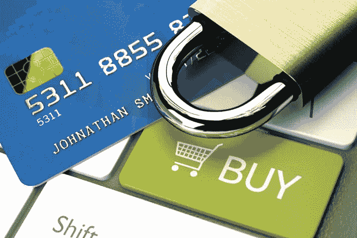

Creator: Advantus Media Inc. and QuoteInspector.com | Credit: QuoteInspector.com

PayPal 为开发人员提供了一个沙盒帐户，用于在上线之前在他们的网站上实现和测试 PayPal checkout。您可以使用 PayPal 提供给您的个人和商业电子邮件来测试您的应用程序并模拟真实交易。

首先，您必须设置您的开发环境来获取 OAuth 2.0 客户端 ID 和沙箱的秘密凭证。去 PayPal [开发者网站](https://developer.paypal.com/home)，用你的私人 PayPal 账户(你用来网上购物的账户)登录。如果你还没有账号，可以在这里注册个人账号[。只是要注意，私人帐户不会让你在真实环境中使用 PayPal，但对于测试来说已经足够好了。如果您想将代码部署到实际环境中，您需要创建一个商业帐户。](https://www.paypal.com/us/webapps/mpp/account-selection)

登录后，在您的仪表盘菜单中，导航至*我的应用&凭证*。

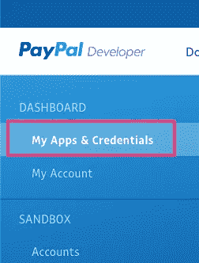

确保您在*沙箱*选项卡上获取测试凭证。一旦你准备好发布一个实时项目，你可以切换到 *Live* 标签来获得一组新的凭证(记住你需要一个商业 PayPal 帐户！).

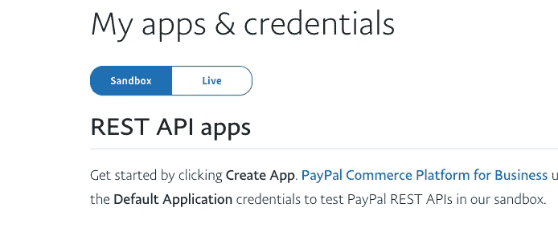

Select the Sandbox tab to obtain credentials for testing

在*应用名称*下点击*创建应用*。

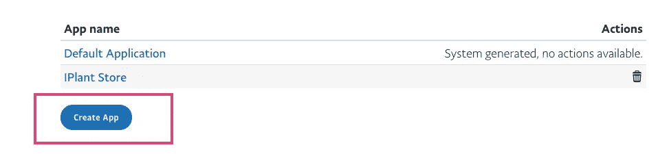

在一个新窗口中填写应用程序的名称，并选择应用程序的类型。使用 ***商人*** 如果你正在为一个特定的企业建立一个网站，它将得到所有的付款；使用 ***平台*** 用于有许多不同卖家的更大的电子商务网站。

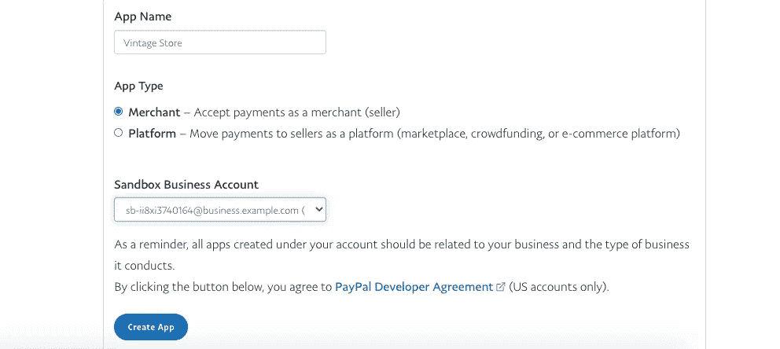

一旦你点击*创建应用程序，* PayPal 会为你提供 API 凭证:沙盒账户、客户 ID 和密码。对于我们的项目，我们只需要保存沙盒帐户。

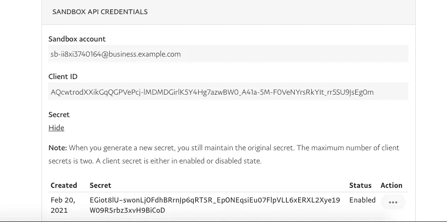

为了测试我们的交易，我们需要获得两封电子邮件，一封给买家，另一封给商家(卖家)。在沙盒下的仪表盘中选择*账户*并选择*创建账户*。首先，创建一个个人帐户(为买家)，从下拉菜单中选择你正在测试的国家。

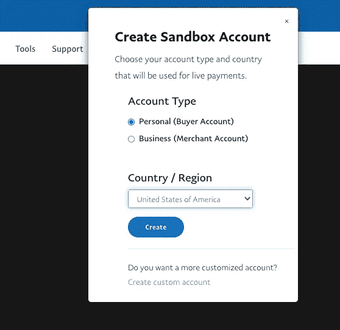

创建个人帐户后，让我们为商家创建一个商业帐户。

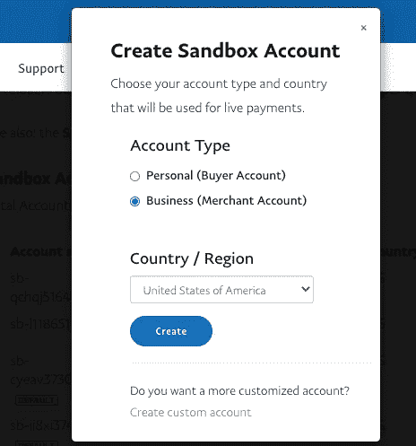

在*管理账户*下，点击 **…** (三个点)并选择*查看/编辑账户*。这里我们将需要*系统生成的密码*。保存好个人和公司账户的电子邮件和密码，我们以后会用到。

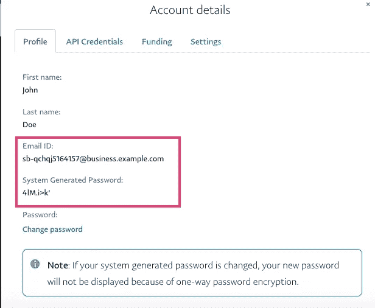

现在我们已经完成了获取 PayPal 凭证的工作，可以继续我们的 React 项目了。我们将使用**react-paypal-express-check out**NPM 包。要安装它，请在您的终端上运行

`npm install — save react-paypal-express-checkout`。

我们需要从`react-paypal-express-checkout .`进口`PaypalExpressBtn`

在 render 方法中，我们创建了三个回调函数；`onError`发生在 PayPal 主脚本无法加载时，`onCancel`发生在用户点击取消按钮或关闭 PayPal 弹出窗口时，`onSuccess`表示交易成功。

之后，我们声明变量，默认情况下环境变量 `env`被设置为`‘sandbox’`，一旦你的应用程序准备好生产，你将需要把它改为`‘production’`。我们将货币变量设置为`‘USD’`。如果您想使用不同的货币，您可以在[这里](https://developer.paypal.com/docs/classic/api/currency_codes/)查看不同的货币代码。我们把总变量设为`30`；虽然默认情况下它被设置为`1`，但我更喜欢用一个更大的数字来测试。在`client`变量中，我们将从 PayPal 收到的沙盒账户值分配给沙盒密钥。

然后我们返回所有道具中的`PaypalExpressBtn` 。

就是这样！PayPal 集成到您的项目中。现在让我们测试它实际上是如何工作的。

从购物车中，我们选择用贝宝支付。

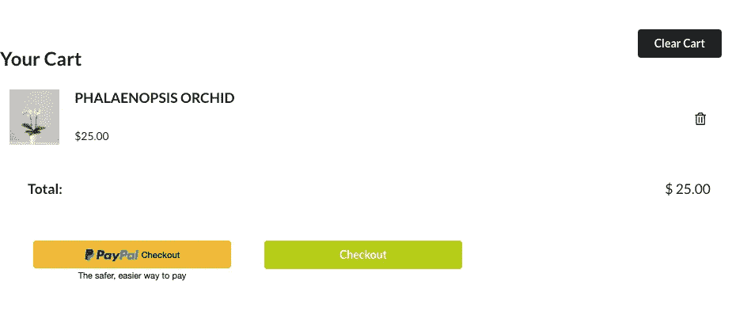

使用个人帐户凭证(**我们从 PayPal 收到的用于测试的凭证，而不是您的真实凭证)登录！**)

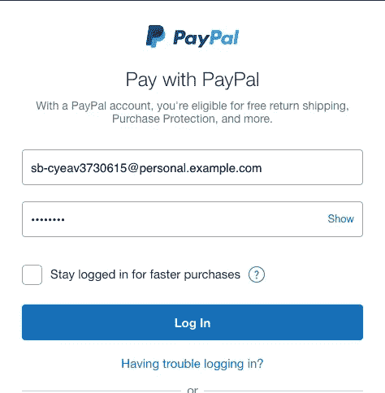

在这里，您可以看到测试用户的地址和我们在组件中设置的总数，让我们单击“支付”按钮。

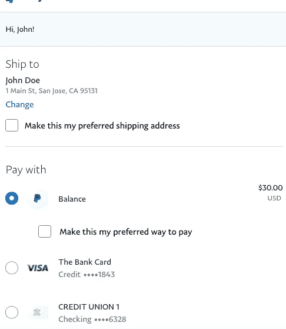

如果我们的交易成功，我们会在控制台中得到支付成功的响应。

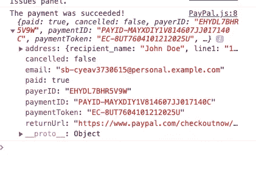

现在让我们进入 PayPal 沙盒 webiste ，用我们的商业邮箱和密码登录。

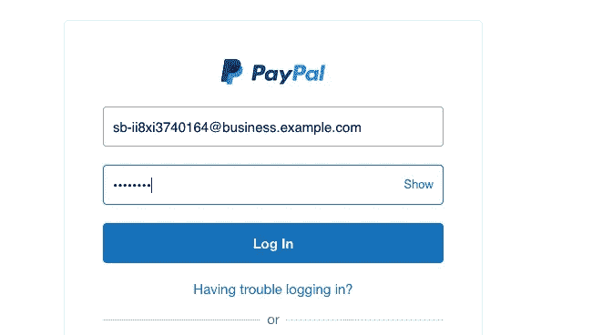

在仪表盘中，我们可以看到我们的最后一笔交易和中的*笔钱(因为 PayPal 从每笔交易中收取佣金，所以您在这里的金额低于应有金额)。*

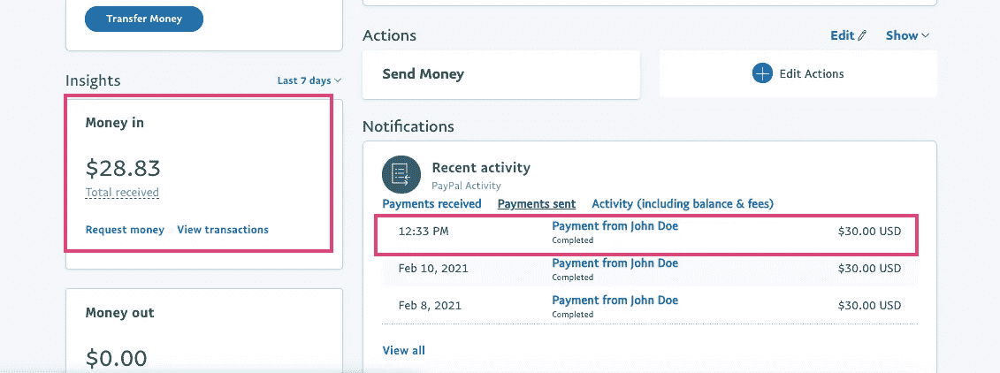

通过点击最后一笔交易，您可以看到关于该交易的更多信息，从这里您可以测试向客户退款，或者点击*发货*项目并添加跟踪号码，慢慢来，测试这里的所有选项，以确保一切正常。

## 结论

万岁！我们将 PayPal 结账选项整合到我们的项目中，并完成了我们的第一笔交易。我希望这个指南对你有帮助。感谢阅读！

*阅读更多尽在*[***plain English . io***](https://plainenglish.io/)