# 在 React 中集成地图服务

> 原文：<https://javascript.plainenglish.io/integrating-map-services-in-react-c7196dfc7e09?source=collection_archive---------12----------------------->

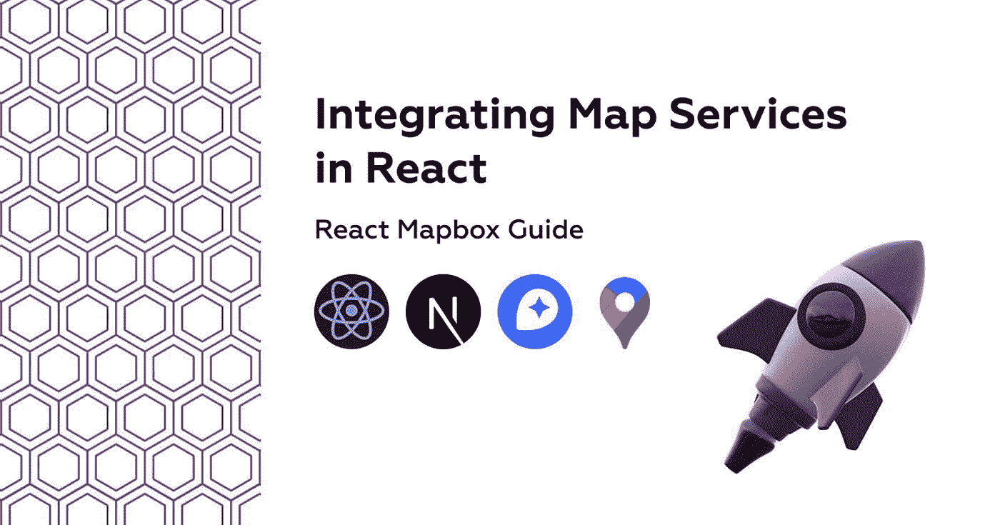

# React 地图框指南

多年来，开发行业一直在争论谁是最好的地图提供商，让我们看看谁会赢得地图提供商的游戏。

由于其可靠性，谷歌地图 SDK 在很长一段时间内一直是王者，但随着价格点远远高于竞争对手，并且没有像 Mapbox 或免费传单那样的可定制性，这种情况开始发生变化。

当您决定使用地图服务时，您必须考虑多个因素:

*   价格点(美元/地图加载或 API 请求)
*   可靠性(服务的准确性和稳健性)
*   可定制性(可用的个性化级别、调色板或标记)
*   开发者体验(在应用程序中集成和开发有多容易)
*   其他服务，如搜索(也称为地理编码)、导航等

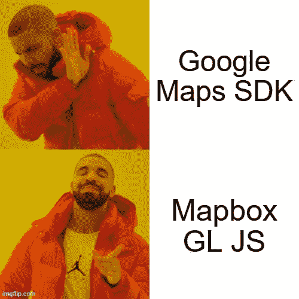

# 1.为什么选择[地图框](https://www.mapbox.com/)？

今年早些时候，我开发了一个全栈应用程序，使用 Mapbox 和 React 来提高自行车盗窃意识，我喜欢它的易用性和定制性。在 bike-theft-map.bikmo.com 的[检查一下。](https://bike-theft-map.bikmo.com/)

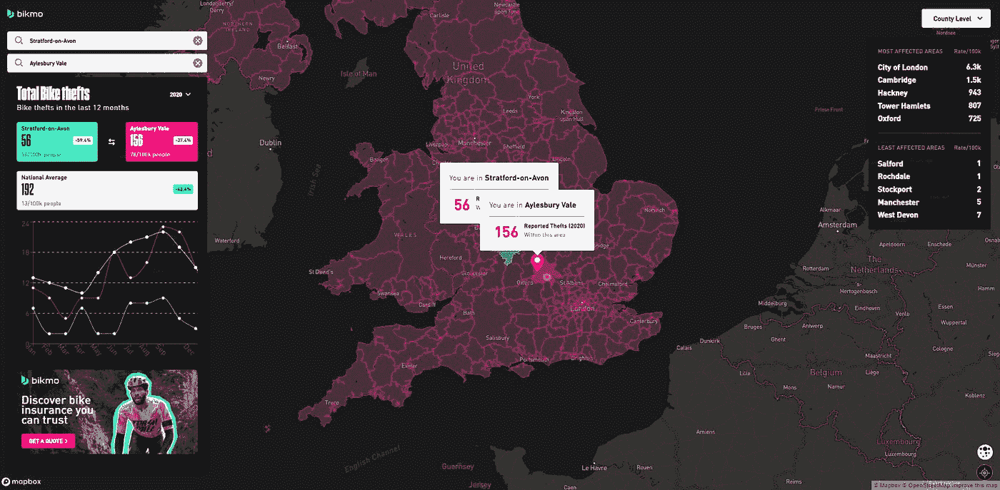

在大量使用谷歌地图的应用中，你可以通过利用 Mapbox 的众多可定制功能，轻松脱颖而出。

使用 Mapbox Studio，你可以创建你梦想中的黑暗模式地图，甚至可以将某个品牌的调色板整合到树的叶子颜色中。

更重要的是，免费计划允许高达 100k/月的地图加载，这对于开发甚至小型应用程序来说都是非常好的。

# 2.我们在建造什么？

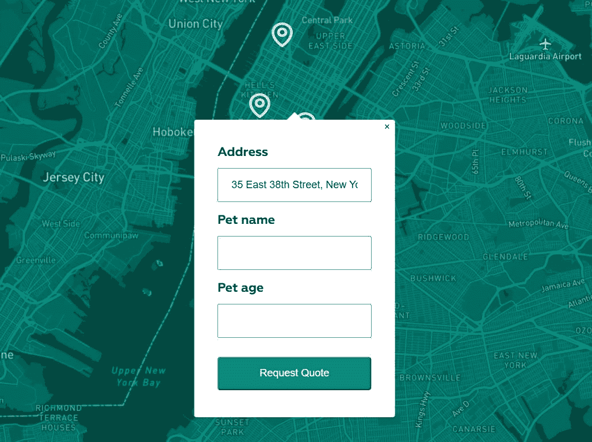

我们将为在纽约有多个诊所的宠物兽医制作一个 [NextJS](https://nextjs.org/) 应用程序，使用它人们可以查看地图上每个位置的标记，并通过点击它可以在带它去那里之前完成关于他们宠物详细信息的表格。

# 3.创建自定义地图样式

创建帐户后，我们可以访问 [Mapbox Studio](https://studio.mapbox.com/) 并按下新样式按钮创建新样式。

选择一个基础风格，然后我们可以用我们的宠物诊所品牌颜色定制。

让我们选择单色风格，因为它需要最少的时间来定制。

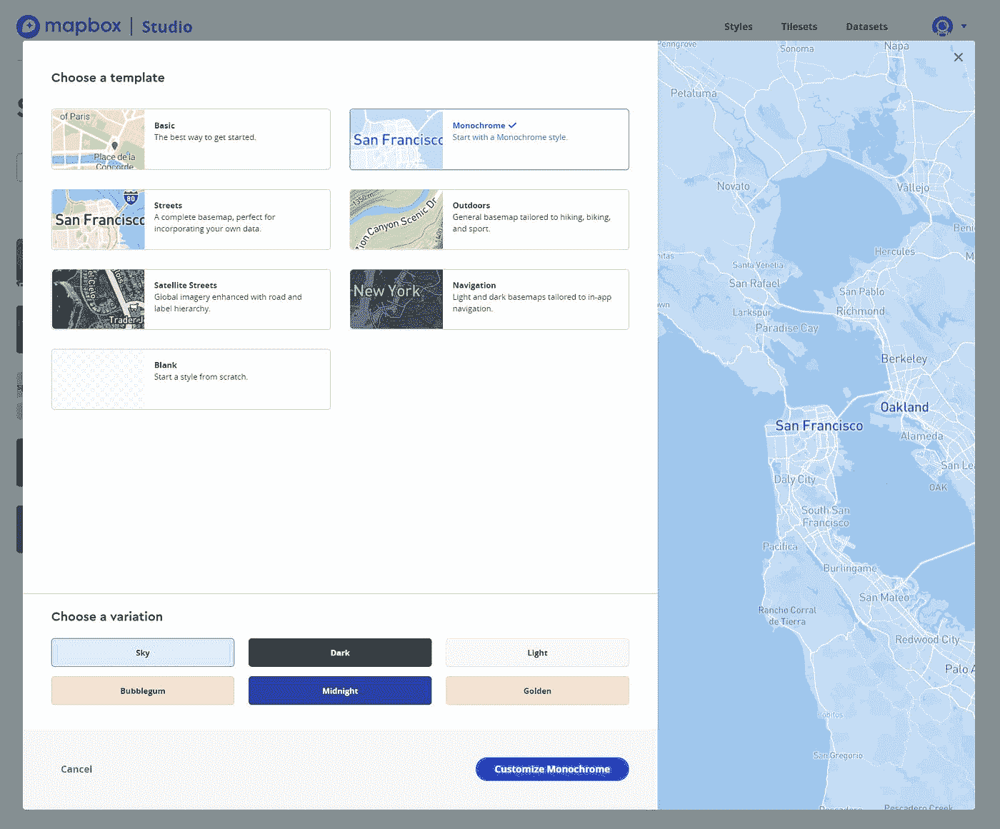

在左侧边栏菜单中的颜色下，我们可以自定义颜色(#00A896)。

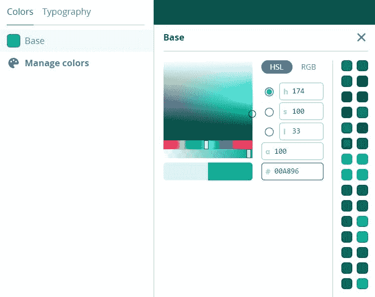

为了发布修改，我们必须点击右上角的发布按钮。现在我们所需要的是在我们的网站中使用的风格 url，我们可以在右上角找到它。

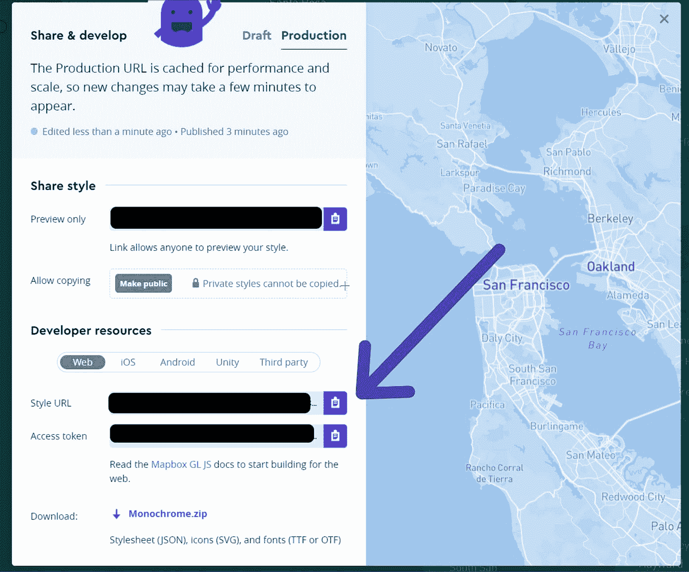

# 4.React 中的地图框

由于我们是在 NextJS 中构建这个应用程序，我们可以使用官方的 Vanilla JS [Mapbox GL JS](https://docs.mapbox.com/mapbox-gl-js/example/) 库或者伟大的 React 包装器 [react-map-gl](https://visgl.github.io/react-map-gl/) 。我将使用后者，因为它在我们的用例中效果很好。

让我们创建一个全新的 NextJS 项目并安装依赖项:

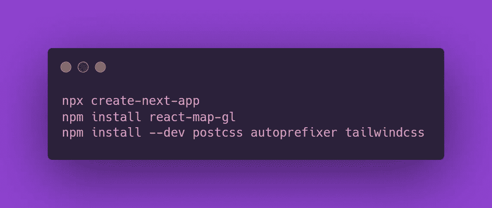

让我们首先从 react-map-gl 中扩展与地图相关的组件，并在 components/ folder 中创建一些自定义组件。

在 components/pin/index.js 中，我们在标记中添加了自定义的地图图钉图标(查看这个 [CodeSandbox](https://codesandbox.io/s/react-mapbox-example-t7xv0?file=/pages/index.js) ):

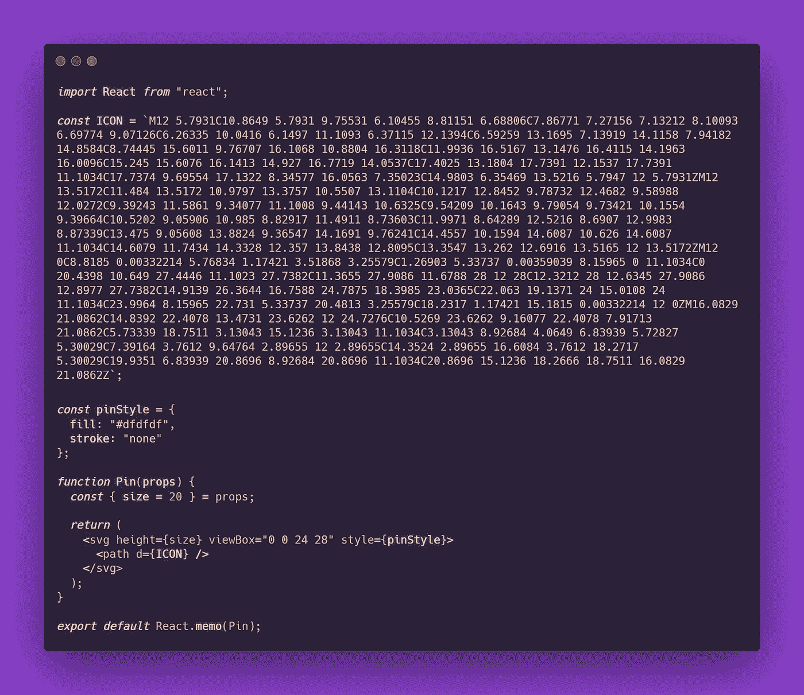

在 components/marker/index.js 中，我们扩展了标记组件:

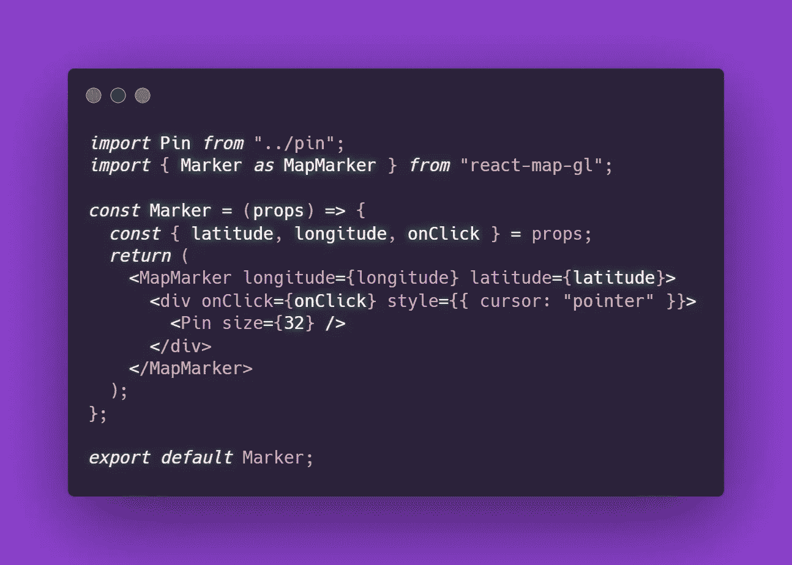

最后，在 components/popup/index.js 中为窗体 popup

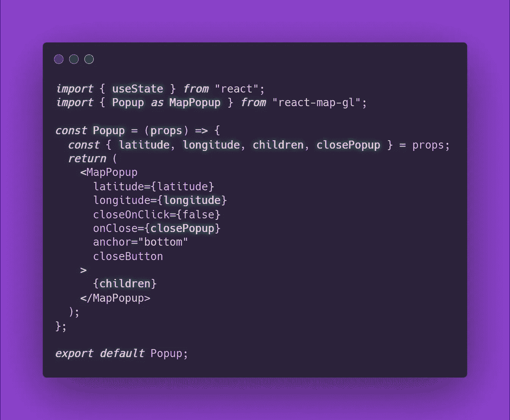

现在我们可以继续添加地图和显示标记和弹出窗口的业务逻辑。这将包括最少的样式和地图视口状态，因此它可以很容易地更新，以使用标记或表单提交的 API。

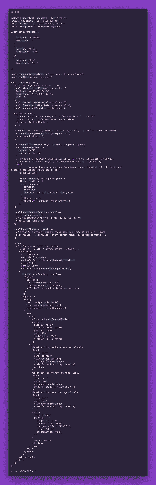

这就是我们使用 MapBox 开发基于地图的 React 应用程序所需的全部内容，使用这个令人惊叹的工具还可以做更多的事情，如热图、地图转换、GeoJSON 动画等。

如果你想检查这个演示项目(替换 index.js 中的 mapboxApiAccessToken & mapStyle)，这里是 [CodeSandbox](https://codesandbox.io/s/react-mapbox-example-t7xv0?file=/pages/index.js) 。

查看官方网站[示例](https://visgl.github.io/react-map-gl/examples)或查看这个基于地图框的伟大工具[来提高自行车盗窃意识](https://bike-theft-map.bikmo.com/)。

> 我希望你喜欢这个关于将地图服务与 Mapbox 和 NextJS 集成的简短教程🦄！
> 
> 在 [alexstreza.dev](http://alexstreza.dev/) 查看更多我的**作品**。

*更多内容请看*[*plain English . io*](http://plainenglish.io/)