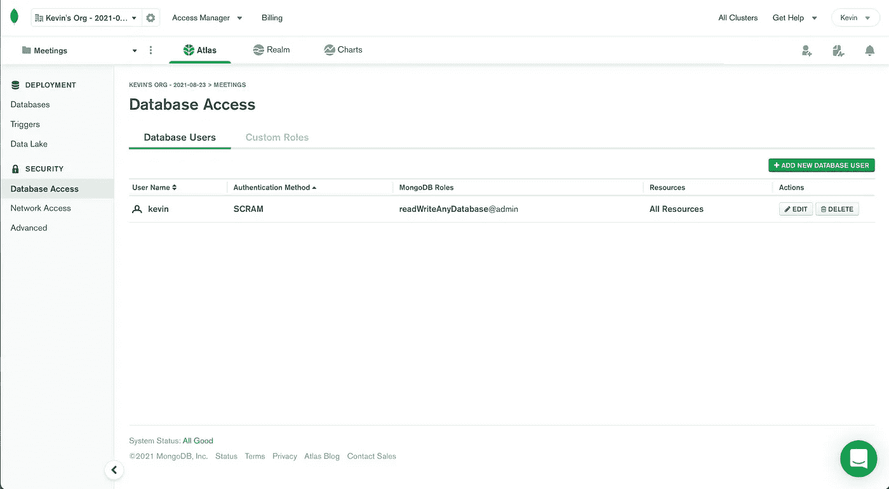
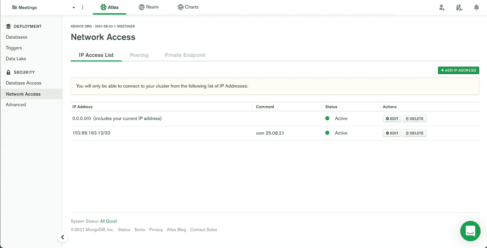

# 将 MongoDB 集成到 Next.js

> 原文：<https://javascript.plainenglish.io/integrating-mongodb-to-nextjs-f7038f90051a?source=collection_archive---------5----------------------->

## 了解如何使用 getStaticProps 轻松地将 MongoDB 这样的数据库集成到 Next.js 中！


我们将逐步介绍将 MongoDB 集成到 Next.js web 应用程序的过程。如果你正在做一个 fullstack 项目，迟早你可能会遇到需要将你的 web 应用程序连接到数据库的情况。在这篇博文中，我将使用 **MongoDB** 。这是一个非常简单的非 SQL 数据库，您可以很容易地免费使用它！

# 如何入门？

在我们深入实际代码之前，您首先需要设置一些关于 MongoDB 的东西。首先，在这里创建一个账户[。我们将使用 MongoDB 云图。](https://www.mongodb.com/de-de/cloud/atlas)

在完成你的注册和建立一个组织后，你主要需要做些事情。进入**数据库访问**，添加一个新用户。确保该用户具有读写权限！使用**密码**作为验证方法，并记下该密码，因为您稍后会用到它。



设置好您的用户后，进入**网络访问**并添加您当前的 IP 地址，以便能够与您的数据库建立连接。或者，您可以允许来自每个 IP 地址的访问。



# 如何设置我的代码？

因为这篇文章是关于数据获取的，所以 **getStaticProps** 函数是建立连接和获取数据的最佳地方。如果你不知道 getStaticProps 和 Next.js 提供的其他选项，请访问这个网站。

下面您可以找到从 MongoDB 连接和获取数据的完整代码。我们会一步一步来。

```
import { MongoClient } from "mongodb";

export async function getStaticProps() {

  const client = await MongoClient.connect(
    "mongodb+srv://<username>:<username>@cluster0.pqdlimongodb.net/
    <dbname>?retryWrites=true&w=majority"
  );

  const db = client.db();

  const yourCollection = db.collection("yourCollection");

  const yourData = await yourCollection.find().toArray();

  client.close();

  return {
    props: data
  };
}
```

第一步，您需要通过 **npm i mongodb** 安装所需的依赖项。完成后，使用以下命令导入 MongoClient:

```
import { MongoClient } from "mongodb";
```

如您所见，我将整个函数构造为异步的，这对于数据获取来说通常是个好主意。名为 **client** 的第一个常量建立了到数据库的实际连接。在**连接函数**的括号内，您需要用本博客第一步设置中的凭证替换<用户名>和<密码>。此外，您必须用自己选择的数据库名称替换< dbname >！

建立连接后，您可以将数据库的一个实例存储在名为 **db** 的变量中。

```
const yourCollection = db.collection("yourCollection");
```

由于 MongoDB 是一个所谓的非 SQL 数据库，我们在这里使用集合。上面的代码片段显示了如何在 const **yourCollection** 中存储这样一个集合。在这个集合还不存在的情况下，会由 MongoDB 自动生成。那很好，不是吗？！？

下一步，将集合中的实际数据存储在一个名为 **yourData** 的常量中。在这里，我们存储集合中的所有条目。或者，您可以使用以下代码:

```
const yourData = await yourCollection.find({}, {}).toArray();
```

在第一对花括号中，您可以添加过滤器，这些过滤器将应用于您的集合数据。第二对花括号告诉你的代码，过滤器应该应用于集合中的哪些数据字段。

```
const yourData = await yourCollection.findOne({id: 3,});
```

如果您只是在您的集合中寻找一个特定的数据点，您也可以使用上面的代码片段。在这个特定的例子中，我们寻找 id 为 3 的数据条目。

在最后一步中，您可能希望使用以下代码切断与数据库的连接:

```
client.close();
```

# 结论

所以这仍然是集成 Next.js 和 MongoDB 的一个简单用例。它可以变得有点复杂，例如，当它涉及到获取动态网站的数据。这将在另一篇博客文章中介绍！

哇，真有趣！我一定会继续写关于 React 和 Next.js 主题的博客！如果你喜欢这篇文章，请随时关注我。

我希望这篇博文对你有所帮助。无论如何，谢谢你读这篇文章，祝你有美好的一天！