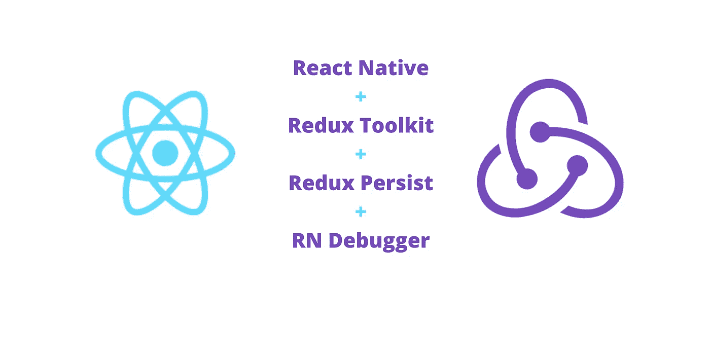
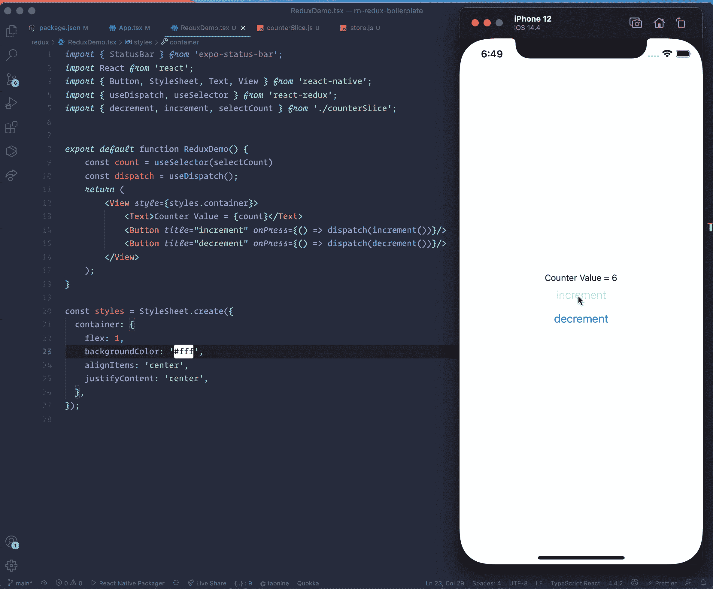
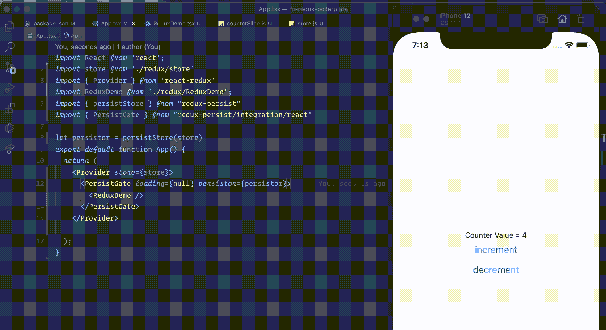
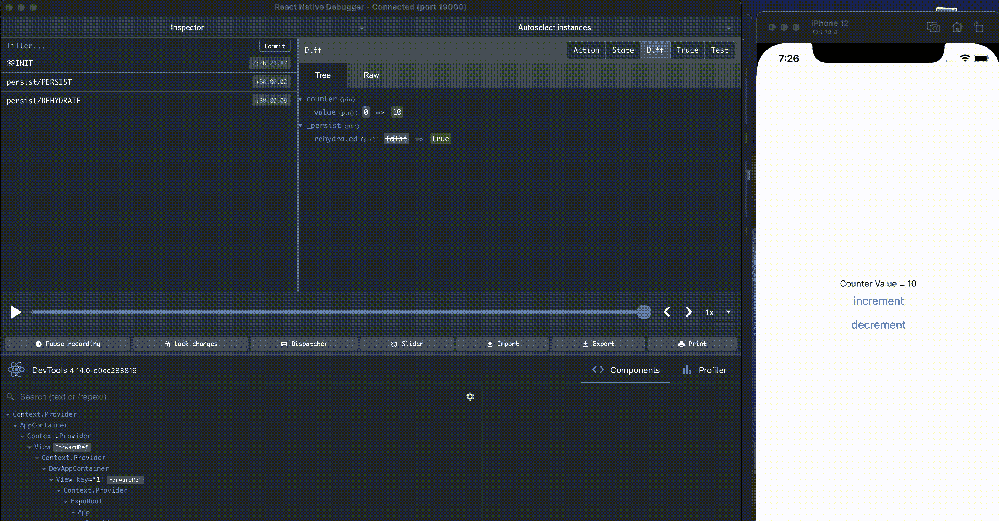

# 将 Redux Toolkit、Redux persist 和 React-Native 调试器与 React 本机应用程序集成在一起

> 原文：<https://javascript.plainenglish.io/integrating-redux-toolkit-redux-persist-and-react-native-debugger-to-a-react-native-app-f41e63476016?source=collection_archive---------3----------------------->



# 背景:

当您作为一名新的开发人员来到全局状态管理时，最常见的事情之一就是“Redux 太复杂了”、“它有太多的样板文件”等等。在你下结论之前，我请求你检查一下新的 Redux 文档和 Redux Toolkit (RTK)。

对我个人来说，我喜欢使用 redux 作为我的全局状态管理解决方案。因为以下原因:

1.  我已经明白 Redux 的概念了。
2.  Redux 在业界久经考验。
3.  它在就业市场上有很高的技能需求。
4.  RTK 解决了我们以前使用 Redux 时面临的所有痛点。

作为一名 react 原生开发人员，我最近玩了 Redux Toolkit、react 原生调试器和 Redux persist，以便在我的 React 原生应用程序中保持全局状态。这篇博文试图记录我所学到的东西。

# 创建我们的注册护士应用程序

我们将创建一个 React 本地应用程序的最小示例来演示 redux 集成。让我们通过运行它来创建应用程序

```
expo init rn-redux-boilerplate
```

一旦完成，我们将安装 redux 相关的包

```
yarn add redux @reduxjs/toolkit react-redux redux-persist
```

# 我们的应用程序是做什么的？

出于文档目的，该应用程序非常简单，这里的想法是将 redux 与 we react 原生应用程序集成，在本文的下一部分，我们将使用一个实际的示例。现在，我们只想创建一个计数器功能，我们可以增加和减少计数。

# 初始化我们的 Redux

现在让我们为您的演示目的创建 redux 功能。如果您以前使用过 redux，您可能记得我们曾经创建多个文件来管理一个状态。例如，我们可能已经创建了**反还原**、**反作用**、**反作用类型**来处理我们的计数器状态

感谢 redux 工具包，现在一切都非常整洁干净。我们可以将所有与 count 相关的 redux 逻辑放在一个文件中，我将其命名为 **counterSlice.js.** 我们可以将所有内容放在一个文件中，如下所示

```
import { createSlice } from '@reduxjs/toolkit'

export const counterSlice = createSlice({
  name: 'counter',
  initialState: {
    value: 0
  },
  reducers: {
    increment: state => {
      // Redux Toolkit allows us to write "mutating" logic in reducers. It
      // doesn't actually mutate the state because it uses the immer library,
      // which detects changes to a "draft state" and produces a brand new
      // immutable state based off those changes
      state.value += 1
    },
    decrement: state => {
      state.value -= 1
    },
    incrementByAmount: (state, action) => {
      state.value += action.payload
    }
  }
})

export const { increment, decrement, incrementByAmount } = counterSlice.actions
export const selectCount = state => state.counter.value

export default counterSlice.reducer
```

因为这篇文章的目的不是解释 redux 概念，所以我将继续讨论与 React native 的集成部分。

# 创建商店

设置好我们的反切片后，我们现在可以创建我们的商店并链接到我们的 RN 应用程序。让我们在 redux 文件夹中创建一个名为 store.js 的文件，并用 counterSlice 中的 counterReducer 创建存储。

```
import { configureStore } from '@reduxjs/toolkit'
import counterReducer from './counterSlice'

export default configureStore({
  reducer: {counter : counterReducer},
})
```

我们的商店现在设置好了，我们可以用这个商店包装我们的应用程序，redux 中的所有状态都可以用于我们的应用程序。

# 提供商店

在我们的根组件中，我们现在需要用商店包装应用程序。

```
import store from './redux/store'
import { Provider } from 'react-redux'

export default function App() {
  return (
    <Provider store={store}>
      <ReduxDemo />
    </Provider>

  );
}
```

太好了，这样我们的应用程序就可以连接 Redux Store 了。

# 在我们的组件中调用动作并从 redux 获取值。

在我们的组件中，我们现在可以使用选择器获得计数器值，使用 dispatch 获得递增/递减值。

```
export default function ReduxDemo() {
    const count = useSelector(selectCount) // getting the counter value
    const dispatch = useDispatch(); // will use dispatch to call actions
    return (
        <View style={styles.container}>
            <Text>Counter Value = {count}</Text>
            <Button title="increment" onPress={() => dispatch(increment())}/>
            <Button title="decrement" onPress={() => dispatch(decrement())}/>
        </View>
    );
}
```



# Redux 持续

如果我们想保持我们的状态，这样如果用户关闭应用程序并返回，他们仍然会看到以前的值，我们可以使用 redux persist。Redux persist 会将状态保存在我们的本地 AsyncStorage 中。我们现在就开始吧。我们需要对 store.js 文件做一些修改。

```
const persistConfig = {
	key: "root",
	version: 1,
	storage: AsyncStorage,
}const rootReducer = combineReducers({
	counter: counterReducer,
})const persistedReducer = persistReducer(persistConfig, rootReducer)export default configureStore({
  reducer: persistedReducer
})
```

然后，我们还需要添加我们的 App.tsx 文件。

```
import { persistStore } from "redux-persist"
import { PersistGate } from "redux-persist/integration/react"let persistor = persistStore(store)
export default function App() {
  return (
    <Provider store={store}>
      <PersistGate loading={null} persistor={persistor}>
        <ReduxDemo />
      </PersistGate>
    </Provider>

  );
}
```

如果我们关闭应用程序并再次回到我们的应用程序，我们将看到我们的计数器值设置为关闭应用程序之前的值。这意味着我们持续的全球状态正在起作用。



# 反应本机调试器

Redux 的主要优势之一是它有一个非常强大的开发工具。您可以看到您的状态变化，实时调度操作。你可以在你的行动之间进行时间旅行，并得到你的全局状态的整体快照。在你开发的时候超级有用。对于 react native，您需要从这个开源 repo 下载这个调试器

[GitHub—jhen 0409/React-Native-debugger:基于 React Native 官方调试器的独立应用，包含 React Inspector/Redux dev tools](https://github.com/jhen0409/react-native-debugger)

一旦安装完毕，保持打开状态，从 RN 菜单进入调试器选项。你会看到它会自动开始显示所有的日志。确保您的 Chrome 浏览器调试器已关闭，并且您在正确的端口上。下面是调试器的简短预览:



这篇文章的目的是记录 Redux Toolkit、Redux persist 和 RN 调试器的集成。所以我没有解释任何 redux 的概念，希望在以后的博客文章中，我会给出一个实际的例子来解释 Redux。

*更多内容尽在*[***plain English . io***](http://plainenglish.io/)