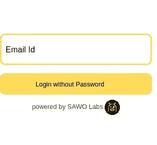

# 集成 SAWO 实验室认证+创建 React 应用程序

> 原文：<https://javascript.plainenglish.io/integrating-sawo-labs-authentication-create-react-app-4601360fd5d0?source=collection_archive---------13----------------------->


你好。我正在使用 SAWO Labs 构建一个简单的身份验证应用程序。在这个过程中，我发现有必要了解比官方文档所提供的更多的内容。

下面是一个简短的演练，帮助您将 SAWO Labs 身份验证与 React 应用程序集成。

现场代码的视频版本将会出现在我的 Youtube 上

# 在我们的小应用中:

*   我们将有一个登录页面。
*   我们将有一个仪表板页面。
*   只有经过身份验证的用户才能进入仪表板页面。
*   我们将使用 VSCode，NPM 作为我们的包管理器。

# 我们开始吧

*   你需要一个 SAWO Labs 账户来使用这个很棒的东西。前往[sawolabs.com](https://sawolabs.com)创建你的第一个项目，如果你选择本地开发，将主机设置为`localhost`。否则，您可以将 Host 设置为您的应用程序 URL。
*   您可以使用 CodeSandbox React 模板，或者如果您在本地执行，请使用以下命令:`npx create-react-app client`。
*   10 分钟后…
*   我们需要在我们的`node_modules`中有 SAWO labs 包。所以到终端，确保你已经输入了`cd client`并运行下面的命令来安装 SAWO 包:`npm i sawo`。
*   一旦软件包安装完毕，您将前往`src/app.js`。
*   通过删除不必要的代码来清理文件，src/app.js 的最终外观应该如下所示:

```
/* src/app.js */import React from "react";
import "./App.css";
function App() {
  return (
    <div id="App"> </div>
  );
}export default App;
```

*   让我们导入 SAWO 包。

```
import React from "react";
import "./App.css";
import Sawo from "sawo";
```

*   在`.env.local`文件中保存您的 API 密匙，并确保您已经在`.gitignore`中添加了它。`.env.local`文件应该是这样的:

```
REACT_APP_API_SAWO=11example1-821fexampled23-19830-318example2312
```

*   让我们前往`src/app.js`。基于此处文件[中的第 5 点。我们的文件最终应该是这样的。](https://docs.sawolabs.com/sawo/frameworks/react)

```
/* src/app.js */import React from "react";
import logo from "./logo.svg";
import "./App.css";
import Sawo from "sawo";
function App() {
   return (
         <div
          id="sawo-container"
          style={{ height: "300px", width: "300px" }}
        ></div>
  );
}export default App;
```

*   恭喜你，但是如果你在浏览器上查看你的申请，我们会得到一个空白，什么都没有。现在是时候调用 SDK 了！:)

## 关键点

当 id 为`sawo-container`的`div`被渲染时，我们需要调用 SDK。所以我们将使用`React.useEffect()`钩子来满足文件`src/app.js`中的这个条件。

```
/* src/app.js */import React from "react";
import logo from "./logo.svg";
import "./App.css";
import Sawo from "sawo";
function App() { /*
This makes sure when the component is rendered, 
it is called only once.
*/
React.useEffect(() => { }, []); 
 return (
         <div
          id="sawo-container"
          style={{ height: "300px", width: "300px" }}
        ></div>
  );
}export default App;
```

*   是时候为 SAWO 认证写配置了，正如在他们的文档[这里](https://docs.sawolabs.com/sawo/frameworks/react)的第 6 点中所讨论的。我们将把它放在`useEffect`钩子里面。为什么？因为我们希望在组件安装到屏幕上之后执行这个操作。
*   准备好配置后，我们将使用`config`创建一个新的 SAWO 实例，并执行`showForm`方法。最后，`useEffect`看起来是这样的:

```
React.useEffect(() => {
  var config = {
      containerID: "sawo-container",
      identifierType: "email",
      apiKey: process.env.REACT_APP_API_SAWO,
      onSuccess: (payload) => {
        console.log(payload); 
      },
    };
    let sawo = new Sawo(config);
    sawo.showForm();
 }, []);
```

*   让我们来看看浏览器上的应用程序。现在，您应该注意到 SAWO 身份验证要求您提供电子邮件 id。:)



# 仪表板连接。

*   我们将创建一个文件`src/Dashboard.js`，看起来像这样。

```
import React from "react";const Dashboard = (props) => { return (
    <>
       <h2>Private Dashboard</h2>
        Email: {props.payload.identifier}
    </>
  );
};export default Dashboard;
```

转至`src/app.js`，我们将执行以下操作:

*   我们需要在应用程序中导入我们的仪表板组件。
*   我们需要创建一个状态，在用户通过身份验证后存储有效负载。

让我们开始吧。

```
/* src/app.js */import React from "react";
import logo from "./logo.svg";
import "./App.css";/* This imports Dashboard Component*/
import Dashboard from './dashboard'import Sawo from "sawo";
function App() {/* We are creating a state, using the useState hook. */let [payload, setPayload] = React.useState(false);/*
This makes sure when the component is rendered, 
it is called only once.
*/
React.useEffect(() => {
  var config = {
      containerID: "sawo-container",
      identifierType: "email",
      apiKey: process.env.REACT_APP_API_SAWO,
      onSuccess: (payload) => {
        // console.log(payload); 
        setPayload(payload)
      },
    };
    let sawo = new Sawo(config);
    sawo.showForm();
 }, []); 
 return (<>
         <div
          id="sawo-container"
          style={{ height: "300px", width: "300px" }}
        ></div>
        {payload && (
        <>
          <Dashboard payload={payload} />
        </>
        )}
</>
  );
}export default App;
```

仅此而已。希望你喜欢阅读这篇文章。
你可以通过 [Twitter](https://twitter.com/imabptweets) 联系我

*更多内容请看*[***plain English . io***](http://plainenglish.io/)