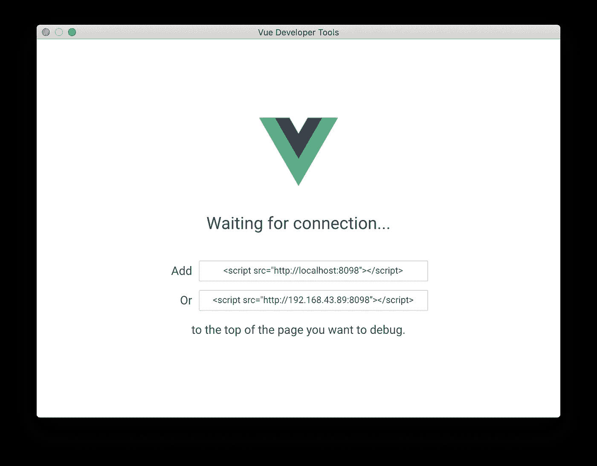

# 如何将 Vue Devtools 集成到电子应用程序中

> 原文：<https://javascript.plainenglish.io/integrating-vue-devtools-into-an-electron-application-cb26d70729cf?source=collection_archive---------18----------------------->


# 将 Vue Devtools 集成到电子应用中

> 将 Vue.js devtools 引入到我们的电子应用程序中来帮助调试。这篇文章假设你已经关注了我之前的[文章](https://codybontecou.com/global-state-management-in-an-electron-app.html)。

## 装置

Vue Devtools 提供了他们的 Devtools 的非浏览器专用版本，他们称之为[独立版](https://devtools.vuejs.org/guide/installation.html#standalone)。

您可以全局安装软件包:

```
npm install -g @vue/devtools@beta
# Or with yarn
yarn global add @vue/devtools@beta
```

或者在项目中作为依赖项:

```
npm install --save-dev @vue/devtools@beta
# Or with yarn
yarn add -D @vue/devtools@beta
```

*因为我们的应用程序使用 Vue 3，所以我们必须根据* [*这个*](https://github.com/vuejs/devtools/issues/1199) *问题*使用 dev 工具的版本 6 beta

## 全局使用 Vue.js 开发工具

一旦全局安装，您现在可以在命令行上运行命令`vue-devtools`。

这将在它自己的窗口中产生一个 devtools 实例。



现在，将以下内容添加到应用程序 HTML 文件的`<head>`部分:

```
<script src="http://localhost:8098"></script>
```

如果您想远程调试应用程序，请使用下面的代码片段:

```
<script>
  window.__VUE_DEVTOOLS_HOST__ = '<your-local-ip>' // default: localhost
  window.__VUE_DEVTOOLS_PORT__ = '<devtools-port>' // default: 8098
</script>
<script src="http://<your-local-ip>:8098"></script>
```

**在部署到生产环境之前，不要忘记删除这段代码！**

一旦你的应用程序在 HTML 中有了合适的脚本标签，运行它*而不需要*终止运行`vue-devtools`的终端。

在我们的例子中，

```
npm run dev
```

## 将 Vue Devtools 作为依赖项运行

在您的项目目录中，运行以下命令应该会生成 devtools:

```
./node_modules/.bin/vue-devtools
```

为了方便和易用，我将`./node_modules/.bin/vue-devtools`命令移到了我的`package.json`脚本中:

```
"devtools": "./node_modules/.bin/vue-devtools"
```

当使用 devtools 作为本地依赖项时，我们在`<head>`中不需要 script 标签。

如果您之前添加了此代码片段，请将其删除:

```
<script src="http://localhost:8098"></script>
```

你现在应该都准备好了。如果你需要额外的帮助，查看他们的[文档](https://devtools.vuejs.org/)或者他们的 GitHub repo [文档](https://github.com/vuejs/devtools/tree/legacy/packages/shell-electron#vue-remote-devtools)。

希望你喜欢它！

*更多内容看* [***说白了. io***](http://plainenglish.io/) ***。*** *报名参加我们的* [***免费每周简讯点击这里***](http://newsletter.plainenglish.io/) ***。***