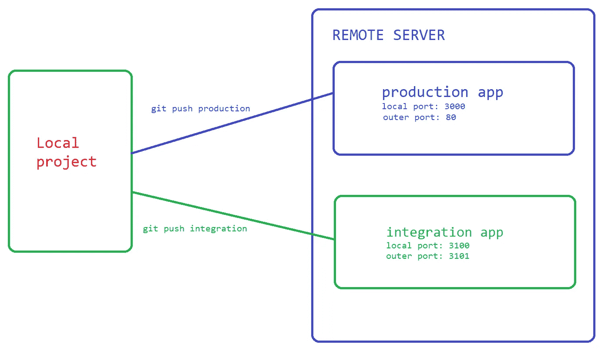
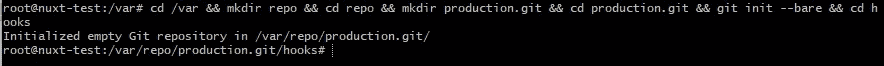
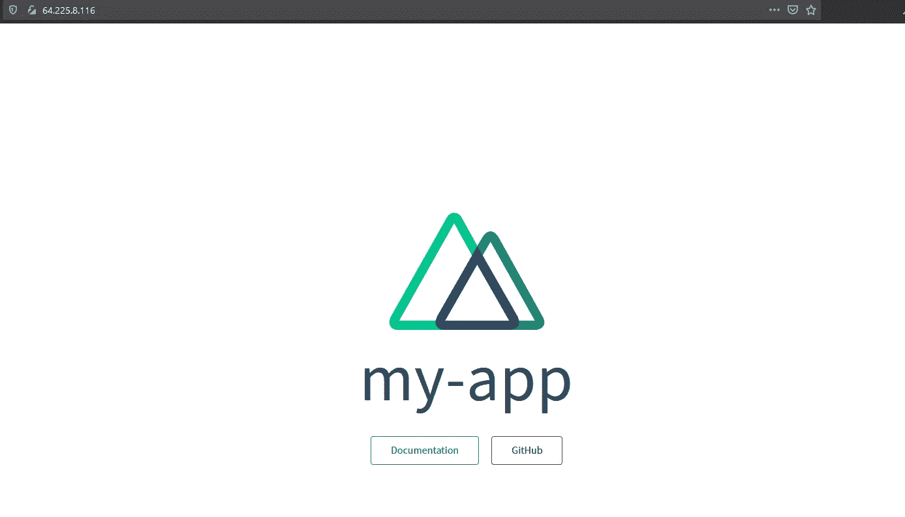
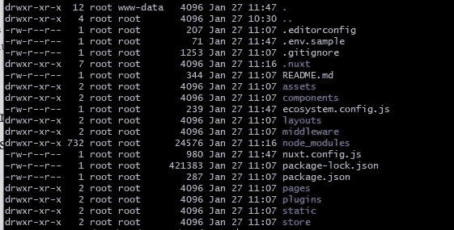
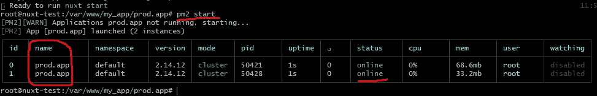
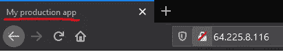
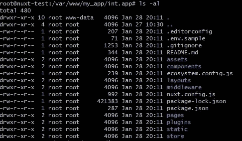
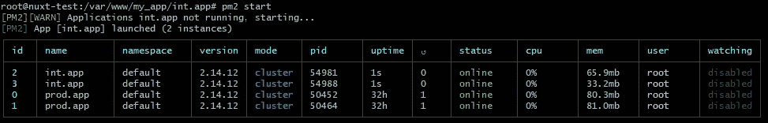
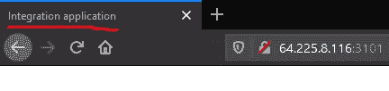

# 处理 Nuxt.js 应用的集成和生产部署

> 原文：<https://javascript.plainenglish.io/integration-and-production-deployment-for-nuxt-js-applications-amazing-scalable-and-configurable-7ea64bea77cc?source=collection_archive---------7----------------------->


Let’s build together — [https://unsplash.com/](https://unsplash.com/)

> 本文主要关注 Nuxt SSR 应用程序的部署。但是这项技术可以在部署过程中用于任何类型的应用程序。

首先在现实世界的部署过程中，我们需要测试是否一切都按预期运行。这就是为什么我们需要一种更加**健壮**和**可扩展**的方式来部署、测试，然后将一切发送到生产现场。

首先，如果你没有阅读前一篇文章，我强烈推荐[在这里阅读](https://medium.com/js-dojo/how-to-deploy-nuxt-application-to-server-production-mode-on-db67633421fd?sk=32e2893ad759748e88cdaf7ecbf0b250)，因为我将在接下来的步骤中使用相同的应用程序。好了，让我们开始部署我们的应用程序吧。最终，我们的流程将会如下图所示:



Application deployment cycle

最初，我们需要在服务器上创建**集成**和**生产**文件夹。所以我打开一个终端，连接到我的服务器*(换成你的 IP 或者连接你现有的服务。这里我用* [*数字海洋*](https://m.do.co/c/460c21eea24d) *)* :

```
ssh root@**64.225.8.116** //**your Droplet IP address here.**
```

然后，我们需要更改当前目录，并为我们的应用程序创建文件夹。 ***如果你想要一个单行的解决方案，立即应用第 6 步:)***

```
1\. cd /var/www
2\. mkdir my_app
3\. cd my_app
4\. mkdir prod.app //for production only
5\. mkdir int.app //testing new features before production
6\. cd /var/www && mkdir my_app && cd /var/www/my_app && mkdir prod.app && mkdir int.app
```

我们的两个文件夹已经可以部署了。然后我们需要在我们的应用程序*中**初始化 git** (如果你从未使用过 git，请在你的系统中安装它，并学习如何使用它。* [*这里是所有系统下载的链接*](https://git-scm.com/book/en/v2/Getting-Started-Installing-Git) *)* 。我们不会每次都做推拉循环。稍后我会向**展示一个简单有效的**方法。但是现在要确保 git 已经在应用程序源代码中初始化了。您可以在您的**项目根目录**中运行这个命令来测试它:

```
1\. cd ~/Desktop/my-app //your app root
2\. git branch 
```

如果你看到**不是 git 库错误**在项目根文件夹中运行这个命令**否则继续下一步:**

```
git init //initialize 
git add . //add everything into git
git commit -m "first commit" //just commit initial data
```

> 我们不需要向 Github 推送任何东西。但是如果有兴趣我会分享源代码。[你可以从这里进入。](https://github.com/Abdulla1995/my-simple-app)

现在我们准备在服务器上配置 git，并把它推到我们的集成和生产文件夹中。使用终端登录服务器，首先执行以下步骤**进行生产发布***(如果 git* 由于某种原因在您的服务器中不存在*，请首先安装它，然后执行以下步骤*:

```
1\. cd /var && mkdir repo && cd repo && mkdir production.git && cd production.git && git init --bare && cd hooks
```



command success info

我们已经创建了一个空的 git 库来接受本地推送。然后，我们将使用 **git 挂钩**来正确执行工作流:

```
2\. nano post-receive
3\. Add the following into opened file
git --work-tree=**/var/www/my_app/prod.app** --git-dir=**/var/repo/production.git** checkout -f
4\. Ctrl + X and type 'Y' then hit Enter to save the file
```

我们使用 **git post-receive hook** 来立即接受推送的文件，并将它们直接复制到生产应用程序方向。*(git—work-tree =/var****/www/my _ app/prod . app****)。*最后，我们需要给 git 文件权限，以便顺利完成操作:

```
5\. chmod +x post-receive
6\. chown -R :www-data /var/www/my_app/prod.app //give permission to accepting folder also.
```

现在，我们的服务器已经准备好接受生产服务器上推送的文件。接下来，在您的本地计算机中打开项目根目录，并键入以下命令来创建远程生产源( ***将 IP 更改为您的)*** ):

```
1\. git remote add production ssh://root@**64.225.8.116**/var/repo/production.git
2\. git push production //pushes to the server
```

如果一切正常，您将在服务器上的 **prod.app** 目录中看到生产文件。运行 prod.app 目录中的下一个命令以确保:)

```
ls -l // listing all files 
```

我们的文件在那里，我们准备在服务器上运行生产应用程序。*如果您来自上一篇文章，并且已经在后台运行 app，请将其从*[*PM2*](https://www.npmjs.com/package/pm2)*中删除，因为我们将使用最新的:*

```
pm2 list // to see if the application running 
pm2 delete npm //npm is the name we gave it
```

好了，让我们安装 npm 包并构建应用程序，看看是否一切正常。在 prod.app 根文件夹中运行以下命令:

```
npm install && npm run build && npm run start //install, build, run
```

安装后，您可以通过在任何浏览器上输入您的 IP 地址来确认应用程序是否正常工作(*如果您没有进行 Nginx 配置，应用程序将无法工作。请阅读* [*上一篇*](https://medium.com/js-dojo/how-to-deploy-nuxt-application-to-server-production-mode-on-db67633421fd?source=friends_link&sk=32e2893ad759748e88cdaf7ecbf0b250) 并做配置)。



现在，让我们关闭应用程序并继续分离**集成**和**生产**构建。首先，我们需要添加“.env”文件放在我们的应用程序根文件夹中。因为。环境文件被忽略。g itignore“我们也创建“. env.sample”并将其添加到 git 中，并且不在其中添加机密信息。在您喜欢的代码编辑器中打开项目并创建这些文件 ***(.env.sample 文件)*** *:*

```
APP_NAME="App name here"
PORT=3000
HOST="localhost"
BASE_URL="http://"
```

然后将这个文件复制粘贴到根目录下。env 或创建一个新的并给它一个名字”。env”。我们在端口 **3000** 上使用生产，稍后在 **3100** 上集成:

```
**APP_NAME="My-app"**
PORT=**3000**
HOST="localhost"
**BASE_URL="http://localhost:3000"**
```

然后打开 nuxt.config.js 文件，将下面几行添加到配置对象的顶部:

```
server: {
  port: *process*.env.PORT, //take port from .env file automatically Thanks to NUXT
},//Also edit the title in head section to be sure .env is affecting on site title
head {
    title: ***process***.env.APP_NAME,
...
```

现在，如果您想确保可以通过更改端口号在本地运行应用程序。但是请记住，如果您在。环境文件。

接下来，我们将添加**生态系统. config.js.sample** 文件，使用更加灵活的 [pm2](https://www.npmjs.com/package/pm2) 功能在后台运行我们的应用程序。创建文件并添加以下行:

```
module.exports = {
    apps: [
        {
            name: '**app_running_name**',
            exec_mode: 'cluster',
            **instances: '2'**, // Or "max" - for maximum available of     instances
            script: './node_modules/nuxt/bin/nuxt.js',
            args: 'start'
        }
    ]
}
```

您可以在 pm2 和 Nuxt 站点上了解更多有关设置的信息。我们将运行 2 个实例，发布版本的名称将会更改。然后向 git 添加新文件，并将它们推送到我们的生产服务器。

```
1\. git add --all
2\. git commit -m "added .env and pm2 config file"
3\. git push production
```

每个提交的更改都在我们的服务器上:)让我们打开服务器终端，确保我们的文件在那里。在 prod.app 根文件夹中运行命令:

```
ls -al // to see hidden .env.sample added - a
```



如果看到新文件，最后一步是将. env.sample 复制为。环境和编辑一点。

```
1\. cp .env.sample .env
2\. nano .env
3\. Editing a little
APP_NAME=**"My production app"**
PORT=3000
HOST="localhost"
BASE_URL=**"http://localhost:3000"** 4\. Ctrl + X and Y and hit enter to save the edited file
5\. npm run build//Also need to copy ecosystem and set it 
1\. cp ecosystem.config.js.sample ecosystem.config.js
2\. nano ecosystem.config.js
3\. Change as below
module.exports = {
  apps: [
    {
      name: **'prod.app',**
      exec_mode: 'cluster',
      instances: '2', // Or "max" - for maximum available of instances
      script: './node_modules/nuxt/bin/nuxt.js',
      args: 'start'
    }
  ]
}
4\. Ctrl + X and Y and hit enter to save the edited file.
```

我们已经建立了应用程序，我们准备在后台运行应用程序。Pm2 将帮助我们*(该命令自动运行生态系统配置文件)。* **如果没有配置 Nginx 反向代理，app 不会运行。请阅读** [**上一篇**](https://medium.com/js-dojo/how-to-deploy-nuxt-application-to-server-production-mode-on-db67633421fd?sk=32e2893ad759748e88cdaf7ecbf0b250) **正确配置。**

```
pm2 start
```



Running cluster mode pm2 application

刷新浏览器，您将看到标题更改为我们在。环境应用程序名称部分:



Title edited

因此，我们的生产应用程序在两个实例上以**集群**模式完美运行。我们可以通过键入以下命令在新构建完成后重新加载应用程序:

```
pm2 reload prod.app //the reloaded app name must be correct.
```

现在，我们知道了如何直接部署到服务器并运行生产环境。让我们开始我们的分离目标，也就是集成，并部署它。我们将迅速增加一个整合分支机构。会有细微的差别，但一般来说，过程是相同的。所以我会加快步伐。配置服务器:

```
1\. cd /var/repo && mkdir integration.git && cd **integration**.git && git init --bare && cd hooks
2\. nano post-receive
3\. Insert below line into opened file. (added integration to the end)
git --work-tree=/var/www/my_app/**int.app** --git-dir=/var/repo/integration.git checkout -f **integration** 4\. Ctrl + X and type 'y' and hit Enter
5\. chmod +x post-receive
6\. chown -R :www-data /var/www/my_app/int.app //give permission to accepting folder also.
```

我们的服务器已经准备好接受集成推送。现在打开本地项目，并在终端中运行以下命令:

```
1\. git remote add integration ssh://root@**64.225.8.116**/var/repo/integration.git
2\. git branch integration && git checkout integration
3\. git push integration
```

现在转到服务器终端中的 **int.app** 目录，然后 ls 查看是否所有内容都在那里:

```
cd /var/www/my_app/int.app && ls -al
```



integration files

现在我们需要创造。env 并将端口更改为另一个数字，以用于测试目的。复制. env.sample 并将端口号更改为 **3100** *(如果端口空闲，可以是任何数字):*

```
1.cp .env.sample .env && nano .env
2\. Change as below
APP_NAME=**"Integration application"**
PORT=**3100**
HOST="localhost"
BASE_URL="http://localhost:3100"
3\. Ctrl + X and type 'y' and hit Enter to save edits.
4\. npm install
5\. npm run build
```

现在我们的应用程序已经构建好了，可以在端口号为 3100 的端口上运行了。让我们运行我们的应用程序。命令是相同的，将使用配置:

```
1\. cp ecosystem.config.js.sample ecosystem.config.js
2\. nano ecosystem.config.js
3\. Change as below
module.exports = {
  apps: [
    {
      name: **'int.app',**
      exec_mode: 'cluster',
      instances: '2', // Or "max" - for maximum available of instances
      script: './node_modules/nuxt/bin/nuxt.js',
      args: 'start'
    }
  ]
}
4\. Ctrl + X and Y and hit enter to save the edited file.
5\. pm2 start
```



showing both int and prod apps

最后，我们需要设置 **Nginx** 监听外部 **3101** 端口，并将其重定向到**3100**端口，我们的集成应用程序正在该端口上运行:

```
1\. cd /etc/nginx/sites-available/
2\. There will be my.app file which created in the previous article. We will copy and edit it a bit - or jump 3rd step
**cp my.app int.app**
3\. **nano int.app**  - then change it as below:
server {
    listen **3101**;
    server_name 64.225.8.116; #**droplet IP here** 
    location / {
        proxy_pass http://localhost:**3100**;
        proxy_http_version 1.1;
        proxy_set_header Upgrade $http_upgrade;
        proxy_set_header Connection 'upgrade';
        proxy_set_header Host $host;
        proxy_cache_bypass $http_upgrade;
    }
}
4\. Ctrl + X and Y and hit enter to save the edited file. 
5\. ln -s /etc/nginx/sites-available/int.app /etc/nginx/sites-enabled
6\. nginx -t  // if ok then restarting nginx server
7\. service nginx restart
```



**就这些！**我们的生产和集成应用程序是分开运行的。转到浏览器中的链接并检查它。我的是-[**http://64.225.8.116:3101/**](http://64.225.8.116:3101/)

如果您有任何**域**，您可以使用一个子域作为测试环境。那么 Nginx 配置将如下所示:

```
//integration
server {
    listen 80;
    server_name **int.yourdomain.com**; #subdomain here

    location / {
        **proxy_pass http://localhost:3100;**
        proxy_http_version 1.1;
        proxy_set_header Upgrade $http_upgrade;
        proxy_set_header Connection 'upgrade';
        proxy_set_header Host $host;
        proxy_cache_bypass $http_upgrade;
    }
}//production
server {
    listen 80;
    server_name **yourdomain.com**; #domain here

    location / {
        **proxy_pass http://localhost:3000;**
        proxy_http_version 1.1;
        proxy_set_header Upgrade $http_upgrade;
        proxy_set_header Connection 'upgrade';
        proxy_set_header Host $host;
        proxy_cache_bypass $http_upgrade;
    }
}
```

# **结论**

我已经谈到了我在测试和部署 Nuxt 应用程序到服务器时使用它的方式。这个版本部署最适合 Nuxt SSR 模式，它根据每个请求动态生成站点内容。稍后我还将写一篇文章来演示如何为 Nuxt 生成模式设置 configure 静态生成内容。将会有一些配置编辑，但过程基本相同。希望你在阅读的时候喜欢它。

好的编码日:)

**有用链接:**

1 .Pm2 文档—[https://pm2.keymetrics.io/docs/usage/pm2-doc-single-page/](https://pm2.keymetrics.io/docs/usage/pm2-doc-single-page/)

2.Nuxt 部署—[https://nuxtjs.org/docs/2.x/get-started/commands/](https://nuxtjs.org/docs/2.x/get-started/commands/)

3.本文准备项目—[https://github.com/Abdulla1995/my-simple-app](https://github.com/Abdulla1995/my-simple-app)

4.通过注册此链接获得 100 美元的数字海洋免费积分—[https://m.do.co/c/460c21eea24d](https://m.do.co/c/460c21eea24d)