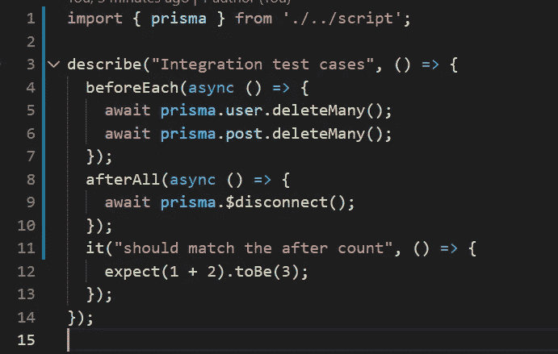

# 使用 PostgreSQL 和 GitHub 动作进行集成测试

> 原文：<https://javascript.plainenglish.io/integration-testing-with-postgresql-and-github-action-822c0c90ebef?source=collection_archive---------1----------------------->


Photo by [Joshua Sortino](https://unsplash.com/@sortino?utm_source=medium&utm_medium=referral) on [Unsplash](https://unsplash.com?utm_source=medium&utm_medium=referral)

嘿，你好。今天，我将谈论 Prisma 与集成测试。这种技术组合如今越来越受欢迎，为什么不深入研究一下呢？

**什么是集成测试？**

集成测试是某种可以同时测试几个部分的工作代码。与单元测试用例不同，它们在测试更大的代码时更有用，比如连接到 DB 或查询它

# 介绍

今天我们将探索很多东西。这是我们要看的所有项目的清单:

*   以打字打的文件
*   Prisma(你可以选择任何你喜欢的形式)
*   一种数据库系统
*   玩笑
*   GitHub 操作

他们中的大多数你已经知道了，但是对于不知道 Prisma 的新人们来说。它是 JavaScript 和 TypeScript 语言的下一代 ORM 提供者。我会强烈推荐你访问官方网页[这里](https://www.prisma.io/)阅读更多。

# 开始

在我们开始之前，请确保您检查了我推送所有代码的这个回购。这将对您有所帮助，起始物料在回购的[初始](https://github.com/Piyush-Use-Personal/prisma-integration-testing/tree/initial)分支上

要运行上述存储库，您需要执行几个步骤

*   创建一个. env 文件，并将 DATABASE_URL 变量放在 Postgres 数据库中
*   做`yarn`
*   使用迁移命令`npm prisma migrate dev`升级您的迁移。它将运行所有迁移，目前只有一个迁移
*   你可以通过`yarn run dev`命令运行文件

## 概观

作为一个概述，该项目只有一个工作文件，让您创建用户和他们的职位，你可以检查回购本身的语法。只是看一眼，我们只有一种方法可以解决所有的问题。现在，让我们专注于为该文件编写测试用例

## 安装 Jest

让我们安装 jest 及其依赖项。既然我们使用 ts，我们也需要确保这一点。运行以下命令

```
yarn add --dev jest jest-mock-extended ts-jest cross-env @types/jest
```

这将把所有的依赖项添加到项目中，同时把一个新的脚本添加到`package.json`文件中

```
"test:integration": "cross-env NODE_ENV=test jest --testPathPattern=integration"
```

我不会使用默认的`tests`文件夹，但是会把所有的集成测试用例放到`/integration`文件夹中，我更喜欢单元测试用例放在默认的文件夹中

现在让我们创建一个名为`integration`的测试文件夹，并创建一个名为`script.test.ts`的文件

让我们先写一些样本测试用例，


sample test case file

输出:


sample test case output

## 集成测试用例

让我们编写实际的东西并进行集成测试。我们的场景将会是

*   实际的方法是创建 2 个用户和 4 个帖子。因此，在方法运行后，我们将通过查询数据库来查看这些数字是否有效

为此，我们首先需要在根项目中创建`jest.config.js`和`setup.js`文件

jest.config.js

```
const path = require('path') module.exports = { preset: 'ts-jest', testEnvironment: 'node', setupFiles: [path.resolve(__dirname) + '/setup.js'],}
```

setup.js

```
process.env.DATABASE_URL = "postgresql://<your-user>:<your-password>@localhost:5432/test";
```

脚本. ts

> 删除代码的文件级调用，这样我们就可以在某些操作上使用 await

我们先来了解一下流程，

我们将首先将数据库模拟成某个示例数据库，使用该数据库来执行所有操作，最后哑数据库。`setup.js`将从。env 文件，您可以将该文件推送到存储库

## 迁移更改

在进行实际测试之前，我们首先需要迁移测试数据库中的模式。您可以通过命令手动完成此操作。这将把所有模式加载到选定的数据库中

```
yarn prisma db push
```

> 我们将在工作流文件中使用相同的命令

## 导出客户端

这一步很重要，我们需要同一个客户端作为项目在测试环境中。因此，从文件中导出您的客户端

```
// before
const prisma = new PrismaClient()// after
export const prisma = new PrismaClient()// at last line
export default main
```

现在，我们可以访问同一个客户端来测试文件。

## 更新测试用例以包括 beforeEach 和 afterAll

现在，我们需要更新 beforeEach 和 afterAll 来使用和清空表，就像这样



Added beforeEach and afterAll methods

这应该和之前一样，因为我们还没有更新测试用例

更新后的测试用例看起来会像这样，


updated script.test.ts file

这里，我们检查帖子和用户的数量是否与我们刚刚在数据库中创建的数量相同。

这将标志着我们的测试用例完成。到此为止的所有代码都存在于分支上[集成](https://github.com/Piyush-Use-Personal/prisma-integration-testing/tree/integration)

# 自动化集成测试

让我们转到好的部分，自动化的东西。首先，我们需要创建一个名为

```
.github/workflows/ci.yml
```

会有几个步骤

*   创建触发器
*   连接到 PostgreSQL 容器
*   导出变量
*   运行测试用例

对于第一步，我们将更新。yml 到以下

```
name: run integration testingon: push: branches: [main] pull_request: branches: [main, dev]
```

您可以拥有自己的工作流触发器。

现在让我们创建作业和容器，这是输出，它看起来会是什么样子，


这里，我们用一个 alpine docker 映像连接到 PostgreSQL 容器，你应该从[这里](https://docs.github.com/en/actions/using-containerized-services/creating-postgresql-service-containers)阅读更多内容

确保所有 Postgres 变量都与`setup.js`相同，否则事情会变糟。一些关键的事情是

*   导出端口，以便它可用于其他操作作业
*   仅在通过设置选项键成功连接 Postgres 后运行命令

现在，编写要运行的命令


steps items

请注意，我们如何将 DATABASE_URL 传递给命令，它必须与 setup.js 文件相同，以使项目无缝运行。

现在，如果您看到 repo 中的 action 选项卡，您应该会看到如下输出


ci.yml output

# 结论

这就是你如何建立你的集成测试工作流程。你可以把最后一项放在任何一个 Postgres 系统中，这样你就不用担心了。

我希望你喜欢这篇文章，并能学到一些新东西。完整的源代码可以在 GitHub 的分支上找到，并且考虑订阅我的 substack 来获得更多的内容[这里](https://piyushdubey.substack.com/?r=omfzc&utm_campaign=pub&utm_medium=web&utm_source=)。

*更多内容尽在*[***plain English . io***](http://plainenglish.io/)