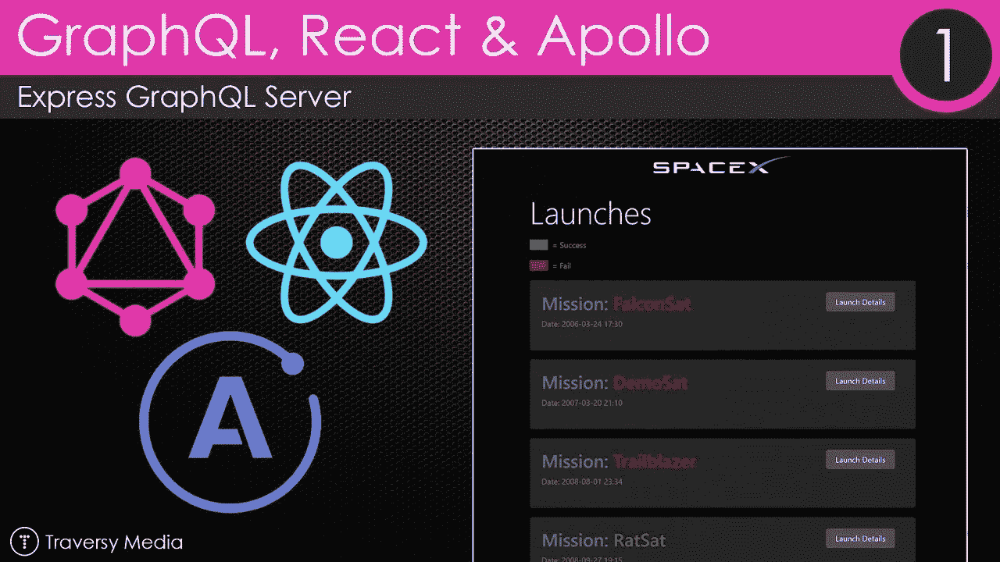
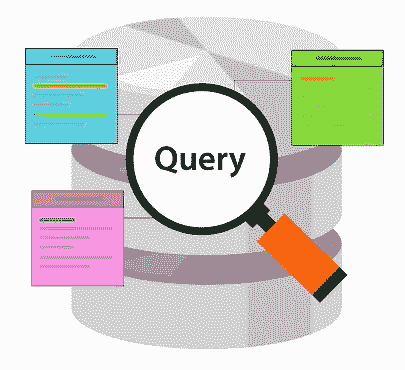

# 从前端与 Apollo GraphQL 服务器交互

> 原文：<https://javascript.plainenglish.io/interaction-with-an-apollo-graphql-server-from-the-frontend-633538f0c2f5?source=collection_archive---------11----------------------->



## 介绍

Apollo GraphQL 允许我们构建一个服务器，客户可以用他们想要的任何方式进行查询。在本文中，我们将研究与后端数据交互的不同方式。我们将经历设置、查询、变异和轮询或显式获取。

## 描述

我们需要指定服务器的 URL 并实例化一个客户端。因此，我们首先进行如下设置:

*   我们需要 apollo-boost 和 react-apollo 库来用 GraphQL 建立一个 react 应用程序。
*   阿波罗飞船为我们提供了一个阿波罗客户端。
*   我们需要实例化一个 URL。
*   react-apollo 为我们提供了更高级别的供应商。
*   我们需要用它包装我们的应用程序。
*   首先进行基本安装:

```
yarn add react-apollo apollo-boost graphql
```

*   当我们安装好所有东西后，我们就可以开始设置了。
*   转到 index.js 并键入以下内容:

```
import React, { Component } from "react";
import ApolloClient from "apollo-boost";
import { ApolloProvider } from "react-apollo";
import Local from “./components/Local”;
const localGraphQL = "http://localhost:4000/graphql";
const client = new ApolloClient({
  uri: localGraphQL
});
class App extends Component {
  render() {
    return (
      <ApolloProvider client={client}>
        <div>
          <h2>My first Apollo app </h2>
        </div>
     </ApolloProvider>
    );
  }
}
export default App;
```

*   如上所示，我们首先实例化一个 ApolloClient。
*   然后在这个过程中提供一个 url，我们的 GraphQL 服务器的位置。
*   此外，我们用我们的 ApolloProvider 包装整个应用程序。
*   我们还用 ApolloClient 实例设置了它的客户端属性。
*   现在我们已经准备好与我们的 GraphQL 服务器进行交互了

## 询问

*   为了能够查询 Apollo 服务器，我们需要做三件事:
*   编写我们的 gql 查询
*   利用 react-apollo 库提供的查询组件
*   呈现响应



*   我们需要导入 graphql-tag，然后编写 graphql 查询来编写我们的 gql 查询，如下所示:

```
const getRates = gql`
{
  rates(currency: “USD”) {
    currency
    rate
  }
}`;
```

*   之后，我们需要从 react-apollo 导入查询组件。
*   As input 属性给出了我们刚刚定义的查询，结果如下:

```
const Data = () => (
  <Query query={getRates} >
  // render the query results
  </Query>
);
```

*   我们正在调用一个函数，该函数在查询组件的第一个子组件中有一个对象作为参数。
*   该对象具有以下属性:
*   加载，只要查询还没有被解决这是真的
*   错误，如果我们从查询中返回一个错误
*   数据，查询得到的数据结果
*   此时，我们了解了这些属性以及如何使用它们，让我们一起来放置:

```
import React from "react";
import { Query } from "react-apollo";
import gql from "graphql-tag";
const getRates = gql`
{
  products(type: "DVD") {
    name
    price
  }
}`;
const Data = () => (
  <Query query={getRates} >
  {({ loading, error, data }) => {
  if (loading) return <p>Loading…</p>;
  if (error) return <p>Error :(</p>;
  return data.products.map(({ name, price }) => (
    <div key={name}>
      <p>{`${name}: ${price}`}</p>
    </div>
   ));
  }}
</Query>
);
export default Data;
```

*   我们现在已经非常熟悉如何从 GraphQL 服务器读取数据并呈现给我们的用户。

## 投票

*   有时，我们还希望定期获取数据，而不必公开导航到某个页面或按下一个确切的按钮来发出 GET 请求。
*   例如，我们在聊天应用中使用它来获得实时感。
*   我们显然是在谈论轮询，即定期获取数据。
*   我们学习使用的查询因子具有内置的轮询。
*   我们需要做的就是将 pollInterval 属性设置为两次提取之间所需的毫秒数。
*   让我们来看看这可能是什么样子:


```
import React from "react";
import { Query } from "react-apollo";
import gql from "graphql-tag";
const GET_DATA = gql`
{
  products {
    name
    id
  }
}
`;
const DataPull = () => (
  <Query query={GET_DATA} pollInterval={500}>
  {(loading, error, data, startPolling, stopPolling) => {
  if (loading) return null;
  if (error) return `Error!: ${error}`;
    return (
     <React.Fragment>
      {data.products.map(p => <div>{p.name}</div>)}
      <button onClick={()=> startPolling()}>Start polling</button>
      <button onClick={() => stopPolling()}>Stop polling</button>
    </React.Fragment>;
    )
}}
</Query>
);
export default DataPull;
```

*   如上所述，我们现在提出了以下新概念:
*   pollInterval，这大致是以毫秒为单位的轮询间隔，我们可以看到我们将其设置为 500，例如半秒
*   startPolling，这是一个函数，如果我们之前停止了轮询，我们可以重新开始轮询
*   停止轮询是一个允许我们随时停止轮询的功能。

## 重取

*   有时，我们最终会遇到这样的情况，我们希望公开获取数据，以确认我们看到的是最新的数据。
*   这样做的目的是对用户操作做出反应，而不是轮询。
*   让我们看看如何使用这一重取功能:

```
import React from "react";
import { Query } from "react-apollo";
import gql from "graphql-tag";
const GET_DATA = gql`
{
  products {
    name
    id
  }
}
`;
const Refetch = () => (
  <Query query={GET_DATA}>
  {(loading, error, data, refetch) => {
  if (loading) return null;
  if (error) return `Error!: ${error}`;
  return (
    <React.Fragment>
      <div>
        {data.prop}
        <button onClick={() => refetch()}>Fetch</button>
      </div>
   </React.Fragment>
  )
}}
</Query>
);
export default Refetch;
```

*   如上所示，我们向查询子函数添加了另一个参数 refetch，如下所示:

```
{(loading, error, data, refetch) => {
}}
```

*   这个 refetch 参数是一个函数。
*   我们可以调用它。
*   因此，在我们的标记中将它连接到一个按钮，如下所示:

```
<button onClick={() => refetch()}>Fetch</button>
```

## 变化

*   一旦我们对 GraphQL 服务器进行了变异，我们需要执行以下操作:
*   调用正确的突变
*   使用 react-apollo 中的变异组件
*   以上内容并不完整，事实并非如此。
*   让我们从第一件事开始，我们的突变查询:
*   我们将使用 graphql-tag 库中的 gql 助手来创建我们的变异查询。
*   然后我们使用关键字突变，接着给突变一个名字。
*   识别它的输入参数$person。
*   目前我们有以下查询:

```
const ADD_PERSON = gql`
mutation AddPerson($person: Person!) {
}
`;
```

现在我们准备调用我们在 GraphQL 服务器中定义的实际突变 addPerson。您的突变查询现在应该如下所示:

```
const ADD_PERSON = gql`
mutation AddPerson($person: Person!) {
   addPerson(person: $person) {
     id
   }
}
`;
```

*   接下来的工作是通过使用 React 组件变异来放置变异查询。
*   该组件需要两件东西:
*   填充突变属性，
*   定义突变组件的子组件
*   让我们从使用突变组件的第一点开始。
*   设置其突变属性，如下所示:

```
import React from "react";
import { Mutation } from "react-apollo";
import gql from "graphql-tag";
const ADD_PERSON = gql`
  mutation AddPerson($person: Person!) {
    addPerson(person: $person) {
      id
    }
  }
`;
<Mutation mutation={ADD_PERSON}>
</Mutation>
```

*   我们已经使用了我们的突变组件。
*   用我们的突变查询 ADD_PERSON 设置突变属性。
*   下一步是定义突变组件的子组件。
*   正如我们已经说过的，孩子是这样一个函数:

```
(addPerson, { data, loading, error }) => (
// JSX
)
```

*   如上所述的函数预计将返回 JSX。
*   我们可能会定义一段 JSX，让我们使用以下内容:
*   addPerson()，这个函数将执行变异查询。
*   加载时，这个布尔值会告诉我们突变是否正在进行，使用这个值来决定是否使用微调器
*   数据，这是变异查询完成后返回的数据
*   现在，让我们定义我们的 JSX。
*   当我们想要收集数据时，定义一个表单是很常见的
*   因此，让我们这样做:

```
<form onSubmit={e => {
e.preventDefault();
addPerson({ variables: { person: { name: input.value } } });
input.value = “”;
}} >
<input ref={node => { input = node; }} />
<button type=”submit”>Add Person</button>
{loading &&
<div>adding person…</div>
}
{ data &&
<div>response data</div>
}
{ error &&
<div>Error adding person…</div>
}
</form>
```

*   我们有我们的形式和一个输入框和一个按钮，我们可以按下。
*   我们将 addPerson()方法挂接到表单的 onSubmit()上。
*   我们还解决了如何获取数据进行变异查询。
*   我们给 addPerson()方法一个具有属性变量的对象，在这些属性变量中，将一个对象分配给属性 Person。
*   person 属性与变异查询中存在的输入参数相同。
*   其他字段数据、加载和错误用作条件 JSX，如果它们为真，我们选择显示它们。
*   这就是用一些参数调用突变的全部内容
*   显示响应，无论是实际数据还是错误。
*   以下是完整的代码。

```
import React from “react”;import { Mutation } from “react-apollo”;import gql from “graphql-tag”;const ADD_PERSON = gql`mutation AddPerson($person: Person!) {addPerson(person: $person) {id}}`;const DataInput = () => {let input;return (<Mutation mutation={ADD_PERSON}>{(addPerson, { data, loading, error }) => (<div><form onSubmit={e => {e.preventDefault();addPerson({ variables: { person: { name: input.value } } });input.value = “”;}} ><input ref={node => { input = node; }} /><button type=”submit”>Add Person</button>{loading &&<div>adding person…</div>}{ data &&<div>response data</div>}{ error &&<div>Error adding person…</div>}</form></div>)}</Mutation>)}export default DataInput;
```

欲了解更多详情，请访问:

[https://www . technologiesinindustry 4 . com/interaction-with-an-Apollo-graph QL-server-from-the-front end/](https://www.technologiesinindustry4.com/interaction-with-an-apollo-graphql-server-from-the-frontend/)

*更多内容尽在*[***plain English . io***](http://plainenglish.io/)