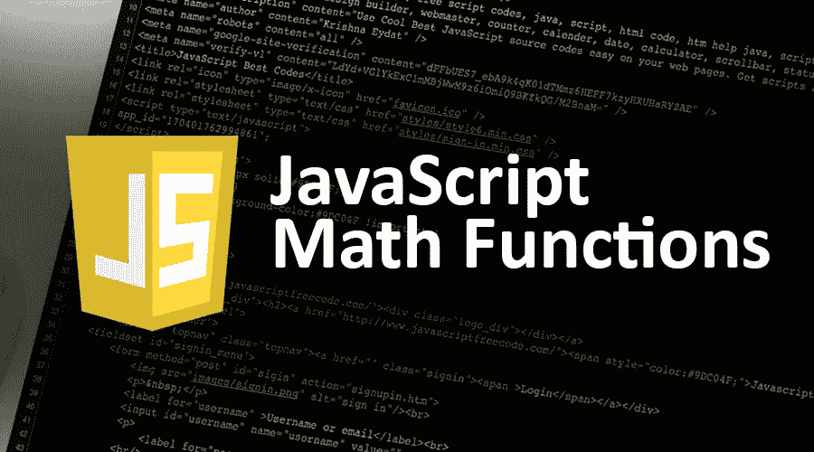
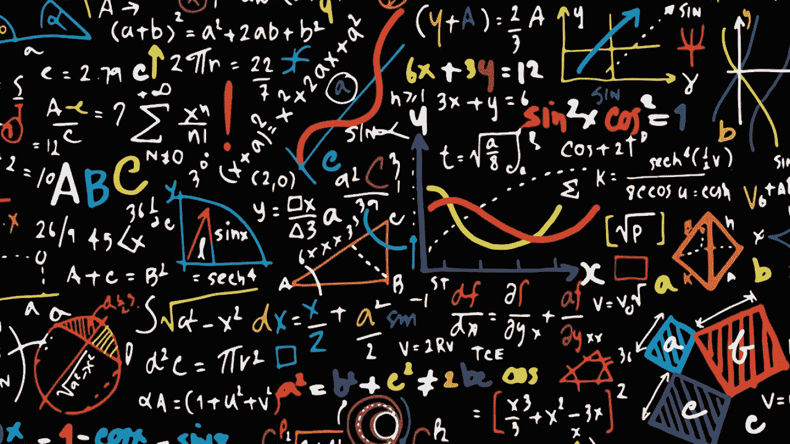
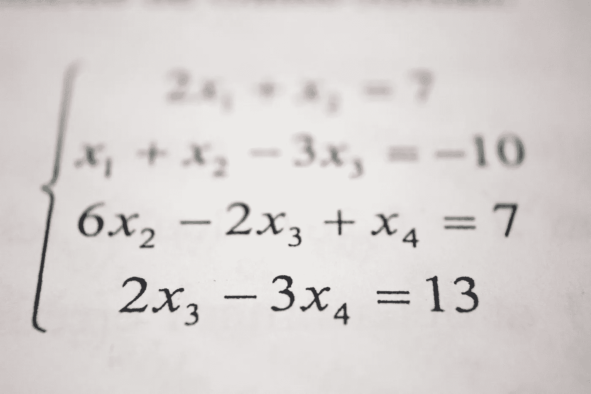

# JavaScript 中有趣数学函数的初学者指南

> 原文：<https://javascript.plainenglish.io/interesting-javascript-math-functions-222d8f97f7b9?source=collection_archive---------25----------------------->

## JAVASCRIPT 初学者指南

## JavaScript 中有哪些有趣的数学函数？



每当你处理数字运算时，我们可能需要一些数学函数来帮助我们美化输出。



那么我们来看看一些常用的数学函数，并附有例子。

一件棘手的事情是理解 round()、ceil()和 floor()之间的区别。

*此方法用于通常的舍入过程，舍入到最接近的整数。*

```
*Math.round(6.4); // returns 6Math.round(6.6); // returns 7*
```

***2*。math . ceil()****

*此方法将一个数字向上舍入到下一个最大的整数。*

```
*Math.ceil(5.2); // returns 6*
```

*3.**math . floor()***

*此方法将数字向下舍入为整数。*

```
*Math.floor(7.6); // returns 7*
```

****4。Math.trunc()****

*此方法盲目地删除小数点后的所有数字，只返回整数部分。*

```
*Math.trunc(9.1);// returns 9Math.trunc(4.552590); // returns 4*
```

****5。math . ABS()****

*此方法返回数字的绝对值。*

```
*Math.abs(-5); // returns 5*
```

****⑥。Math.random()****

*此方法返回从 0 到 1(小于 1)的随机浮点数。*

```
*Math.random(); // returns 005256263146866003Math.random(); // returns 0.428776144986766*
```

****7。Math.sqrt()****

*此方法返回数字的平方根。*

```
*Math.sqrt(9); // returns 3*
```

***8。Math.pow()***

*此方法返回指数幂的底数。*

```
*Math.pow(8, 3); // returns 512*
```

****9。Math.min()****

*此方法从参数/数组中返回最小的数字。*

```
*Math.min(54, 3546, 0); // returns 0const nums = [43, 41, 35510];Math.min(…nums)); // returns 41*
```

***10*。Math.max()****

*此方法从参数/数组中返回最大的数字。*

```
*Math.max(54, 3546, 0); // returns 0const nums = [343, 656, 3551];Math.max(…nums)); // returns 3551*
```

**

*我希望现在这些数字很容易处理！我个人在使用 Postman 的自动化脚本中使用它们。还有很多其他的数学函数。*

*但愿这些对你们绝对有用！*

*祝 2021 年愉快！*

**更多内容请看*[***plain English . io***](http://plainenglish.io/)*