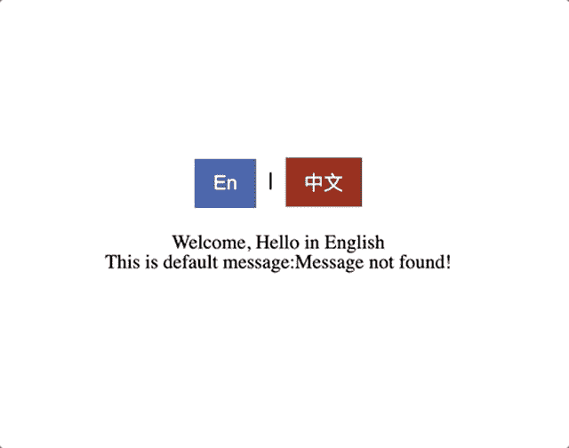

# React 中的国际化:使用钩子和上下文提供者

> 原文：<https://javascript.plainenglish.io/internationalization-in-react-js-application-34925edd81dd?source=collection_archive---------11----------------------->


*为多语言应用程序编码总是具有挑战性。大多数情况下，您最终会添加一些第三方库。使用 basic React，您可以拥有一个健壮的、可伸缩的库。*

在任何跨国公司工作，你都必须支持来自世界各地的客户。您的应用程序必须支持多语言功能。并且用户应该能够在语言之间切换。大多数时候你会选择像 [i18next](https://www.i18next.com/) 这样的第三方库。然而，它也有自己的挑战。

*在本文中，我将重点介绍如何创建一个简单易用的国际化模块，并且只使用很少几行代码。我不会比较你为什么应该或不应该使用第三方库。*

在继续之前，让我们了解一下库的需求。


# 项目要求

1.  用户应该能够在语言之间切换
2.  当用户切换到另一种语言时，用户应该看到不同的文本。

# 非功能需求

1.  假设我们正在使用 React，这个库应该支持 React 的最新钩子概念
2.  该库应该提供一个在运行时更新翻译的选项(通过网络获取)
3.  该库应该提供对默认消息的支持，以防如果请求的话，该键/值不存在于消息集中
4.  该库应该提供一种基于用户偏好更新默认区域设置的方法
5.  开发人员应该能够在任何地区获得消息，即使默认的地区是不同的。这将有助于同时获得不同语言的信息。

**示例应用:**



Sample App

# 创建 React.js 应用程序

创建一个 react 应用程序非常简单。可以使用`create-react-app,`创建 react app。如果你已经有了自己的 app。您可以跳过这一步，进入下一步。

```
npx create-react-app my-multi-lingual-app --template typescript
```

一旦创建了应用程序，您就可以从`App.tsx`中删除现有代码。

**注意:** *对于本文，我们将使用 Typescript 编写代码。我总是建议对定制构建库使用 TypeScript。它不仅减少了解释大量代码的工作量，而且通过补充 JS 中不好的部分提供了更好的支持。你可以阅读这篇文章，找到更多我不再使用 JavaScript 的理由*[](/im-not-using-javascript-anymore-6851c707b3d1)**。**

# *创建 i18n 包*

*为了简单起见，让我们在`src`目录中创建一个目录。网上有很多文章，比如 [**如何创建 node.js 模块**](https://docs.npmjs.com/creating-node-js-modules) 。如果您愿意的话，您可以按照它们中的任何一个来创建一个单独的包并发布您的库。*

***创建一个文件国际化. tsx***

*让我们导入它，并用默认的英文文本创建一个基本的应用程序结构。*

## *更新应用程序的 HTML 模板*

# *用默认消息测试 I18nProvider 类*

*对于我们的**国际化**模块，我们将使用[反应上下文 API](https://reactjs.org/docs/context.html) 。为了避免直接暴露给提供者类，我们将使用 HOC 组件包装提供者。你可以在这里详细阅读，如何为提供者创建一个包装类。*

*为了访问 provider 类的值，让我们创建一个自定义挂钩。*

***更新 *App.tsx* ，获取硬编码消息***

# *从网络获取消息*

*刷新后，您可以看到硬编码的消息。让我们从网络中获取消息，并在 **I18nProvider** 中将它们设置为消息。为此，我们需要创建一个公共方法来提供上下文。*

*类似地，我们必须将该方法具体化为 **set locale** 。在 **App.tsx** 中访问所有这些方法非常简单。我们来更新一下 **App.tsx** 。*

# *处理网络延迟*

*即使我们从网络上获取消息并将其设置为 messages，我们仍然会看到一个破碎的页面。这是因为我们试图在没有错误处理的情况下访问给定代码`<p>Welcome, {messages["en-US"].hello}</p>`中的消息文本。由于网络延迟(异步)，你会看到这个破碎的网页。要避免这样的问题，还是优雅地处理。我们可以在我们的 **I18nProvider** 中添加一个 **boolean(loaded)** 。*

*现在更新 **App.tsx** 以显示从网络获取消息后加载消息。*

# *在语言之间切换*

***I18nProvider** 公开了 **setLocale** 方法。通过用**键**发送 locale 参数，我们可以从 **I18nProvider** 获取消息。用一种语言处理信息要比用多种语言容易得多。为了根据当前的语言环境从 **I18nProvider** 获取文本，我们可以添加 **translate** 一个助手函数/方法。*

*现在，在 **App.tsx** 中获取地区文本将变得更加容易。*

# *最终代码*

*`src/i18n/Internationalization.tsx`的完整代码*

*`src/i18n/App.tsx`的最终代码*

***注:**你总能在运行代码-沙箱里找到源代码，[react-国际化-screr](https://codesandbox.io/s/react-internationalization-screr) 。*

# *演示应用程序*

# *结论*

*我们可以通过添加几行代码清楚地看到。我们可以创建一个基本的简单国际化库。但是，如果您的应用程序非常大，并且您不想维护自己的自定义库。您应该使用第三方库。你会得到更好的支持和标准化。*

*谢谢，希望你喜欢这篇文章。它将为您提供如何使用 React.js 上下文 API 的基本概念。如果你觉得这个有用，请分享并反馈。如果你有任何疑问和建议，请写在评论中。*

**原载于*[*https://blog . decipe . dev*](https://blog.decipher.dev/internationalization-in-plain-reactjs)*。**

**更多内容请看*[***plain English . io***](http://plainenglish.io/)*