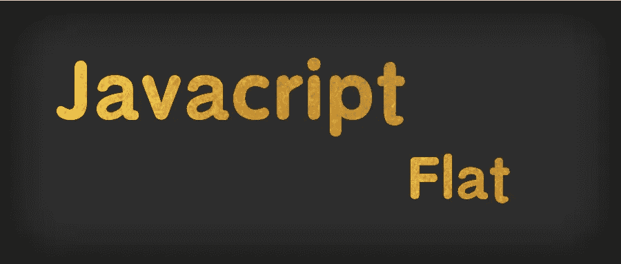

# 面试问题:阵列扁平化方法的实现原理

> 原文：<https://javascript.plainenglish.io/interviewer-the-principle-of-implementing-the-flat-array-method-a3e776d48069?source=collection_archive---------11----------------------->

前段时间面试的时候，面试官问:如何实施扁平化方法？当时实现还不完善，后来发现有不少面试官要求手写数组的扁平化方法。其中包括小米、美团、滴滴、Shopee 等。

手写平码法是一个很基础的面试题，通常在笔试或者第一轮面试中，主要考察基本的手写编码能力。今天，我们将重新学习 array flat 方法，从了解 flat 特性到实现 flat，然后抓住面试官的一系列问题。



Javascript array flat method

# 代码摘要`Array.prototype.flat()`功能

```
**const** animals = ["🐷", ["🐶", "🐂"], ["🐎", ["🐑", ["🐲"]], "🐛"]];*// default "flatten" once if no parameters are passed*
animals.flat();
*// ["🐷", "🐶", "🐂", "🐎", ["🐑", ["🐲"]], "🐛"]**// pass in an integer parameter, the number of "flattenings"*
animals.flat(2);
*// ["🐷", "🐶", "🐂", "🐎", "🐑", ["🐲"], "🐛"]**// The Infinity keyword is converted to a one-dimensional array when used as an argument, no matter how many levels of nesting*
animals.flat(Infinity);
*// ["🐷", "🐶", "🐂", "🐎", "🐑", "🐲", "🐛"]**// passing in an integer <= 0 will return the original array, not "flattened"*
animals.flat(0);
animals.flat(-10);
*// ["🐷", ["🐶", "🐂"], ["🐎", ["🐑", ["🐲"]], "🐛"]];**// If the original array has empty space, the flat() method will skip the empty space.*
["🐷", "🐶", "🐂", "🐎",,].flat();
*// ["🐷", "🐶", "🐂", "🐎"]*
```

# `Array.prototype.flat()`功能概述

*   `Array.prototype.flat()`用于将嵌套数组“展平”成一维数组。该方法返回一个新数组，对原始数据没有影响。
*   当没有传递参数时，默认是“展平”一个级别，可以传递一个整数来表示要“展平”的级别数。
*   传递一个整数`<=0`将返回原始数组，而不会“展平”它。
*   当`Infinity`关键字用作参数时，它将被转换为一维数组，而不管嵌套层数
*   如果原数组有空位，`Array.prototype.flat()`将跳过这个空位。

# 面试官抓住了问题的核心

# 第一个问题:实现简单的数组展平`flat`函数

首先，我们将花一点时间探索如何实现一个简单的数组展平`flat`函数，详细说明各种实现选项，然后尝试抓住面试官接二连三的问题。

## 实施理念

这个想法非常简单:用一个数组平面函数实现一个`flat`函数，我们所要做的就是找到数组中数组类型的元素并扩展它们。这是实现`flat`方法背后的关键思想。

考虑到这个想法，我们需要解决实施这个想法需要克服的困难。

*   要解决的第一个问题是遍历数组的每个元素；
*   第二个问题是确定元素是否是数组；
*   第三个要解决的是将数组的元素扩展一层；

## 遍历数组的解决方案

有很多方法可以迭代一个数组并获得它的元素，**包括但不限于下面的**。

*   `for loop`
*   `for.... .of`
*   `for... .in`
*   `forEach()`
*   `entries()`
*   `keys()`
*   `values()`
*   `reduce()`
*   `map()`

```
**const** arr = [1, 2, 3, 4, [1, 2, 3, [1, 2, 3, [1, 2, 3]]], 5, "string", { name: "Bouncing iron eggs" }];*// There are too many ways to iterate through an array, so this article will only enumerate the common ones**// for loop*
**for** (**let** i = 0; i < arr.length; i++) {
  console.log(arr[i]);
}*// for...of*
**for** (**let** value **of** arr) {
  console.log(value);
}*// for...in*
**for** (**let** i **in** arr) {
  console.log(arr[i]);
}*// forEach loop*
arr.forEach(value => {
  console.log(value);
});*// entries（）*
**for** (**let** [index, value] **of** arr.entries()) {
  console.log(value);
}*// keys()*
**for** (**let** index **of** arr.keys()) {
  console.log(arr[index]);
}*// values()*
**for** (**let** value **of** arr.values()) {
  console.log(value);
}*// reduce()*
arr.reduce((pre, cur) => {
  console.log(cur);
}, []);*// map()*
arr.map(value => console.log(value));
```

任何可以遍历数组以获取数组中每个元素的方法都是可行的解决方案。

## 判断元素是否为数组的一种方法

*   `instanceof`
*   `constructor`
*   `Object.prototype.toString`
*   `isArray`

```
**const** arr = [1, 2, 3, 4, [1, 2, 3, [1, 2, 3, [1, 2, 3]]], 5, "string", { name: "Bouncing iron eggs" }];arr **instanceof** Array
*// true*arr.constructor === Array
*// true*Object.prototype.toString.call(arr) === '[object Array]'
*// true*Array.isArray(arr)
*// true*
```

**描述**。

*   `instanceof`操作符假设只有一个全局环境。如果页面包含具有多个全局环境的多个框架，并且如果您将一个数组从一个框架传递到另一个框架，则传入的数组将拥有自己的独立构造函数，该构造函数来自第二个框架中本机创建的数组。(所以这种情况下会不准确)
*   `typeof`操作符接受数组的类型并返回`object`。
*   因为`constructor`可以被覆盖，所以不能保证它是一个数组。

```
**const** str = 'abc'; 
str.constructor = Array; 
str.constructor === Array  *// true*
```

## 将数组元素扩展一级的方案

*   扩展运算符+ `concat`

`concat()`方法用于合并两个或多个数组，在串联中添加扩展运算符会将数组扩展一层。有关详细信息，请参见以下代码。

*   `concat` + `apply`

主要使用`apply`绑定作用域，第二个参数是一个数组或类似数组的对象，其中数组元素作为单独的参数传递给`func`函数。也就是在调用`apply`函数的过程中，传入的数组被一个一个的传入要执行的函数，相当于数组的一层扩展。

*   `toString` + `split`

不推荐使用`toString` + `split`方法，因为操作字符串是一件危险的事情。如果数组中的所有元素都是数字，`toString` + `split`就可以了，而且是一步到位的过程。

```
**const** arr = [1, 2, 3, 4, [1, 2, 3, [1, 2, 3, [1, 2, 3]]], 5, "string", { name: "Bouncing iron eggs" }];*// Expansion operator + concat*
[].concat(...arr)*// [1, 2, 3, 4, 1, 2, 3, [1, 2, 3, [1, 2, 3]], 5, "string", { name: "Bouncing iron eggs" }];**// concat + apply*
[].concat.apply([], arr);
*// [1, 2, 3, 4, 1, 2, 3, [1, 2, 3, [1, 2, 3]], 5, "string", { name: "Bouncing iron eggs" }];**// toString  + split*
**const** arr2 =[1, 2, 3, 4, [1, 2, 3, [1, 2, 3, [1, 2, 3]]]]
arr2.toString().split(',').map(v=>parseInt(v))
*// [1, 2, 3, 4, 1, 2, 3, 1, 2, 3, 1, 2, 3]*
```

总结了要解决的三大难点之后，我们就可以非常容易地实现一个版本的`flat`函数了。

```
**const** arr = [1, 2, 3, 4, [1, 2, 3, [1, 2, 3, [1, 2, 3]]], 5, "string", { name: "Bouncing iron eggs" }];*// concat + recursive*
**function** **flat**(arr) {
  **let** arrResult = [];
  arr.forEach(item => {
    **if** (Array.isArray(item)) {
      arrResult = arrResult.concat(arguments.callee(item));   
      *// recursive*
      *// or use the extended operator*
      *// arrResult.push(...arguments.callee(item));*
    } **else** {
      arrResult.push(item);
    }
  });
  **return** arrResult;
}flat(arr)
*// [1, 2, 3, 4, 1, 2, 3, 1, 2, 3, 1, 2, 3, 5, "string", { name: "Bouncing iron eggs" }];*
```

至此，恭喜你成功获得面试官对你手撕代码能力的基本认可🎉。但是面试官往往会超越这一点，会继续看面试官的各种能力。

# 问题 2:用`reduce`实现`flat`功能

我见过很多面试官喜欢指名道姓，要求面试官直接用`reduce`实现`flat`功能。想知道为什么吗？当我们考虑空数组的情况时，我们将在本文后面看到原因。其实想法是一样的。

```
**const** arr = [1, 2, 3, 4, [1, 2, 3, [1, 2, 3, [1, 2, 3]]], 5, "string", { name: "Bouncing iron eggs" }]*// First use reduce to expand a layer*
arr.reduce((pre, cur) => pre.concat(cur), []);
*// [1, 2, 3, 4, 1, 2, 3, [1, 2, 3, [1, 2, 3]], 5, "string", { name: "Bouncing iron eggs" }];**// Expanding a layer with reduce + recursion*
**const** flat = arr => {
  **return** arr.reduce((pre, cur) => {
    **return** pre.concat(Array.isArray(cur) ? flat(cur) : cur);
  }, []);
};
*// [1, 2, 3, 4, 1, 2, 3, 1, 2, 3, 1, 2, 3, 5, "string", { name: "Bouncing iron eggs" }];*
```

# 问题 3:使用堆栈思想实现`flat`函数

```
*// Stack Ideas*
**function** **flat**(arr) {
  **const** result = []; 
  **const** stack = [].concat(arr);  
  *// Copy the array elements to the stack, direct assignment will change the original array*
  *// If the stack is not empty, the loop traverses*
  **while** (stack.length !== 0) {
    **const** val = stack.pop(); 
    **if** (Array.isArray(val)) {
      stack.push(...val); 
      *// If the array is on the stack again, and a layer is expanded*
    } **else** {
      result.unshift(val); 
      *// If it's not an array, take it out and put it in the result array*
    }
  }
  **return** result;
}**const** arr = [1, 2, 3, 4, [1, 2, 3, [1, 2, 3, [1, 2, 3]]], 5, "string", { name: "Bouncing iron eggs" }]flat(arr)
*// [1, 2, 3, 4, 1, 2, 3, 1, 2, 3, 1, 2, 3, 5, "string", { name: "Bouncing iron eggs" }];*
```

# 第四个问题:通过传入整数参数来控制“调平”层的数量

```
*// reduce + recursive*
**function** **flat**(arr, num = 1) {
  **return** num > 0
    ? arr.reduce(
        (pre, cur) =>
          pre.concat(Array.isArray(cur) ? flat(cur, num - 1) : cur),
        []
      )
    : arr.slice();
}**const** arr = [1, 2, 3, 4, [1, 2, 3, [1, 2, 3, [1, 2, 3]]], 5, "string", { name: "Bouncing iron eggs" }]flat(arr, Infinity);
*// [1, 2, 3, 4, 1, 2, 3, 1, 2, 3, 1, 2, 3, 5, "string", { name: "Bouncing iron eggs" }];*
```

# 问题 5:使用`Generator`实现`flat`功能

```
**function*** **flat**(arr, num) {
  **if** (num === undefined) num = 1;
  **for** (**const** item **of** arr) {
    **if** (Array.isArray(item) && num > 0) {   *// num > 0*
      **yield*** flat(item, num - 1);
    } **else** {
      **yield** item;
    }
  }
}**const** arr = [1, 2, 3, 4, [1, 2, 3, [1, 2, 3, [1, 2, 3]]], 5, "string", { name: "Bouncing iron eggs" }]*// When the Generator function is called, it does not execute and returns not the result of the function run, but a pointer object to the internal state.**// That is, the Iterator Object. So we have to use the extension operator once to get the result*[...flat(arr, Infinity)]    
*// [1, 2, 3, 4, 1, 2, 3, 1, 2, 3, 1, 2, 3, 5, "string", { name: "Bouncing iron eggs" }];*
```

# 问题 6:在原型链上实现重写`flat`函数

```
Array.prototype.fakeFlat = **function**(num = 1) {
  **if** (!Number(num) || Number(num) < 0) {
    **return** this;
  }
  **let** arr = this.concat();    
      *// Get an array of calls to the fakeFlat function*
  **while** (num > 0) {           
    **if** (arr.some(x => Array.isArray(x))) {
      arr = [].concat.apply([], arr);	
      *// If there are still array elements in the array and num > 0, continue to expand the array by one level* 
    } **else** {
      **break**; 
      *// Stops the loop if there are no array elements in the array and regardless of whether num is still greater than 0.*
    }
    num--;
  }
  **return** arr;
};**const** arr = [1, 2, 3, 4, [1, 2, 3, [1, 2, 3, [1, 2, 3]]], 5, "string", { name: "Bouncing iron eggs" }]arr.fakeFlat(Infinity)*// [1, 2, 3, 4, 1, 2, 3, 1, 2, 3, 1, 2, 3, 5, "string", { name: "Bouncing iron eggs" }];*
```

# 问题 7:考虑空数组的情况

从我们在开头总结的`flat`特性我们知道，`flat`函数是通过跳过空值来执行的，大多数处理空值的 ES5 数组方法都选择跳过，包括:`forEach()`、`filter()`、`reduce()`、`every()`和`some()`。

所以我们可以用上面的方法来实现平面跳空特性

```
*// reduce + recursive*
Array.prototype.fakeFlat = **function**(num = 1) {
  **if** (!Number(num) || Number(num) < 0) {
    **return** this;
  }
  **let** arr = [].concat(this);
  **return** num > 0
    ? arr.reduce(
        (pre, cur) =>
          pre.concat(Array.isArray(cur) ? cur.fakeFlat(--num) : cur),
        []
      )
    : arr.slice();
};**const** arr = [1, [3, 4], , ,];
arr.fakeFlat()
*// [1, 3, 4]**// foEach + recursive*
Array.prototype.fakeFlat = **function**(num = 1) {
  **if** (!Number(num) || Number(num) < 0) {
    **return** this;
  }
  **let** arr = [];
  this.forEach(item => {
    **if** (Array.isArray(item)) {
      arr = arr.concat(item.fakeFlat(--num));
    } **else** {
      arr.push(item);
    }
  });
  **return** arr;
};**const** arr = [1, [3, 4], , ,];
arr.fakeFlat()
*// [1, 3, 4]*
```

# 延伸阅读:由于处理空格的规则非常不一致，建议避开。

ES5 在处理空位时非常不一致，大多数情况下会忽略它们。

*   `forEach()`、`filter()`、`reduce()`、`every()`、`some()`均跳过空位。
*   `map()`会跳过空格，但会保留值。
*   `join()`和`toString()`将空位视为`undefined`，而`undefined`和`null`则视为空字符串。

ES6 将空位显式转换为`undefined`。

*   `entries()`、`keys()`、`values()`、`find()`、`findIndex()`会把空的位当作`undefined`。
*   `for... . of`循环将在空白空间中迭代。
*   `fill()`将空白视为正常的数组位置。
*   `copyWithin()`会将空位一起复制。
*   扩展运算符(`...` )也会将空白转换成`undefined`。
*   `Array.from`方法获取数组的空位，并将其转换为`undefined`。

# 摘要

面试官看的是一个写代码的题目，但不仅仅是写代码，还有各种知识点和代码边界案例。虽然大多数情况下面试官不会变态到`flat`实现来连续追面试官撕几个版本，但是面试官会要求根据你写的版本写一个更完美的代码版本是常有的事。无论面试官问多少问题，只有我们埋头于基本问题，我们才会回答得舒服。`flat`的实现绝对不是文中列出的唯一版本，敲出自己的代码才是最好的进步，在评论区写自己的版本吧！

> *觉得有用就跟我来❤*

*更多内容请看*[***plain English . io***](http://plainenglish.io/)