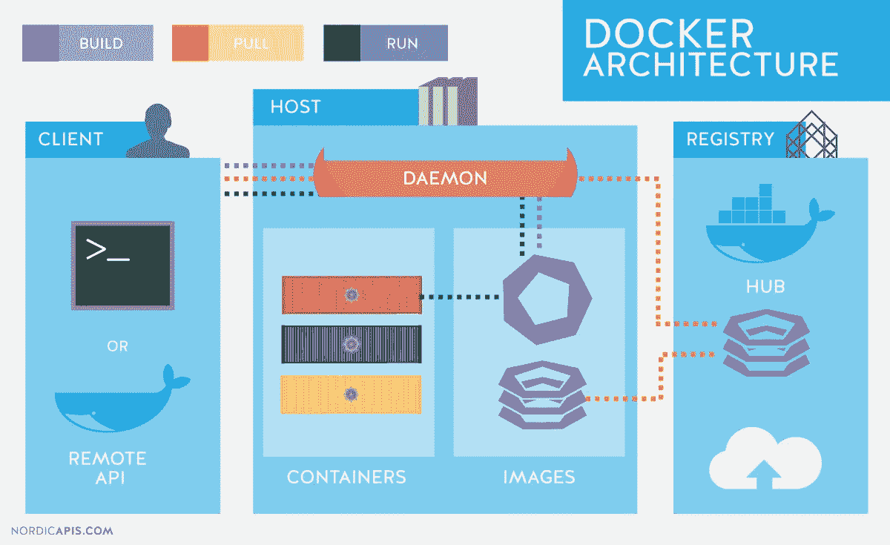

# Docker 简介

> 原文：<https://javascript.plainenglish.io/intro-to-docker-823dc07fcd7c?source=collection_archive---------10----------------------->

Docker 是一个流行的开源项目，用 go 编写，由点云(一家 PaaS 公司)开发。它基本上是一个容器引擎，使用 Linux 内核特性(如名称空间和控制组)在操作系统上创建容器。在今天的帖子中，我将向您介绍 docker，以及一些基本的命令和常见问题。


Docker Basics

## 虚拟化:

虚拟化允许您将一个系统分成多个不同的部分，这些部分就像独立的、不同的单独系统一样。这有助于开发人员在一台物理服务器的硬件上运行和托管多个操作系统。**虚拟机管理程序**为客户操作系统提供整体虚拟机。这些虚拟机形成了系统硬件 **层**的**抽象，这意味着主机上的每个虚拟机都充当物理机。**

## 集装箱化:

这有助于开发人员在单个虚拟机或服务器上使用相同的操作系统部署多个**应用**。容器为运行应用程序提供了一个隔离的环境。整个用户空间明确地专用于应用程序。容器构成了应用层**的**抽象，这意味着每个容器构成了一个不同的应用。容器内的任何更改都不会反映在主机上，甚至不会反映在同一主机上运行的其他容器上。****

****

**Virtualization vs Containerization**

**正如我们所见，与虚拟化相比，容器化的开销要低得多。容器要轻量得多，可以比 VM 更快地启动和关闭。**

## **码头工人:**

**Docker 是一个容器化平台，它以容器的形式将应用程序及其依赖项打包在一起。这确保了您的应用程序可以在任何环境中无缝工作，无论是开发、测试还是生产环境。Docker 容器，将一个软件包装在一个完整的文件系统中，该文件系统包含运行所需的一切:代码、运行时、系统工具、系统库等。它基本上包装了任何可以安装在服务器上的东西。这保证了软件将总是相同地运行，而不管其环境如何。**

## **码头集装箱:**

**最简单地说，docker 容器由应用程序及其所有依赖项组成。它与其他容器共享内核，在主机操作系统的用户空间中作为独立的进程运行。docker 容器的主要目的是在部署和运行应用程序时摆脱对基础设施的依赖。这意味着任何容器化的应用程序都可以在任何平台上运行，而不考虑底层使用的基础设施。从技术上讲，它们只是 docker 映像的运行时实例。**

**docker 容器从开始创建到结束的不同阶段称为 docker 容器生命周期。
最重要的阶段是:**

*   ****Created:** 这是容器刚刚被新建但还没有开始的状态。**
*   ****正在运行:**在这种状态下，容器将与所有相关的进程一起运行。**
*   ****暂停:**此状态下，正在运行的容器暂停。**
*   ****停止:**当正在运行的容器已经停止时，会出现这种状态。**
*   ****删除:**在此，容器处于死状态。**

****

**Docker Container Lifecycle**

## **Docker 图像:**

**Docker 镜像是 Docker 容器的蓝图，包含应用程序代码和依赖项、软件包等。换句话说，Docker 图像用于创建容器。当用户运行 Docker 映像时，会创建一个容器实例。Docker 映像可以部署到任何 docker 环境中，容器可以在那里运行应用程序。**

## **码头中心:**

**Docker 图像创建 docker 容器。这些码头工人的形象必须有一个栖身之所。默认位置是 Docker Hub。用户可以从 Docker Hub 获取图像，并使用它们来创建定制的图像和容器。Docker 提供了一个基于云的注册表，用于存储容器的公共图像，并提供查找和共享这些图像的功能，称为 Docker Hub。**

## **Docker 架构:**

**Docker 架构由 Docker 引擎组成，Docker 引擎是一个客户端-服务器应用程序，有三个主要组件:**

1.  **服务器是一种长期运行的程序，称为守护进程(docker 命令)。**
2.  **REST API 指定了一些接口，程序可以使用这些接口与守护进程对话，并指示它做什么。**
3.  **命令行界面(CLI)客户端(docker 命令)。**
4.  **CLI 使用 Docker REST API 通过脚本或直接 CLI 命令来控制 Docker 守护进程或与之交互。许多其他 Docker 应用程序使用底层 API 和 CLI。**

****

## **Docker 文件:**

**Docker 可以通过从一个名为 Dockerfile 的文件中读取指令来自动构建映像。它是一个文本文档，包含用户可以在命令行上调用的所有命令来组合一个图像。使用 docker build，用户可以创建一个连续执行几个命令行指令的自动化构建。**

****

**Steps to create a docker container**

## **基本命令:**

```
$ docker version // To check the docker version
$ docker info // to get info about no of containers running, paused & stopped
$ docker login // to login to docker repository
docker run -it -d <image_name> // to create and run docker container from image with detached mode$ docker ps // list only running container
$ docker rm <container_id> // to remove stopped container
$ docker rmi <image_id> // to remove the image
$ docker build <path_to_docker_file> //to build the docker file
$ docker push <username/image_name> // to push image to hub or repository$ docker pull <image_name> // To pull docker image
$ docker start <container_id> // To start container
$ docker kill <container_id> // To kill docker container
$ docker stop <container_id> // To stop docker container
```

## **常见问题:**

****问:**Docker 容器的规模有多大？一样有什么要求吗？
**答:**容器可以扩展到成千上万个并行运行。容器总是需要内存&操作系统。以及缩放时有效使用该内存的方法。**

****问:**当 docket 容器存在时，您会丢失数据吗？
**答:**不会，你不会丢失数据的。它保留在磁盘上，直到 docker 容器被显式删除。**

****问:**为什么要使用 docker 系统 prune？
**答:**移除所有停止的容器，不使用的 N/W，悬空图像&建立缓存。**

****问:**能否从 docker 中移除暂停的容器？
**答:**不可以，不能去掉。**

****问:**容器可以自己重启吗？
**答:**不能，不能自己重启。虽然您可以设置 flag-restart[restart-policy-value]来自动重启容器。**

****问:**每台主机可以运行多少个容器？
**答:**这完全取决于主机，因为容器需要存储空间，硬件需要支持的 CPU &内存。**

**在接下来的文章中，我们将通过一个 Node.js 项目部署的例子来了解 AWS ECS & ECR。**

*****感谢阅读。最初发表于 2021 年 5 月 30 日 https://noob2geek.in/******[***。***](https://noob2geek.in/)*****

***更多内容请看*[*plain English . io*](http://plainenglish.io/)**